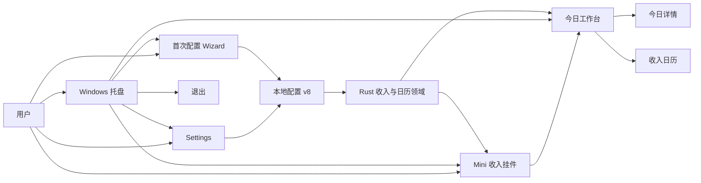
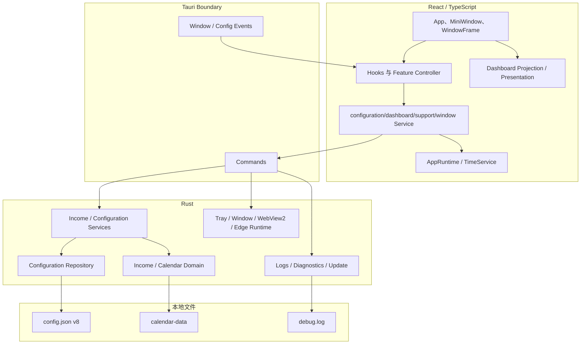
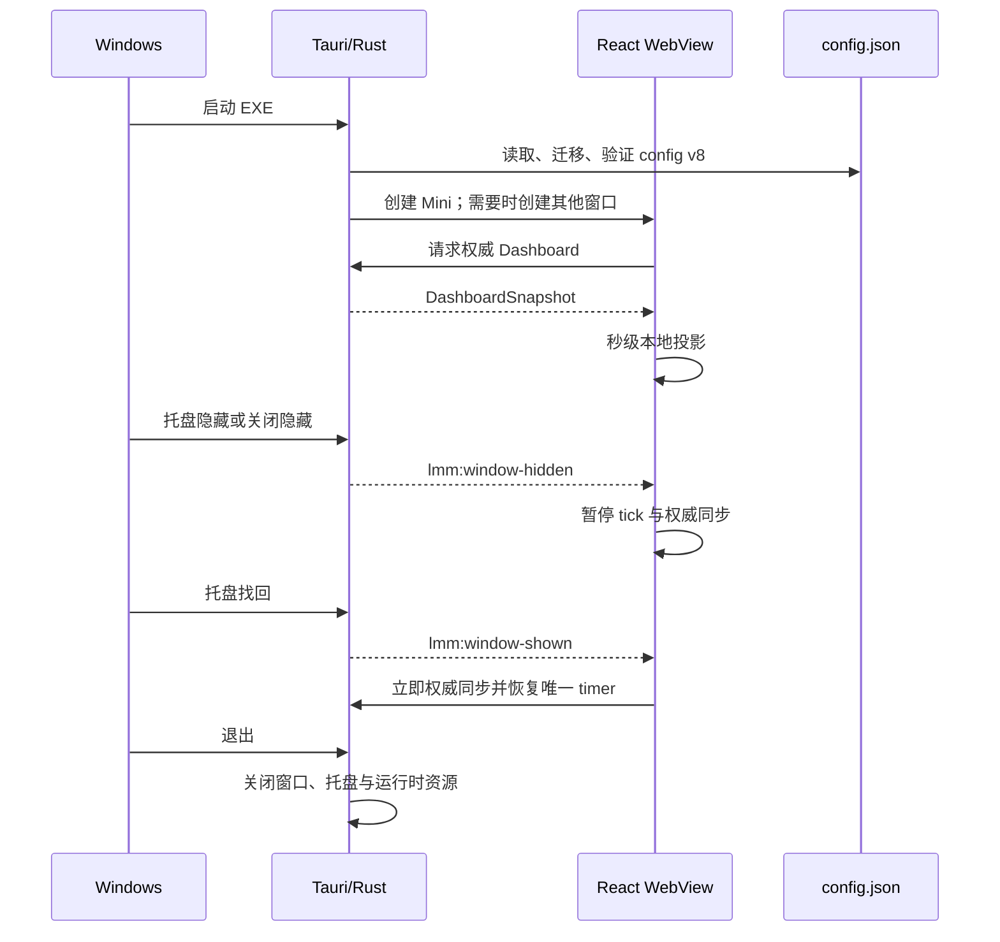

入口判断：/review

# LetsMakeMoney Windows v1.0.5 深度 Review

## Review 判断

- 主通路：Project Review。
- 辅助通路：Implementation Review、Page Review、Release Readiness Review。
- 覆盖范围：Windows v1 当前产品定位、领域模型、窗口与状态流、React/Tauri/Rust 分层、配置与日志、Mini 隐私贴边、日历呈现、自动测试、构建打包、Git/tag/GitHub Release、公开文档和目录治理。
- 不覆盖范围：不重新验收 v1.0.4 全部 GUI；不重跑完整 Git 历史敏感信息审计；不验证真实多显示器、负坐标工作区和显示器移除；不评审尚未形成方案的桌宠恢复与动画实现。
- 证据来源：当前 Git 树、v1.0.4 PRD/进度/验证/发布文档、GitHub Release 元数据、公开 README、React/Rust/Tauri 实现、现有行为测试、项目所有者对真实 v1.0.4 发布包的截图与操作反馈，以及本轮只读验证命令。
- 证据日期：2026-07-31。

**总体结论：v1.0.4 仍是可公开下载和继续使用的 Stable 版本，不需要撤回 Release；但当前仓库不应把本地 `releases/v1.0.4/` 中的同名 Zip 当作已发布附件。** v1.0.5 的真实起点不是重写产品，而是先关闭发布事实、Mini 隐私交互和公开文档三条可信链，再判断日历与窗口质感候选是否值得进入正式范围。

当前没有要求撤回 v1.0.4 的 Blocker。已确认或高度可能的 Major 有四项：

1. 根 README、英文 README 和 Windows 工程 README 仍以 v1.0.3 为当前版本。
2. 本地同名 v1.0.4 Zip 来自脏工作树，身份与 GitHub 已发布附件不同；现有包验只证明包内自洽。
3. Mini 拖拽完成后保留 `pointerInside=true`，与“首次贴边不及时收起”的真实反馈吻合。
4. Mini 对任意窗口 `focus` 执行展开，可能解释关闭今日工作台后 Mini 或隐私入口非预期出现；具体界面仍需复现锁定。

## 对象身份

| 对象 | 本轮核对结果 | 证据状态 |
| --- | --- | --- |
| 当前分支 | `main` | 已确认 |
| 当前 HEAD | `8a63da7836fb24c3b7f8ff12f896ac40571adeb7` | 已确认 |
| v1.0.4 tag 指向 | `4d06dc73dbc5c27d7a97462d8262a553dd97d5b6` | 已确认 |
| GitHub Release | `v1.0.4` Stable，非 Draft、非 Prerelease | 已确认 |
| 远端 Zip | 3,228,929 字节；SHA256 `C4F28892831891A4266C4D9B12D432CD5C970BB3C9B36A6B8DB21FA2566DE50E` | 已确认 |
| 远端附件 | 仅便携 Zip 与 `SHA256SUMS.txt` | 已确认 |
| 当前元数据版本 | npm、Cargo、Tauri 均为 `1.0.4` | 已确认 |
| 当前工作树 | 文档/原型及 v1.0.5 Review 变更；无业务源码差异 | 已确认 |
| 本地同名 Zip | 3,228,960 字节；SHA256 `C67E730BF81741D03BFAF6D14F3F16EB74FD8591D8B3AB76D45A980E854C249B` | 已确认 |
| 本地 Zip BUILD-INFO | `source_head=09f838d...`、`source_tree_dirty=true`、EXE SHA256 `B2A183...` | 已确认 |

结论边界：GitHub Release、tag 和 v1.0.4 发布文档相互一致；发生漂移的是本地可变发布目录，不是远端已发布附件。

## 产品地图

### 产品定位

LetsMakeMoney v1 是一个本地优先、无账号、无云同步的 Windows 收入进度工具。用户一次配置月薪、休息模式和工作时间后，通过 Mini 挂件或今日工作台查看当前阶段、今日收入、工作进度和日历归属。

当前正式主线不包含桌宠。v0.9-beta 保留为历史桌宠基线；是否恢复桌宠属于独立产品决策，不能自动并入 v1.0.5 维护范围。

### 目标用户与核心场景

- 目标用户：希望把固定月薪转换成当前工作日、当前阶段和实时收入进度的 Windows 用户。
- 高频场景：看一眼 Mini；打开今日详情；检查收入日历；调整工资/作息；通过托盘隐藏和找回。
- 隐私场景：将 Mini 靠近屏幕左右边缘后自动收起，避免持续暴露工资金额。
- 维护场景：查看数据目录、诊断摘要、日志和更新状态。

### 产品模块图

### 核心用户流程

```mermaid
flowchart TD
    A["启动"] --> B{"配置是否完成"}
    B -- "否" --> C["Wizard"]
    C --> D["保存配置事务"]
    D --> E["Mini"]
    B -- "是" --> E
    E --> F["权威 Dashboard 快照"]
    F --> G["本地秒级投影"]
    E --> H["打开工作台"]
    H --> I["今日 / 日历"]
    I --> J["手动日期调整"]
    J --> F
    E --> K["左右贴边"]
    K --> L["隐私收起"]
    L --> M["悬停、点击或托盘找回"]
    M --> E
```

## 领域地图

| 领域对象 | 关键状态 | 权威所有者 | 主要入口 |
| --- | --- | --- | --- |
| `SalarySchedule` | 月薪、上/下班、休息开始/结束、休息模式、大小周当前周 | Rust 配置与收入领域 | Wizard、Settings |
| `CalendarData` | 官方、估算、过期、失败；工作日、休息日、调休、手动覆盖 | Rust 日历数据与领域 | 日历、Dashboard |
| `DateOverrideKind` | `workday`、`paid_rest`、`unpaid_rest`、恢复自动 | Rust 配置事务 | 日历日期调整 |
| `TodaySnapshot` / `DashboardSnapshot` | 上班前、工作、休息、下班后、休息日；金额、进度、下一边界 | Rust 计算权威；React 做短周期投影 | Mini、工作台 |
| `ThemeMode` | `light`、`dark` | 配置 v8 | Settings、全部 WebView |
| `MiniEdgeDock` | `none`、`left`、`right` | 原生窗口状态 + 配置 v8 | Mini 拖拽、Settings |
| WindowKind | `mini`、`workbench`、`settings`、`wizard` | Tauri 窗口层 | 托盘、窗口 Service |

### 业务不变量

1. Rust 的收入与日历结果是权威值；React 秒级 tick 只能投影，不能建立第二套业务口径。
2. 配置保存失败时，旧配置和用户草稿必须保持；配置文件采用版本化和安全迁移。
3. 手动日期调整优先于官方日历和休息模式，但不得伪装为官方数据。
4. 工作月累计采用整数分分配，完整月累计必须与月薪一致。
5. 跨夜班次使用 owner date，不以界面所在自然日替代业务归属日。
6. Mini 隐私收起态不得显示工资金额；只持久化展开态正常位置。
7. 官方、估算、过期和失败必须保持真实标签，不能因视觉精简隐藏风险状态。

### 术语冲突与待统一点

| 术语 | 当前含义冲突 | 建议 |
| --- | --- | --- |
| “今天” | 自然日、收入 owner date、当前选中日期在 UI 中相邻出现 | 保留领域区分；视觉层不得用同一种边框表达今天与选中 |
| “隐藏” | Tauri 窗口隐藏、Mini 隐私收起、托盘隐藏三种行为 | 日志与测试继续使用不同事件；用户反馈复现时先锁定具体窗口状态 |
| “发布包” | GitHub 锁定附件与本地可变 `releases/v1.0.4` 使用同名路径 | 正式文档以远端 digest/发布提交为准；本地包必须显示候选身份 |
| “官方日历” | 数据可信来源与常驻成功提示块被绑定 | 官方来源必须保留在诊断/详情；正常态不必常驻占据日历首屏 |

## 工程架构地图

### 启动、隐藏与退出时序

### 主要模块审查

| 模块 | 职责与入口 | 状态/配置/日志 | 现有验证 | 风险与公开贡献适配度 |
| --- | --- | --- | --- | --- |
| `App.tsx` | 工作台、日历、Settings、Wizard 的页面编排 | 多页面草稿和 UI 状态 | Presentation、配置、日历行为测试 | 1,096 行；适合继续局部组件化，不适合整体重写；贡献适配度中 |
| `model.ts` | Dashboard/日历同步、缓存、浏览器 fallback 与 Hooks | 快照、timer、月历缓存 | 权威同步、生命周期、日历、组合测试 | 1,012 行且职责集中；先加接缝再拆；适配度中低 |
| `features/mini` | Mini 展示、拖拽、隐私贴边状态机 | `mini_edge_auto_hide`、`mini_edge_dock`、交互锁 | `mini-edge-auto-hide.behavior.ts` 22/22 | 真实反馈暴露两个未覆盖交互组合；适配度中 |
| `runtime` / `services` | Tauri 边界、统一时间和桌面 Service | 统一 command/event 入口 | Runtime、Desktop Service 行为测试 | v1.0.4 已形成有效边界；适配度高 |
| Rust `domain.rs` | 收入、工作日、日期归属和金额守恒 | 纯领域输入输出 | 53 项 Rust 回归及跨夜/金额测试 | 文件仍大但领域内聚；适配度中高 |
| Rust `config.rs` | v5-v7 到 v8 迁移、校验、安全写入 | config v8 | 迁移、损坏恢复、事务测试 | 数据安全关键；不宜为减行拆散不变量；适配度中 |
| Rust `lib.rs` / `platform.rs` | 窗口、托盘、WebView2、贴边、启动组装 | 原生运行时状态和日志 | 平台合同、桌面冒烟、人工验证 | 1,962 行编排集中；Windows 专业门槛高，适配度低至中 |
| 打包与发布脚本 | 构建、BUILD-INFO、原子替换、本地包验 | 发布目录、哈希 | v104 聚合与包验 | 包内自洽强，远端发布身份锁定不足；适配度中 |

## 当前进度真实性

### 一致部分

- `doc/current.md`、v1.0.4 verification、release checklist、release notes、tag 和 GitHub Release 对发布提交及远端哈希的描述一致。
- npm、Cargo 和 Tauri 元数据均为 1.0.4。
- GitHub Stable Release 仅包含允许的两个附件。
- 当前业务源码没有未提交修改；v1.0.5 只有候选问题池与本次 Review 文档。
- v1.0.4 的架构分层不是纸面计划：Runtime、Service、Repository、Command/Model 接缝和对应行为测试已实际存在。

### 事实不一致

1. 根 `README.md`、`README.en.md` 和 `apps/windows-v1/README.md` 仍把 v1.0.3 写为当前公开版本，并给出 v103 构建/验证命令。
2. `doc/current.md` 的 v1.0.5 候选段落后混入了 v1.0.4 已完成范围，若不标明继承基线会误读为 v1.0.5 已正式立项。
3. 本地 `releases/v1.0.4` 已被脏工作树候选覆盖，与远端正式附件同名但身份不同。

### v1.0.5 的真实起点

- v1.0.5 尚未立项、没有 PRD、没有开发计划、没有候选包。
- 六条用户反馈只属于候选问题池。
- 可直接修复的是公开文档事实；Mini 两条异常应先补行为测试/复现；视觉候选应进入 `/idea` 和原型比较。

## 意图、实现与验证对照

| 规则 ID | 文档意图与来源 | 实现证据 | 现有验证 | 状态 | 最小动作 |
| --- | --- | --- | --- | --- | --- |
| R-PRIVACY-01 | Mini 贴左右边缘后延迟收起，收起态不显示工资 | `miniEdgeAutoHide.ts` 以 `pointerInside` 和交互锁决定资格；原生窗口负责 retracted | 22/22 覆盖离开、锁、拖回内部、fallback；未覆盖拖拽结束仍在边缘且无 `pointerleave` | 实现偏离（高度可能） | 先加报告场景 characterization test，再定向修正拖拽完成后的指针资格 |
| R-PRIVACY-02 | 只有明确显示/找回或指针进入才应展开 Mini | `useMiniEdgeAutoHide.ts` 对任意 `focus` 和 `lmm:window-shown` 同时调用 `reveal` 与 `refresh` | 无“关闭 sibling window 导致 Mini focus”组合测试 | 未验证 | 真实复现并区分 Mini、隐私入口和托盘菜单；再收敛事件语义 |
| R-CALENDAR-01 | 官方/估算/stale/error 来源必须真实可辨 | `CalendarCoverageNotice` 对四种状态均渲染 | 状态合同有覆盖；没有“正常官方态是否常驻”的体验门禁 | 一致；存在候选体验债 | 仅移除正常态常驻块，不能隐藏风险态 |
| R-RELEASE-01 | v1.0.4 正式附件来自干净发布提交且哈希锁定 | 远端附件和发布文档一致；本地打包脚本允许生成 dirty candidate 并覆盖同名本地路径 | 包验验证包内哈希，但不比较发布提交、`source_tree_dirty=false` 或 GitHub digest | 未验证 | 增加“候选自洽”与“正式发布身份”两级命令或显式参数 |
| R-DOC-01 | 公开 README 应描述当前 Stable 与有效命令 | `doc/current.md` 为 v1.0.4；三个公开/工程 README 仍为 v1.0.3 | `verify_docs.py` 读取 README，但发布身份断言只覆盖 current/release 文档 | 文档过期 | 直接更新 README，并给文档门禁增加当前版本/脚本断言 |
| R-PET-01 | v1 Stable 主线无宠物；v0.9-beta 可回退 | v1 工程无宠物运行入口；历史资产仍在文档/原型 | v1.0-v1.0.4 发布与包边界验证 | 一致 | 桌宠恢复另开 `/idea`，不混入本次维护 Review |

## 关键发现

| ID | 文件/符号 | 现象与证据 | 影响 | 严重度 | 证据状态 | 建议 | 去向 |
| --- | --- | --- | --- | --- | --- | --- | --- |
| V105-REV-001 | `README.md`、`README.en.md`、`apps/windows-v1/README.md` | 当前公开版本、链接、构建和验证命令仍是 v1.0.3；代码元数据和 current 已是 v1.0.4 | 外部用户和贡献者被引向旧 Release 与旧脚本，公开事实源不一致 | Major | 已确认 | 直接同步 v1.0.4 口径，并让 docs gate 断言 README 当前版本 | 直接修文档 |
| V105-REV-002 | `releases/v1.0.4`、`package_v104.ps1`、`verify_v104_package.ps1` | 本地 Zip 为 `C67E...`、dirty build、`source_head=09f838...`；远端为 `C4F288...`、干净发布提交。包验不拒绝 dirty，也不比较远端锁定身份 | 后续验收可能拿错同名包，形成“结构通过但对象错误”的发布事故 | Major | 已确认 | 区分 candidate/output 与 published cache；正式验收增加提交、dirty、锁定哈希检查 | 工程治理 / 进入 `/idea` |
| V105-REV-003 | `miniEdgeAutoHide.ts::dragCompleted` | 拖拽完成只清除 dragging lock，不重置 `pointerInside`；`eligible()` 要求其为 false。与首次贴边需额外交互才收起的反馈吻合 | 隐私自动收起延迟，用户对核心隐私能力失去信任 | Major | 高度可能 | 先补“指针仍在窗口、拖到边缘、无 pointerleave”的测试，再定向修复 | Bugfix |
| V105-REV-004 | `useMiniEdgeAutoHide.ts::handleShown` | `focus` 与 `lmm:window-shown` 都执行 `reveal + refresh`；关闭 Workbench 可能把焦点交回 Mini | 关闭详情后可能非预期展开并重新暴露信息 | Major | 高度可能 | 用窗口标签和日志复现用户所称“隐藏菜单”，拆分 focus 与显式 shown 语义 | 继续验证后 Bugfix |
| V105-REV-005 | `CalendarCoverageNotice` | 官方数据正常时仍常驻绿色来源块 | 日历首屏被成功态信息挤占；风险态若一并删除又会损害可信度 | Minor | 已确认 | 正常 official 收敛为非占位信息，estimated/stale/error 保留 | 进入 `/idea` |
| V105-REV-006 | `.is-today .calendar-day__number` | 今天使用数字圆环，选中日期使用单元格边框；截图中两者邻近且视觉层级冲突 | 今天、选中和业务日期状态辨识成本上升 | Minor | 主观判断 | 用文字/角标/边缘标记做原型对比，继续保留非颜色表达 | 进入 `/idea` |
| V105-REV-007 | `WindowFrame.tsx`、透明根容器和窗口 CSS | WebView 透明边界、`.window-frame` 边框/圆角/阴影与标题栏叠加形成“框中框”观感 | 降低窗口成品质感；改动可能影响四角裁切和 DPI | Minor | 已确认 | 限定根容器、标题栏和阴影做生产级校准，不重写设计系统 | 进入 `/idea` |
| V105-REV-008 | `App.tsx`、`model.ts`、Rust `lib.rs` | 分层已建立，但三个编排文件仍分别为 1,096、1,012、1,962 行 | 跨窗口/日历/原生生命周期修改仍容易扩散 | Minor | 已确认 | 只在相关需求触碰时以 characterization tests 保护局部切片 | 技术债 |
| V105-REV-009 | `verify_docs.py` | 门禁核对 current/release 的 v1.0.4 身份，却未要求根 README 与工程 README 同步 | 自动门禁全部通过仍可公开过期说明 | Minor | 已确认 | 增加 README 当前版本、有效脚本和 Release 链接断言 | 测试治理 |
| V105-REV-010 | 本地忽略目录与历史脚本 | 约 41.6 MiB 本地验收/发布副本；每个版本保留独立打包和验证脚本 | 工作区认知成本增加，但直接删除会损失证据或历史复验 | Suggestion | 已确认 | 按瘦身审计分批处理，先证据摘要和脚本参数化 | 进入治理计划 |

## 根因判断

1. **不是技术栈失控。** v1.0.4 已建立 Runtime/Service/Repository/Domain 接缝，主链路测试密度也足够高；当前问题主要在跨窗口事件组合、候选/正式产物身份和公开文档同步。
2. **Mini 问题是状态机组合缺口。** 单个 pointer、lock、drag 场景都有测试，但“拖拽释放仍在窗口内”和“sibling 关闭导致 focus 转移”没有成为一等场景。
3. **发布问题是身份层级缺失。** 现有脚本适合验证“这个 Zip 自洽”，不适合单独证明“这个 Zip 就是已发布对象”。
4. **视觉反馈不是简单换色。** 日历和窗口边界同时承载业务状态、导航状态和透明窗口裁切，必须先定义状态优先级再调样式。

## 验证结果

| 检查 | 结果 | 说明 |
| --- | --- | --- |
| Git 分支/HEAD/tag/remote | 通过 | 当前树与 v1.0.4 发布提交边界已锁定 |
| GitHub Release 元数据 | 通过 | Stable、两个附件、远端 digest 已确认 |
| `verify_v104.ps1` | 通过 | 显式提供声明的 Node/Python/Cargo 后，完整聚合约 71.7 秒通过 |
| React 行为测试 | 通过 | Runtime 15/15、同步 25/25、日历 11/11、配置 16/16、生命周期 14/14、日期调整 4/4、Desktop Service 27/27、高风险组合 24/24、Mini 22/22 等均通过 |
| Rust 回归 | 通过 | 53 项测试通过，format/clippy/构建由聚合门禁覆盖 |
| `verify_v104_package.ps1`（本地 Zip） | 包内自洽通过 | 不能继承为已发布附件通过；该包身份与远端不同且 dirty |
| 文档 UTF-8/链接门禁 | 通过但覆盖不足 | 能证明文档可解析与指定 release 事实一致，不能证明 README 当前版本正确 |
| 首次默认环境执行 | 未通过 | 当前 shell 未声明 Node；显式工具路径后通过。属于开发环境前置条件，不是产品运行缺陷 |
| 本轮 GUI/Computer Use | 未执行 | 用户截图与 v1.0.4 既有验收可作为观察证据；两条 Mini 异常仍需新鲜复现 |
| 真实多显示器 | 暂不验证 | 继承 v1.0.4 已批准延期边界 |

## 安全、隐私与发布判断

- 当前正式发布包仍可公开：远端身份、许可附件和发布说明没有被本地候选覆盖。
- 本轮未发现业务源码新增的凭据或私密配置；但没有重跑完整 Git 历史秘密扫描，因此不能把本结论扩展为新的历史安全审计。
- Mini 收起态当前只提供恢复点击面，不显示收入金额，隐私原则仍成立。
- 候选“窄竖条倒计时”会增加低敏感度状态信息的常驻暴露，应在 `/idea` 中明确上班前、休息日、加载失败、跨夜和无边界时是否显示，而不是直接实现。
- v1.0.5 在完成发布身份门禁前，不应从本地固定目录直接选包进入 acceptance。

## 代码瘦身结论

详细证据见 [slimming-candidates.md](slimming-candidates.md)。

- 可直接清理：空的本地 smoke 临时目录；不涉及跟踪文件。
- 需要证据保全后清理：`.tmp_acceptance/` 和本地历史发布副本。
- 需要补测试后治理：按版本重复的打包/验证脚本，`App.tsx`、`model.ts`、Rust `lib.rs` 的局部切片。
- 必须保留：仍被历史脚本引用的 `spikes/v1.0-ui/`、v0.9 桌宠/Figma/动画合同、历史 release 和验收结论。
- 不建议：为了目录整齐一次性删除历史脚本、原型、证据或重写主状态管理。

## v1.0.5 候选分流

以下仅是 Review 分流，不是正式需求：

| 优先级 | 候选 | 证据状态 | 推荐去向 |
| --- | --- | --- | --- |
| P0 | 修正公开 README 的 v1.0.4 事实与命令 | 已确认 | 直接修文档 |
| P0 | 区分本地 candidate 与正式 published identity，并增加锁定校验 | 已确认 | 进入 `/idea` 或工程治理 PRD |
| P0 | Mini 首次贴边收起状态机缺口 | 高度可能 | 补 characterization test 后定向 Bugfix |
| P1 | 关闭 Workbench 后非预期界面 | 高度可能 | Computer Use + 日志复现后 Bugfix |
| P1 | 日历 normal official 信息层级与今天标记 | 已确认 / 主观判断 | 进入 `/idea` 与原型比较 |
| P1 | 通用窗口边界质感 | 已确认 | 进入 `/idea`，限定透明根容器和 DPI |
| P2 | 模块局部切片和历史脚本参数化 | 已确认 | 技术治理，随需求渐进实施 |
| 独立方向 | 桌宠恢复与动画 | 待确认 | 单独 `/idea`，不与 v1.0.5 自动合并 |

P0 只表示“如果发布 v1.0.5，必须先关闭的可信链”，不表示 v1.0.5 已经立项。

## 取舍建议

### 必须改

1. 公开 README 事实漂移。
2. 正式发布对象与本地候选的身份门禁。
3. Mini 首次贴边收起的行为测试与定向修复。

### 应该改

1. 复现并修正 sibling 窗口关闭导致的 Mini 展开。
2. 合并评估日历首屏、今天状态和窗口根边界三个视觉候选。
3. 为 README 与发布脚本补可失败的自动断言。

### 可以延后

1. App/model/lib 的进一步局部拆分。
2. 历史脚本参数化和本地证据清理。
3. 多显示器真实补证。

### 不建议做

1. 在没有新产品定义和动画验收合同前直接恢复桌宠。
2. 因三个大文件仍然较长就重写 React 状态管理或 Rust 主链路。
3. 为消除视觉瑕疵重做全部设计系统。

## 需要项目所有者确认的问题

1. v1.0.5 是否定位为“隐私与发布可信度维护版”，还是同时纳入日历和窗口视觉精修？推荐先完成维护项，再决定视觉范围。
2. 本地 `releases/v1.0.4` 的 dirty candidate 后续是删除并从 GitHub 回下载正式附件，还是移动到明确的 candidate 目录保留？本轮不执行。
3. “关闭今日工作台后自动出现的隐藏菜单”实际是 Mini 完整窗口、贴边隐私入口，还是 Windows 托盘菜单？该答案会改变修复入口。

## 是否具备进入下一阶段的条件

- 具备进入 v1.0.5 `/idea` 的基础：问题、证据、影响和分流已建立。
- 不具备直接进入完整 `/prd` 的基础：版本定位和三项项目所有者决策尚未确认。
- 公开 README 可直接治理，不需要等待 PRD。
- Mini 首次贴边问题可在补齐定向测试后走小范围 Bugfix，不必用完整 PRD 包装明确缺陷。

## 下一步

推荐顺序：

1. 直接修正 README 与 docs gate。
2. 锁定本地/远端发布身份策略。
3. 对两条 Mini 异常执行定向复现与 characterization tests。
4. 再进入 `/idea`，决定视觉候选和隐私竖条是否进入 v1.0.5。
