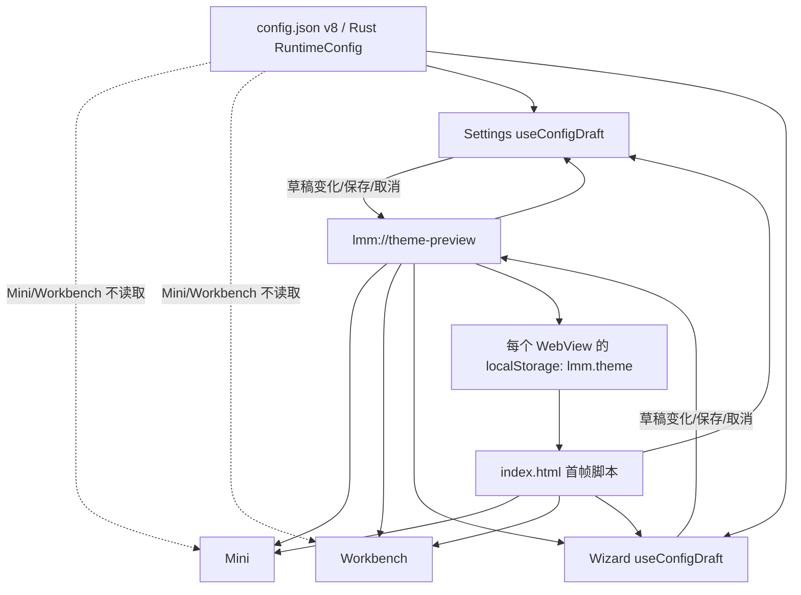
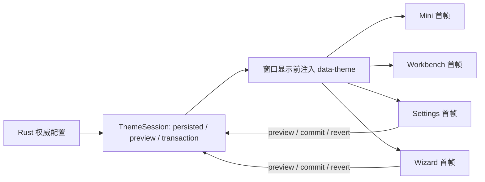

入口判断：/review（v1.0.6 维护版本）

# LetsMakeMoney Windows v1.0.6 维护版本 Review

## Review 判断

- 主通路：Implementation Review。
- 辅助通路：Release Readiness Review、文档事实 Review。
- 审查目标：确认 `V105-POST-001` 的真实根因、影响窗口、同源风险、最小修复范围、回归矩阵与 v1.0.6 发布门禁。
- 覆盖范围：Mini、Workbench、Settings、Wizard 的主题首帧、配置读取、预览事务、跨窗口事件、隐藏与恢复；同源配置初始化；现有测试和日志；当前公开事实。
- 未覆盖范围：不重新验收收入、日历和 Mini 隐私贴边全链路；不验证 Windows 10；不验证真实多显示器；不修改业务代码；不重建或替换 v1.0.5 Release。
- 证据日期：2026-08-02。

**总体结论：`V105-POST-001` 已确认，根因是主题同时以 `config.json` 和 WebView `localStorage` 作为持久来源，而 Mini/Workbench 首帧没有在显示前与 Rust 权威配置收敛。Settings 的“无变化保存”广播主题，只是偶然补上了缺失的初始化同步。**

该问题不影响收入、日历、配置文件完整性或 v1.0.5 的基本可用性，v1.0.5 Stable 无需撤回。它适合直接进入定向 Bugfix，不需要重新执行 `/idea` 或完整 `/prd`；v1.0.2 PRD 已经给出了首帧、跨窗口和事务语义，当前属于实现偏差与测试漏检。

v1.0.6 不应只把 Workbench 改成浅色。修复必须一次关闭以下同源问题：

1. 四个 WebView 首帧只有一个权威主题来源。
2. 未保存主题预览不能在异常退出后成为下次启动的事实来源。
3. 监听器晚注册或窗口懒创建时，必须通过快照/重放完成收敛，不能依赖一次性广播。
4. Settings/Wizard 在权威配置完成加载前不得允许默认草稿被误保存。
5. 测试必须验证真实初始化顺序和 DOM 结果，而不是只检查字符串存在。

## 对象与证据身份

| 对象 | 核对结果 | 证据状态 |
| --- | --- | --- |
| 当前工作分支 | `release/v1.0.5` | 已确认 |
| 当前 HEAD | `0b2c3461a59b9e8063b2e43974483f64759dc737` | 已确认 |
| 当前树对象 | `dde23fdd0fc5d7169ad647b611a00e7124085e13` | 已确认 |
| v1.0.5 Release 源提交 | `ffc431af3fbf7c3b54bca8aaff44946cc8d6aeaf` | 已确认 |
| Release 源树对象 | `dde23fdd0fc5d7169ad647b611a00e7124085e13` | 已确认 |
| 当前树与 Release 源差异 | 0 个文件 | 已确认 |
| `v1.0.5` tag | 指向 `ffc431af3fbf7c3b54bca8aaff44946cc8d6aeaf` | 已确认 |
| 本地 `origin/main` | `ffc431af3fbf7c3b54bca8aaff44946cc8d6aeaf` | 已确认 |
| 远端实时状态 | `git fetch origin --prune` 因 SSH 连接关闭失败；本轮只能证明本地远端引用 | 待确认 |
| 当前工作树（审查开始时） | 干净 | 已确认 |

当前 HEAD 是文档层提交，但其树与 v1.0.5 Release 源完全相同，因此可以用于实现审查；不能把分支名或额外文档提交误写成正式 Release 源。

### 外部观察证据

外部文件：

`E:\codex\.tmp-lmm-v105-postrelease\doc\releases\v1.0.5\post-release-observation.md`

该文件未同步进当前 Release 源，本轮只将其作为外部证据读取，没有复制、覆盖或改写 v1.0.5 主仓库历史。

| 证据 | 结果 | 证据状态 |
| --- | --- | --- |
| `config.json` | `config_version=8`、`theme_mode=light` | 已确认 |
| `POST-V105-MINI-001.png` | Mini 首次显示为深色 | 已确认 |
| `POST-V105-CALENDAR-001.jpg` | Workbench/日历首次显示为深色 | 已确认 |
| `POST-V105-SETTINGS-001.jpg` | Settings 打开后可呈现浅色 | 已确认 |
| `POST-V105-CALENDAR-AFTER-NOCHANGE-SAVE.jpg` | Settings 无变化保存后 Workbench 收敛为浅色 | 已确认 |
| `debug.log` | 出现 `theme.preview_applied theme=light reason=unchanged` | 已确认 |
| 数据影响 | 未发现工资、日历或配置内容损坏 | 已确认 |

外部观察锁定的正式发布身份：Zip SHA256 `019B706E18E7D57D0B7E6DBFB6300762422B5723A11EB6ACCB601DA438215889`；EXE SHA256 `68FA8FC443B12A2BA8BD757F532EC6B90E09E3DA7E1027255267150C4DAEC37A`；WebView2Loader SHA256 `8427B1FC58EC707813E5C0A51EB5D69397BB333250A7B891BE4D3B123F1E0F1C`。

## 产品与工程地图

### 四窗口职责

| 窗口 | 用户职责 | 当前配置入口 | 当前主题初始化 |
| --- | --- | --- | --- |
| Mini | 常驻收入摘要、贴边隐私与工作台入口 | Dashboard 权威快照；不加载配置草稿 | `index.html` 读取本 WebView `localStorage`；监听延迟注册 |
| Workbench | 今日详情与收入日历 | Dashboard 权威快照；不加载配置草稿 | 同 Mini |
| Settings | 修改配置、主题预览、保存/取消 | `useConfigDraft()` 异步读取 Rust 配置 | 初始仍来自 `localStorage`，加载完成后 `applyTheme(config.theme_mode)` |
| Wizard | 首次配置或重新配置 | `useConfigDraft()` 异步读取 Rust 配置 | 同 Settings |

### 当前实际主题状态流

### v1.0.2 既定目标流

差异不是视觉偏好，而是实现没有满足既有 PRD：`doc/releases/v1.0.2/prd.md` 已要求窗口显示前注入主题、跨窗口即时同步、不得建立第二套长期主题存储，并要求记录 `theme.loaded` 与 `theme.window.applied`。

## 意图、实现与验证追踪

| 既定意图 | 当前实现 | 当前验证 | 判断 |
| --- | --- | --- | --- |
| Rust 在 WebView 可见首帧前恢复权威主题 | `index.html` 只读 `localStorage` | 无首帧行为测试 | 实现偏差，已确认 |
| 不建立第二套长期主题存储 | `theme.ts` 每次 `applyTheme()` 都写 `localStorage` | 只检查常量与事件字符串 | 实现偏差，已确认 |
| 新窗口读取最新 persisted/preview 会话 | 监听器延迟 3000ms 注册，注册后无快照重放 | 静态测试反而要求保留 3000ms 延迟 | 实现偏差与验证偏差，已确认 |
| 无变化保存不改变主题 | 结果本身不改变配置，但会广播 persisted theme | 外部 GUI 证据证明它承担了主题纠正 | 行为结果正确，职责错误，已确认 |
| Settings/Wizard 使用权威配置 | 异步加载前先渲染 seed/default 草稿 | 无“加载前不可保存”测试 | 未验证，高度可能存在竞态 |
| 隐藏/恢复后保持主题 | hidden/shown 只处理窗口生命周期，不做主题收敛 | 无浅/深隐藏恢复矩阵 | 未验证 |

## 关键发现

### Major

#### V106-REV-002：Settings/Wizard 权威配置加载前存在默认草稿交互窗口

- 证据状态：高度可能。
- 代码证据：`apps/windows-v1/src/configModel.ts:37-67` 以默认值创建草稿，再异步调用配置服务；`App.tsx` 中 Settings/Wizard 没有以 `config.loading` 阻断完整表单交互。
- 用户影响：在配置读取较慢或 WebView2 冷启动异常时，用户可能看到默认工资、作息或主题，并在权威配置返回前操作。若保存路径被触发，存在默认草稿覆盖现有配置的风险。
- 边界：本轮没有取得真实数据被覆盖的证据，不能写成已发生缺陷。
- 建议：先写可控延迟 characterization test；无论是否稳定复现，都应建立“权威配置未加载完成时表单不可提交”的交互门禁，并验证加载失败保留旧配置。
- 建议去向：直接 Bugfix，同主题初始化一并定向处理。

#### V106-REV-003：现有主题门禁不能证明首帧和跨窗口行为

- 证据状态：已确认。
- 代码证据：`tests/theme.behavior.ts` 只有 5 项枚举归一化断言；`tests/verify_v102.py` 只检查事件、常量和 3000ms 延迟字符串。
- 运行证据：现有架构与 v1.0.2 静态聚合全部通过，但 v1.0.5 正式包仍出现首帧主题错误。
- 用户影响：CI 可能继续对同类回归给出绿色结果，发布结论缺乏可信度。
- 建议：新增主题解析、事务、监听晚注册、窗口懒创建、首帧 DOM、隐藏恢复和打包后 GUI 证据；旧静态检查只能作为补充。
- 建议去向：直接 Bugfix 的发布门禁。

### Minor

#### V106-REV-001：主题存在双持久来源，Mini/Workbench 首帧可能采用过期主题

- 证据状态：已确认。
- 代码证据：`apps/windows-v1/index.html:7-12` 只读 `localStorage`；`theme.ts:10-18` 把每次主题应用写回 `localStorage`；Mini/Workbench 不调用配置草稿加载。
- 运行证据：权威配置为浅色时，Mini 与 Workbench 首次显示为深色；Settings 无变化保存广播浅色后恢复。
- 用户影响：冷启动或懒打开窗口出现错误主题，可能闪烁、对比度突变，削弱配置可信度。
- 同源风险：未保存的深色预览也会写入 `localStorage`；若应用在取消前异常退出，下次首帧可能恢复未提交主题。该异常退出路径为高度可能，尚无真实复现证据。
- 建议：以 Rust persisted theme 和进程内 preview session 为唯一权威；WebView 缓存如保留，只能是可校验的启动提示，不得覆盖权威配置。
- 建议去向：直接 Bugfix；作为 v1.0.6 发布阻塞。

#### V106-REV-004：主题日志不足以证明初始化来源和收敛过程

- 证据状态：已确认。
- 证据：外部日志只有 `theme.preview_applied ... reason=unchanged`，缺少 PRD 要求的 `theme.loaded`、窗口标签、来源、事务状态和 `theme.window.applied`。
- 用户影响：出现首帧错误时无法判断是配置、缓存、监听时机还是窗口恢复导致。
- 建议：新增脱敏语义日志，不记录完整配置或用户工资；日志至少包含窗口标签、目标主题、来源、原因、会话代际和结果。
- 建议去向：直接 Bugfix。

#### V106-REV-005：公开文档仍停留在 v1.0.4 / v1.0.5 开发口径

- 证据状态：已确认。
- 证据：根 `README.md`、`README.en.md`、`apps/windows-v1/README.md` 和 `doc/current.md` 仍将 v1.0.4 写为公开版本、v1.0.5 写为开发候选。
- 门禁偏差：`scripts/verify_v10_docs.ps1` 本轮仍返回通过，因为它验证的正是“v1.0.4 已发布、v1.0.5 开发中”的旧合同；因此该结果不能证明当前公开事实正确。
- 用户影响：贡献者和用户无法从仓库确认当前发布事实。
- 分类：事实不一致，不是产品需求。
- 建议去向：v1.0.6 发布前直接修文档，不扩大 Bugfix 业务范围。

### Suggestion

#### V106-REV-006：Windows 10 与真实多显示器继续保持环境补证

- 证据状态：待确认。
- 当前证据只覆盖 Windows 11、单显示器、100% DPI。
- 本版主题 Bugfix 没有新增显示器能力；多显示器不得升级为功能需求。
- Windows 10 需在可用设备或 VM 上执行冷启动与四窗口主题冒烟；真实多显示器延续既有环境补证。
- 建议去向：继续验证，不阻塞 v1.0.6 定向 Bugfix 开发；发布结论必须如实标记。

## 根因归属

| 层 | 应有职责 | 当前偏差 | 修复边界 |
| --- | --- | --- | --- |
| Rust 配置读取 | 加载、迁移并提供 persisted theme | 已加载，但未用于所有窗口首帧 | 提供可在显示前消费的权威主题快照 |
| WebView 初始化 | 在 React 和窗口可见前应用已解析主题 | 只读可能过期的 `localStorage` | 只消费权威 bootstrap；失败时安全回退浅色并记录原因 |
| Theme preview | 当前事务内即时预览、提交或回滚 | 与长期 `localStorage` 写入耦合 | preview 不成为第二持久事实；带事务/代际语义 |
| 跨窗口同步 | 已存在窗口即时同步；新窗口读取当前会话 | 一次性事件 + 3 秒延迟监听，无重放 | 监听成功后读取快照，或由后端重放当前主题 |
| 窗口生命周期 | 负责 hidden/shown、timer 暂停和恢复 | 与主题无直接耦合 | shown 后校验已应用会话代际；不得把 focus 当 preview |
| 配置草稿 | 权威配置加载完成后允许编辑 | 默认草稿先可见、可交互 | 加载完成前阻止提交；失败保持旧配置和可读反馈 |

## 最小修复范围

### 必须修改

1. 建立单一主题解析函数，输入 persisted theme、当前 preview session 和非法值回退，输出目标主题及来源。
2. Mini、Workbench、Settings、Wizard 在窗口首次可见前应用同一目标主题。
3. 替换“延迟 3000ms 后只监听事件”的脆弱路径：监听注册后必须读取当前快照，晚注册不会丢失主题。
4. `localStorage` 不再拥有高于 `config.json`/ThemeSession 的权威性；未保存 preview 不得跨异常重启自动提交。
5. Settings/Wizard 权威配置加载完成前禁用保存及会写配置的交互；加载失败不得用默认值覆盖旧配置。
6. 保存成功、无变化、失败、取消和关闭继续满足既有主题事务合同。
7. 增加主题初始化与窗口应用语义日志。
8. 补齐行为测试、打包后 GUI 复验和公开文档事实。

### 明确不做

- 不引入第三种主题、系统跟随、自定义主题或主题市场。
- 不建立新的全局状态管理框架。
- 不重写多窗口架构，不合并 Mini 与 Workbench Dashboard 所有权。
- 不改变收入、日历、配置 schema 或 Mini 隐私状态机。
- 不借机重做 UI、窗口质感或 DPI 布局。
- 不修改 v1.0.5 tag、Release 和附件。

## 回归矩阵

| 场景 | 初始条件 | Mini | Workbench | Settings | Wizard | 通过标准 |
| --- | --- | --- | --- | --- | --- | --- |
| 浅色冷启动 | 配置 light；缓存 dark | 首帧浅色 | 首次打开即浅色 | 首帧浅色 | 首帧浅色 | 任一窗口不得先深后浅 |
| 深色冷启动 | 配置 dark；缓存 light | 首帧深色 | 首次打开即深色 | 首帧深色 | 首帧深色 | 任一窗口不得闪白 |
| 新用户 | 无配置、无缓存 | 浅色安全默认 | 浅色 | 浅色 | 浅色 | Wizard 可用，不产生非法主题 |
| 非法配置 | `theme_mode` 非法 | 浅色回退 | 浅色回退 | 显示浅色并给出诊断 | 同左 | Rust 与四窗口结论一致 |
| 缺失配置字段 | 旧配置无 theme | 浅色迁移 | 浅色 | 浅色 | 浅色 | 配置迁移安全且可持久化 |
| 深色预览 | Settings 草稿改 dark | 即时深色 | 即时深色 | 即时深色 | 即时深色 | 四窗口同一会话代际 |
| 预览取消/关闭 | persisted light、preview dark | 回浅色 | 回浅色 | 回浅色 | 回浅色 | 配置哈希不变，无残留缓存 |
| 异常退出重启 | persisted light、preview dark 后强制结束 | 首帧浅色 | 浅色 | 浅色 | 浅色 | 未提交 preview 不跨进程生效 |
| 保存成功 | light → dark | 深色 | 深色 | 深色 | 深色 | 配置落盘与全部窗口一致 |
| 无变化保存 | light → light | 不闪动 | 不闪动 | 不闪动 | 不闪动 | 不承担首次主题纠正 |
| 保存失败 | persisted light、draft dark | 回到或保持合同定义状态 | 同步一致 | 输入保留、错误可读 | 同左 | 旧配置不污染 |
| 懒打开窗口 | 先改主题，再首次打开 Workbench/Wizard | 已同步 | 首帧即当前会话主题 | 已同步 | 首帧即当前会话主题 | 不依赖历史事件仍在队列 |
| 隐藏/恢复 | 四窗口分别隐藏后恢复 | 主题不变 | 主题不变 | 主题不变 | 主题不变 | shown 后单次收敛，无重复监听 |
| 配置加载延迟 | 人工延迟 `read_configuration` | 不受影响 | 不受影响 | 未加载前不可提交 | 未加载前不可提交 | 不显示可保存的默认草稿 |
| 配置加载失败 | 强制 command 失败 | 保留可用快照 | 保留可用快照 | 错误可读、旧值不被覆盖 | 同左 | 不写默认配置 |
| Windows 10 | 正式 Zip | 冒烟 | 冒烟 | 冒烟 | 冒烟 | 环境可用时补证 |
| 多显示器 | 双屏/负坐标 | 仅主题一致性观察 | 主题一致 | 主题一致 | 主题一致 | 延续环境补证，不扩功能 |

## 测试与验证门禁

### 自动门禁

1. TypeScript 纯函数：主题解析优先级、非法值、preview/commit/revert、代际比较。
2. 配置事务：保存成功、无变化、失败、取消和异常退出模拟。
3. WebView/DOM：相反缓存与权威配置组合下，首个可观察帧的 `data-theme` 和 `color-scheme` 正确。
4. 监听生命周期：晚注册、重复注册、窗口懒创建、hidden/shown 后只有一个有效监听器。
5. 配置 hydration：延迟与失败时保存不可用，默认草稿不能落盘。
6. Rust：旧配置迁移、非法主题回退、权威 bootstrap 快照和脱敏日志。
7. 继续通过现有 architecture、v1.0.2 presentation/theme、Rust、打包与包体验证；更新旧静态门禁，不能继续把 3000ms 延迟本身视为通过条件。

### Computer Use / 人工门禁

1. 从全新解压的候选 Zip 启动，不使用 dev server 代替。
2. 分别构造 `config=light/cache=dark` 与 `config=dark/cache=light`；任何保存操作前采集四窗口首帧。
3. 执行预览、取消、保存成功、无变化、失败和异常退出重启。
4. 分别验证 Mini、Workbench、Settings、Wizard 的冷启动、首次懒打开、隐藏和恢复。
5. 对比验收前后配置 SHA256；失败、取消、无变化必须符合事务合同。
6. 读取脱敏日志，确认 `theme.loaded`、`theme.window.applied`、preview/commit/revert 及窗口标签闭环。

### v1.0.6 发布阻塞

- 四窗口任一首帧与 persisted/preview 权威主题不一致。
- Settings/Wizard 在权威配置未加载时可以保存默认草稿。
- 未保存主题在取消、失败或异常重启后残留。
- 晚注册或懒创建窗口无法收敛，必须靠无变化保存纠正。
- 同一窗口重复注册监听器或 hidden/shown 后重复应用造成闪烁。
- 配置失败污染旧配置。
- 行为门禁未进入 CI 或正式聚合验证。
- README、`doc/current.md`、版本、tag、包内 README 和 `BUILD-INFO` 事实不一致。
- 候选身份、Zip/EXE/DLL SHA256 或 `source_tree_dirty=false` 未锁定。

Windows 10 和真实多显示器继续作为环境补证，不因本次主题修复扩大为功能开发；最终验证文档必须保留真实状态，不能写成已通过。

## 本轮验证结果

| 验证 | 结果 | 结论边界 |
| --- | --- | --- |
| 当前树与 `ffc431...` Release 源树比较 | 0 个业务文件差异 | 审查对象可对应 v1.0.5 发布实现 |
| 现有 architecture 聚合 | 当前套件全部通过 | 证明既有门禁可运行，不证明主题首帧正确 |
| v1.0.2 theme 静态验证 | 通过 | 只验证枚举、事件和延迟字符串，属于覆盖缺口证据 |
| `scripts/verify_v10_docs.ps1` | 通过，检查 94 份文档 | 验证器仍采用旧版本事实合同，不能消除 `V106-DOC-001` |
| 新增文档严格 UTF-8 解码与乱码扫描 | 2/2 通过 | 未发现替换字符或常见乱码片段 |
| `git diff --check` | 通过 | 无空白错误 |
| 业务源码差异 | 0 | 本轮仅新增 v1.0.6 Review 文档 |

## 发布与版本判断

| 判断 | 结论 |
| --- | --- |
| v1.0.5 是否需要撤回 | 否；缺陷为非阻塞视觉一致性问题 |
| 是否需要 `/idea` | 否；没有产品范围决策缺口 |
| 是否需要完整 `/prd` | 否；v1.0.2 PRD 已定义目标合同 |
| 是否可直接进入 Bugfix | 是；先补 characterization tests，再做最小定向实现 |
| v1.0.6 是否可立即发布 | 否；需完成修复、行为回归、正式候选 GUI 复验和事实文档收口 |
| Windows 10 / 多显示器 | 环境补证；不扩大为本版功能 |

## 下一步建议

进入 `/bugfix` 或按现有开发流程建立一份精简修复任务，范围仅包含：主题权威 bootstrap、晚监听收敛、配置 hydration 门禁、主题语义日志、行为测试和事实文档。修复完成后重新从干净提交构建 v1.0.6 候选，并按本文件回归矩阵执行独立验收。
