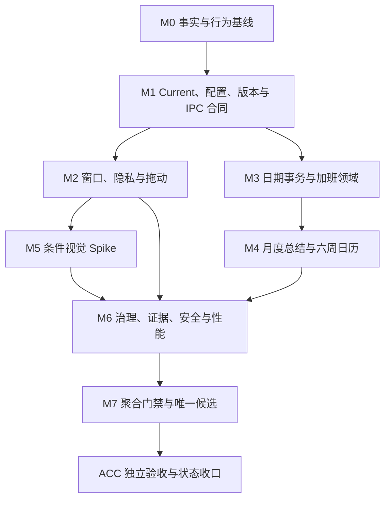

# LetsMakeMoney Windows v1.0.7 开发计划

## 追踪信息

| 字段 | 内容 |
| --- | --- |
| 目标版本 | Windows v1.0.7 Stable |
| 计划类型 | v1.0 系列功能收官 / 正式推进型开发承接 |
| 代码基线 | `main@12b6b03ce91b716d49590e21eb8dd7fe90fa283c` |
| 当前公开版本 | v1.0.6 Stable |
| 当前状态 | 开发承接已完成，实施未开始 |
| 需求事实源 | `doc/releases/v1.0.7/prd.md` |
| 追踪事实源 | `doc/releases/v1.0.7/traceability.md` |
| 状态事实源 | `doc/releases/v1.0.7/progress_v1.0.7.md` |
| 实施记录 | `doc/logs/dev_log_v1.0.7.md` |
| 原型 | `doc/prototypes/v1.0/index.html` |
| 最后更新 | 2026-08-03 |

## 1. 开发范围

### 1.1 版本目标

v1.0.7 关闭 v1.0 系列已确认的可信、窗口、隐私、日历、加班和维护缺口。实施遵循“行为测试先行、最小批次、独立回退、条件项不默认通过”，不恢复宠物，不扩展新的产品线。

### 1.2 正式范围

| FR | 内容 | 实施性质 |
| --- | --- | --- |
| FR-001 | 唯一 current CI 门禁 | 必须实现 |
| FR-002 | config v8 唯一机器合同 | 必须实现 |
| FR-003 | 应用版本单一事实源 | 必须实现 |
| FR-004 | 首次启动置顶可靠生效 | 必须实现 |
| FR-005 | Mini/Workbench 可补偿显示事务 | 必须实现 |
| FR-006 | Mini 自动隐藏状态机稳健化 | 先 Spike；达到阈值才修复，否则只增强诊断 |
| FR-007 | “调整今天”复用日期事务 | 必须实现 |
| FR-008 | 按日加班记录与费率快照 | 必须实现 |
| FR-009 | 月度工时总结与六周日历 | 必须实现 |
| FR-010 | 可访问的圆角 Combobox | Spike 通过后实施，否则保留原生控件 |
| FR-011 | 透明窗口单一表面所有权 | Spike 通过后实施，否则回滚基线表面 |
| FR-012 | 自由拖动与安全回落 | 必须实现 |
| FR-013 | 本版触达边界的局部治理 | 限定实现：一项前端边界、一项 Rust 边界 |
| FR-014 | 证据耐久、支持矩阵与 current 收口 | 必须实现 |
| FR-015 | 高风险 IPC 机器 fixture | 限定实现，不做全量 codegen |
| FR-016 | 脚本 current/historical 生命周期 | 必须实现 |
| FR-017 | 最小 CSP 兼容门禁 | 隔离 Spike；全链路通过后才允许启用 |
| FR-018 | 冷启动与 Bundle 性能门禁 | 先测量；超过阈值且收益不低于 15% 才优化 |

### 1.3 非目标

- 不恢复宠物或接入 PetManager。
- 不加入账号、云同步、安装器、自动更新或多平台。
- 不实现完整考勤、打卡、加班审批、加班倍率或加班收入汇总。
- 不引入新的全局状态库，不重写技术栈或全局状态管理。
- 不全量拆分 `App.tsx`、`model.ts`、Rust `lib.rs`。
- 不把多显示器写入 v1.0.7 的验收范围或通过声明。

### 1.4 实施原则

1. 每个批次先补 characterization test，再修改行为。
2. 配置、加班文件和窗口位置的旧数据保护优先于界面完成度。
3. 条件 Spike 以“继续、停止、回退”三种结论收口；停止并完整回退也可视为该任务完成。
4. 公开 command、payload、配置格式和既有日志事件保持兼容。
5. 原型证据只证明设计合同，不替代真实 Tauri、Windows、DPI 或托盘验收。
6. 每一里程碑更新 progress 和 dev log；排查流水只进入 dev log。

## 2. PRD 对照

| FR | IDEA | 里程碑 | 主要验收 |
| --- | --- | --- | --- |
| FR-001 | IDEA-001 | M1、M7 | current gate 自检、误用负向测试、CI |
| FR-002 | IDEA-002 | M0、M1、M7 | v8 四层合同、v5-v7 迁移、失败保护 |
| FR-003 | IDEA-003 | M1、M7 | Cargo/Tauri/包名/关于/更新/BUILD-INFO 一致 |
| FR-004 | IDEA-004 | M0、M2、ACC | 清配置冷启动、true/false、托盘找回 |
| FR-005 | IDEA-005 | M0、M2、ACC | 四种 Mini 进入前状态与失败补偿 |
| FR-006 | IDEA-006 | M0、M2、ACC | 10,000 序列、30 次贴边、语义日志 |
| FR-007 | IDEA-007 | M0、M3、ACC | 应用、无变化、取消、关闭、失败、重试 |
| FR-008 | IDEA-008 | M0、M3、M4、ACC | 精度、费率快照、跨夜、原子写、损坏恢复 |
| FR-009 | IDEA-009 | M0、M4、ACC | 聚合公式、5/6 周、三 DPI 一屏可见 |
| FR-010 | IDEA-010 | M5、ACC | 键盘、焦点、ARIA、翻转、三 DPI |
| FR-011 | IDEA-011 | M5、ACC | 四窗口三 DPI 四角与阴影审查 |
| FR-012 | IDEA-012 | M0、M2、ACC | 自由出屏、finalize、recover、找回 |
| FR-013 | IDEA-013 | M3、M6 | 依赖方向、薄 command、行为等价 |
| FR-014 | IDEA-014 | M0、M6、M7、ACC | 证据摘要、支持矩阵、current 索引 |
| FR-015 | IDEA-015 | M1、M3、M6 | 四类 IPC 成功/失败 fixture |
| FR-016 | IDEA-016 | M1、M6、M7 | lifecycle 索引、调用图、误用失败 |
| FR-017 | IDEA-017 | M6、ACC | CSP 隔离回归与启用/回退结论 |
| FR-018 | IDEA-018 | M6、M7 | 冷暖启动、首帧、Bundle、长任务阈值 |

`traceability.md` 中的 `V107-REV-001` 至 `V107-REV-014`、`V107-OBS-001` 至 `V107-OBS-010` 继续作为完整上游追踪，本计划不得省略或改写其去向。

## 3. 文件与模块影响

| 领域 | 主要路径 | 允许的改动 |
| --- | --- | --- |
| Current gate | `.github/workflows/windows-v1-verify.yml`、`scripts/verify_windows_current.ps1`、`scripts/current-manifest.json` | 唯一入口、manifest、自检和误用失败 |
| 历史脚本 | `scripts/verify_v10*.ps1`、`scripts/package_v10*.ps1` | 保留历史能力，增加 lifecycle 索引和 current 误用保护，不批量重写 |
| 配置合同 | `apps/windows-v1/contracts/`、`src/domain/configuration.ts`、`src-tauri/src/config.rs` | v8 Schema/defaults/迁移交叉一致 |
| 版本身份 | `package.json`、`Cargo.toml`、`tauri.conf.json`、关于页、更新检查、打包脚本 | 建立单一读取链和一致性门禁 |
| 前端窗口 | `src/App.tsx`、`src/model.ts`、`src/features/mini/`、`src/services/windowService.ts` | 窗口事务、置顶、自动隐藏、拖动和回落 |
| 日历功能 | 新增或扩展 `src/features/calendar/`、`calendarState.ts`、`dateOverrideState.ts` | 日期调整、加班编辑、月度总结呈现；不拥有全局配置保存 |
| Rust 窗口边界 | 新增或扩展 `src-tauri/src/window_policy.rs`、`src-tauri/src/lib.rs` | show/hide transaction、move/finalize/recover、错误映射；command 保持薄层 |
| 加班领域 | `src-tauri/src/models/`、`repositories/`、`services/`、`commands/` 及 TS service/model | 版本化 JSON 仓储、事务、聚合和 IPC |
| UI 与主题 | `src/components.tsx`、`src/styles.css`、`WindowFrame.tsx`、原型 | 六周日历、总结、条件 Combobox 与表面校准 |
| 自动测试 | `apps/windows-v1/tests/` | 行为测试、fixture、Schema、负向测试和条件门禁 |
| 证据与发布 | `doc/releases/v1.0.7/`、`doc/logs/`、`.artifacts/`、`releases/` | 脱敏摘要、外部原始证据索引、候选身份和发布检查 |

任何实际文件名调整都要在 dev log 中记录理由；不得借此扩大到非本版模块。

## 4. 核心实施合同

### 4.1 数据与配置

- config 继续使用 v8；Schema、defaults、Rust 与 TypeScript 必须一致。
- 加班独立存储于 `%APPDATA%\LetsMakeMoney\overtime-records.json`，`schema_version=1`。
- `business_date` 一日一条；输入 `0` 删除；新建捕获当前整数分时薪，修改保留原快照。
- 写盘采用临时文件、校验、原子替换；失败保留旧文件与编辑草稿。
- 损坏文件不得被空数据覆盖；需保留备份、可读错误与恢复入口。

### 4.2 窗口与隐私

- Workbench 打开采用 visibility lease；Mini 的展开、隐私收起、用户隐藏与不存在状态分别恢复。
- Workbench show 或 Mini hide 任一步失败都必须补偿，不允许两个窗口同时丢失。
- 首次置顶在配置 hydration 后、Mini 首次显示前应用；失败不抢焦点且可诊断。
- 拖动中不做每帧钳制；pointer up 才 finalize；启动、找回或显示环境变化才 recover。
- Mini 隐私竖条是合法位置，不参与丢失判断。

### 4.3 条件门禁

| 条件项 | 继续阈值 | 停止/回退 |
| --- | --- | --- |
| FR-006 自动隐藏 | 10,000 序列或 30 次真实贴边至少复现一次且定位唯一转移 | 未复现则只保留脱敏日志与继续观察 |
| FR-010 Combobox | 全键盘、ARIA、双主题、100/125/150% DPI 和翻转均通过 | 任一焦点逃逸、不可选或裁切即保留原生 select |
| FR-011 窗口表面 | 4 窗口 × 3 DPI 无双弧、黑边、阴影裁切 | 任一失败则整体回滚 v1.0.6 表面 |
| FR-017 CSP | 全窗口、IPC、资源与更新链路通过 | 任一失败则 CSP 保持未启用并记录风险 |
| FR-018 性能 | 冷启动 P95 >2.0s、Mini 首帧 >1.2s、Workbench >1.5s、JS gzip >180KB 或长任务 >100ms；优化收益 >=15% | 未超阈值不优化；收益不足撤销候选 |

### 4.4 证据失效

- 代码、依赖、构建参数或候选哈希变化后，相关 GUI 与性能证据失效。
- 原型浏览器验证不继承为 Tauri 壳验证。
- Windows 11 单显示器为强制环境；Windows 10 没有真实证据时必须收窄支持声明。
- 多显示器始终标记暂不验证，不可写为通过。

## 5. 依赖与实施顺序

- M1 完成前不得写入新加班数据，也不得构建 v1.0.7 候选。
- M2 与 M3 可在 M1 后并行，但两者均应使用相同 IPC fixture 和错误分类。
- M4 依赖 M3 的加班仓储与聚合结果。
- M5 不阻塞 M3/M4；其失败回退结论必须在 M7 前冻结。
- M7 只能从干净提交构建唯一候选；ACC 不得使用开发目录或旧包替代。

## 6. 里程碑与最小任务

### V107-M0 事实、基线与行为刻画（10 项）

- [ ] `V107-M0-001` 记录分支、HEAD、工作树、remote、tag、v1.0.6 Release 与本地候选身份。
- [ ] `V107-M0-002` 冻结 PRD、traceability、原型与本计划版本，记录继承证据及失效条件。
- [ ] `V107-M0-003` 盘点 current/historical 脚本调用图、CI 入口和现有误用风险。
- [ ] `V107-M0-004` 盘点 config v8 的 Rust、TS、Schema、defaults 和 v5-v7 迁移基线。
- [ ] `V107-M0-005` 建立首次置顶 true/false、清配置、旧配置和托盘找回 characterization tests。
- [ ] `V107-M0-006` 建立 Mini/Workbench 四种进入前状态和 show/hide 失败刻画测试。
- [ ] `V107-M0-007` 建立 Mini 自动隐藏、拖动、焦点、modal、late timer 和 recover 事件夹具。
- [ ] `V107-M0-008` 建立日期事务、加班精度、费率快照、跨夜和损坏文件测试向量。
- [ ] `V107-M0-009` 建立五周/六周、浅深主题、长内容和 100/125/150% DPI 验收矩阵。
- [ ] `V107-M0-010` 建立 v1.0.7 脱敏证据目录、候选身份和用户环境恢复合同。

完成标准：所有现状、预期红灯、条件阈值和回退面可独立判定；业务行为尚未改变。

### V107-M1 Current、配置、版本与 IPC 合同（12 项）

- [ ] `V107-M1-001` 新增 `scripts/current-manifest.json` 并锁定 v1.0.7 current 子门禁。
- [ ] `V107-M1-002` 新增唯一 `scripts/verify_windows_current.ps1`，统一工具解析、输出和退出码。
- [ ] `V107-M1-003` 将 Windows CI 改为只调用 current 入口，并增加静态断言。
- [ ] `V107-M1-004` 为错误版本、historical 误用、缺失子门禁和取消场景补负向测试。
- [ ] `V107-M1-005` 对齐 config v8 JSON Schema、defaults、Rust 与 TypeScript 字段、枚举和默认值。
- [ ] `V107-M1-006` 保留并验证 v5-v7 迁移、损坏恢复、原子保存、无变化和失败保护。
- [ ] `V107-M1-007` 建立桌面版本 metadata 单一读取链，浏览器明确使用 `dev-preview`。
- [ ] `V107-M1-008` 交叉校验 package、Cargo、Tauri、关于页、更新请求、BUILD-INFO 和 Zip 文件名。
- [ ] `V107-M1-009` 建立配置事务 IPC 成功、无变化、失败和旧配置保护 fixture。
- [ ] `V107-M1-010` 建立 Dashboard 与窗口 show/hide 成功、失败和补偿 fixture。
- [ ] `V107-M1-011` 建立加班读取、保存、删除、冲突和损坏响应 fixture 骨架。
- [ ] `V107-M1-012` 运行 M1 聚合门禁并确认业务功能差异仅限合同修正。

完成标准：绿色 CI 能证明当前 v1.0.7 合同；config v8 与版本身份不存在多点漂移；四类高风险 IPC 具备机器可读基线。

### V107-M2 窗口、隐私与自由拖动（14 项）

- [ ] `V107-M2-001` 在配置 hydration 后、Mini 首次显示前应用权威 always-on-top policy。
- [ ] `V107-M2-002` 为置顶失败建立 typed error、非阻塞反馈、日志与托盘找回重试。
- [ ] `V107-M2-003` 实现 Mini/Workbench visibility lease 与 transaction id。
- [ ] `V107-M2-004` 覆盖打开、重复打开、关闭、系统 X、初始化失败和 Workbench 崩溃补偿。
- [ ] `V107-M2-005` 区分 privacy_retracted、hidden_by_user、expanded 和 not_present 的恢复结果。
- [ ] `V107-M2-006` 将桌面 show/hide 失败与浏览器 query fallback 分离，桌面错误不得静默吞掉。
- [ ] `V107-M2-007` 运行 FR-006 的 10,000 条确定性随机状态序列并保存最小复现种子。
- [ ] `V107-M2-008` 完成左右边缘各 15 次真实贴边；按阈值决定修复或仅保留诊断。
- [ ] `V107-M2-009` 若继续，实现唯一状态转移的最小自动隐藏修复和 generation-safe timer。
- [ ] `V107-M2-010` 将拖动拆为 move、finalize、recover，移除拖动期间逐帧钳制。
- [ ] `V107-M2-011` 实现 Mini 28×48、其他窗口 48×48 逻辑像素安全抓取区并按 DPI 冻结阈值。
- [ ] `V107-M2-012` 覆盖四边出屏、负坐标、拖回、重启、托盘找回、分辨率和 DPI 变化。
- [ ] `V107-M2-013` 证明 Mini 隐私竖条不被 recover 误判为窗口丢失。
- [ ] `V107-M2-014` 回归位置持久化、自动隐藏开关、reduced motion、托盘和窗口找回。

完成标准：首次置顶、窗口切换与找回可补偿；拖动跟手且释放后可找回；FR-006 有可复核的修复或停止结论。

### V107-M3 日期事务、加班领域与局部边界（14 项）

- [ ] `V107-M3-001` 提取共享 DateOverrideEditor/reducer/service，日历与“调整今天”复用同一事务。
- [ ] `V107-M3-002` 覆盖工作日、带薪休息、不带薪休息、恢复自动和既有覆盖。
- [ ] `V107-M3-003` 覆盖应用、无变化、取消、X、Escape、失败、重试和持久化同步重算。
- [ ] `V107-M3-004` 定义并实现 overtime schema v1、模型、校验和一日唯一约束。
- [ ] `V107-M3-005` 实现版本化 JSON repository、临时文件校验、原子替换、备份和损坏保护。
- [ ] `V107-M3-006` 实现 overtime service 与薄 Tauri commands，统一 typed error。
- [ ] `V107-M3-007` 实现 TS overtime service/model 与加载、编辑、保存、删除、失败状态。
- [ ] `V107-M3-008` 落实 0–24 小时、最多两位小数、最近一分钟和 0 删除合同。
- [ ] `V107-M3-009` 新建记录捕获当前整数分时薪；修改保留快照；删除后重建捕获新快照。
- [ ] `V107-M3-010` 覆盖所有日期类型、历史补录、跨夜 owner date、用户最终业务日期和跨月记录。
- [ ] `V107-M3-011` 实现加班编辑弹窗的保存、无变化、取消、关闭、删除确认、失败和恢复入口。
- [ ] `V107-M3-012` 完成配置事务、Dashboard、窗口与加班四类 IPC fixture 的成功/失败覆盖。
- [ ] `V107-M3-013` 仅提取 `features/calendar` 和 `window_policy` 两个许可边界，保持公开 API 与日志兼容。
- [ ] `V107-M3-014` 运行依赖方向、薄 command、行为等价、并发写入和回滚测试。

完成标准：日期调整只有一套事务；加班数据可安全创建、修改、删除、恢复和解释；局部治理不改变既有公开合同。

### V107-M4 月度总结与六周日历（10 项）

- [ ] `V107-M4-001` 实现计划工时、已流逝计划工时和加班工时的纯聚合函数。
- [ ] `V107-M4-002` 覆盖过去、当前、未来月及当前 owner date 的有效班次分钟。
- [ ] `V107-M4-003` 将加班读取失败与日历失败分开，失败时不得伪造 0。
- [ ] `V107-M4-004` 在日历日期格增加加班标记，但不展示或累计加班收入。
- [ ] `V107-M4-005` 实现 5 周与 6 周自适应日期格及固定三列总结。
- [ ] `V107-M4-006` 保持 Workbench 820×620 逻辑尺寸，日历页不得出现纵向滚动条。
- [ ] `V107-M4-007` 覆盖 normal、loading、stale、error、零记录和多条记录状态。
- [ ] `V107-M4-008` 覆盖浅色/深色、长数字、长文案和月份切换。
- [ ] `V107-M4-009` 完成 100%、125%、150% DPI 的溢出、对齐与键盘交互验证。
- [ ] `V107-M4-010` 对照 PRD 原型完成浏览器与真实 Tauri 定向复验。

完成标准：整月、总结和图例一屏完整可见；三项指标公式可手工复算；任何数据失败都不伪造结果。

### V107-M5 Combobox 与窗口表面条件 Spike（12 项）

- [ ] `V107-M5-001` 锁定原生 select 的键盘、焦点、读屏、保存和失败基线。
- [ ] `V107-M5-002` 创建仅覆盖休息模式与本周类型的圆角 Combobox 隔离样件。
- [ ] `V107-M5-003` 覆盖 Arrow、Home/End、Enter、Space、Escape、Tab、外点和焦点恢复。
- [ ] `V107-M5-004` 覆盖 ARIA combobox/listbox/option、disabled/error 和窗口边缘翻转。
- [ ] `V107-M5-005` 在双主题与 100%、125%、150% DPI 判定 FR-010 继续或停止。
- [ ] `V107-M5-006` 若通过，只替换两类目标控件；若失败，删除样件运行路径并保留原生 select。
- [ ] `V107-M5-007` 锁定 Mini、Workbench、Settings、Wizard 的圆角、阴影、透明根和焦点基线。
- [ ] `V107-M5-008` 分别试验原生阴影、Web 阴影和非透明外层三种表面 owner。
- [ ] `V107-M5-009` 采集四窗口 × 三 DPI 的四角像素、阴影和裁切证据。
- [ ] `V107-M5-010` 判定 FR-011 接受或拒绝；拒绝时整体回滚 v1.0.6 表面。
- [ ] `V107-M5-011` 回归拖动、关闭、焦点、模态、托盘找回与双主题。
- [ ] `V107-M5-012` 将两个 Spike 的结论、回退、证据索引和失效条件写入 verification。

完成标准：两个条件项各自有明确通过、停止或回退结论；失败样件不残留在正式运行路径。

### V107-M6 治理、证据、安全与性能条件门禁（14 项）

- [ ] `V107-M6-001` 建立 current/historical 脚本 lifecycle 索引和 current 唯一入口说明。
- [ ] `V107-M6-002` 为 historical 脚本增加被 current 错用时的失败保护，不批量重写历史逻辑。
- [ ] `V107-M6-003` 精简 `doc/current.md` 为当前入口，历史事实链接回各 release 文档。
- [ ] `V107-M6-004` 建立仓库脱敏摘要、外部原始证据索引、候选身份和唯一副本保护。
- [ ] `V107-M6-005` 定义并验证 Windows 11 单显示器支持矩阵。
- [ ] `V107-M6-006` 获取 Windows 10 真实证据；环境不足时收窄公开支持声明。
- [ ] `V107-M6-007` 将多显示器明确标记暂不验证，并从通过声明中排除。
- [ ] `V107-M6-008` 运行 IPC fixture、敏感字段、绝对路径、UTF-8、乱码和链接检查。
- [ ] `V107-M6-009` 在隔离分支/目录建立最小 CSP 候选，不直接启用正式配置。
- [ ] `V107-M6-010` 回归全部窗口、Tauri IPC、静态资源、日历、更新检查和下载路径。
- [ ] `V107-M6-011` 按门禁决定启用或撤销 CSP，并记录风险接受状态。
- [ ] `V107-M6-012` 采集至少 10 次冷/暖启动、Mini/Workbench 首帧、JS gzip 和 WebView 长任务基线。
- [ ] `V107-M6-013` 仅在超过阈值时实施单点性能优化，并证明收益不低于 15%；否则停止。
- [ ] `V107-M6-014` 回归本版局部边界，证明无新的状态库、全局重写或历史 IPC 改名。

完成标准：支持声明、证据和脚本可换机复核；CSP/性能各自按阈值闭合，不以“未优化”冒充失败，也不以短测冒充收益。

### V107-M7 聚合门禁与唯一候选（12 项）

- [ ] `V107-M7-001` 将应用、npm、Cargo、Tauri、README、更新检查和发布说明统一为 1.0.7。
- [ ] `V107-M7-002` 完成 current manifest 与 CI required check 的最终自检。
- [ ] `V107-M7-003` 建立或更新 v1.0.7 打包入口，使用隔离目录和事务式替换。
- [ ] `V107-M7-004` 建立 candidate/published 双模式包体验证及负向夹具。
- [ ] `V107-M7-005` 运行 TypeScript strict、全部行为测试和 Vite production build。
- [ ] `V107-M7-006` 运行 Rust test、fmt、clippy 和 release build。
- [ ] `V107-M7-007` 运行 config、IPC、窗口、加班、日历、视觉条件项和历史兼容聚合门禁。
- [ ] `V107-M7-008` 运行文档状态、UTF-8、乱码、链接、隐私、敏感路径和 `git diff --check`。
- [ ] `V107-M7-009` 从干净提交构建唯一候选，锁定 source HEAD、dirty=false、版本和构建环境。
- [ ] `V107-M7-010` 锁定 Zip、EXE、WebView2Loader、README、BUILD-INFO 和许可文件 SHA256。
- [ ] `V107-M7-011` 验证候选包不含临时证据、开发缓存、未登记二进制或绝对路径。
- [ ] `V107-M7-012` 更新 verification、manual verification、release checklist 和 release notes 的候选身份。

完成标准：唯一候选来自干净提交且全部自动门禁通过；未执行 GUI 的项目保持待补证，不能写为通过。

### V107-ACC 独立候选验收与状态收口（14 项）

- [ ] `V107-ACC-001` 核对分支、HEAD、dirty、Zip/EXE/WebView2Loader/README/BUILD-INFO 哈希。
- [ ] `V107-ACC-002` 新目录解压并仅运行候选 EXE，备份与恢复配置、加班文件、日志和窗口位置。
- [ ] `V107-ACC-003` 验证清配置首次置顶 true/false、保存后即时变化和托盘找回。
- [ ] `V107-ACC-004` 验证 Mini/Workbench 四种进入前状态、打开/关闭/失败补偿和金额隐私。
- [ ] `V107-ACC-005` 验证 FR-006 最终采用结论及左右边缘真实贴边回归。
- [ ] `V107-ACC-006` 验证自由出屏、释放回落、重启、托盘找回、隐私竖条和位置持久化。
- [ ] `V107-ACC-007` 验证今日/日历共享日期事务的保存、无变化、取消、关闭、失败和重试。
- [ ] `V107-ACC-008` 验证加班新建、修改、删除、历史补录、休息日、跨夜、费率变化和重启。
- [ ] `V107-ACC-009` 手工复算计划工时、已流逝计划工时和加班工时，并核对 5/6 周日历。
- [ ] `V107-ACC-010` 验证 Combobox 与窗口表面的最终采用或回退结果。
- [ ] `V107-ACC-011` 在 Windows 11 单显示器完成浅深主题与 100/125/150% DPI 验收。
- [ ] `V107-ACC-012` 完成托盘、更新检查、配置恢复、诊断、日志和 v1.0.6 核心回归。
- [ ] `V107-ACC-013` 记录 Windows 10 真实证据或支持收窄；多显示器标记暂不验证。
- [ ] `V107-ACC-014` 恢复用户环境，更新状态文档并给出发布收口判断；不执行发布动作。

完成标准：无发布阻塞；条件项和环境边界准确；候选身份、用户环境恢复和支持声明闭合。

## 7. 测试与验收计划

### 7.1 自动化

- TypeScript strict、现有行为测试及新增窗口、日期、加班、聚合和 Combobox 测试。
- Rust 单元/集成测试、配置迁移、仓储原子性、窗口 policy、IPC fixture、fmt 与 clippy。
- current gate、historical 误用、版本身份、包体验证、文档和隐私负向测试。
- 六周布局、双主题和 DPI 使用浏览器自动检查辅助，不能替代真实 Windows。

### 7.2 Computer Use

- 只运行新解压候选包，不使用开发服务器或旧 EXE。
- 覆盖 Mini、Workbench、Settings、Wizard、托盘、日期调整、加班和日历。
- 记录真实鼠标拖动、贴边、窗口层级、焦点、系统通知区和 DPI 证据。

### 7.3 人工边界

- Windows 11 单显示器和 100/125/150% DPI 为强制项。
- Windows 10 无环境时不得写通过，必须收窄支持声明。
- 多显示器为暂不验证，不阻塞 v1.0.7，但不得进入支持声明。
- 读屏体验若 Computer Use 无法证明，必须由人工补证。

### 7.4 发布回归

- 收入、日历、日期调整、跨夜、主题、配置事务、托盘、窗口找回和更新检查不得回归。
- 加班文件不得污染 config v8；回滚 v1.0.6 时应被安全忽略。
- 条件 Spike 回滚后仍需重新运行聚合门禁和真实 GUI 定向复验。

## 8. 开发日志约定

- `progress_v1.0.7.md` 只写状态、checklist、阻塞、最近验证和证据入口。
- `dev_log_v1.0.7.md` 记录实施过程、决策、失败尝试、修复和验证。
- 每次实施记录目标、影响文件、风险、回退、已验证、未验证和下一步。
- 条件 Spike 的失败和停止结论不得删除或改写成成功。

## 9. 风险与回退

| 风险 | 控制与回退 |
| --- | --- |
| 配置合同漂移 | 四层交叉门禁；保留 v5-v7 fixture；失败停止写盘 |
| 加班文件损坏 | 独立版本化仓储、备份、原子替换；失败不伪造 0 |
| Mini/Workbench 同时丢失 | visibility lease 补偿；失败回到 v1.0.6 可见状态 |
| 自动隐藏难复现 | 达不到继续阈值则只加日志，不宣称修复 |
| 自定义 Combobox 降低可访问性 | 任一键盘、焦点或裁切失败即保留原生 select |
| 表面校准引入黑边 | 四窗口三 DPI 任一失败整体回滚 |
| CSP 阻断运行链 | 只在隔离候选验证，失败保持未启用 |
| 性能优化无实际收益 | 未超阈值不优化；收益小于 15% 撤销候选 |
| 支持声明超证据 | Win10 无证据即收窄；多显示器不声明支持 |
| 大文件责任回流 | 只允许 `features/calendar` 与 `window_policy` 两个边界，行为差异立即回滚 |

## 10. 实施启动门禁

进入 `V107-M0` 前必须满足：

- [x] 完整 PRD 已由项目所有者确认。
- [x] FR-001 至 FR-018 均有 IDEA、REV/OBS、测试和人工验收追踪。
- [x] 高保真原型已完成浏览器验证。
- [x] 条件 Spike 的继续、停止和回退阈值已冻结。
- [x] 开发计划、progress 和 dev log 已建立。
- [ ] 项目所有者下达 `V107-M0` 实施指令。

开发承接结论：**具备开始 V107-M0 的条件，但本轮不自动实施。**
