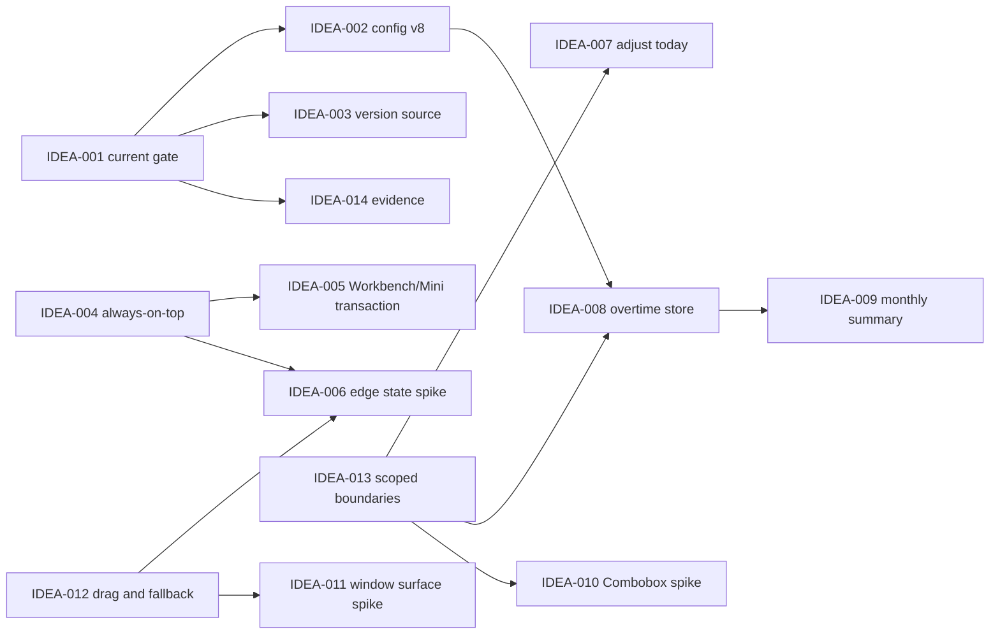

入口判断：/idea

# LetsMakeMoney Windows v1.0.7 候选需求池

## 追踪信息

- 当前状态：Idea 与完整 PRD 已确认；开发计划、进度看板和开发日志已生成，实施未开始
- 目标版本：Windows v1.0.7
- 上游来源：`V107-REV-20260803`、项目所有者真实运行观察、代码与测试审计
- 下游承接：`prd.md`、`traceability.md`、v1.0 高保真原型、`dev_plan_v1.0.7.md` 与 `progress_v1.0.7.md`
- 当前事实源：本地及远端 `main@12b6b03ce91b716d49590e21eb8dd7fe90fa283c`、GitHub v1.0.6 Stable Release
- 最后更新：2026-08-03

## Idea 阶段判断

- 本次来源：v1.0.7 深度 Review 的 14 项发现，以及项目所有者在 v1.0.6 正式包中的 10 项真实运行观察。
- 本版本主线：先关闭发布、配置、隐私和窗口可信问题，再在同一套日期与收入事实源上增加按日加班记录和月度工时总结，并完成限定范围的日历与窗口视觉修正。
- 为什么不是其他方向：当前最直接的问题集中在发布门禁、窗口可靠性、隐私、日历可读性和加班记录。全量架构重写、设计系统重写、宠物、账号、云同步、安装器与多平台都会显著扩大风险，且没有比现有问题更强的版本证据。
- 直接进入 `/prd`：V107-IDEA-001 至 005、007 至 009、012，以及 V107-IDEA-013 的限定治理和 V107-IDEA-014 的证据摘要部分。
- 先做技术 Spike：V107-IDEA-006 的状态机随机序列复现、V107-IDEA-010 的 Combobox 可访问性样件、V107-IDEA-011 的窗口表面所有权校准。
- 现在直接做：仅允许在后续实施阶段修正文档事实；本轮不修改代码。
- 继续验证：Windows 10、真实多显示器、DPI 下的安全抓取阈值。
- 暂不做：IPC 全量生成、CSP 正式启用、Bundle 拆分、脚本批量归档、全量模块重构。
- 总体结论：加班记录精度、休息日录入与跨夜归属已经确认；推荐将 v1.0.7 定义为 v1.0 系列收官版本，采用“收官完整方案”，视觉、安全与性能候选仍必须满足各自 Spike 或测量门禁。

## 上游证据摘要

### 数据证据包

- 决策问题：v1.0.7 应只做工程维护，还是同时承接窗口缺陷、加班、月度总结和限定视觉修正。
- 数据 / 来源：v1.0.6 正式包真实运行截图与观察、`App.tsx`、`model.ts`、Rust `lib.rs`、配置合同、行为测试、CI workflow、发布文档。
- 统计对象与粒度：单一正式发布版本、10 项逐场景观察、14 项代码与治理发现；不是用户群体统计。
- 时间范围：2026-08-03 的代码与真实运行审查。
- 数据新鲜度：对应当前 `main@12b6b03` 与 v1.0.6 Stable，适用于 v1.0.7 范围决策。
- 数据质量与代表性：代码事实和稳定截图为强证据；自动隐藏偶发失效只有高度可能证据；视觉偏好仅代表项目所有者和当前设计合同，不能推导全部用户偏好。
- 关键发现：CI 与配置合同存在确定的当前事实偏差；Mini、Workbench、日期调整和拖动存在可定位的行为问题；加班和月度总结当前完全没有领域模型；原生 Select 和双层圆角需要受控视觉验证。
- 反证 / 替代解释：没有使用数据证明所有用户需要加班；前端 Bundle 体积没有造成已确认启动问题；多职责文件虽大但仍有既有测试保护。
- 不能推出的结论：不能推出内存泄漏、Windows 10 或多显示器已兼容、所有用户都偏好自定义下拉框、完整架构重写会带来净收益。
- 对价值与时机的影响：可信、隐私和窗口找回问题现在处理；加班以最小独立数据合同推进；视觉与架构仅限本版直接触达区域。
- 最小补证或实验：Mini 随机状态序列、Combobox 键盘样件、窗口圆角三档 DPI 样件、六周日历加总结原型、安全抓取区多 DPI 测量。

## 证据追踪矩阵

下表逐项追踪 `V107-REV-001` 至 `V107-REV-014` 和 `V107-OBS-001` 至 `V107-OBS-010`。未进入实现的事项也保留明确去向。

| 上游 ID | 对应候选或去向 | 证据等级 | 结论 |
|---|---|---|---|
| V107-REV-001 | 已完成基线，不重复编号 | 强 | 主线已对账，保护分支保留，不进入 v1.0.7 开发 |
| V107-REV-002 | V107-IDEA-001 | 强 | 进入 PRD，P0 |
| V107-REV-003 | V107-IDEA-002 | 强 | 进入 PRD，P0 |
| V107-REV-004 | V107-IDEA-005 | 中 | 进入 PRD，需失败注入测试 |
| V107-REV-005 | V107-IDEA-013 | 强 | 限定局部治理，P2 |
| V107-REV-006 | V107-IDEA-013 | 强 | 增加责任边界门禁，不全量拆分 |
| V107-REV-007 | V107-IDEA-014 | 强 | 建立脱敏摘要与外部证据索引 |
| V107-REV-008 | V107-IDEA-003 | 强 | 进入 PRD，P0 |
| V107-REV-009 | V107-IDEA-014 | 强 | 直接修文档，历史留在 release 文档 |
| V107-REV-010 | V107-IDEA-015 | 中 | 继续验证，v1.0.7 不做全量 codegen |
| V107-REV-011 | V107-IDEA-014 | 强 | Windows 10、多显示器保留环境补证 |
| V107-REV-012 | V107-IDEA-017 | 中 | 技术 Spike，不进入正式实现 |
| V107-REV-013 | V107-IDEA-016 | 强 | 建立 lifecycle 索引，不删除历史脚本 |
| V107-REV-014 | V107-IDEA-018 | 中 | 暂不处理，先有性能阈值再拆包 |
| V107-OBS-001 | V107-IDEA-004 | 强 | 进入 PRD，P0 |
| V107-OBS-002 | V107-IDEA-005 | 强 | 进入 PRD，P0 |
| V107-OBS-003 | V107-IDEA-006 | 中 | 先完成技术 Spike，再进入修复门禁 |
| V107-OBS-004 | V107-IDEA-008 | 强 | 进入 PRD，P1 |
| V107-OBS-005 | V107-IDEA-009 | 强 | 进入 PRD，P1 |
| V107-OBS-006 | V107-IDEA-007 | 强 | 进入 PRD，P1 |
| V107-OBS-007 | V107-IDEA-009 | 强 | 进入 PRD，P1 |
| V107-OBS-008 | V107-IDEA-010 | 中 | 先做可访问性样件，满足门禁后进入 PRD |
| V107-OBS-009 | V107-IDEA-011 | 中 | 先做窗口表面 Spike，满足门禁后进入 PRD |
| V107-OBS-010 | V107-IDEA-012 | 强 | 进入 PRD，P0 |

## 承重假设与最小实验

| 假设 ID | 承重主张 | 若失败的影响 | 当前支持 / 反证 | 状态 | 最小实验 | 继续阈值 | 停止 / 转向阈值 |
|---|---|---|---|---|---|---|---|
| V107-H-001 | Mini 偶发不收起能由 pointer、focus、drag、timer 的有限状态序列稳定复现 | 无法写出可信修复合同 | 状态机复杂且有真实观察，但当前无稳定序列 | 部分支持 | 固定时钟 + 属性序列测试，覆盖左右各 100 组 | 发现至少一条可重复失败序列，并能用单一不变量解释 | 500 组无失败时降级为继续收集日志，不猜根因 |
| V107-H-002 | 自定义 Combobox 能在 WebView2 中同时满足圆角视觉、键盘、焦点、屏幕边界和读屏 | 若失败只能保留原生 Select | 当前只有两个 Select，替换范围可控；尚无样件 | 未知 | 单组件样件覆盖键盘、读屏、浅深主题和 150% DPI | 全部交互通过，且弹层不被窗口裁切 | 任一键盘或读屏关键路径退化则保留原生 Select |
| V107-H-003 | 六周日历与三项月度总结可在常用 Workbench 尺寸内无需页面滚动 | 若失败需要调整信息密度或窗口尺寸 | 920×640 已发生裁切，加入总结会更紧 | 未知 | 5/6 周、浅深主题、100/125/150% DPI 高保真样件 | 日期、图例、总结均完整，正文无纵向滚动 | 字号低于可读阈值或 150% 必须裁切时，允许该区域局部滚动或增大窗口 |
| V107-H-004 | Mini 28px、其他窗口 48px 的逻辑抓取区能在三档 DPI 和显示变化后保证找回 | 若失败会造成窗口丢失或过度回落 | 28px 隐私条已有产品合同，其他窗口约 48px 尚未实测 | 部分支持 | 几何夹具 + 真实 100/125/150% DPI，覆盖负坐标与显示器断开 | 每个窗口均有可点击抓取区且不发生逐帧闪影 | 任一 DPI 无法抓取则提高阈值，不能以固定物理像素发布 |
| V107-H-005 | 独立版本化 JSON 记录足以承载加班，不需要数据库或完整考勤系统 | 若失败会扩大为数据平台或真实工时系统 | 按日记录量小；无需查询复杂关系；现有原子 JSON 仓储成熟 | 已支持 | 1000 条跨月记录的读写、迁移、回滚和统计测试 | 原子保存、校验、月统计和回滚均通过，性能无可感知停顿 | 出现并发写入或查询复杂度需求时停止扩展，另立版本评估存储 |

## 候选需求总览

| ID | 标题 | 类型 | 证据等级 | 压力测试分数 | 置信度 | 分档结论 | 依赖 | 建议去向 | 最小下一步 |
|---|---|---|---|---:|---|---|---|---|---|
| V107-IDEA-001 | 唯一 current CI 门禁 | 发布工程 | 强 | 36/40 | 高 | 高价值 | 无 | 进入 PRD，P0 | 定义无版本入口与自检 |
| V107-IDEA-002 | config v8 唯一机器合同 | 数据合同 | 强 | 37/40 | 高 | 高价值 | 001 | 进入 PRD，P0 | Rust/TS/Schema/defaults 交叉清单 |
| V107-IDEA-003 | 应用版本单一事实源 | 发布工程 | 强 | 33/40 | 高 | 高价值 | 001 | 进入 PRD，P0 | 确认运行时 metadata 接口 |
| V107-IDEA-004 | 首次启动置顶可靠生效 | 缺陷 / 隐私 | 强 | 34/40 | 高 | 高价值 | 001 | 进入 PRD，P0 | 冷启动组合 characterization |
| V107-IDEA-005 | Workbench 与 Mini 可补偿显示事务 | 窗口 / 隐私 | 强 | 35/40 | 高 | 高价值 | 004 | 进入 PRD，P0 | 定义状态快照与失败补偿 |
| V107-IDEA-006 | Mini 自动隐藏状态机稳健化 | 隐私 / Spike | 中 | 29/40 | 中 | 中价值，先验证 | 004、012 | 技术 Spike 后 Bugfix | 随机序列与语义日志 |
| V107-IDEA-007 | “调整今天”复用日期事务 | 交互缺陷 | 强 | 34/40 | 高 | 高价值 | 013 | 进入 PRD，P1 | 抽取共享日期编辑入口 |
| V107-IDEA-008 | 按日加班记录与费率快照 | 产品增强 | 强 | 31/40 | 中 | 中价值，收敛推进 | 002、013 | 进入 PRD，P1 | 确认精度与日期语义 |
| V107-IDEA-009 | 月度工时总结与六周日历 | 产品增强 / 布局 | 强 | 31/40 | 中 | 中价值，收敛推进 | 008 | 进入 PRD，P1 | 完成无滚动布局样件 |
| V107-IDEA-010 | 可访问的圆角 Combobox | 视觉 / 可访问性 | 中 | 25/40 | 中 | 部分通过 | 013 | Spike 通过后进入 PRD | 两个 Select 的样件 |
| V107-IDEA-011 | 透明窗口单一表面所有权 | 视觉 / Spike | 中 | 24/40 | 中 | 部分通过 | 012 | Spike 通过后进入 PRD | 三种阴影/圆角所有权对照 |
| V107-IDEA-012 | 自由拖动与安全回落 | 窗口可靠性 | 强 | 34/40 | 高 | 高价值 | 无 | 进入 PRD，P0 | 分离 move 与 finalize |
| V107-IDEA-013 | 本版触达边界的局部治理与行为测试 | 工程治理 | 强 | 27/40 | 中 | 中价值，严格限量 | 007、008、009、012 | 进入 PRD，P2 | 选定一前端一 Rust 边界 |
| V107-IDEA-014 | 证据耐久、支持矩阵与 current 收口 | 测试 / 文档治理 | 强 | 28/40 | 高 | 中价值 | 001 | 部分进入 PRD / 直接文档 | 定义 evidence manifest |
| V107-IDEA-015 | IPC 机器可读 fixture | 类型治理 | 中 | 22/40 | 中 | 待验证 | 001 | 继续验证 | 选一个高风险命令做 fixture |
| V107-IDEA-016 | 脚本 current/historical lifecycle | 脚本治理 | 强 | 27/40 | 高 | 中价值 | 001 | 直接文档 / Spike | 生成调用图，不移动脚本 |
| V107-IDEA-017 | 最小 CSP 兼容 Spike | 安全 Spike | 中 | 19/40 | 中 | 待验证 | 001 | 技术 Spike，版本外 | 隔离验证 IPC、资源与更新 |
| V107-IDEA-018 | Bundle 性能测量 | 性能 | 中 | 14/40 | 高 | 暂不做 | 无 | 暂不处理 | 先定义冷启动阈值 |

## 候选需求池

### V107-IDEA-001 唯一 current CI 门禁

- 上游来源：V107-REV-002、V107-SLIM-001。
- 类型：发布工程；严重度：Major；证据状态：已确认。
- 当前问题：GitHub Actions 仍调用 `verify_v104.ps1`，绿色检查不能证明 v1.0.6 当前完整门禁通过。
- 用户或贡献者价值：阻止错误配置、版本或平台改动在“CI 绿色”的假象下进入主线。
- 影响范围：GitHub Actions、PowerShell 聚合脚本、Rust/TS/文档与包合同。
- 依赖与风险：无前置；切换后可能暴露当前 Windows runner 缺失，属于应被看见的真实失败。
- 测试缺口：workflow 自身没有断言实际调用的是 current gate。
- 成本：中；压力测试结论：值得继续；推荐去向：进入 PRD，P0。
- 最小下一步：定义无版本名 `verify_windows_current.ps1`，由机器可读声明指向当前版本合同；版本脚本只用于 historical 复验。

### V107-IDEA-002 config v8 唯一机器合同

- 上游来源：V107-REV-003、V107-SLIM-002。
- 类型：数据合同；严重度：Major；证据状态：已确认。
- 当前问题：Rust/TS 使用 config v8，公开 `config-v1.schema.json` 和 defaults 仍为 v6，旧验证因此自洽误通过。
- 用户价值：避免新工具或贡献者生成错误配置，保护已发布用户迁移和本地数据。
- 影响范围：Rust、TypeScript、JSON Schema、defaults、迁移测试、诊断、CI；无数据库影响。
- 依赖与风险：依赖 001 纳入 current gate；不得删除 v5 至 v7 migration。
- 测试缺口：缺少字段、枚举、默认值和版本跨四层交叉验证。
- 成本：中；压力测试结论：值得继续；推荐去向：进入 PRD，P0。
- 最小下一步：当前合同明确命名为 v8；v6、v7 只作为 historical migration fixture。

### V107-IDEA-003 应用版本单一事实源

- 上游来源：V107-REV-008。
- 类型：发布工程；严重度：Major；证据状态：已确认。
- 当前问题：`package.json`、Cargo、Tauri、关于页和更新检查分别维护 `1.0.6`。
- 用户价值：关于页、更新判断和发布包永远反映正在运行的真实版本。
- 影响范围：React、Tauri metadata、更新服务、打包与包体验证。
- 依赖与风险：依赖 001；浏览器预览需要明确 fallback，不能硬失败。
- 测试缺口：包版本、运行时版本和可见版本没有一一核对。
- 成本：小到中；压力测试结论：值得继续；推荐去向：进入 PRD，P0。
- 最小下一步：读取 Tauri app version，preview 使用明确的开发占位值。

### V107-IDEA-004 首次启动置顶可靠生效

- 上游来源：V107-OBS-001。
- 类型：缺陷 / 隐私；严重度：Major；证据状态：已确认。
- 当前问题：配置默认开启置顶，但首次启动可被其他窗口覆盖；切换开关后才恢复。
- 用户价值：默认行为与配置一致，Mini 不会无故消失在窗口后方。
- 影响范围：Rust window policy、配置 hydration、Mini 首次显示、隐藏恢复、日志与行为测试。
- 依赖与风险：依赖 001；重应用策略不能抢焦点或覆盖用户关闭置顶的选择。
- 测试缺口：清配置、旧配置、true/false、托盘恢复和二级窗口组合。
- 成本：中；压力测试结论：值得继续；推荐去向：进入 PRD，P0。
- 最小下一步：冻结首次可见顺序，证明配置加载后、窗口显示前后均得到权威策略。

### V107-IDEA-005 Workbench 与 Mini 可补偿显示事务

- 上游来源：V107-OBS-002、V107-REV-004、V107-SLIM-007。
- 类型：窗口 / 隐私；严重度：Major；证据状态：已确认。
- 当前问题：打开 Workbench 不隐藏 Mini；桌面 show 失败会误走 query fallback，hide 失败被吞掉。
- 用户价值：避免金额窗口重叠暴露，并保证打开或关闭失败可解释、可恢复。
- 影响范围：Mini、Workbench、WindowFrame、windowService、Rust show/hide、日志和测试。
- 依赖与风险：依赖 004；必须保留浏览器预览，不能用预览回退掩盖桌面错误。
- 测试缺口：进入前 Mini 为展开、隐私收起、显式隐藏、错误态，以及 Workbench 打开/关闭/崩溃/显示失败。
- 成本：中；压力测试结论：值得继续；推荐去向：进入 PRD，P0。
- 最小下一步：用一次性 visibility lease 记录 Mini 进入前状态；显示 Workbench 失败立即补偿；关闭只恢复 lease 拥有的状态。

### V107-IDEA-006 Mini 自动隐藏状态机稳健化

- 上游来源：V107-OBS-003。
- 类型：隐私 / 技术 Spike；严重度：Major；证据状态：高度可能。
- 当前问题：真实运行偶发贴边后不收起，但暂无线性复现步骤。
- 用户价值：减少工资长期暴露，恢复隐私功能可信度。
- 影响范围：`miniEdgeAutoHide.ts`、pointer/focus/drag/native dock、语义日志、Rust complete drag。
- 依赖与风险：依赖 004、012；证据强度未到稳定 Bug 根因，不允许凭猜测改 timer。
- 测试缺口：随机事件序列、pointer capture、无 pointerleave、快速移入移出、开关切换、窗口 focus。
- 成本：中到大；压力测试结论：继续验证；推荐去向：Spike 成功后进入 Bugfix。
- 最小下一步：完成 V107-H-001；若无法复现，先增加脱敏状态转换日志，不宣称修复。

### V107-IDEA-007 “调整今天”复用日期事务

- 上游来源：V107-OBS-006。
- 类型：交互缺陷；严重度：Major；证据状态：已确认。
- 当前问题：Today 三个分支调用 Settings，Calendar 已有正确的 `DateOverrideEditor` 事务。
- 用户价值：在原处完成自动判断、工作日、带薪休息、不带薪休息的调整，不跳错页面。
- 影响范围：Today、Calendar、日期调整 reducer/service、日志、反馈与测试。
- 依赖与风险：依赖 013 的共享日期编辑边界；不得复制第二套保存逻辑。
- 测试缺口：应用、取消、关闭、无变化、失败、重试、持久化和全链路重算。
- 成本：中；压力测试结论：值得继续；推荐去向：进入 PRD，P1。
- 最小下一步：把 DateOverrideEditor 变为共享业务组件，Today 传入当前 owner date。

### V107-IDEA-008 按日加班记录与费率快照

- 上游来源：V107-OBS-004。
- 类型：产品增强；严重度：Major；证据状态：已确认。
- 当前问题：当前只有计划有效工时，没有按日期加班记录、费率快照或历史补录。
- 用户价值：用户能记录额外劳动，并在工资变化后保留当时的金额解释依据。
- 影响范围：Rust domain/service/repository、TypeScript model/service、日历弹窗、日志、迁移、测试、发布包；无数据库影响。
- 依赖与风险：依赖 002、013；必须独立版本化存储，不能增加一个全局 `overtime_hours` 字段。
- 测试缺口：小数精度、范围、休息日、跨夜、跨月、修改、删除、费率变化、保存失败和损坏恢复。
- 成本：大但可拆；压力测试结论：收敛后值得继续；推荐去向：进入 PRD，P1。
- 最小下一步：采用本地 `overtime-records.json` v1 原子仓储候选；每条记录保存业务日期、整数分钟、录入时整数分时薪快照和更新时间。

### V107-IDEA-009 月度工时总结与六周日历

- 上游来源：V107-OBS-005、V107-OBS-007。
- 类型：产品增强 / 布局；严重度：Major；证据状态：已确认。
- 当前问题：日历无工时总结，六周月份已被底部裁切。
- 用户价值：无需把计划时长误认为实际出勤，也能快速理解本月计划、已流逝计划和加班情况。
- 影响范围：Rust 月聚合、TS 日历模型、Workbench 日历布局、浅深主题、DPI、测试。
- 依赖与风险：依赖 008；不能展示“实际工时”，不能在 v1.0.7 月总结展示加班收入。
- 测试缺口：5/6 周、跨月、未来月份、月中、零记录、长数字、100/125/150% DPI。
- 成本：中到大；压力测试结论：范围收敛后值得继续；推荐去向：进入 PRD，P1。
- 最小下一步：先验证 V107-H-003，再冻结三项指标与一屏布局合同。

### V107-IDEA-010 可访问的圆角 Combobox

- 上游来源：V107-OBS-008。
- 类型：视觉 / 可访问性；严重度：Minor；证据状态：已确认。
- 当前问题：两个原生 Select 的弹层由 WebView2/Windows 绘制，直角样式与应用不一致。
- 用户价值：提高 Settings 的一致性，同时保持键盘与读屏能力。
- 影响范围：Settings、组件层、焦点管理、浅深主题、DPI、自动测试。
- 依赖与风险：依赖 013；自定义弹层可能引入裁切、焦点逃逸和可访问性倒退。
- 测试缺口：箭头键、Home/End、Escape、Tab、读屏标签、窗口边缘、150% DPI。
- 成本：中；压力测试结论：部分通过；推荐去向：Spike 通过后进入 PRD。
- 最小下一步：仅为“休息模式”和“本周类型”实现一个共享样件，不扩展到设计系统重写。

### V107-IDEA-011 透明窗口单一表面所有权

- 上游来源：V107-OBS-009。
- 类型：视觉 / 技术 Spike；严重度：Minor；证据状态：已确认。
- 当前问题：透明原生窗口、原生 shadow 与 Web 圆角边框共同绘制，角部出现双层弧线。
- 用户价值：提升全部窗口的生产质感，避免明显边缘瑕疵。
- 影响范围：Tauri window flags、WindowFrame、CSS surface、Mini/Workbench/Settings/Wizard、DPI。
- 依赖与风险：依赖 012；错误选择会损失阴影、裁切内容或产生透明黑边。
- 测试缺口：四窗口、浅深主题、100/125/150% DPI、最大化边界、截图像素对照。
- 成本：中；压力测试结论：部分通过；推荐去向：视觉 Spike 后进入 PRD。
- 最小下一步：比较“原生阴影拥有”“Web 阴影拥有”“无透明外层”三种限定样件，选择一个所有者。

### V107-IDEA-012 自由拖动与安全回落

- 上游来源：V107-OBS-010。
- 类型：窗口可靠性；严重度：Major；证据状态：已确认。
- 当前问题：`move_app_window` 每帧设置位置后立即 `safe_window_position`，造成边缘闪影并阻止部分出屏。
- 用户价值：拖动自然，同时在松开、重启、找回和显示环境变化后不会丢失窗口。
- 影响范围：Rust window commands/platform geometry、React drag hook、位置持久化、Mini 隐私状态、日志和测试。
- 依赖与风险：无前置；必须明确区分用户主动隐私收起和窗口不可达。
- 测试缺口：左右/上下出屏、负坐标、多 DPI、分辨率变化、显示器断开、托盘找回、重启。
- 成本：中；压力测试结论：值得继续；推荐去向：进入 PRD，P0。
- 最小下一步：move 仅跟随指针；drag finalize、show/restart/topology change 才执行可抓取性检查。

### V107-IDEA-013 本版触达边界的局部治理与行为测试

- 上游来源：V107-REV-005、V107-REV-006、V107-SLIM-004 至 007。
- 类型：工程治理；严重度：Minor；证据状态：已确认。
- 当前问题：`App.tsx`、`model.ts` 和 Rust `lib.rs` 多职责集中，结构门禁不能阻止责任回流。
- 用户价值：降低本版日期、加班和窗口修复互相污染的风险。
- 影响范围：前端页面/领域边界、Rust window/error boundary、结构与行为测试。
- 依赖与风险：只服务 007 至 012；不能成为脱离用户范围的架构工程。
- 测试缺口：行为等价 characterization、禁止依赖方向、command 薄层和公开 API 稳定性。
- 成本：中；压力测试结论：限量推进；推荐去向：进入 PRD，P2。
- 最小下一步：前端最多提取“日期调整 + 加班 + 月总结”的 calendar feature 边界；Rust 最多提取 window policy/error mapping 边界。

### V107-IDEA-014 证据耐久、支持矩阵与 current 收口

- 上游来源：V107-REV-007、009、011、V107-SLIM-003。
- 类型：测试 / 文档治理；严重度：Minor；证据状态：已确认。
- 当前问题：GUI 原始证据仅在本机 `.artifacts`，current 复述多个历史版本，Windows 10 和真实多显示器缺证据。
- 用户或贡献者价值：发布结论可复核，当前状态可快速理解，平台声明不冒充通过。
- 影响范围：文档、evidence manifest、acceptance、CI 链接和支持矩阵。
- 依赖与风险：依赖 001；不得提交工资、用户名、绝对路径或完整原始日志。
- 测试缺口：外部证据不可变索引、链接存活、环境差异。
- 成本：中；压力测试结论：值得继续；推荐去向：部分 PRD、部分直接文档。
- 最小下一步：仓库保留脱敏摘要/哈希/环境/结论；原图与完整日志放外部稳定位置；Windows 10、多显示器不足时明确待补证。

### V107-IDEA-015 IPC 机器可读 fixture

- 上游来源：V107-REV-010、V107-SLIM-009。
- 类型：类型治理；严重度：Minor；证据状态：已确认。
- 当前问题：Rust/TS 请求响应由字符串与手写泛型维持，但尚无真实漂移事故。
- 用户价值：潜在降低字段漂移风险，当前不是直接用户问题。
- 影响范围：Rust command、TS service、fixture；风险是引入过度 codegen。
- 成本：中；压力测试结论：继续验证；推荐去向：v1.0.7 外。
- 最小下一步：只为加班或窗口状态选择一个高风险命令做 fixture，出现稳定收益后再立项。

### V107-IDEA-016 脚本 current/historical lifecycle

- 上游来源：V107-REV-013、V107-SLIM-008。
- 类型：脚本治理；严重度：Suggestion；证据状态：已确认。
- 当前问题：版本脚本有继承链和多个手工入口，但仍承担历史复验。
- 用户或贡献者价值：降低误用入口，不破坏旧版本追溯。
- 影响范围：scripts、README、CI、历史 tag；禁止直接删除。
- 成本：小到中；压力测试结论：值得继续；推荐去向：直接文档 + 后续 Spike。
- 最小下一步：生成 current/historical/manual 调用图；本版仅引入唯一 current gate。

### V107-IDEA-017 最小 CSP 兼容 Spike

- 上游来源：V107-REV-012、V107-SLIM-010。
- 类型：安全 Spike；严重度：Suggestion；证据状态：已确认。
- 当前问题：CSP 为 `null`，但没有注入事件或安全事故证据。
- 用户价值：潜在增加内容注入防线；错误启用会破坏 IPC、资源和更新。
- 影响范围：Tauri config、所有窗口、GitHub 更新；验证成本高。
- 成本：中到大；压力测试结论：仅 Spike；推荐去向：v1.0.7 外。
- 最小下一步：隔离分支验证最小策略，失败不影响本版。

### V107-IDEA-018 Bundle 性能测量

- 上游来源：V107-REV-014、V107-SLIM-011。
- 类型：性能；严重度：Suggestion；证据状态：已确认。
- 当前问题：Bundle 约 714 KB raw / 132 KB gzip，但没有启动慢、内存异常或用户投诉证据。
- 用户价值：当前无法证明；盲目拆包会增加复杂度。
- 影响范围：Vite、React、窗口首帧、缓存。
- 成本：中；压力测试结论：未通过；推荐去向：暂不处理。
- 最小下一步：未来只有冷启动或首帧超过项目所有者确认阈值时再测量。

## 加班与月度总结合同

### 推荐数据边界

1. 加班是按业务日期保存的独立记录，不是 AppConfig 中的单一累计字段。
2. 推荐本地版本化文件 `overtime-records.json`，采用与配置一致的临时写入、回读校验和原子替换；不引入数据库。
3. 每条记录至少包含：业务日期、整数分钟、录入时整数分时薪快照、由快照计算的金额依据、创建/更新时间和 schema 版本。
4. UI 接受小数小时，写入前转换为整数分钟；精度、步进和舍入规则留给 PRD 确认。
5. 修改时默认保留原费率快照；删除后重新创建视为新记录并捕获新快照。该语义为推荐，待确认。
6. 普通工作日、普通休息日、带薪休息和不带薪休息均建议允许录入，因为记录的是额外劳动，不改变该日期的基础业务分类。该语义为推荐，待确认。
7. 跨夜场景默认使用当前 Dashboard `owner_date`，用户可在日历选择其他日期；最终持久化以用户提交的业务日期为准，不自动改归属。
8. 加班金额可在单日编辑时作为计算预览和历史解释依据，但 v1.0.7 不并入“今日已赚”、月薪进度或月度总结。

### 月度指标口径

| 指标 | 定义 | 明确不代表 |
|---|---|---|
| 计划工时 | 月内所有有效计划工作日的有效工作时长之和，随官方/估算日历和手动日期调整重算 | 真实出勤 |
| 已流逝计划工时 | 截至当前时刻，已在计划工作区间内流逝的有效时间；历史计划工作日按完整计划计入 | 实际完成、打卡或生产率 |
| 加班工时 | 月内加班记录分钟数之和 | 基础计划工时或真实考勤全量 |

- 月度总结不展示加班收入。
- 日期调整改变计划工时和已流逝计划工时，但不自动删除加班记录。
- 记录保存失败时，旧记录和旧月度汇总必须保持不变。

## 窗口与隐私状态机

### Workbench 与 Mini

| 进入前 Mini 状态 | 打开 Workbench | Workbench 关闭 | 打开失败 |
|---|---|---|---|
| 展开可见 | 原生隐藏并记录 lease | 恢复展开可见 | 立即恢复展开 |
| 隐私收起 | 原生隐藏并记录 dock/收起状态 | 恢复原侧收起 | 立即恢复原侧收起 |
| 用户已隐藏 | 不额外显示 | 保持隐藏 | 保持隐藏 |
| Mini show/hide 失败 | 显示可读反馈并写日志 | 不伪造成功 | 回滚 lease，不进行 query 导航 |

- Workbench 只恢复自己隐藏的 Mini；用户通过托盘显式改变状态后，旧 lease 不得覆盖新意图。
- 关闭、系统关闭请求、异常销毁和显示失败均要走可补偿路径。
- 浏览器原型可继续 query fallback；真实桌面错误必须保留原始语义。

### Mini 自动隐藏

- 正式修复前必须先通过 V107-H-001。
- 核心不变量：拖动完成且 native 已贴边、无交互锁、指针不在窗口时，必须在约定延迟后进入隐私收起；任何锁释放都必须重新评估。
- 不得通过无限延长 timer 或忽略 focus 来掩盖问题。
- 语义日志只记录状态、事件和原因，不记录收入数据。

### 自由拖动与安全回落

- 拖动阶段：只设置指针目标位置，不调用 `safe_window_position`。
- 松开阶段：若保留足够逻辑抓取区则保持原位；不足时回落到最近工作区。
- 恢复阶段：重启、托盘找回、分辨率/DPI 改变或显示器断开时重新检查。
- Mini 主动隐私收起使用独立 dock 合同，不被安全回落判为窗口丢失。
- 压力测试基线为 Mini 28px、其他窗口 48px 逻辑抓取区；最终值必须由三档 DPI 证据确定。

## 日历与视觉方案

### 日历布局

- 保留完整 7 列和最多 6 行月份，不允许第六行被 Workbench 裁切。
- 月度总结位于日历下方或侧方，但不得挤压日期字号、点击区域和图例。
- 优先在 920×640 常用窗口内完成；V107-H-003 失败时允许提高最小窗口高度或仅让日历业务区局部滚动，不能让整个页面出现难以发现的底部内容。
- 今天、选中、工作/休息/手动状态沿用 v1.0.6 的复合状态合同，不因布局调整被覆盖。

### Combobox

- 仅替换当前两个原生 Select：休息模式、本周类型。
- 必须具备关闭态、展开态、hover、focus、disabled、错误、键盘和读屏状态。
- 若 V107-H-002 不通过，v1.0.7 保留原生 Select，只做闭合控件 CSS 校准。

### 窗口表面

- 单个窗口只能有一个圆角和阴影所有者。
- Spike 必须覆盖 Mini、Workbench、Settings、Wizard，以及浅色、深色、100/125/150% DPI。
- 不重写设计系统，不改变全部页面信息架构。

## 工程治理边界

### v1.0.7 允许

1. 前端最多提取一个与本版直接相关的边界：日期调整、加班和月总结组成的 calendar feature；保留现有公开 service/hook API。
2. Rust 最多提取一个边界：window policy、safe fallback 和 error mapping；命令名及 Tauri 注册保持不变。
3. 为上述边界增加行为 characterization、禁止依赖方向和薄 command 门禁。
4. 建立 current gate、配置 v8 合同、版本事实源和 evidence manifest。
5. `doc/current.md` 只保留当前公开版本、开发阶段和入口；历史结论继续由 release 文档承接。

### v1.0.7 不允许

- 引入 Redux、Zustand 或新的全局状态库。
- 全量拆分 App.tsx、model.ts 或 Rust lib.rs。
- 全量 IPC codegen。
- 删除 migration、历史脚本、Spike、v0.9/Figma/宠物或历史 release 文档。
- 正式启用 CSP、拆分 Bundle、恢复宠物、账号、云同步、安装器或多平台。

## 依赖关系

## 优先级与实施依赖

### P0

1. V107-IDEA-001 current gate。
2. V107-IDEA-002 config v8 唯一合同。
3. V107-IDEA-003 版本单一事实源。
4. V107-IDEA-004 首次置顶。
5. V107-IDEA-005 Workbench/Mini 显示事务。
6. V107-IDEA-006 Mini 自动隐藏 Spike 与后续修复门禁。
7. V107-IDEA-012 自由拖动与安全回落。

### P1

1. V107-IDEA-007 调整今天。
2. V107-IDEA-008 加班记录。
3. V107-IDEA-009 月度总结和六周布局。
4. V107-IDEA-010 Combobox 条件实现。
5. V107-IDEA-011 窗口表面条件实现。

### P2

1. V107-IDEA-013 限定工程治理。
2. V107-IDEA-014 证据与文档治理。
3. V107-IDEA-015、016 仅做 fixture 或索引。
4. V107-IDEA-017、018 不进入本版实现。

### 推荐顺序

1. 先完成 001、002、003，建立可信开发门禁。
2. 并行完成 004/005 与 012；006 在 012 几何合同稳定后执行状态机 Spike。
3. 完成 013 的两个限定边界，再接 007 和 008。
4. 008 数据合同通过后完成 009。
5. 010、011 各自通过 Spike 后再实施；失败即保留现状。
6. 最后补 014、Windows 环境矩阵和全量发布身份门禁。

## 最小方案

- 完成 V107-IDEA-001 至 007、012。
- 关闭 CI、配置、版本、置顶、Workbench/Mini、自动隐藏和调整今天的可信/隐私问题。
- 不加入完整加班能力、月度总结、自定义 Combobox 或窗口表面改造。
- 适合需要快速发布维护版的情况；用户已确认的加班方向将延后。

## 推荐方案

- 完成最小方案。
- 完成 V107-IDEA-008、009，建立独立加班记录与三项月度工时总结。
- V107-IDEA-010、011 只有在 Spike 通过后实施限定视觉修正。
- 完成 V107-IDEA-013 的一前端、一 Rust 边界和必要行为测试。
- 完成 V107-IDEA-014 的脱敏证据摘要、current 收口和 Windows 支持矩阵。
- V107-IDEA-015、016 只做最小 fixture/索引，不做全量生成或脚本迁移。
- 选择理由：覆盖全部 10 条项目所有者观察，同时把不确定视觉与偶发隐私问题放进前置门禁，不用一次性重写系统。

## 收官完整方案（已确认）

- 完成推荐方案中的 V107-IDEA-001 至 014，不把条件 Spike 失败伪装成已实现。
- 将 V107-IDEA-015 从单点试验提升为高风险 IPC 合同覆盖：配置事务、Dashboard、窗口显示/隐藏和加班记录必须具备机器可读 fixture，但不做全量 codegen。
- 完成 V107-IDEA-016 的 current/historical 脚本生命周期索引、唯一当前入口和误用失败保护；历史脚本继续保留，不批量迁移。
- V107-IDEA-017 在隔离环境完成最小 CSP 兼容 Spike；只有 IPC、资源、更新和全部窗口回归通过后才启用，否则形成明确风险记录，不阻塞既有功能。
- V107-IDEA-018 只建立冷启动、首帧、Bundle 和 WebView 资源基线；仅在超过 PRD 阈值时实施定向优化，不为追求数字进行拆包。
- Windows 11 单显示器为本版强制桌面验收环境；Windows 10 需取得真实证据或收窄公开支持声明。多显示器明确不进入 v1.0.7 验收范围，也不得写成已验证。
- 版本结束时要求：公开事实、配置迁移、窗口与隐私、加班与月度总结、视觉条件项、行为测试、用户文档、发布包身份和回滚路径均有明确结论，不保留“实现了但未验收”的项目。
- 选择理由：这是 v1.0 产品边界内的最大闭环，不恢复宠物、不加入账号、云同步、安装器、多平台或整体架构重写，能降低收官后的维护尾项而不制造新的产品线。

## 过大方案

- 全量拆分 App.tsx、model.ts、Rust lib.rs。
- 引入全局状态管理并重写多窗口同步。
- 完整考勤、打卡、加班倍率、审批和加班收入统计系统。
- 全量设计系统与所有窗口重做。
- 全量 IPC codegen、CSP 正式启用和 Bundle 拆分。
- 恢复宠物或 PetManager、账号、云同步、安装器、自动更新、多平台。
- 不进入原因：这些内容显著超出 v1.0.x 稳定线，缺少用户与性能证据，会同时触碰数据、窗口、视觉和发布链，无法保持可回退性。

## 最终分流

| 去向 | 候选 |
|---|---|
| 进入 v1.0.7 PRD | V107-IDEA-001 至 005、007 至 009、012、013 的限定范围、014 的证据合同 |
| 技术 Spike 后决定是否进 PRD | V107-IDEA-006、010、011 |
| 直接修文档 / 建索引 | V107-IDEA-014 的 current 收口、V107-IDEA-016 |
| 继续验证 | V107-IDEA-015、Windows 10、多显示器 |
| 暂不处理 | V107-IDEA-017、018 |
| 已完成基线 | V107-REV-001 |

## 已确认决策与剩余范围选择

1. **加班精度与范围**：已确认。UI 允许最多两位小数，写入时按最近一分钟转换，单日范围 `0.00` 至 `24.00` 小时；`0` 视为删除。
2. **休息日与跨夜归属**：已确认。普通休息日、带薪休息、不带薪休息均允许录入；跨夜入口默认使用 Dashboard `owner_date`，最终以用户提交的业务日期为准。
3. **Windows 环境门禁**：已确认本版暂不考虑多显示器。多显示器不进入通过声明；Windows 11 单显示器为强制验收环境，Windows 10 证据或支持声明仍需在 PRD 中闭合。
4. **版本范围**：已确认采用“收官完整方案”；文档中的“过大方案”继续作为明确非目标。

## 是否具备进入 v1.0.7 /prd 的条件

**具备。** 上游 24 项、数据合同、依赖、风险、Spike、收官完整方案和非目标均已确认，可直接进入完整 PRD。PRD 必须把 V107-IDEA-006、010、011、017、018 写成带前置门禁或测量阈值的条件需求，不能把未完成 Spike 伪装为确定实现。

## 下一阶段建议

- PRD 与开发承接均已完成；下一步从 `V107-M0` 开始冻结事实、行为基线和证据合同。
- 不得跳过 M0 直接修改窗口、加班、日历或视觉代码。
- 当前仍未修改业务代码，未构建、打包、验收、提交或推送。
