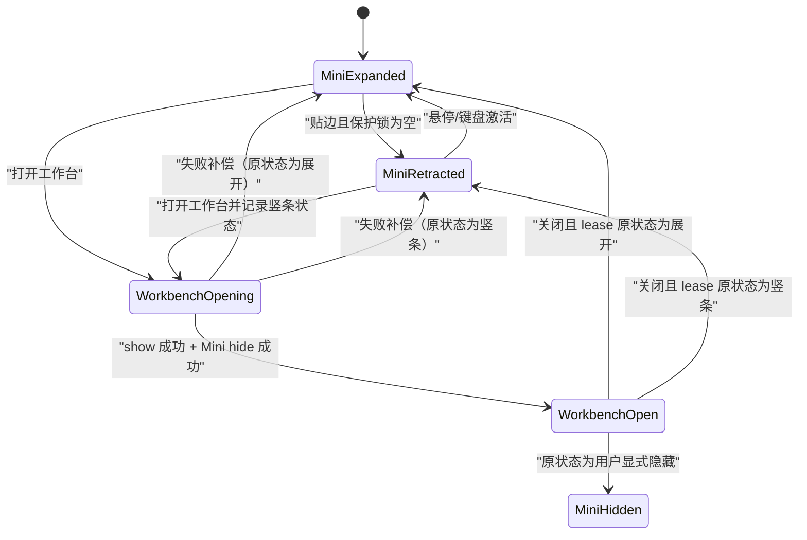
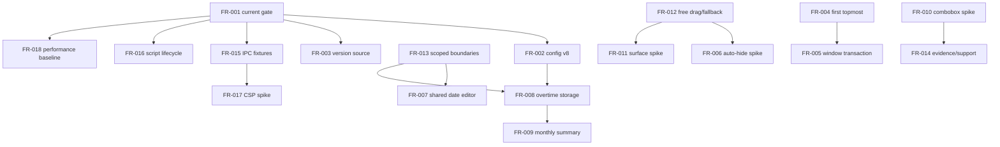

# LetsMakeMoney Windows v1.0.7 产品需求文档

## 文档信息

| 字段 | 内容 |
| --- | --- |
| 版本 | v1.0.7 Stable 候选 |
| PRD 类型 | 正式推进型 PRD / v1.0 系列功能收官 |
| 产品基线 | `main@12b6b03ce91b716d49590e21eb8dd7fe90fa283c` |
| 当前公开版本 | v1.0.6 Stable |
| 状态 | 已由项目所有者确认；开发承接已完成，实施未开始 |
| 上游 | `idea-pool.md`、`review.md`、`owner-observation.md`、`issue-pool.md`、`slimming-candidates.md` |
| 追踪矩阵 | `traceability.md` |
| 原型 | `doc/prototypes/v1.0/index.html` |

## 1. PRD 判断

v1.0.7 是 v1.0 系列最后一个功能版本。它不是一次产品线扩张，也不是架构重写；目标是关闭已经被真实运行、代码审计和发布流程证明存在的可信、隐私、窗口、日历与维护缺口，并交付有限的新能力：按日加班记录和月度工时总结。

本版采用已确认的“收官完整方案”：`V107-IDEA-001` 至 `V107-IDEA-014` 全部进入开发合同；`V107-IDEA-015`、`V107-IDEA-016`进入限定治理；`V107-IDEA-017`、`V107-IDEA-018`仅在条件门禁满足时实施。任何条件 Spike 未通过时，都必须保留既有稳定行为并记录结论，不能写成已实现。

## 2. 产品目标与非目标

### 2.1 产品目标

1. 让 CI、配置、版本和发布包共同证明同一个当前版本。
2. 让首次置顶、Mini 隐私收起、Workbench 切换和窗口找回具备可补偿、可诊断的行为合同。
3. 让“调整今天”和日历日期调整使用同一事务。
4. 让用户按业务日期记录加班时间，并保存当时的时薪解释依据。
5. 在一屏日历中展示计划工时、已流逝计划工时和加班工时，不把计划冒充实际出勤。
6. 在不重写设计系统的前提下，关闭原生下拉割裂、透明窗口双弧线和拖动闪影。
7. 建立 v1.0 系列可复核的测试、证据、脚本和平台支持收口。

### 2.2 非目标

- 不恢复宠物或 PetManager。
- 不加入账号、云同步、安装器、静默自动更新或多平台。
- 不建设完整考勤、打卡、加班审批、倍数规则、调休余额或加班收入报表。
- 不扩展第三种主题、自定义主题或主题市场。
- 不引入新的全局状态库，不重写 React/Tauri/Rust 主链路。
- 不把多显示器列入 v1.0.7 验收范围或通过声明。
- 不更改 v1.0.6 tag、Release、附件或历史验收结论。

## 3. 用户与关键场景

### 3.1 目标用户

- 在 Windows 11 单显示器设备上，希望随时查看本日收入进度的固定月薪用户。
- 需要对特殊日期、跨夜班次和临时加班保留本地记录的用户。
- 对工资隐私敏感，需要 Mini 贴边自动收起和可靠找回的用户。

### 3.2 黄金路径


## 4. 统一术语与不变量

### 4.1 术语

| 术语 | 定义 |
| --- | --- |
| Mini | 迷你收入视图，包括展开态和 28px 隐私竖条态 |
| Workbench | 今日详情和收入日历所在的主工作台窗口 |
| owner date | Dashboard 对当前班次解析出的业务归属日期 |
| 业务日期 | 用户提交并持久化加班或日期调整的日历日期 |
| 计划工时 | 按配置、日历和日期调整推导出的应工作时长，不代表真实出勤 |
| 已流逝计划工时 | 截至当前时刻，在计划工作区间内自然流逝的时长，不代表真实出勤 |
| 加班工时 | 用户主动记录的额外工作分钟数 |
| current gate | 当前主线唯一、无版本号的完整验证入口 |
| historical gate | 仅用于历史 tag 或旧版本复验的版本化脚本 |

### 4.2 业务不变量

1. 收入、工作日、日期调整和跨夜 owner date 的 v1.0.6 口径保持不变。
2. 加班记录不改变 Dashboard 的今日收入、工作进度、月薪累计或日期类型。
3. 月度总结不得把计划工时或时间流逝称为“实际工时”。
4. 金额均以整数分存储或计算；加班时长以整数分钟存储。
5. 用户主动隐私收起的 Mini 不属于窗口丢失，不能被通用安全回落强制展开。
6. 原生桌面错误不能回退成浏览器 query 导航；浏览器原型回退只在非 Tauri 环境使用。
7. 所有新增数据仅保存在本机，不引入数据库和网络账户。

## 5. 功能需求总览

| FR | 标题 | IDEA | 优先级 | 实施性质 |
| --- | --- | --- | --- | --- |
| FR-001 | 唯一 current CI 门禁 | IDEA-001 | P0 | 必须实现 |
| FR-002 | config v8 唯一机器合同 | IDEA-002 | P0 | 必须实现 |
| FR-003 | 应用版本单一事实源 | IDEA-003 | P0 | 必须实现 |
| FR-004 | 首次启动置顶可靠生效 | IDEA-004 | P0 | 必须实现 |
| FR-005 | Mini/Workbench 可补偿显示事务 | IDEA-005 | P0 | 必须实现 |
| FR-006 | Mini 自动隐藏状态机稳健化 | IDEA-006 | P0 | Spike 后实施或仅增强诊断 |
| FR-007 | “调整今天”复用日期事务 | IDEA-007 | P1 | 必须实现 |
| FR-008 | 按日加班记录与费率快照 | IDEA-008 | P1 | 必须实现 |
| FR-009 | 月度工时总结与六周日历 | IDEA-009 | P1 | 必须实现 |
| FR-010 | 可访问的圆角 Combobox | IDEA-010 | P1 | Spike 通过后实施 |
| FR-011 | 透明窗口单一表面所有权 | IDEA-011 | P1 | Spike 通过后实施 |
| FR-012 | 自由拖动与安全回落 | IDEA-012 | P0 | 必须实现 |
| FR-013 | 本版触达边界的局部治理 | IDEA-013 | P2 | 限定实现 |
| FR-014 | 证据耐久、支持矩阵与 current 收口 | IDEA-014 | P2 | 必须实现 |
| FR-015 | 高风险 IPC 机器 fixture | IDEA-015 | P2 | 限定实现 |
| FR-016 | 脚本 current/historical 生命周期 | IDEA-016 | P2 | 必须实现 |
| FR-017 | 最小 CSP 兼容门禁 | IDEA-017 | P2 | 条件启用 |
| FR-018 | 冷启动与 Bundle 性能门禁 | IDEA-018 | P2 | 条件优化 |

## 6. 正式需求

### FR-001 唯一 current CI 门禁

**用户目标**：贡献者和项目所有者看到绿色 required check 时，可以确认当前版本的完整合同确实通过。

| 合同项 | 要求 |
| --- | --- |
| 入口/出口 | `.github/workflows/windows-v1-verify.yml` 只调用 `scripts/verify_windows_current.ps1`；退出码 0 才通过 |
| 默认/状态 | `current-manifest.json` 指向 v1.0.7 合同；`validating/passed/failed/misused` |
| 保存/取消/关闭 | 不涉及用户保存；CI 取消保持 cancelled，不写通过 |
| 失败/重试 | 入口缺失、manifest 版本不匹配、调用 historical gate、任一子门禁失败均返回非零；重跑不得跳过失败项 |
| 日志 | 输出 current manifest、HEAD、子门禁名称和退出码，不输出秘密 |
| 兼容/回滚 | historical 脚本保留；回滚 workflow 时仍不得重新指向旧版作为 current |
| 测试 | workflow 静态断言、入口自检、错误版本和 historical 误用负向测试 |
| 数据库 | 无数据库影响 |

### FR-002 config v8 唯一机器合同

**用户目标**：旧用户配置安全迁移，工具和贡献者不会生成与应用不一致的配置。

| 合同项 | 要求 |
| --- | --- |
| 入口/出口 | Rust `CURRENT_CONFIG_VERSION`、TS `CURRENT_CONFIG_VERSION`、JSON Schema、defaults 交叉校验后输出 v8 配置 |
| 默认/状态 | `valid/migrated/invalid/recovered`；新配置和缺失版本走既有迁移规则 |
| 保存/取消/关闭 | 配置事务保持 v1.0.6 语义：成功原子替换、无变化不写盘、失败保留旧配置和草稿 |
| 失败/重试 | 非法枚举或字段拒绝写入；读取损坏时保留备份并安全恢复；重试不得覆盖最后有效配置 |
| 日志 | 只记录版本、迁移路径和错误代码，不记录薪资值 |
| 兼容/回滚 | v5-v7 migration fixture 必须保留；回滚 v1.0.6 时 v8 配置仍可读 |
| 测试 | Rust/TS/Schema/defaults 四层字段、枚举、默认值和版本一致性；历史迁移回归 |
| 数据库 | 无数据库影响，仍使用本地 `config.json` |

### FR-003 应用版本单一事实源

**用户目标**：关于页、更新检查、文件名和发布包显示同一个真实版本。

| 合同项 | 要求 |
| --- | --- |
| 入口/出口 | 桌面环境从 Tauri package metadata 读取版本；浏览器预览显示明确的 `dev-preview` |
| 默认/状态 | `loaded/fallback/error`；正式包禁止 fallback |
| 保存/取消/关闭 | 无用户写入 |
| 失败/重试 | 正式构建无法读取版本时构建失败；浏览器原型可使用开发占位值 |
| 日志 | 更新检查记录运行版本和目标版本，不记录下载 token |
| 兼容/回滚 | 不改变更新比较算法，只替换版本来源 |
| 测试 | Cargo/Tauri/package/BUILD-INFO/Zip 名称/关于页/更新请求交叉核对 |
| 数据库 | 无数据库影响 |

### FR-004 首次启动置顶可靠生效

**用户目标**：配置为始终置顶时，首次显示的 Mini 就保持在普通窗口上方；关闭置顶时不抢占层级。

| 合同项 | 要求 |
| --- | --- |
| 入口/出口 | 配置 hydration 完成后、Mini 首次可见前应用权威 window policy；显示后只做一次校验，不抢焦点 |
| 默认/状态 | `pending_config/applying/applied/disabled/failed` |
| 保存/取消/关闭 | Settings 保存成功后即时重应用；取消和关闭恢复 persisted 值 |
| 失败/重试 | 应用失败显示非阻塞反馈并记录；托盘找回时重试一次，仍失败则保留可见窗口但不谎报置顶 |
| 日志 | `window.policy.requested/applied/failed`，含窗口 label 和布尔值，不含配置正文 |
| 兼容/回滚 | 保持 v1.0.6 默认值；不新增焦点抢占 |
| 测试 | 清配置、旧配置、true/false、冷启动、托盘找回、Workbench/Settings 同时存在 |
| 数据库 | 无数据库影响 |

### FR-005 Mini/Workbench 可补偿显示事务

**用户目标**：打开 Workbench 时不被 Mini 遮挡或重复暴露金额；关闭或失败后恢复正确状态。

| 合同项 | 要求 |
| --- | --- |
| 入口/出口 | 从 Mini、托盘或其他窗口打开 Workbench；成功后 Workbench 可见、Mini 按 lease 隐藏；关闭后恢复进入前状态 |
| 默认/状态 | visibility lease 记录 `expanded/privacy_retracted/hidden_by_user/not_present`；`opening/open/compensating/closed/failed` |
| 保存/取消/关闭 | 无配置写入；关闭、系统按钮和 Workbench 初始化失败均结束 lease |
| 失败/重试 | Workbench show 失败不隐藏 Mini；Mini hide 失败则终止打开并补偿；桌面错误显示可读反馈，浏览器才 query fallback |
| 日志 | `window.transaction.started/committed/compensated/failed`，记录 transaction id、label 和状态，不记录金额 |
| 兼容/回滚 | 托盘显式隐藏的 Mini 不由 Workbench 恢复；隐私竖条恢复为竖条而非展开态 |
| 测试 | 四种进入前状态，打开/关闭/show 失败/hide 失败/Workbench 崩溃/重复打开/托盘恢复 |
| 数据库 | 无数据库影响 |

### FR-006 Mini 自动隐藏状态机稳健化

**用户目标**：贴边后即使没有额外点击，Mini 也会按约定收起；交互期间不会误收起。

| 合同项 | 要求 |
| --- | --- |
| 入口/出口 | pointer、focus、drag、native dock、设置变更进入统一 reducer；输出展开、等待收起、已收起或保护锁定 |
| 默认/状态 | `expanded/retract_scheduled/retracted/revealing/fallback`；锁：dragging、pointer_inside、focused、modal |
| 保存/取消/关闭 | 自动隐藏开关沿用配置事务；关闭后取消 timer，开启后按 native status 重新同步 |
| 失败/重试 | V107-H-001 先运行至少 10,000 条确定性随机事件序列；可复现失败才修根因；不可复现则只加脱敏状态日志，不宣称缺陷已关闭 |
| 日志 | 状态、事件、锁集合、timer 代次和 native visibility；禁止记录屏幕内容、金额和绝对坐标 |
| 兼容/回滚 | 保留现有延时和 reduced-motion 分支，除非 Spike 证据证明需调整 |
| 测试 | 无 pointerleave、pointer capture、快速移入移出、拖动后焦点残留、开关切换、Workbench lease、窗口找回 |
| 数据库 | 无数据库影响 |

**继续阈值**：随机序列或真实 Computer Use 至少稳定复现 1 次错误状态，且可定位到唯一状态转移。**停止阈值**：10,000 序列、30 次真实贴边和语义日志均未复现。停止时保留日志增强与“继续观察”结论。

### FR-007 “调整今天”复用日期事务

**用户目标**：在今日页直接调整当前 owner date，不跳转到 Settings。

| 合同项 | 要求 |
| --- | --- |
| 入口/出口 | 今日页三个状态分支的“调整今天”均打开共享 DateOverrideEditor，并传入当前 owner date |
| 默认/状态 | 自动判断、工作日、带薪休息、不带薪休息；展示当前自动来源和既有覆盖 |
| 保存/取消/关闭 | 应用走既有 `save_date_override`；取消、X、Escape 不写盘；无变化不发写请求 |
| 失败/重试 | 失败保留编辑值和旧配置，显示可读错误；重试使用相同 transaction id 语义 |
| 日志 | 记录日期、目标枚举、结果和错误代码，不记录薪资 |
| 兼容/回滚 | 日历入口继续使用同一组件和 service，不复制第二套 reducer |
| 测试 | 应用/无变化/取消/关闭/失败/重试/持久化；Dashboard、日历、收入和安排同步重算 |
| 数据库 | 无数据库影响，沿用 config v8 `date_overrides` |

### FR-008 按日加班记录与费率快照

**用户目标**：按业务日期补录、修改或删除加班时长，并保留录入时的时薪解释依据。

#### 数据合同

文件：`%APPDATA%\LetsMakeMoney\overtime-records.json`，UTF-8，本地原子写入，独立于 config v8。

```json
{
  "schema_version": 1,
  "records": [
    {
      "business_date": "2026-08-03",
      "minutes": 90,
      "hourly_rate_fen_snapshot": 6250,
      "created_at": "2026-08-03T19:30:00+08:00",
      "updated_at": "2026-08-03T19:30:00+08:00"
    }
  ]
}
```

- `business_date` 唯一，一日最多一条。
- UI 接受 0 至 24 小时、最多两位小数；写入时 `round(hours × 60)`，范围为 0 至 1440 分钟。
- 输入 `0` 表示删除。大于 24、负数、NaN、超过两位小数均禁止提交。
- 新建记录时用当前 Dashboard 权威时薪的整数分保存 `hourly_rate_fen_snapshot`。
- 修改现有记录只改分钟和 `updated_at`，保留原费率快照；删除后重新创建视为新记录并捕获新费率。
- 所有工作日、普通休息日、带薪休息和不带薪休息均允许录入。
- 跨夜入口默认选中 Dashboard `owner_date`；最终以用户提交的业务日期为准。

| 合同项 | 要求 |
| --- | --- |
| 入口/出口 | 日历日期、今日页快捷入口；成功后关闭弹窗、更新日期标记和月度总结 |
| 默认/状态 | `loading/empty/editing/saving/saved/deleting/failed/corrupt` |
| 保存/取消/关闭 | 保存原子替换；取消、X、Escape 不写盘；无变化不写盘；0 执行删除确认语义 |
| 失败/重试 | 写失败保留输入和旧文件；损坏文件不自动覆盖，保留备份并显示恢复入口；读取失败月度总结显示不可用而非 0 |
| 日志 | 记录日期、分钟、操作、schema 版本和错误代码；不得记录薪资或费率快照值 |
| 兼容/回滚 | v1.0.6 没有该文件视为空；回滚 v1.0.6 会忽略该文件；v1.0.7 不修改 config v8 |
| 测试 | 精度/边界/休息日/跨夜/跨月/修改/删除/费率变化/原子失败/损坏恢复/并发写入 |
| 数据库 | 无数据库影响，新增一个版本化 JSON 仓储 |

加班收入仅作为记录解释字段可在编辑弹窗显示“按录入时费率，本次约 ¥x.xx”；v1.0.7 的 Dashboard 和月度总结不展示、累计或发放加班收入。

### FR-009 月度工时总结与六周日历

**用户目标**：一屏看完整月份，并理解计划、截至当前的计划流逝和主动记录的加班。

#### 指标公式

1. `计划工时分钟 = Σ 当月每个解析为工作日的日期有效班次分钟`。
2. `已流逝计划工时分钟`：过去的工作日计完整有效分钟；当前 owner date 若为工作日，计截至当前时刻落在工作区间内、扣除休息后的分钟；未来日期计 0。过去月份等于该月计划工时，未来月份为 0。
3. `加班工时分钟 = Σ business_date 属于该月的 overtime.minutes`。
4. 三项均以“小时 + 分钟”展示；没有记录时显示 `0 分钟`，不得显示“实际工时”。

| 合同项 | 要求 |
| --- | --- |
| 入口/出口 | Workbench 收入日历；切月后同时更新日期格、图例和月度总结 |
| 默认/状态 | 5 周/6 周、loading/ready/stale/error；加班仓储失败与日历失败分别呈现 |
| 保存/取消/关闭 | 本页只读；日期调整和加班弹窗按各自事务保存 |
| 失败/重试 | 任一数据源失败不得伪造 0；保留最后有效月数据并标记 stale，允许独立重试 |
| 日志 | 记录月份、数据版本、聚合结果的分钟数和错误代码，不记录金额 |
| 兼容/回滚 | 保留 v1.0.6 日历状态和图例；新增加班标记和总结区 |
| 测试 | 5/6 周、月中、过去/当前/未来月、零/多条加班、跨月、长数字、浅深主题和 100/125/150% DPI |
| 数据库 | 无数据库影响 |

**一屏合同**：Workbench 逻辑尺寸保持 820×620；日历页内容区不得出现纵向滚动条。6 周时日期格高度 38–42px，5 周时可增至 44–48px；总结固定三列，标题、月份导航、日期格、总结和图例必须完整可见。

### FR-010 可访问的圆角 Combobox

**用户目标**：下拉控件与应用圆角语言一致，同时不损失键盘和读屏能力。

| 合同项 | 要求 |
| --- | --- |
| 入口/出口 | 首批只替换“休息模式”和“本周类型”；按钮打开同窗口内 listbox 弹层 |
| 默认/状态 | closed/open/highlighted/selected/disabled/error；ARIA combobox + listbox + option |
| 保存/取消/关闭 | 选择只改 draft；Settings 保存才持久化；Escape/外点关闭不改选中值；Tab 提交当前选中并离开 |
| 失败/重试 | 弹层无法计算位置时向上翻转；仍无法容纳则使用受约束滚动，不溢出窗口 |
| 日志 | 不记录普通键盘导航；仅记录组件异常 |
| 兼容/回滚 | Spike 失败保留原生 `<select>`，不阻塞其他功能；浏览器 fallback 可使用同组件 |
| 测试 | ArrowUp/Down、Home/End、Enter、Space、Escape、Tab、外点、焦点恢复、读屏标签、150% DPI |
| 数据库 | 无数据库影响 |

**继续阈值**：全部键盘用例、浅深主题、100/125/150% DPI、窗口边缘翻转和 axe/ARIA 静态检查通过。任一焦点逃逸、不可选或弹层裁切为停止条件。

### FR-011 透明窗口单一表面所有权

**用户目标**：四个窗口没有角部双层弧线、透明黑边或阴影裁切。

| 合同项 | 要求 |
| --- | --- |
| 入口/出口 | 比较原生阴影拥有、Web 阴影拥有、非透明外层三种样件；选择一个唯一 owner |
| 默认/状态 | `baseline/candidate/accepted/rejected/rolled_back` |
| 保存/取消/关闭 | 无用户设置；样件不进入正式包，直到门禁通过 |
| 失败/重试 | 任一窗口出现黑边、角部双弧、阴影丢失或内容裁切即拒绝并回滚 v1.0.6 表面 |
| 日志 | 不新增运行日志；保存像素审查摘要和环境 |
| 兼容/回滚 | Mini、Workbench、Settings、Wizard 必须使用同一所有权规则；可整体回滚 |
| 测试 | 四窗口、浅深主题、100/125/150% DPI、四角像素对照、焦点/失焦阴影 |
| 数据库 | 无数据库影响 |

**继续阈值**：12 组强制截图（4 窗口 × 3 DPI）均无双弧和透明黑边，且阴影未裁切；否则停止实施，仅保留 Spike 结论。

### FR-012 自由拖动与安全回落

**用户目标**：窗口拖动跟手且可部分出屏，松开和找回时仍有可抓取区域。

| 合同项 | 要求 |
| --- | --- |
| 入口/出口 | pointer drag 期间只调用 move；pointer up 调用 finalize；启动、托盘找回和显示环境变化调用 recover |
| 默认/状态 | `dragging/finalizing/recovering/reachable/privacy_retracted` |
| 保存/取消/关闭 | finalize 后持久化最终可达位置；取消拖动保留最后位置；关闭不额外钳制 |
| 失败/重试 | move 失败中止拖动并反馈；finalize 失败保留当前可见位置并允许托盘找回；恢复只在抓取区不足时执行 |
| 日志 | 记录 label、原因、可见抓取宽高、DPI 和结果；不记录完整桌面拓扑或绝对路径 |
| 兼容/回滚 | Mini 隐私竖条是合法状态，排除在丢失检测外；多显示器不作通过声明 |
| 测试 | 四边出屏、负坐标、拖回、重启、托盘找回、分辨率/DPI 变化；Win11 单显示器强制 |
| 数据库 | 无数据库影响，沿用窗口位置本地配置 |

**抓取区基线**：Mini 展开态至少保留 28×48 逻辑像素；Workbench/Settings/Wizard 至少保留 48×48 逻辑像素。100/125/150% DPI 实测均满足后方可冻结；实测失败时取更大的最小值。多显示器断开仅记录为未验证。

### FR-013 本版触达边界的局部治理

**用户目标**：本版改动不会继续把日期、加班和窗口职责堆回大文件。

| 合同项 | 要求 |
| --- | --- |
| 前端边界 | 最多提取 `features/calendar`，拥有日期调整、加班编辑和月度总结呈现；不拥有配置保存或全局 Dashboard 同步 |
| Rust 边界 | 最多提取 `window_policy`，拥有 show/hide transaction、move/finalize/recover 和错误映射；command 只做参数转换 |
| 默认/状态 | 行为等价 characterization 全绿后才迁移；每步可独立回滚 |
| 保存/失败 | 公开 command 名、payload 和配置格式不变；任何行为差异立即回滚该步 |
| 日志 | 事件名保持兼容，允许新增 transaction id |
| 兼容/回滚 | 不引入状态库，不改技术栈，不重命名历史 IPC |
| 测试 | 禁止依赖方向、薄 command、公开 API 快照和行为等价测试 |
| 数据库 | 无数据库影响 |

### FR-014 证据耐久、支持矩阵与 current 收口

**用户目标**：发布结论能换机复核，支持声明不超出真实证据。

| 合同项 | 要求 |
| --- | --- |
| 入口/出口 | 每次候选验收生成仓库内脱敏 evidence manifest，并链接外部原始证据；`doc/current.md` 只保留当前状态与入口 |
| 默认/状态 | `available/external/missing/deferred/not_applicable` |
| 保存/取消/关闭 | manifest 在验收结束写入；原始证据丢失必须标记 missing，不重构冒充 |
| 失败/重试 | 绝对路径、用户名、薪资、完整日志或秘密出现时门禁失败 |
| 日志 | manifest 记录候选哈希、环境、结论、证据哈希和脱敏摘要 |
| 兼容/回滚 | 历史 release 文档不重写；Windows 10 无证据时收窄支持声明；多显示器明确不在 v1.0.7 声明中 |
| 测试 | 链接、UTF-8、隐私扫描、manifest schema、证据哈希和 support matrix 一致性 |
| 数据库 | 无数据库影响 |

### FR-015 高风险 IPC 机器 fixture

**用户目标**：Rust 和 TypeScript 的高风险 command 字段变化能在 CI 而非用户运行时暴露。

覆盖：配置事务、Dashboard、窗口 show/hide transaction、加班 CRUD。每类至少提供一个成功 fixture 和一个失败 fixture，包含 command、请求 JSON、响应 JSON、错误代码和 schema 版本。fixture 由 Rust 测试生成或验证，TS 测试消费；不做全量 codegen，不要求覆盖纯诊断命令。字段漂移、未知枚举或错误码不一致返回非零。无数据库影响。

### FR-016 脚本 current/historical 生命周期

**用户目标**：贡献者只需知道一个当前入口，仍可复验历史版本。

- `scripts/script-lifecycle.json` 标注 `current/historical/manual`、调用者、被调用脚本和适用 tag。
- current gate 只能调用 current 或明确的 reusable 脚本；调用 historical 直接失败。
- historical 脚本保留原行为，不批量迁移、不删除。
- README、CONTRIBUTING 和 CI 只推荐无版本 current 入口。
- 生命周期图、循环调用、失效路径和未知脚本进入门禁。无数据库影响。

### FR-017 最小 CSP 兼容门禁

**用户目标**：在不破坏应用的前提下获得额外内容注入防护。

隔离候选使用最小策略，必须验证 Mini、Workbench、Settings、Wizard、全部高风险 IPC fixture、本地静态资源、事件、托盘、GitHub 更新查询和错误反馈。全部通过才允许写入正式 `tauri.conf.json`；任一功能受阻即回退 `csp: null`，记录风险接受，不阻塞 v1.0.7 其余范围。禁止 `unsafe-eval`；是否保留 `unsafe-inline` 由 Vite 产物实测决定。无数据库影响。

### FR-018 冷启动与 Bundle 性能门禁

**用户目标**：只在用户可感知的性能问题存在时优化，不用复杂度换漂亮数字。

基线在 Win11 单显示器、冷缓存和暖缓存各运行 10 次，记录进程启动到 Mini 首个完整内容帧、Workbench 首次完整帧、JS raw/gzip、单 WebView 首帧资源总量和大于 100ms 的主线程长任务。满足任一条件才允许定向优化：冷启动 P95 > 2.0s、Mini 首个完整帧 P95 > 1.2s、Workbench 首帧 P95 > 1.5s、JS gzip > 180KB，或关键交互出现 >100ms 长任务。未超过则停止，不拆包。优化后功能门禁全绿且对应指标至少改善 15%，否则回滚。无数据库影响。

## 7. 窗口与隐私状态合同



窗口事务必须幂等：重复 close、晚到 show 完成事件或同一 transaction 的补偿只能执行一次。Workbench 不能拥有用户显式隐藏的 Mini；通用找回不能展开主动隐私收起的 Mini。

## 8. 发布与支持门禁

### 8.1 强制环境

- Windows 11 单显示器：功能、窗口、DPI、托盘和 GUI 验收必须通过。
- 100%、125%、150% DPI：Mini、Workbench、Settings、Wizard、Combobox、日期/加班弹窗必须无裁切、重叠和文本溢出。
- Windows 10：必须取得真实证据；未取得则 README 和 Release Notes 将支持声明收窄为“Windows 11 已验证，Windows 10 尚未验证”。
- 多显示器：本版不验证、不声明通过，不阻塞 Win11 单显示器发布。

### 8.2 自动门禁

1. TypeScript strict、现有前端测试与新增行为测试。
2. `cargo fmt --check`、`cargo clippy -- -D warnings`、`cargo test`。
3. config v8、IPC fixture、脚本 lifecycle、版本单一源和证据 manifest 检查。
4. 原型、文档、UTF-8、乱码、本地链接、`git diff --check`。
5. 从干净提交构建便携 Zip，验证包名、版本、README、BUILD-INFO 和 SHA256。

### 8.3 Computer Use 与人工边界

| 项目 | Computer Use | 人工验收 |
| --- | --- | --- |
| 首次置顶 | 可辅助截图与窗口切换 | 必须肉眼确认层级，无抢焦点 |
| Workbench/Mini 事务 | 可完整操作 | 必须覆盖失败补偿证据 |
| Mini 自动隐藏 | 可重复操作 | 偶发问题需状态日志与人工确认 |
| 日期调整/加班 | 可完整操作 | 核对输入、持久化和重启 |
| 六周日历/DPI | 可截图 | 125%/150% 必须真实系统 DPI |
| Combobox | 可键盘操作 | 读屏标签和焦点顺序需人工确认 |
| 窗口表面 | 可截图 | 四角、阴影和透明边必须肉眼审查 |
| 自由拖动 | 可操作 | 多显示器明确不验证 |
| Windows 10 | 仅环境存在时 | 无环境则收窄支持声明 |

## 9. 原型交付门禁

| 原型交付门禁 | 本轮要求 |
| --- | --- |
| 交付文件 | `doc/prototypes/v1.0/index.html`、`app.js`、`styles.css`、`README.md`，继续维护一套 v1.0 高保真原型 |
| 状态与出口 | 覆盖 Mini/Workbench 显示事务、日期调整、加班新建/修改/删除、5/6 周月历、月度总结、Combobox、窗口表面和条件失败态 |
| 模拟边界 | 仅模拟 UI 和本地事务结果；不冒充 Rust 存储、原生窗口、真实 DPI、CSP 或性能测试已实现 |
| 浏览器验证 | Chromium 下完成点击、键盘、主题、DPI 模拟、长内容、控制台、溢出和可访问名称检查 |
| 结论回写 | 验证结果写入原型 README 和 `traceability.md`；未验证的原生边界明确标记 |

## 10. 依赖与实施顺序



推荐顺序：

1. current gate、config v8、版本单一源、脚本 lifecycle 与 IPC fixture。
2. characterization tests；完成前端 calendar feature 和 Rust window policy 的最小边界。
3. 首次置顶、Workbench/Mini 事务、自由拖动。
4. Mini 自动隐藏 Spike 与有证据的修复。
5. 共享日期调整、加班仓储、月度总结和六周布局。
6. Combobox 和窗口表面条件 Spike。
7. CSP/性能条件门禁、支持矩阵和候选验收。

## 11. 回滚策略

- 每个 FR 形成独立、可撤销的实现批次，不以全量架构提交承载。
- 加班功能可通过隐藏入口回滚；`overtime-records.json` 保留且不删除。
- Combobox、窗口表面、CSP 和性能优化均必须保留一键或单提交回滚路径。
- 窗口事务失败时回到 v1.0.6 的可见状态，不允许 Mini 与 Workbench 同时丢失。
- 发布候选失败时停止 tag/Release，不修改 v1.0.6 正式附件。

## 12. 开发前验收结论

本 PRD 已定义全部 18 个 IDEA 的正式去向、数据与窗口合同、条件门禁、回滚、测试和发布边界。原型最终浏览器验证与项目所有者确认均已完成；`dev_plan_v1.0.7.md`、`progress_v1.0.7.md` 和开发日志已经建立。当前具备从 `V107-M0` 开始实施的条件，不得跳过基线冻结直接修改业务行为。
