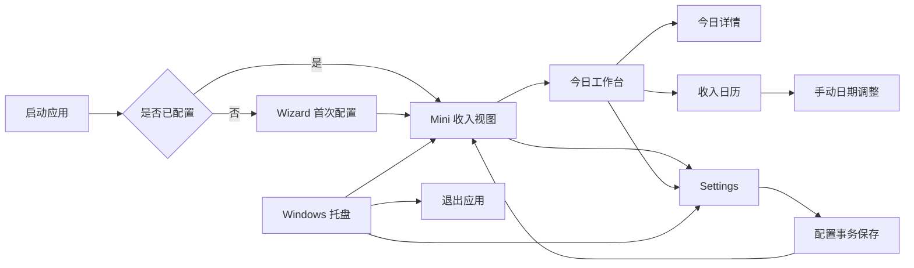
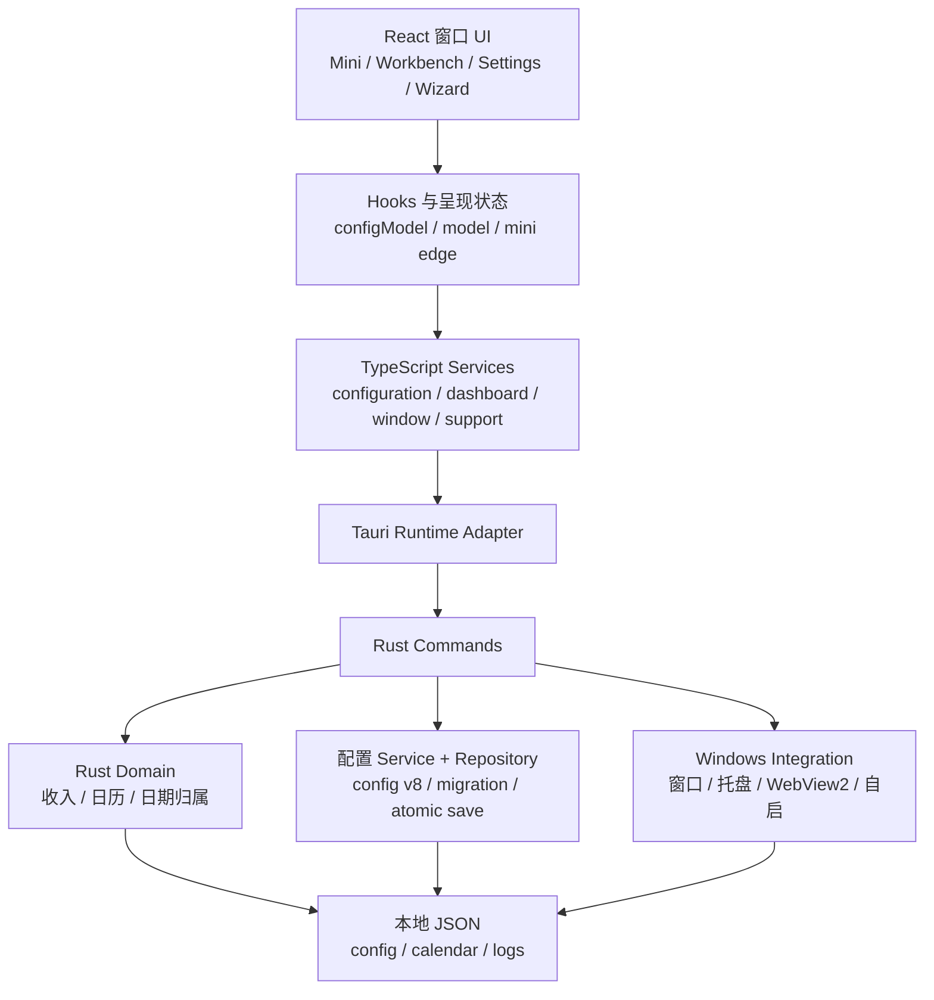
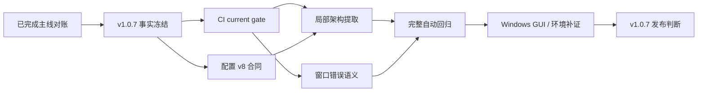

入口判断：/review

# Review：LetsMakeMoney Windows v1.0.7 深度项目审查

## 追踪信息

- Review ID：`V107-REV-20260803`
- 当前状态：基础审查与项目所有者真实运行观察已完成，等待 `/idea` 收敛 v1.0.7 范围
- 目标版本：Windows v1.0.7
- 下游承接：直接修 / `/idea` / 技术 Spike / 继续验证
- 当前事实源：本地及远端 `main` 提交 `12b6b03ce91b716d49590e21eb8dd7fe90fa283c`、v1.0.6 tag 源提交 `51e4c08da5260af9b9f4808c4f6d29591319e655`、GitHub v1.0.6 Stable Release
- 最后更新：2026-08-03

## Review 判断

- 自动识别类型：Project Review
- 辅助通路：Implementation Review、Release Readiness Review、文档与目录治理 Review
- 本次 Review 范围：产品与工程地图、React/Tauri/Rust 主链路、配置与收入领域、窗口生命周期、测试与 CI、构建发布、文档事实、历史脚本与瘦身候选
- 不覆盖范围：不执行真实 Windows GUI 全量回归；不补 Windows 10、多显示器证据；不进行专业漏洞扫描；不改写 Git 历史；不修改业务代码
- 总体判断：v1.0.6 Stable 的正式 Release 身份、文档口径和既有发布证据一致，无撤回理由。代码已具备配置迁移、事务保存、收入领域测试、窗口生命周期和发布包身份校验等可靠基础。主线分叉已经完成非破坏性对账；当前 CI 和机器可读配置合同仍有两处工程事实偏差。项目所有者真实运行另确认了窗口置顶、Mini/Workbench 重叠、日期调整入口、六周日历和视觉一致性问题，并提出加班与月度总结新能力，详见 [owner-observation.md](owner-observation.md)。
- 当前是否适合继续公开：适合。仓库已公开且现有 v1.0.6 可继续分发。
- 当前是否适合直接在本地 `main` 开始 v1.0.7：主线身份已经清晰，但尚不适合直接编码。新增观察需要先经过 `/idea`，尤其必须确定加班日期归属、费率和月度工时口径。

## 使用工具与证据来源

- 本地文件 / 项目结构：`README.md`、`README.en.md`、`doc/current.md`、`doc/releases/v1.0.6/`、`apps/windows-v1/`、`scripts/`、`.github/workflows/windows-v1-verify.yml`
- GitHub / Release：`gh release view v1.0.6`、`gh run list`；正式 Release 为 <https://github.com/NzyZzz1998/LetsMakeMoney/releases/tag/v1.0.6>
- Git：本地 `main`、`origin/main`、tag、remote、提交差异、跟踪文件和工作区状态
- 隔离审查：在 `%TEMP%/lmm-v107-review-20260803` 的 detached worktree 上读取并验证 `origin/main`，未用本地分叉代码冒充正式基线
- 关键验证：TypeScript strict、Vite production build、15 组前端行为测试、结构验证、v1.0.6 定向合同、配置合同独立验证、`git diff --check`
- 未执行验证：Cargo 本地复跑、真实 GUI、Windows 10、多显示器、真实睡眠/时间跳变、专业依赖漏洞扫描
- 结论限制：CI 运行成功只能证明工作流实际调用的 v1.0.4 聚合门禁通过，不能证明当前 v1.0.6 完整聚合门禁在 GitHub Actions 中被执行

### 锁定身份

| 对象 | 身份 | 结论 |
|---|---|---|
| 本地分支 | `main` | 已确认 |
| 本地 HEAD | `12b6b03ce91b716d49590e21eb8dd7fe90fa283c` | 已确认；与 `origin/main` 一致 |
| 远端主线 | `origin/main` = `12b6b03ce91b716d49590e21eb8dd7fe90fa283c` | 已确认；本次代码事实基线 |
| v1.0.6 源提交 | `51e4c08da5260af9b9f4808c4f6d29591319e655` | 已确认 |
| v1.0.6 Zip | 3,245,194 字节；SHA256 `AEE4BC4A41D3839E421138D0B152EA5A8B0FBDC60C5B189EA11790DE4ED8B66A` | 已确认，GitHub digest 一致 |
| 主线保护 | `backup/local-main-before-v107-reconcile-20260803@6c9f010` | 已确认；保留对账前本地提交，不 force push |
| 本地工作区 | 仅已有未跟踪 `doc/releases/v1.0.5/post-release-observation.md`，另加本次 Review 文档 | 已确认；未覆盖原有文件 |

## 产品定位与用户场景

- 产品定位：无宠物的 Windows 本地收入进度工具，将月薪、工作日、工作时段和日历规则转换为可持续查看的今日收入与工作进度。
- 目标用户：希望在桌面上低干扰查看收入进度、工作阶段和日历归属的 Windows 用户。
- 核心使用场景：首次配置 -> Mini 常驻 -> 今日工作台 -> 日历与日期调整 -> Settings -> 托盘隐藏与找回。
- 当前阶段目标：v1.0.x Stable 维护主线；稳定性、数据可信、隐私和发布可复现优先于新功能。
- 成功标准：收入与日期结果可解释；配置保存可回滚；窗口可找回；发布包身份可验证；贡献者能复现验证。
- 非目标 / 当前不做：宠物、账号、云同步、安装器、静默更新、跨平台重写、主题市场。
- 产品线边界：v0.9 保留为历史桌宠回退版本；v1.x 是 Rust + Tauri + React 的无宠物 Stable 主线。

## 产品与工程地图

### 用户路径

### 工程模块

### 发布与验证流

## 领域与关键决策

### 核心对象与状态

| 领域 | 对象 / 状态 | 事实源 |
|---|---|---|
| 配置 | `AppConfig` v8、`ThemeMode`、`RestMode`、`MiniEdgeDock`、日期调整 | Rust `config.rs`、TS `domain/configuration.ts` |
| 收入 | `SalarySchedule`、月薪分值、当月应计槽位、今日快照 | Rust `domain.rs` |
| 日历 | 官方、估算、stale、error；工作日、休息日、调休 | `calendar_data.rs`、`calendarCoverage.ts` |
| Dashboard | loading、error、before_work、working、rest、after_work、休息日 | `model.ts`、`presentation.ts` |
| 窗口 | Mini、Workbench、Settings、Wizard；shown / hidden / suspended | `windowService.ts`、Rust `lib.rs` |
| Mini 隐私 | left / right / none；expanded / retracted | `miniEdgeAutoHide.ts`、Rust `lib.rs` |
| 主题 | persisted、preview、revision、transaction | `theme.ts`、Rust `ThemeSession` |

### 业务不变量

1. 权威收入计算位于 Rust domain；UI 只消费快照和纯呈现投影。
2. 配置保存必须先校验、写临时文件、回读验证，再替换正式文件；副作用失败要回滚。
3. 配置迁移必须保留备份；当前只接受 v8，允许从 v5、v6、v7 迁移。
4. 手动日期调整优先于官方日历和休息模式；带薪休息与不带薪休息不可合并。
5. 权威同步失败不得清空上一份可信快照。
6. 隐藏窗口暂停本地 tick 与权威同步，恢复后重置 wall-clock 样本并立即收敛。
7. Mini 收起态不得显示收入金额；窗口与托盘必须始终存在找回路径。
8. 本地同名 Zip 不能替代 GitHub Release 附件身份。

### 已确认决策

- 继续维护 Rust + Tauri + React 主线，不恢复宠物。
- 配置保持 v8，不为窗口状态另建数据库。
- 双主题只支持浅色和深色，浅色为默认。
- v1.0.6 是主题初始化定向维护版本，不改变收入、日历或 Mini 行为。

## 意图、实现与验证对照

| 规则 ID | 文档意图与来源 | 实现证据 | 现有验证 | 状态 | 影响 | 最小动作 |
|---|---|---|---|---|---|---|
| V107-I-001 | 当前公开版本为 v1.0.6 | 三份 README、`doc/current.md`、tag、Release | GitHub Release 与 digest 核对 | 一致 | 发布事实可信 | 保持 |
| V107-I-002 | 当前完整门禁使用 `verify_v106.ps1` | README 明确当前入口；CI 实际调用 `verify_v104.ps1` | 最近 CI 虽绿，但只执行旧入口 | 实现偏离 | PR 可能绕过 v1.0.6 Rust 全量、clippy、文档和定向合同 | CI 切换到当前聚合入口，并增加自检 |
| V107-I-003 | 配置事实源为 v8 | Rust/TS 为 v8；旧 `config-v1.schema.json` 和 `config-defaults.json` 仍为 v6 | `verify_contracts.py` 硬编码 v6 并错误通过 | 文档过期 | 贡献者和工具可能使用错误 Schema | 建立唯一 Schema/默认值合同并交叉验证 |
| V107-I-004 | 配置保存失败不污染旧配置 | 临时写入、回读、原子替换、回滚点、运行态仅在成功后更新 | Rust service 与 config 测试 | 一致 | 用户数据风险受控 | 保持并纳入当前 CI |
| V107-I-005 | 桌面窗口失败应可诊断 | Rust 有详细日志；React `showWindow` 对任何错误改写 query，hide 静默吞错 | 服务适配器测试存在；组合行为无直接覆盖 | 未验证 | 原生失败可能被误当浏览器预览 | 区分 desktop/browser 并增加失败行为测试 |
| V107-I-006 | 高风险验收需可追溯 | 文档保留哈希与结论；原图、日志位于 Git 忽略 `.artifacts` | 本机存在性不具长期保证 | 实现偏离 | 换机后无法复核原始 GUI 证据 | 仓库保存脱敏摘要与外部证据索引 |
| V107-I-007 | 前后端逐步分层 | 已有 services/repositories/domain/hooks | 结构检查只验证文件和边界字符串 | 实现偏离 | `App.tsx`、`model.ts`、`lib.rs` 继续承担多窗口编排 | 先 characterization tests，再分一个边界 |
| V107-I-008 | Windows 10/11 与多显示器兼容 | README 声明 Windows 10/11 | 现有真实证据为 Windows 11 单显示器 | 未验证 | 平台支持声明证据不完整 | 建立环境补证矩阵 |

## 关键发现

| ID | 问题 | 类型 | 严重度 | 证据状态 | 证据 | 影响 | 建议 | 去向 |
|---|---|---|---|---|---|---|---|---|
| V107-REV-001 | 本地 `main` 与公开主线曾双向各有 5 个提交 | Git 治理 | Major | 已确认并关闭 | 已建立 `backup/local-main-before-v107-reconcile-20260803@6c9f010`；当前 `main` 与 `origin/main` 均为 `12b6b03`，ahead/behind `0/0` | 开发对象身份已恢复清晰，保护分支保留追溯入口 | 作为已完成基线保留 | 已完成 |
| V107-REV-002 | GitHub Actions 仍执行 v1.0.4 聚合脚本 | 发布工程 | Major | 已确认 | workflow 第 60–63 行；README 与 `verify_v106.ps1` | 绿色 required check 不能证明当前完整门禁 | 改为版本无关的 current gate 或 v1.0.7 聚合入口；增加脚本身份断言 | v1.0.7 P0 |
| V107-REV-003 | 公开配置 Schema/默认值停在 v6，且旧测试自洽通过 | 数据合同 | Major | 已确认 | `config-v1.schema.json:30-32`、`config-defaults.json:2`、Rust `CURRENT_CONFIG_VERSION=8`；旧测试实际返回 0 | 贡献者、文档和工具可能生成或校验错误配置；日期调整枚举也已漂移 | 将当前 v8 合同设为唯一事实源，交叉校验 Rust/TS/JSON Schema/defaults | v1.0.7 P0 |
| V107-REV-004 | 桌面窗口 show/hide 失败与浏览器预览回退未区分 | 错误语义 | Major | 高度可能 | `App.tsx:79-92`、`WindowFrame.tsx:23-26`；`appRuntime.isDesktop` 已可用 | 原生窗口故障可能导航当前窗口或无反馈，增加“窗口丢失”排障难度 | desktop 下保留错误并反馈/记录；browser 才使用 query fallback | Bugfix / P1 |
| V107-REV-005 | 前端和 Rust 核心编排仍高度集中 | 架构治理 | Minor | 已确认 | `App.tsx` 1128 行、`model.ts` 1012 行、`lib.rs` 2266 行；文件内跨多个窗口和平台职责 | 修改一个窗口或状态易扩大回归面 | 只做有行为测试保护的局部提取，不引入新全局状态框架 | `/idea` P1 |
| V107-REV-006 | 架构结构门禁只能证明“文件存在”，不能证明责任已迁移 | 测试治理 | Minor | 已确认 | `verify_architecture_structure.py` 与现有结构门禁 | 代码可继续回流到大文件而测试仍绿 | 增加禁止依赖方向、命令薄层和模块拥有者约束 | `/idea` P1 |
| V107-REV-007 | v1.0.6 原始 GUI 证据只存在于 Git 忽略本机目录 | 证据治理 | Minor | 已确认 | `verification.md:73-86`、`progress_v1.0.6.md:46-49` | 换机或清理后无法复核原始材料 | 仓库内保留脱敏 evidence manifest，原始材料放稳定外部位置 | v1.0.7 P1 |
| V107-REV-008 | 当前版本号在 UI/更新检查中重复硬编码 | 发布工程 | Minor | 已确认 | `App.tsx:1078,1083,1106`；package/Cargo/Tauri 另有版本 | 版本升级可能出现“包是新版本、关于页或更新比较仍是旧版本” | 从 Tauri/app package 读取单一版本，包门禁核对 UI 版本 | v1.0.7 P1 |
| V107-REV-009 | `doc/current.md` 已膨胀为 294 行历史汇总 | 文档治理 | Minor | 已确认 | current 同时复述 v1.0.1–v1.0.6 的进度与哈希 | 当前事实源难扫描，版本内容重复后易漂移 | current 只保留当前状态和入口，历史留在 release 文档 | 直接修文档 |
| V107-REV-010 | TypeScript IPC 仍以字符串命令和泛型返回值为主 | 类型合同 | Minor | 已确认 | `appRuntime.invoke<T>`、各 service 手写请求/响应 | Rust 字段变化可能到运行时才暴露 | 先做命令合同清单与编译期 fixture；代码生成仅作 Spike | `/idea` P2 |
| V107-REV-011 | Windows 10 与真实多显示器仍缺证据 | 平台验证 | Minor | 已确认 | v1.0.6 issue pool 与 verification | 支持声明存在残余风险 | v1.0.7 补环境矩阵；设备不足时保持明确未验证 | 继续验证 |
| V107-REV-012 | Tauri CSP 为 `null` | 安全加固 | Suggestion | 已确认 | `tauri.conf.json` CSP 配置 | 本地应用当前攻击面有限，但无法提供额外内容注入防护 | 先做 CSP 兼容 Spike，不能直接开启后破坏 Tauri/GitHub 更新请求 | 技术 Spike |
| V107-REV-013 | 版本化脚本形成继承链，删除证据不足 | 工程瘦身 | Suggestion | 已确认 | v106 -> v105 package；v104 -> v103 -> v102 回归链；历史文档引用 | 维护成本增加，但直接删除会破坏历史复验 | 生成调用图、标注 current/historical/manual，之后再决定归档 | 技术 Spike |
| V107-REV-014 | 前端产物约 714 KB 原始 JS（约 132 KB gzip） | 性能候选 | Suggestion | 已确认 | 隔离 Vite build 输出 | 尚无启动慢或内存问题证据 | 先测冷启动和 WebView 首帧，再决定 code split | 暂不处理 |

## 值得保留的部分

1. **收入与日历领域边界**：Rust `domain.rs` 已覆盖工作日、单双休/大小周、跨夜、带薪/不带薪休息和金额尾差。
2. **配置安全**：v5–v8 迁移、备份、临时文件写入、回读校验、替换和副作用回滚均有直接测试。
3. **权威快照策略**：前端生命周期 reducer、30 秒权威同步、1 秒本地呈现和失败保留可信快照已有行为测试。
4. **窗口隐私与生命周期**：Mini 贴边、收起/展开、隐藏暂停、恢复同步、主题事务已有专门模块和回归矩阵。
5. **发布身份意识**：候选、正式附件、回下载缓存和 GitHub digest 已明确区分。
6. **依赖锁定**：npm、Cargo、Rust toolchain、GitHub Actions 均固定版本或不可变提交。

## 架构摩擦与瘦身候选

| 候选 | 摩擦/现象 | 调用与所有权证据 | 风险 | 最小调整 | 验证与回退 | 结论 |
|---|---|---|---|---|---|---|
| `App.tsx` | 多窗口、Wizard、Settings、支持页集中 | 所有入口仍由 App 路由；不是死代码 | 中 | 先提取 Workbench/Settings/Wizard 页面组件，不改状态模型 | 截图/行为测试；单提交可回退 | 需补测试后调整 |
| `model.ts` | Dashboard、日历 cache、日期调整 hook 共存 | Mini 与 Workbench 均调用 | 高 | 先提取 calendar repository/hook；保留公开 API | 权威同步和高风险组合测试 | 需补测试后调整 |
| Rust `lib.rs` | command、窗口、托盘、Mini edge、WebView 生命周期集中 | Tauri `run()` 和命令注册均在此 | 高 | 先提取纯窗口规格和错误映射，再提取 tray/mini-edge 模块 | cargo test + GUI 窗口矩阵 | 需补测试后调整 |
| v1 配置旧合同 | 与当前 v8 并存并误导 | 仍被用户手册和 `test:contract` 引用 | 高 | 更新或明确归档；禁止同时称为当前合同 | Rust/TS/schema/defaults 交叉校验 | 必须调整 |
| 版本化脚本 | 多层继承、手工入口多 | 当前与历史发布均有引用 | 中 | 先标注 lifecycle，再抽公共 helper | 历史 tag 上只读复验 | 需要 Spike |
| `spikes/v1.0-ui` | 名称像临时资产 | 仍被正式构建/验证路径引用 | 高 | 不移动；先消除正式依赖后再审 | clean clone 构建 | 必须保留 |
| v0.9 / Figma / 历史 release 文档 | 体积与数量较多 | 仍承担许可、回滚和历史证据 | 中 | 仅建立索引和归档规则 | 链接、tag、Release 回溯 | 必须保留 |
| 跟踪二进制/临时目录 | 当前树未发现 | Git 跟踪扫描无命中 | 低 | 无动作 | 公开候选扫描 | 无可直接清理项 |

详细删除证据与门禁见 [slimming-candidates.md](slimming-candidates.md)。

## v1.0.7 候选版本组合

### 最小方案

1. 保留已完成的主线对账和保护分支作为开发基线证据。
2. 将 CI 切到真正的当前完整门禁，并让工作流验证自己调用的聚合版本。
3. 修复 v8 配置 Schema/defaults/日期调整枚举的事实漂移，增加跨 Rust、TS、JSON 的合同测试。
4. 统一应用版本来源，消除关于页和更新检查的手工版本字符串。

结论：这是原工程 Review 的最低可信范围，主要关闭发布与用户数据合同风险。项目所有者新增产品观察后，最终版本组合必须在 `/idea` 中重新收敛。

### 推荐方案

在最小方案上增加：

1. 修正桌面窗口 show/hide 错误语义，并补 browser/desktop 组合行为测试。
2. 对 `App.tsx`、`model.ts`、Rust `lib.rs` 各选择一个边界做渐进式提取；每次只移动一个所有权，不改变 UI、配置或收入结果。
3. 建立脱敏 acceptance manifest 和稳定外部原始证据索引。
4. 将 `doc/current.md` 收敛为当前事实入口。
5. 补 Windows 10 与多显示器验证矩阵；环境不具备时保持“未验证”。
6. 为 IPC 命令建立可校验的请求/响应清单，代码生成留作后续判断。

结论：推荐。它能让 v1.0.7 成为“工程可信与可维护性版本”，同时控制回归范围。

### 过大方案

- 全量拆分 `App.tsx`、`model.ts`、`lib.rs`。
- 引入 Redux/Zustand 等全局状态框架并重写多窗口同步。
- 自动生成全部 Rust/TypeScript IPC 类型。
- 一次性合并或删除 v1.0.0–v1.0.6 脚本。
- 重做 UI、恢复宠物、加入账号/云同步/安装器。

结论：不适合 v1.0.7。改动面跨业务、窗口、发布和历史复验，无法维持维护版本的回退粒度。

## 优先级与实施边界

| 优先级 | 候选 | 理由 | 推荐去向 |
|---|---|---|---|
| 已完成 | 本地/远端主线对账 | 开发对象身份门禁已关闭 | 保留证据 |
| P0 | CI current gate | 绿色检查当前不能证明完整门禁 | 直接修 / PRD |
| P0 | 配置 v8 合同统一 | 用户数据与贡献者信任 | PRD |
| P1 | 版本单一事实源 | 防止更新和关于页版本漂移 | PRD |
| P1 | 窗口错误语义 | 保护窗口找回与诊断 | Bugfix / PRD |
| P1 | 局部架构提取 | 降低后续维护成本 | `/idea` 后进入 PRD |
| P1 | 验收证据耐久性 | 提高发布可追溯性 | PRD |
| P1 | Windows 10 / 多显示器证据 | 完成支持声明闭环 | acceptance |
| P2 | IPC 合同、脚本生命周期、current 精简 | 降低长期漂移 | `/idea` / 直接修文档 |
| P2 | CSP、bundle 体积 | 当前无真实用户故障 | Spike / 暂不处理 |

### 依赖关系

## 下一步分流建议

| 去向 | 事项 | 理由 | 最小下一步 |
|---|---|---|---|
| 已完成基线 | 本地/远端主线对账 | 不是产品需求，且前置已经关闭 | 保留保护分支与对账证据 |
| 直接修 | current 文档精简、CI 入口漂移 | 事实明确，无需产品价值判断 | 建立 v1.0.7 变更单并定向验证 |
| Bugfix | 桌面窗口错误语义 | 行为风险明确但需复现/测试 | 先写 browser/desktop characterization tests |
| 进入 `/idea` | 局部架构提取、IPC 合同、证据治理 | 需判断收益与本版范围 | 压力测试每项回归面和成本 |
| 进入 `/prd` | 配置合同统一、版本单一事实源、CI 门禁 | 可形成明确验收标准 | 建立 FR 与门禁追踪 |
| 进入 `/acceptance` | Windows 10、多显示器 | 代码分析不能替代真实环境 | 准备设备/VM 和手工矩阵 |
| 技术 Spike | CSP、脚本整合、bundle 拆分 | 当前没有足够用户价值证据 | 只测量，不改主链路 |

## 暂不处理

- 恢复宠物与 PetManager。
- 账号、云同步、安装器、静默更新或跨平台。
- 全局状态管理重写。
- 全量 UI 自动化。
- 在没有启动性能数据前拆分前端 bundle。
- 在没有调用图和历史复验证据前删除旧脚本、Spike 或历史文档。

## 需要项目所有者确认的问题

1. 打开 Workbench 时 Mini 的隐藏与恢复合同。
2. 加班按日录入、费率、历史重算、休息日和跨夜归属规则。
3. 月度工时采用计划、已流逝计划和手工加班分项，还是引入真实计时。
4. 允许窗口部分出屏时的最小可见区域和安全回落规则。
5. v1.0.7 是否同时承接工程可信主线与产品增强，还是拆成维护版本和后续产品版本。
6. 局部架构治理上限、验收证据两层合同、Windows 10 与多显示器门禁级别。

详细建议和默认推荐见 [owner-observation.md](owner-observation.md)。

## 是否具备进入 v1.0.7 `/idea` 的条件

**具备。** 主线对账已经完成，工程候选与 10 项真实运行观察均有明确证据和分流。下一步应通过 `/idea` 同时压力测试维护可信主线、窗口与视觉修复，以及加班/月度总结的新领域合同；在范围和金额口径确认前不进入开发。

## 给下一次模型接手的摘要

- 公开与本地事实基线均为 `main@12b6b03`；对账前本地提交保存在保护分支。
- v1.0.6 Release 可继续公开分发，无撤回阻塞。
- v1.0.7 工程首要问题是 CI 仍跑 v104、配置公开合同仍为 v6、应用版本重复硬编码。
- 新增产品观察包括置顶、Mini/Workbench 窗口合同、贴边隐私、日期调整入口、六周日历、下拉/圆角/拖动，以及加班与月度总结。
- 配置事务与收入领域不应重写；它们已有可靠实现和测试。
- 架构优化只能渐进执行，先补 characterization tests，再移动一个所有权边界。

## 下一阶段建议

- 推荐下一步：直接进入 v1.0.7 `/idea`，先确认加班金额与日期合同，再比较最小、推荐和过大组合。
- 需要准备的材料：项目所有者对 [owner-observation.md](owner-observation.md) 六个决策点的回答、Windows 10 测试环境、外部原始验收证据存储位置。
- 可直接发送的提示词：见最终汇报中的下一阶段提示词。
