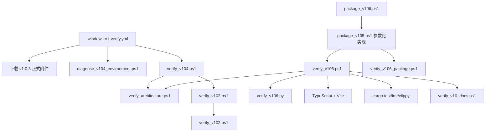

# v1.0.7 脚本生命周期基线

## 当前调用图

## 现状判断

| 路径 | 当前职责 | 判定 | v1.0.7 去向 |
| --- | --- | --- | --- |
| `.github/workflows/windows-v1-verify.yml` | PR/push 门禁 | 错误指向 v1.0.4，且下载 v1.0.3 附件 | M1 改为唯一 current 入口 |
| `verify_v106.ps1` | v1.0.6 聚合验证 | 当前发布版本的最近入口 | 保留为 historical |
| `package_v106.ps1` | v1.0.6 打包包装器 | 委托 v1.0.5 参数化实现 | 保留为 historical |
| `verify_architecture.ps1` | 当前架构行为测试集合 | 可复用，但清单手工维护 | 由 current manifest 明确纳入 |
| `verify_v10_docs.ps1` | 文档、UTF-8、链接检查 | 跨版本复用 | 由 current gate 调用 |
| `verify_v10*` 至 `verify_v105*` | 历史版本复验 | 仍被层层调用或独立使用 | 建立 historical 索引，不批量重写 |

## 已确认风险

1. CI 绿灯不能证明当前 v1.0.6 或目标 v1.0.7 合同。
2. 同名脚本没有 current/historical 标识，维护者容易直接执行旧入口。
3. 聚合脚本存在递归继承，取消、退出码和依赖恢复由不同年代逻辑共同决定。
4. 打包脚本虽已参数化，但版本、候选前缀和验证脚本仍由调用者散点传入。
5. `verify_architecture.ps1` 通过手写数组收集测试，新增测试可能存在但不进入门禁。

## M1 目标

- 新增 `scripts/current-manifest.json`，明确目标版本、current 子门禁、historical 入口和禁止误用规则。
- 新增唯一 `scripts/verify_windows_current.ps1`。
- CI 只调用唯一 current 入口，不直接引用版本脚本。
- historical 脚本继续可复验对应 tag，但在 current 工作树被直接当作 current gate 时返回非零。
- 缺失子门禁、版本不一致、取消或错误工具解析必须返回非零。

本文件只记录 M0 事实，不提前实现 M1。
