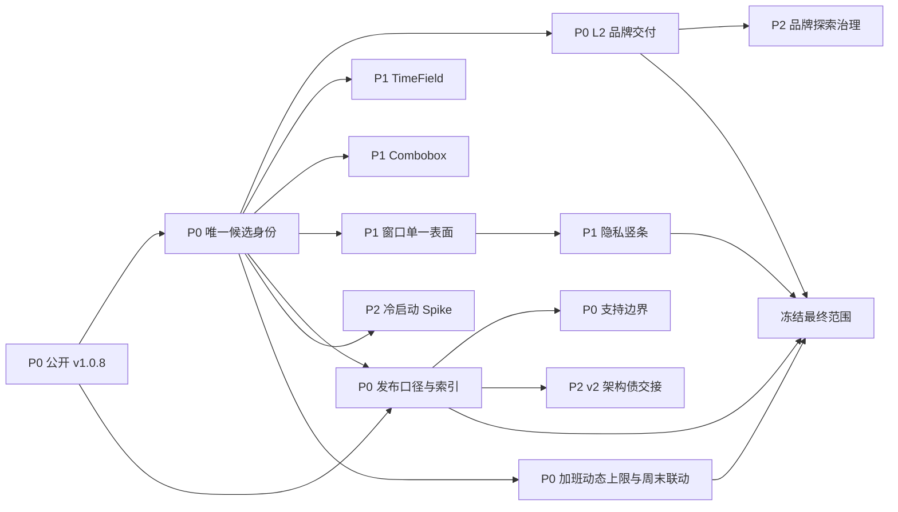

入口判断：/idea

# LetsMakeMoney Windows v1.0.F 收官需求池

## 追踪信息

- 当前状态：Idea 分析完成；非加班范围与加班合同均已完成价值判断，需求池具备冻结并进入 `/prd` 的条件。
- 内部代号：`v1.0.F`。
- 建议公开版本：`v1.0.8`。
- 当前公开基线：`v1.0.7@f500ed4e7de28ec68b2a848da6fa2340420b91b2`。
- 当前审查基线：`main@1801626a153a9644f448729dabc51ee9f88a0d9e`。
- 上游来源：`review.md`、`v1.0.7-post-release-gap.md`、`slimming-candidates.md`、`doc/current.md`、当前 Git 工作区。
- 下游承接：项目所有者确认最终方案后，冻结范围并进入 `/prd`。
- PRD 状态：`prd.md` 与 `traceability.md` 已由项目所有者确认，已进入开发承接与实施。
- 最后更新：2026-08-04。

## Idea 阶段判断

v1.0.F 的真实任务不是再扩展一条产品线，而是把 v1.0 系列收束成一个身份合法、品牌统一、视觉候选可复现、发布事实可信的最终版本。非加班候选中，版本身份、发布对象隔离、L2 Logo 正式交付和干净候选门禁具备强证据，应进入最终范围；TimeField、Combobox、窗口单一表面与隐私竖条具备真实截图和代码证据，适合进入限定范围的视觉收尾。

冷启动与 CSP 均不能因“最后一版”而默认实施：冷启动尚未定位单一高收益原因，CSP 隔离候选已经证明会破坏 Mini bootstrap。两者只能采用带停止条件的 Spike 或明确风险转交。`App.tsx`、`model.ts` 和 Rust `lib.rs` 的整体拆分属于 v2 架构债，不进入 v1.0.F。

当前结论是：**整个 v1.0.F 已具备冻结范围并进入 PRD 的条件。** 加班合同已完成最后一轮确认：工作日加班采用动态间隔上限，自然周末手动设为工作日时联动记录加班并默认 8 小时，普通休息日仍允许独立记录且上限为 24 小时，历史记录不追溯裁剪。

## 本版本主线

> 用公开 `v1.0.8` 完成 v1.0 系列的品牌、视觉、版本身份、加班可信度与发布可信度收官，并只处理已经形成候选和验证基础的高确定性问题。

为什么不是其他方向：

- 不恢复宠物，不接入 PetManager。
- 不新增账号、云同步、安装器、自动更新或跨平台。
- 不全面重构 `App.tsx`、`model.ts`、Rust `lib.rs` 或全局状态管理。
- 不为追求“安全配置完整”强行启用尚不兼容的 CSP。
- 不扩大 Windows 10 与多显示器支持声明。
- 不建设完整考勤、打卡、审批、加班倍数、调休余额或加班收入报表；仅收紧既有按日加班合同。

## 上游证据摘要

| 证据 | 对应结论 | 等级 | 新鲜度与边界 |
| --- | --- | --- | --- |
| Git/tag/Release：`v1.0.7@f500ed4`，正式 Zip SHA256 `D656B96973F64632896715ADCBB9CAFEAED4D06D44BA1C098824335AC673E3F2` | 公开基线可锁定 | 强 | 当前 Release 事实；不证明 dirty 候选已通过 |
| `main@1801626` 与当前 `git status` | Release、main、dirty 候选是三套身份 | 强 | 2026-08-04 实际核对 |
| package/Cargo/Tauri 均为 `1.0.7`，更新版本解析只接受数字段 | `v1.0.F` 不能作为公开版本 | 强 | 代码与配置直接证据 |
| `apps/windows-v1/brand/app-icon-l2.svg`，SHA256 `E6FC5C6078E97E17060686AAFDBB38CE6113BF3BCE856643B166A5D9754FFA96` | L2 已成为明确品牌候选 | 强 | 用户已选择；尚未提交或发布 |
| 17 个已修改文件及 TimeField、AppMark、品牌生成器、Logo 探索等未跟踪文件 | 视觉候选已实现但未冻结 | 强 | 当前工作区直接证据 |
| current gate 在显式工具路径下通过 | 候选具备自动一致性基础 | 强 | 不替代 GUI、DPI 和包验收 |
| Mini/Workbench 冷启动 P95 约 6.1/6.5 秒，单点实验未达到收益阈值 | 性能问题存在，但方案未成立 | 中 | 历史测量；需重新测量才能实施 |
| 正式 `csp: null`，隔离候选破坏 Mini bootstrap 后已撤销 | CSP 不能直接开启 | 强 | 已有失败与回退证据 |
| `implementation_phase()` 固定返回 `M6`，未发现前端消费者 | IPC 已陈旧 | 中 | 仍需确认外部消费者 |
| Windows 11 单显示器 100%/125%/150% 已验证；Windows 10、多显示器未验证 | 支持声明应保持收窄 | 强 | 不能推出其他环境可用 |

## 候选需求池

| ID | 标题 | 类型 | 证据等级 | 压力测试 | 分档结论 | 依赖 | 推荐去向 |
| --- | --- | --- | --- | ---: | --- | --- | --- |
| V10F-IDEA-001 | 公开版本使用 `v1.0.8` | 发布缺陷 | 强 | 38/40 | 高价值 | 无 | 进入 PRD |
| V10F-IDEA-002 | 三层发布对象隔离与唯一候选 | 发布工程 | 强 | 39/40 | 高价值 | 001 | 进入 PRD |
| V10F-IDEA-003 | L2“燕麦石墨”Logo 正式交付 | 品牌/视觉 | 强 | 34/40 | 高价值 | 002 | 进入 PRD |
| V10F-IDEA-004 | TimeField 生产化收口 | 体验/可访问性 | 强 | 33/40 | 高价值 | 002 | 进入 PRD |
| V10F-IDEA-005 | Combobox 视觉与行为收口 | 体验/可访问性 | 强 | 33/40 | 高价值 | 002 | 进入 PRD |
| V10F-IDEA-006 | 窗口单一表面与双弧线修正 | 视觉/窗口 | 强 | 35/40 | 高价值 | 002 | 进入 PRD |
| V10F-IDEA-007 | 隐私竖条可读性与几何合同 | 隐私/体验 | 强 | 35/40 | 高价值 | 002、006 | 进入 PRD |
| V10F-IDEA-008 | 清理陈旧 `implementation_phase=M6` | 工程治理 | 中 | 28/40 | 中价值 | 002 | 先补消费者扫描，再进入 PRD |
| V10F-IDEA-009 | 最终公开口径与验收索引 | 文档/发布 | 强 | 35/40 | 高价值 | 001、002 | 进入 PRD |
| V10F-IDEA-010 | 冷启动定向性能门禁 | 技术 Spike | 中 | 25/40 | 部分通过 | 002 | 技术 Spike |
| V10F-IDEA-011 | CSP 风险接受与 v2 转交 | 安全治理 | 强反证 | 18/40 | 暂不实施 | 无 | 记录风险并转交 v2 |
| V10F-IDEA-012 | 开发工具发现与一键说明 | 开发体验 | 中 | 27/40 | 中价值 | 无 | 进入 PRD/文档治理 |
| V10F-IDEA-013 | 浏览器 fallback 非权威边界 | 测试治理 | 中 | 27/40 | 中价值 | 无 | 进入 PRD/测试治理 |
| V10F-IDEA-014 | 支持矩阵保持收窄 | 支持治理 | 强 | 34/40 | 高价值 | 009 | 进入 PRD |
| V10F-IDEA-015 | Logo 探索与本机派生物分层 | 清理治理 | 中 | 26/40 | 中价值 | 003 | 发布后独立治理 |
| V10F-IDEA-016 | v2 架构债正式交接 | 架构治理 | 强 | 30/40 | 中价值 | 009 | 文档转交，不在本版重构 |
| V10F-IDEA-017 | 加班动态上限与周末工作联动 | 收入可信/事务 | 强 | 35/40 | 高价值 | 日期调整、日历、排班、加班仓储 | 进入 PRD |

评分维度顺序为：痛点、场景、证据、频率、目标贡献、替代方案、成本、验证速度。高证据候选不再重复完整八列表，评分依据如下：

| ID | 八维评分 | 主要低分项/说明 |
| --- | --- | --- |
| 001 | 5/5/5/5/5/5/4/4 | 需要同步多个版本源，但边界明确 |
| 002 | 5/5/5/5/5/5/4/5 | 发布信任直接受影响 |
| 003 | 4/5/5/4/5/4/3/4 | 多尺寸和系统表面人工审阅仍有成本 |
| 004 | 4/5/5/4/4/4/3/4 | 键盘、滚动、弹层和 DPI 组合需完整验证 |
| 005 | 4/5/5/4/4/4/3/4 | 需保护键盘与 ARIA 行为 |
| 006 | 5/5/5/4/5/4/3/4 | 透明 WebView 与 Windows 表面组合有真实回归风险 |
| 007 | 5/5/5/5/5/4/3/3 | 隐私价值高，左右边缘与 DPI 验证稍慢 |
| 008 | 2/3/4/2/3/4/5/5 | 用户价值低，主要是诊断可信与维护收益 |
| 009 | 4/5/5/4/5/5/4/3 | 需尊重历史，不可直接重写旧验收 |
| 010 | 3/5/3/3/4/2/2/3 | 根因和高收益路径尚未确认，触发成本闸门 |
| 011 | 3/4/5/2/4/1/1/2 | 已有失败反证；当前实施成本不可控，最高只能转交 |
| 012 | 3/4/4/3/3/4/4/2 | 贡献者场景明确，但不是用户核心路径 |
| 013 | 3/4/4/3/4/4/3/2 | 需避免把预览结果误当桌面权威结果 |
| 014 | 4/5/5/4/5/5/5/1 | 价值在于不作无证据承诺，不需要新增平台测试 |
| 015 | 2/4/4/2/3/4/4/3 | 只改善仓库/磁盘治理，不是产品功能 |
| 016 | 3/5/5/3/5/4/3/2 | 只交接债务，不在 v1.0.F 实施整体重构 |
| 017 | 5/5/5/4/5/4/3/4 | 动态边界与跨事务保存增加实现成本，但直接保护加班数据可信度 |

## 需求详情

### V10F-IDEA-001 公开版本使用 `v1.0.8`

- 当前问题：`v1.0.F` 不是 Cargo、Tauri、npm 或当前更新比较逻辑可接受的数字 SemVer。
- 用户价值：保证更新检查、版本展示、tag、包名和 Release 身份可比较、可追踪。
- 影响范围：package、Cargo、Tauri、构建信息、更新检查、README、release 文档、tag 与附件名。
- 依赖：无。
- 风险：公开仍使用 `v1.0.F` 会直接破坏版本合同；静默改名则会造成文档口径冲突。
- 测试缺口：尚未对 `1.0.8` 的所有版本源和更新比较做最终 fixture 验证。
- 成本：小。
- 结论：进入 PRD；内部文档可保留“v1.0.F 收官计划”，公开身份统一为 `v1.0.8`。

### V10F-IDEA-002 三层发布对象隔离与唯一候选

- 当前问题：正式 Release、发布后 main 和 dirty 候选均真实存在，但可支持的结论不同。
- 用户价值：避免下载包、测试报告和源提交错配，保护发布信任。
- 影响范围：Git、构建、打包、验证脚本、文档、候选目录和 GitHub Release。
- 依赖：001。
- 风险：若先提交或打包再决定 dirty 文件去向，容易将探索材料或未确认行为带入正式版本。
- 测试缺口：当前候选尚无干净提交、锁定 Zip/EXE 哈希和最终 GUI 证据。
- 成本：中。
- 结论：进入 PRD，要求逐文件分类、干净源重建和 GitHub 回下载复核。

### V10F-IDEA-003 L2“燕麦石墨”Logo 正式交付

- 当前问题：L2 已被项目所有者选定，但源 SVG、生成脚本、ICO/PNG、AppMark、系统表面和探索证据尚未形成单一合同。
- 用户价值：任务栏、托盘、窗口标题、资源管理器与 About 拥有一致、可辨认的品牌标识。
- 影响范围：品牌源、PowerShell 生成器、Tauri icons、React AppMark、窗口与发布包验证。
- 依赖：002。
- 风险：小尺寸糊成色块、ICO 层缺失、生成结果不确定或探索图被误作正式资产。
- 测试缺口：16/20/24/32/40/48/64/128/256 像素、浅深系统表面和 ICO 多层需人工/机器复核。
- 成本：中。
- 结论：进入 PRD；只保留唯一源、确定性生成器、目标资产、哈希和轻量决策记录。

### V10F-IDEA-004 TimeField 生产化收口

- 当前问题：候选已替换原生直角时间输入，但尚未冻结键盘、滚动、弹层方向、取消/确定和 DPI 合同。
- 用户价值：时间录入样式统一、可理解，避免原生控件与应用视觉割裂。
- 影响范围：Wizard、Settings、React、CSS、可访问性测试与 DPI GUI。
- 依赖：002。
- 风险：长列表焦点丢失、弹层出屏、只支持鼠标、只读字段误开弹层。
- 测试缺口：键盘导航、焦点回收、Escape、窗口底部向上展开、100%/125%/150% DPI。
- 成本：中。
- 结论：进入 PRD，限定为现有时间字段替换，不扩展为通用日期时间组件库。

### V10F-IDEA-005 Combobox 视觉与行为收口

- 当前问题：候选处理圆角弹层与错误提示，但必须防止为了视觉隐藏有效错误或破坏 ARIA 关联。
- 用户价值：休息模式、大小周锚点等选择器视觉一致，键盘与读屏仍可用。
- 影响范围：AccessibleCombobox、CSS、Settings/Wizard 与行为测试。
- 依赖：002。
- 风险：视觉层隐藏错误后用户无法理解保存失败；弹层与输入框断层复发。
- 测试缺口：键盘选择、外部点击、Escape、错误可访问文本、长选项与 DPI。
- 成本：中。
- 结论：进入 PRD；`showError=false` 只能隐藏重复视觉提示，不能删除可访问错误语义。

### V10F-IDEA-006 窗口单一表面与双弧线修正

- 当前问题：透明原生窗口、DWM 阴影和 Web 圆角可能叠加为“框中框”或双弧线。
- 用户价值：所有主窗口边缘干净、稳定，不再呈现廉价的双层外框。
- 影响范围：WindowFrame、surface contract、Rust window builder、CSS、透明 WebView。
- 依赖：002。
- 风险：关闭原生阴影后窗口与桌面分离度不足；透明边缘可能在不同 DPI 裁切。
- 测试缺口：Mini、Workbench、Settings、Wizard 的四角、阴影、焦点、拖动及 100%/125%/150% DPI。
- 成本：中。
- 结论：进入 PRD；只允许一个表面所有者，不重新设计全部窗口。

### V10F-IDEA-007 隐私竖条可读性与几何合同

- 当前问题：28px 竖条在真实使用中偏窄，文字可读性不足；候选扩展到 34px 并压缩文案，但尚未冻结。
- 用户价值：金额收起后仍能找到窗口并理解“距离下班/休息”等非敏感状态。
- 影响范围：Rust 几何、前端呈现、CSS、左右贴边、窗口持久化和 fixture。
- 依赖：002、006。
- 风险：扩大可见区可能降低隐私；紧凑文案可能产生歧义；不能把主动收起误判为窗口丢失。
- 测试缺口：左右边缘、长倒计时、加载/休息/结束状态、hover 展开、DPI 与重启找回。
- 成本：中。
- 结论：进入 PRD；以 34 逻辑像素作为候选，不在 PRD 前宣称最终阈值通过。

### V10F-IDEA-008 清理陈旧 `implementation_phase=M6`

- 当前问题：IPC 仍暴露固定 `M6`，与已发布 v1.0.7 和收官版本事实不符。
- 用户价值：避免诊断或外部调用读取错误开发阶段，降低维护误判。
- 影响范围：Rust command 注册、IPC fixture、诊断/About（若有关联）和历史测试。
- 依赖：002。
- 风险：存在尚未发现的外部消费者时直接删除会破坏兼容。
- 测试缺口：全仓、发布脚本、外部文档和动态 IPC 调用扫描。
- 成本：小。
- 结论：先补消费者扫描；无消费者则删除，有消费者则替换为真实构建元数据。

### V10F-IDEA-009 最终公开口径与验收索引

- 当前问题：v1.0.7 已公开称为“收官功能版本”，手动验收正文又保留 dirty 候选阶段事实。
- 用户价值：用户和维护者能明确区分 v1.0.7 历史与 v1.0.8 最终收尾，不会误读发布状态。
- 影响范围：中英文 README、current、release notes、manual verification、支持矩阵和 GitHub Release 文案。
- 依赖：001、002。
- 风险：改写旧文档会破坏真实失败和修复历史。
- 测试缺口：链接、版本、哈希、发布源和历史索引一致性。
- 成本：小。
- 结论：进入 PRD；采用补充索引，不改写 v1.0.7 历史结论。

### V10F-IDEA-010 冷启动定向性能门禁

- 当前问题：已有冷启动 P95 超过目标，但尚未证明可由一个低风险改动显著改善。
- 用户价值：缩短首次打开等待时间。
- 影响范围：Tauri 启动、WebView2、托盘、前端 bootstrap、资源和性能证据。
- 依赖：002。
- 风险：为了性能改动窗口生命周期或托盘初始化，可能破坏已验证稳定性。
- 测试缺口：相同机器、相同构建身份下的新基线与分段时间。
- 成本：大且不确定。
- 结论：技术 Spike。只有重新测量仍超阈值且单一候选在重复实验中带来明确收益时才进入实现；阈值由 PRD 前复用已有性能合同，不在 Idea 阶段补造。

### V10F-IDEA-011 CSP 风险接受与 v2 转交

- 当前问题：正式 CSP 为 `null`；此前隔离候选使 Mini bootstrap 不可用。
- 用户价值：理论上提升 WebView 内容安全，但当前没有兼容方案。
- 影响范围：全部窗口、IPC、资源、更新、错误反馈和 Tauri 配置。
- 依赖：无。
- 风险：直接开启会破坏核心入口，成本闸门和验证速度闸门均未通过。
- 测试缺口：兼容的最小策略及全链路证据不存在。
- 成本：大。
- 结论：不进入 v1.0.F 实施；保留风险接受记录并转交 v2 安全设计。

### V10F-IDEA-012 开发工具发现与一键说明

- 当前问题：current gate 可用，但全新 shell 可能找不到 Node/Python/Cargo，需要显式环境变量。
- 用户价值：贡献者和未来维护者能从干净环境完成验证，减少“代码坏了还是工具没找到”的判断成本。
- 影响范围：开发 README、工具解析脚本、CI 提示。
- 依赖：无。
- 风险：硬编码本机路径会引入新的不可复现性。
- 测试缺口：缺少无工具、部分工具和完整工具环境的失败提示测试。
- 成本：小。
- 结论：进入 PRD 的开发体验/文档范围；不引入新依赖或私有路径。

### V10F-IDEA-013 浏览器 fallback 非权威边界

- 当前问题：浏览器预览拥有简化收入与日历计算，可能与 Rust 权威实现漂移。
- 用户价值：避免把原型/浏览器预览数字误当真实桌面业务结果。
- 影响范围：model、测试、原型说明和开发文档。
- 依赖：无。
- 风险：在收官版重写 fallback 会引入不必要业务回归。
- 测试缺口：核心边界只需证明预览不会被发布/验收当作权威。
- 成本：小到中。
- 结论：进入文档与测试治理；不把 fallback 升格为第二套权威领域模型。

### V10F-IDEA-014 支持矩阵保持收窄

- 当前问题：Windows 10 与多显示器没有真实证据。
- 用户价值：用户不会因过度承诺而获得错误兼容预期。
- 影响范围：README、release notes、support matrix 与验收结论。
- 依赖：009。
- 风险：若收官文案自动写“Windows 10/11 全支持”，会制造未经验证的事实。
- 测试缺口：本版不补 Windows 10 与多显示器证据。
- 成本：小。
- 结论：进入 PRD 作为范围保护；继续只声明 Windows 11 x86_64 单显示器和已验证 DPI。

### V10F-IDEA-015 Logo 探索与本机派生物分层

- 当前问题：Logo 探索约 9MB，本机派生缓存约 7.9GB，但两者与产品源、决策证据的所有权不同。
- 用户价值：间接改善仓库与本机维护，不改变产品功能。
- 影响范围：原型、品牌证据、target/node_modules/artifacts/dist 与清理说明。
- 依赖：003。
- 风险：过早删除会丢失最终选择依据或唯一验收证据。
- 测试缺口：需扫描正式文档链接与最终资产哈希。
- 成本：小。
- 结论：不混入产品实现提交；品牌冻结后独立执行治理。

### V10F-IDEA-016 v2 架构债正式交接

- 当前问题：App、model 和 Rust lib 仍有编排热点，但已有架构分层和测试，不适合在最后一版推倒重写。
- 用户价值：为 v2 提供真实边界和回归门禁，避免未来重复 Review。
- 影响范围：架构文档、测试缺口和 v2 backlog。
- 依赖：009。
- 风险：若在 v1.0.F 实施大拆分，会显著扩大 GUI、窗口与配置回归面。
- 测试缺口：v2 前需补页面编排、timer/fallback 和窗口事务 characterization tests。
- 成本：本版记录成本小；未来实施成本大。
- 结论：本版只落交接文档，不修改架构。

### V10F-IDEA-017 加班动态上限与周末工作联动

- 当前问题：v1.0.7 前端和仓储仅校验 `0–24 小时`，没有验证当前班次下班后到下一次真实上班前的可用间隔；用户手动把自然周六、周日设为工作日时，日期事务也不会同步建立加班记录。
- 原始要求：加班时长不得超过本次下班至下次上班前的时长，且绝对不超过 24 小时；自然周六、周日手动设为工作日时需要记录加班，默认 8 小时。
- 证据：`overtimeModel.ts` 当前固定接受 `0–24`；v1.0.7 `FR-008` 允许所有日期类型独立录入，但未定义动态间隔或日期调整联动。项目所有者已确认完整边界。
- 用户价值：阻止不可能的加班时长进入本地记录，减少周末工作漏记，保持月度加班统计和费率解释可信。
- 正式候选合同：
  1. 对存在计划班次的业务日期，最大加班分钟数为 `min(1440, max(0, next_actual_work_start - current_shift_end))`。
  2. `next_actual_work_start` 必须在应用官方日历、手动日期调整和单休/双休/大小周配置后，寻找下一次真实工作班次；不得固定取下一自然日。
  3. 自然周六、周日被用户手动设为工作日时，日期调整弹窗同时展示加班时长，默认 `min(480, max_overtime_minutes)` 分钟，允许用户修改，并与日期调整原子保存。
  4. 官方调休工作日属于计划工作，不自动创建加班记录。
  5. 普通休息日仍允许独立记录加班；因不存在“本次下班”，其上限保持 1440 分钟，不自动填入时长。
  6. 将手动周末工作恢复为自动判断或休息日时，必须提示是否同时删除由该联动事务创建的加班记录，不得静默删除用户数据。
  7. 新上限只校验新增或修改；既有历史记录不得因排班、日历或工资变化被自动裁剪。为区分联动记录和独立记录，PRD 需定义可迁移的来源/边界快照字段或等价可审计合同。
  8. 既有合同继续有效：最多两位小数、写入时换算为最近一分钟、独立编辑时 `0` 表示删除、首次录入保存时薪 `1.0×` 快照、工资变化不追溯、跨夜默认采用 Dashboard `owner_date` 且最终以用户提交的业务日期为准、月度总结只累计加班工时而不展示加班收入。
- 影响范围：日期调整事务、日历/排班解析、跨夜 owner date、加班编辑器、Rust 仓储 schema 与迁移、月度总结、日志、诊断、自动测试、原型和人工验收。
- 依赖：现有共享日期调整事务、权威日历快照、排班边界计算和加班仓储。
- 风险：日期调整与加班写入若非原子事务会产生半成功；官方调休若误判为加班会重复统计；排班变化若追溯裁剪会损坏历史；缺少记录来源会导致恢复日期时无法判断是否应提示删除。
- 测试缺口：下一真实工作日跨周/跨月、大小周、官方调休、手动覆盖、普通/跨夜/零休息班次、上限小于 8 小时、原子失败补偿、历史超限保留、恢复日期时的删除选择尚无完整行为测试。
- 成本：大。
- 压力测试：35/40，强证据且直接影响收入记录可信度；成本可通过扩展既有日期事务与版本化加班仓储控制，不需要建设完整考勤系统。
- 结论：进入 PRD，作为 v1.0.F 收官范围的 P0 数据可信需求。

## 依赖关系与优先级

### P0

- V10F-IDEA-001：公开数字版本身份。
- V10F-IDEA-002：正式、main 与候选隔离，建立唯一发布对象。
- V10F-IDEA-003：L2 品牌资产合同。
- V10F-IDEA-009：最终公开口径、手动验收补充索引。
- V10F-IDEA-014：支持声明不得越过证据。
- V10F-IDEA-017：加班动态上限、周末工作原子联动与历史数据保护。

### P1

- V10F-IDEA-004：TimeField。
- V10F-IDEA-005：Combobox。
- V10F-IDEA-006：窗口单一表面。
- V10F-IDEA-007：隐私竖条。
- V10F-IDEA-008：陈旧 IPC 清理。
- V10F-IDEA-012：开发工具说明。
- V10F-IDEA-013：fallback 权威边界。

### P2 / 条件项

- V10F-IDEA-010：冷启动只做有停止条件的 Spike。
- V10F-IDEA-011：CSP 不实施，转交 v2。
- V10F-IDEA-015：品牌探索与本机缓存独立治理。
- V10F-IDEA-016：v2 架构债交接，不在本版重构。

## 三档范围方案

### 最小方案

- 公开版本统一为 `v1.0.8`。
- 分离正式 Release、main 与 dirty 候选，从干净提交建立唯一候选。
- 正式交付 L2 Logo 和确定性资产生成合同。
- 修正最终发布口径、手动验收索引和支持矩阵。
- 收紧加班新增/修改上限，保留普通休息日 24 小时边界与历史记录不追溯原则。
- 不纳入 TimeField、Combobox、窗口表面和隐私竖条候选。

适合：只希望关闭发布身份与品牌 Blocker。风险：已完成的高确定性视觉候选仍留尾巴，不符合“最后一版尽可能收净”的目标。

### 推荐方案

- 完成最小方案。
- 纳入 TimeField、Combobox、窗口单一表面和隐私竖条候选，并完成 DPI/可访问性/窗口行为回归。
- 清理陈旧 `implementation_phase=M6`（以消费者扫描为前置）。
- 补开发工具发现说明、fallback 非权威边界和最终 GUI/包验证。
- 完成自然周末手动工作与默认 8 小时加班的原子事务、来源追踪、失败补偿和月度汇总回归。
- 冷启动只重新测量并形成是否转交 v2 的结论，不默认改代码。
- CSP 明确风险接受并转交 v2。

适合：作为 v1.0 系列质量收官。风险可控，且不会把产品变成新版本线。

### 收官完整方案

- 完成推荐方案。
- 冷启动 Spike 若满足既有继续阈值，只允许一个可回退的定向优化；否则停止并转交。
- 落 v2 架构债、历史资产所有权和品牌探索治理文档。
- 发布完成后独立清理可重建缓存和未采用 Logo 中间产物。
- 不启用 CSP，不实施 App/model/lib 整体拆分，不扩大平台支持。

适合：希望把代码、品牌、发布和后续交接同时收净。主要风险是治理工作拉长版本周期；必须保持“文档交接”和“产品实现”分开提交、分开回退。

## 技术 Spike

### 冷启动

- 决策问题：能否用一个低风险、可回退的改动显著改善冷启动，而不破坏窗口、托盘和配置主链路。
- 最小实验：从同一干净候选重复采集 Mini/Workbench 冷启动分段时间，只测试一个最有可能的瓶颈。
- 继续阈值：复用 v1.0.7 已定义的性能门禁；Idea 阶段不新增无依据数字。
- 停止条件：收益未达到既有阈值、结果不稳定、需要改写窗口生命周期或需要多模块重构。

### CSP

- 当前不重开 Spike。
- 既有候选已因 Mini bootstrap 失败而撤销，证据足以支持本版继续风险接受。
- 下一次尝试必须在 v2 安全设计中覆盖全部窗口、IPC、资源与更新链路，不得作为 v1.0.F 的“顺手加固”。

## 历史资产与清理边界

- 必须保留：release 文档、bugfix log、config migration、许可、current/historical 脚本、v0.9 回退与必要设计决策证据。
- 待确认所有权：`spikes/v1.0-ui/`、v0.9 宠物/Figma、iOS 原型。
- 品牌冻结后可治理：被后续轮次完全替代、无文档链接的 Logo 中间 HTML/PNG。
- 可重建本机对象：target、node_modules、dist、artifacts 和已落耐久摘要的临时验收目录。
- 所有删除/移动均不属于本 `/idea`，且不得与产品实现提交混合。

## 已确认决策

项目所有者已确认：

1. 接受公开版本 `v1.0.8`，内部继续称 `v1.0.F`。
2. 非加班范围采用“推荐方案”。
3. 冷启动只做测量型 Spike，未达到继续阈值即转交 v2。
4. Windows 10 与多显示器继续不进入已验证支持声明。
5. Logo 探索只保留最终决策和少量必要对照，其余待发布后独立治理。
6. 加班动态上限按下一次真实工作班次计算并封顶 24 小时；普通休息日独立录入仍封顶 24 小时。
7. 仅自然周六、周日被手动设为工作日时联动加班，默认 8 小时且允许修改；官方调休工作日不自动算加班。
8. 日期调整与联动加班原子保存；恢复日期时提示处理关联记录；历史记录不追溯裁剪。

当前没有阻塞需求池冻结的产品范围问题。PRD 仍需把来源字段、边界快照、原子补偿和异常状态定义为机器可验证合同，但不得重新讨论已确认产品语义。

## 是否具备进入 v1.0.F /prd 的条件

- 非加班范围：**具备**。
- 加班范围：**具备**。
- 整个 v1.0.F：**具备**；建议按更新后的推荐方案进入 `/prd`。

## 下一阶段建议

1. 项目所有者确认采用更新后的推荐方案或收官完整方案。
2. 进入 `/prd`，把加班来源、动态上限、原子事务、迁移和失败补偿写成完整合同并同步高保真原型。
3. PRD 确认前不修改业务代码、配置或原型。
