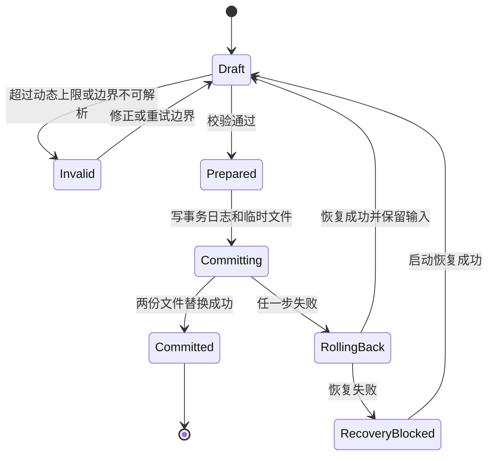
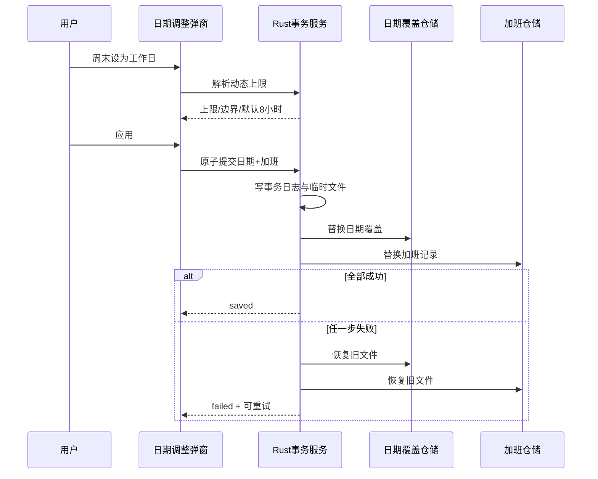

入口判断：/prd（正式推进型，PRD 已由项目所有者确认）

# LetsMakeMoney Windows v1.0.F 产品需求文档

## 1. 文档身份

| 项目 | 内容 |
| --- | --- |
| 内部代号 | `v1.0.F` |
| 公开版本 | `v1.0.8` |
| 当前公开基线 | `v1.0.7@f500ed4e7de28ec68b2a848da6fa2340420b91b2` |
| PRD 取证基线 | `main@1801626a153a9644f448729dabc51ee9f88a0d9e` |
| 上游事实源 | `idea-pool.md`、`review.md`、`v1.0.7-post-release-gap.md`、`slimming-candidates.md` |
| 原型 | `doc/prototypes/v1.0/` |
| 状态 | PRD 已确认；已进入开发承接与实施 |

当前工作区包含未提交的品牌、TimeField、Combobox、窗口表面和隐私竖条候选。它们是需求与原型证据，不是已发布或已验收实现。开发承接必须从项目所有者确认后的干净基线重新锁定对象身份。

## 2. 版本目标

v1.0.F 是 v1.0 系列收官版本。它不扩展新的产品线，而是完成以下闭环：

1. 公开版本、候选包、品牌资产和支持声明可被唯一核对。
2. TimeField、Combobox、透明窗口表面和隐私竖条达到生产级一致性。
3. 加班记录从固定 24 小时上限升级为尊重真实排班边界、可审计、可恢复的本地事务。
4. 冷启动只在证据超过阈值时定向优化；CSP 与整体架构债明确交给 v2。
5. v1.0 系列的文档、验收证据和后续维护入口完成收口。

成功标准：不破坏 v1.0.7 的收入、日历、配置、窗口、托盘和本地数据合同；所有本版 FR 有自动门禁和真实 Windows 验收入口；从干净提交可生成唯一、可追溯的 `v1.0.8` 便携包。

## 3. 用户与核心场景

- 主要用户：在 Windows 桌面查看工作进度和收入、需要本地隐私保护的月薪用户。
- 高频场景：查看 Mini、打开 Workbench、调整日期、记录加班、修改作息、贴边隐藏和托盘找回。
- 信任场景：跨夜班次、周末临时工作、下一工作日跨节假日、保存失败、配置迁移和候选包身份核对。

## 4. 方案收敛与优先级

采用需求池推荐方案。

| 优先级 | 范围 | 理由 |
| --- | --- | --- |
| P0 | FR-001、FR-002、FR-003、FR-009、FR-014、FR-017 | 版本身份、品牌、数据事务和公开支持直接影响用户信任 |
| P1 | FR-004 至 FR-008、FR-010、FR-012、FR-013 | 收口高频控件、窗口质感、隐私与维护体验 |
| P2 | FR-011、FR-015、FR-016 | 风险接受、资产治理和 v2 交接，不阻断业务主链路 |

## 5. 范围与非目标

### 5.1 本次范围

完整处理 `V10F-IDEA-001` 至 `V10F-IDEA-017`。其中 FR-010 为有停止条件的性能 Spike；FR-011 和 FR-016 只形成 v2 风险/债务交接，不在 v1.0.8 实施 CSP 或整体架构拆分。

### 5.2 非目标

- 不恢复宠物或 PetManager。
- 不加入账号、云同步、安装器、静默更新、多平台、主题扩展或完整考勤系统。
- 不引入新的全局状态库，不重写 React/Tauri/Rust 主链路。
- 不自动采集真实出勤；月度“实际工时”仍是计划流逝与用户加班记录的产品口径，不冒充考勤。
- 不自动生成或审批加班，不展示月度加班收入。
- 不在 v1.0.8 启用 CSP；不处理多显示器验收。

## 6. 产品与数据影响矩阵

| 区域 | 影响 | 保护项 |
| --- | --- | --- |
| Mini/隐私竖条 | 标识、表面、可读性和 DPI 几何 | 贴边收起不视为窗口丢失；不泄露金额 |
| Workbench/日历 | 日期调整与加班联动、Logo | 收入与日历现有口径不变 |
| Settings/Wizard | TimeField、Combobox、品牌和表面 | 草稿、取消、关闭、无变化、失败回滚 |
| Rust/Tauri | 加班 schema v2、原子事务、版本/候选门禁 | 不改数据库；旧数据不裁剪 |
| 本地文件 | overtime store v2、恢复事务日志、品牌资产 | 配置与历史记录可迁移、可回滚 |
| CI/脚本 | 唯一版本源、候选身份、工具发现 | historical 脚本仍可复验但不能充当 current gate |
| 文档/发布 | v1.0.8 口径、支持矩阵、证据索引 | 不改写 v1.0.7 历史事实 |

## 7. 功能需求

### FR-001 公开版本固定为 v1.0.8

映射：`V10F-IDEA-001`。

- 应用可见版本、Cargo package、Tauri bundle、Zip 名称、BUILD-INFO、README、更新检查和 Release tag 必须由同一版本事实源生成或验证为 `1.0.8`。
- `v1.0.F` 只出现在内部需求与开发文档，不出现在用户可见 UI、包名或 Release。
- 任一对象仍为 `1.0.7`、`v1.0.F` 或其他值时 current gate 失败。
- 回滚：恢复到最后一个干净 v1.0.7 发布提交，不修改既有 tag/Release。

### FR-002 三层发布对象隔离与唯一候选

映射：`V10F-IDEA-002`。

三层对象必须分离：工作区构建候选、验收锁定候选、GitHub 已发布附件。候选清单记录 source HEAD、dirty 状态、生成时间、Zip/EXE 哈希和工具链。只有 `dirty=false` 且 HEAD 等于发布提交的候选可进入 tag/Release。相同文件名但哈希不同必须拒绝，不允许“同名自洽”。失败时不覆盖已发布缓存，提示实际冲突字段。

### FR-003 L2“燕麦石墨”Logo 正式资产

映射：`V10F-IDEA-003`。

- 采用已确认 L2“燕麦石墨”：燕麦白底、石墨色双峰、金币黄/灰绿色进度条。
- 正式源资产为确定性矢量文件；生成脚本输出 Windows ICO 与 Tauri 所需 PNG 尺寸，不以网页截图作为源。
- 资产清单记录源文件 SHA256、生成脚本、颜色令牌、内边距、圆角和输出哈希。
- 覆盖 16/24/32/48/64/128/256px 与 ICO；16px 下仍能区分双峰与进度条，不出现非对称漂移、空白图或透明边污染。
- 应用标题栏、任务栏、托盘、可执行文件和发布文档使用同一品牌来源；原生托盘可使用单色适配版本，但几何必须同源。
- 任一尺寸不可辨认或哈希不确定时回滚 v1.0.7 图标，不阻断其他功能开发，但阻断 v1.0.8 发布。

### FR-004 TimeField 生产化

映射：`V10F-IDEA-004`。

- Settings 与 Wizard 共用一个 TimeField；不得继续维护两套时间输入逻辑。
- 支持键盘输入、小时/分钟滚轮、12/24 小时本地显示、清除草稿、Escape 取消、Enter 确认、外部点击关闭和焦点归还。
- 值合同仍使用现有配置时间格式；显示层不得改变排班语义。
- 空、非法、禁用和保存失败均保留用户草稿；关闭/取消恢复打开前值。
- 弹层不得与输入框断开，浅/深主题及 100/125/150% DPI 无裁切。
- 回滚：保留现有原生时间输入适配器，可按单组件开关恢复。

### FR-005 Combobox 生产化

映射：`V10F-IDEA-005`。

- Settings 与 Wizard 的休息模式、大小周周型使用共享 Combobox。
- 必须支持鼠标、触摸板、ArrowUp/Down、Home/End、Enter/Space、Escape、Tab、外部点击与焦点归还。
- `role=combobox/listbox/option`、`aria-expanded`、`aria-controls`、活动项和错误描述完整。
- 弹层自动向上/下选择可见方向，圆角、阴影、选中态和焦点态与应用一致。
- 无合法选项、非法旧值和组件异常时回退当前原生 select，不阻断配置。

### FR-006 窗口单一表面

映射：`V10F-IDEA-006`。

- Mini、Workbench、Settings、Wizard 每个窗口只能有一个视觉层负责圆角、边框和阴影；WebView 内容层不得再绘制第二道外轮廓。
- 透明宿主与 HTML 表面使用统一圆角半径和透明安全区，四角不得出现双弧线、黑边或裁切。
- 关闭、缩放、主题切换和 100/125/150% DPI 不得改变外轮廓所有权。
- 原生窗口透明失败时降级为不透明单表面，而不是叠加补偿边框。

### FR-007 隐私竖条几何与可读性

映射：`V10F-IDEA-007`。

- 收起态只显示“距离上班/休息/恢复工作/下班”或“今日休息”等非金额信息。
- 逻辑宽度以 34px 为候选基线，文字距屏幕外缘和裁切边均有可读安全间距；最终物理像素由真实 DPI 验证锁定。
- 左右边缘文字方向一致、可读，键盘可聚焦，hover/Enter 展开，移开后按现有隐私延迟收起。
- 不显示月薪、今日已赚、日薪、时薪或完整配置。
- 竖条属于合法可见状态，不触发安全找回；任务栏/托盘显式隐藏优先级更高。

### FR-008 清理陈旧 implementation_phase=M6

映射：`V10F-IDEA-008`。

先扫描所有前端、Rust、测试、脚本和文档消费者。无运行时消费者时删除陈旧 IPC 并以构建、command 清单和兼容测试证明；存在消费者时改为真实构建元数据并记录来源。不得继续返回错误的 `M6`。该项不改变产品功能，无数据库影响。

### FR-009 最终公开口径与验收索引

映射：`V10F-IDEA-009`。

- `doc/current.md` 只描述当前公开版和当前开发阶段；历史结论留在对应 release 目录。
- v1.0.8 建立 PRD、traceability、dev plan、progress、verification、manual verification、release checklist、release notes 和证据摘要索引。
- 原始本机证据可外置；仓库内必须保留脱敏的候选身份、环境、步骤、结论、哈希和不可恢复缺口。
- 文档不得引用临时验收目录作为唯一事实源。

### FR-010 冷启动定向性能 Spike

映射：`V10F-IDEA-010`。

在 Win11 单显示器同一设备上，冷缓存和暖缓存各 10 次，测量进程启动至 Mini 首个完整内容帧、Workbench 首帧、JS raw/gzip、首帧资源量和 >100ms 长任务。沿用既有停止阈值：冷启动 P95 >2.0s、Mini 首帧 P95 >1.2s、Workbench首帧 P95 >1.5s、JS gzip >180KB 或出现关键长任务时，才允许定向优化。未超过即停止；优化收益不足 15% 或功能门禁回退即撤销。不得据短时数据宣称解决 CPU/内存问题。

### FR-011 CSP 风险接受并转交 v2

映射：`V10F-IDEA-011`。

v1.0.8 保持当前 CSP 状态，不启用新策略。记录资产、IPC、更新、所有窗口和 fallback 的风险边界，建立 v2 前置验证清单。任何候选 CSP 只能在隔离 Spike 中运行，不合入 v1.0.8 产品代码。公开文档不得宣称 CSP 已加固。

### FR-012 开发工具发现与一键说明

映射：`V10F-IDEA-012`。

- current 验证入口按 PATH、环境变量、仓库声明的工具位置顺序发现 Node、Python、Rust、MSVC、Windows SDK 与 WebView2。
- 错误反馈列出缺失工具和可执行修复命令，不写入开发者本机绝对路径。
- 文档给出从干净环境验证、构建、打包的唯一入口；本机专用路径仅允许作为未跟踪环境变量。

### FR-013 浏览器 fallback 非权威边界

映射：`V10F-IDEA-013`。

浏览器 fallback 只用于原型和组件开发，必须显示开发标识且不得写入正式配置、加班记录或发布证据。涉及收入、日历、窗口、托盘、文件写入和更新的结论必须来自 Tauri/Rust。fallback 计算与 Rust 不一致时以 Rust 为准并记录测试失败。

### FR-014 支持矩阵收窄

映射：`V10F-IDEA-014`。

- 正式支持声明：Windows 11 x86_64、单显示器、100/125/150% DPI（以最终真实证据为准）。
- Windows 10 没有本版真实证据时写“尚未验证”，不得写支持通过。
- 多显示器不进入 v1.0.8 验收或通过声明。
- WebView2 Runtime 是运行前提；缺失时提供可读提示。

### FR-015 Logo 探索与本机派生物分层

映射：`V10F-IDEA-015`。

正式仓库只跟踪最终 L2 源文件、生成脚本、必要输出、许可/来源和校验清单。候选 HTML、批量预览、失败生成和本机缓存进入历史设计证据或外部归档，不进入发布包。清理必须在最终 Logo 哈希锁定后单独审批，不在 PRD 阶段删除。

### FR-016 v2 架构债交接

映射：`V10F-IDEA-016`。

输出 v2 债务清单：App.tsx、model.ts、Rust lib.rs 职责边界，共享状态/多窗口所有权，TimeService、CalendarProvider、配置迁移、CSP。每项记录现状、风险、characterization tests、迁移前置、停止条件和 v1.0.8 不实施理由。v1.0.8 不做整体拆分。

### FR-017 加班动态上限与周末工作联动

映射：`V10F-IDEA-017`。

#### 17.1 业务规则

1. 有计划班次时：`max_minutes = min(1440, max(0, next_actual_work_start - current_shift_end))`。
2. `next_actual_work_start` 必须按官方日历、手动日期调整、单休/双休/大小周顺序解析；大小周锚点由用户配置决定。
3. 当前班次与下一班次均使用本地时区的真实日期时间；跨夜班次以 owner_date 建立当前班次，搜索可跨月/跨年。
4. 官方数据不可用但已有明确“估算”日历时可使用估算；无法得出下一工作开始时，新增/修改计划班次加班被阻止，旧记录保持不变。
5. 自然周六/周日被用户手动设为工作日时，在同一日期调整弹窗显示加班字段，默认 `min(480,max_minutes)`；保存日期调整与加班为一个事务。
6. 官方调休工作日是计划工作日，不自动创建加班。
7. 普通休息日允许独立录入，无默认值，上限 1440 分钟。
8. 从手动周末工作恢复自动判断或改为休息时，如存在关联加班，必须询问“保留/一并删除/取消”；不得静默删除。
9. 新规则只约束新增和修改；历史记录、工资变化、排班变化或日历更新均不自动裁剪。
10. 输入最多两位小数，提交按 `round(hours*60)` 换算；独立录入 `0` 表示删除。关联周末工作在动态上限为 0 时阻止原子保存并解释冲突。
11. 新建记录捕获当前 1.0× 时薪快照；修改保留原快照；删除后重建捕获新快照。
12. 月度总结仅显示加班时长，不显示加班收入。

#### 17.2 数据合同

`%APPDATA%\LetsMakeMoney\overtime-records.json` 升级为 schema v2：

```json
{
  "schema_version": 2,
  "records": [
    {
      "business_date": "2026-08-08",
      "minutes": 480,
      "hourly_rate_fen_snapshot": 6250,
      "origin": "manual_weekend_work",
      "boundary_snapshot": {
        "basis": "planned_shift_gap",
        "current_shift_end": "2026-08-08T18:00:00+08:00",
        "next_actual_work_start": "2026-08-10T09:00:00+08:00",
        "maximum_minutes": 1440,
        "calendar_source": "official"
      },
      "linked_override_date": "2026-08-08",
      "created_at": "2026-08-08T10:00:00+08:00",
      "updated_at": "2026-08-08T10:00:00+08:00"
    }
  ]
}
```

枚举：`origin=independent|manual_weekend_work`；`basis=planned_shift_gap|rest_day_cap`；`calendar_source=official|estimated|manual`。独立休息日记录的 `linked_override_date=null`。schema v1 迁移为 `origin=independent`、`boundary_snapshot=null`，原分钟与费率快照不变。

若目标日期已有独立记录，周末工作联动不得覆盖：弹窗展示现有值并保留 `origin=independent`；恢复日期时也不得建议删除。只有由该日期调整创建的 `manual_weekend_work` 记录参与关联删除。

#### 17.3 原子事务与恢复

日期调整与关联加班由单个 Rust command 提交。事务步骤：校验两个草稿；写入包含 transaction id、旧/新哈希与阶段的 `pending-local-transaction.json`；分别写临时文件并 fsync；原子替换目标文件；删除事务日志。任一步失败必须恢复两份旧文件并保留输入。进程崩溃后启动恢复依据阶段和哈希执行确定性回滚，不能留下“日期已改但加班未写”状态。恢复失败时阻止继续写入，展示数据目录和诊断入口。

#### 17.4 状态与交互

- 创建：展示计算上限、边界起止和来源；超过上限即时错误，保存禁用。
- 修改：重算当前上限但不自动改值；值已超过新上限时允许取消/删除，修改保存必须降至上限内。
- 删除：独立记录二次确认；关联记录按日期恢复流程确认。
- 取消/关闭：不写文件、不修改月度总结，恢复打开前草稿。
- 无变化：返回 `unchanged`，不改更新时间和费率快照。
- 失败/重试：输入保留；旧两份文件保持一致；重试使用新 transaction id。

#### 17.5 日志

结构化事件至少包含：`overtime.boundary_resolved`、`overtime.validation_failed`、`date_overtime.transaction_prepared`、`committed`、`rolled_back`、`recovered`、`recovery_failed`。记录 business_date、origin、minutes、maximum_minutes、calendar_source、transaction id、结果和脱敏错误码；不记录月薪、完整用户路径或文件内容。

## 8. 加班状态机与时序





## 9. 配置、迁移与兼容

- 主配置版本沿用 v1.0.7 当前合同；只有正式数据字段确需变化时按既有迁移框架升级，禁止借本版重写配置结构。
- overtime schema v1 -> v2 是幂等迁移；迁移前建立同目录备份，解析/写入失败继续加载 v1 只读数据并禁止修改。
- v1.0.8 回滚到 v1.0.7 时，v1.0.7 可能不认识 schema v2；发布前必须提供导出/回退转换工具或保留 v1 兼容读取门禁。未经证明不得宣称可直接降级。
- 无数据库影响；所有数据仍保存在用户本机。

## 10. 错误与反馈合同

| 场景 | 用户反馈 | 数据保护 | 出口 |
| --- | --- | --- | --- |
| 边界不可解析 | 无法确定下一次上班，当前记录未保存 | 旧记录不变 | 重试/取消 |
| 超过动态上限 | 显示最大时长及边界 | 草稿保留 | 修改/取消 |
| 原子提交失败 | 日期与加班均未改变 | 自动回滚 | 重试/打开数据目录 |
| 启动恢复失败 | 数据恢复未完成，暂不可写 | 全部相关写入锁定 | 诊断/退出 |
| 品牌资产失败 | 构建门禁失败 | 不生成 Release | 修复/回滚图标 |
| TimeField/Combobox异常 | 回退原生控件 | 配置草稿保留 | 继续配置 |
| 窗口透明失败 | 使用不透明单表面 | 功能可用 | 继续使用 |

## 11. 测试与验收设计

### 11.1 自动测试

- Rust：动态上限、下一真实工作日解析、跨月/跨年、跨夜、估算/官方/手动优先级、schema 迁移、事务崩溃恢复、旧记录不裁剪。
- TypeScript：TimeField/Combobox 键盘与焦点、关联加班草稿、取消/关闭/无变化/失败状态、隐私竖条文案与非金额约束。
- 契约：Rust/TS fixture 覆盖日期事务和 overtime v2，非法 origin、负数、>1440、哈希不匹配必须拒绝。
- 发布：唯一版本源、Logo 各尺寸非空与哈希、dirty candidate 拒绝、包内 README/BUILD-INFO/版本一致。

### 11.2 Computer Use

- Win11 单显示器，浅色/深色，100/125/150% DPI。
- 加班创建、修改、删除、普通休息日独立录入、周末工作联动、关联删除三选项、保存失败回滚。
- TimeField 与 Combobox 的鼠标、键盘、焦点和弹层位置。
- Mini/Workbench/Settings/Wizard 四角、边框、阴影和隐私竖条。
- 标题栏、任务栏、托盘、EXE 属性和窗口图标的 L2 一致性。

### 11.3 人工验收与支持边界

- Windows 11 单显示器为发布阻塞环境。
- 100/125/150% DPI 为发布阻塞门禁。
- Windows 10 无真实证据时收窄声明；多显示器明确暂不验证。
- 屏幕阅读器对 Combobox/TimeField 的朗读、16px Logo 辨识、真实冷启动采样需人工确认。

### 11.4 原型验证结果（2026-08-04）

- Microsoft Edge（Playwright 通道）完成 27 项 v1.0.F 定向检查，控制台错误与页面异常均为 0。
- 计划班次样例正确展示 15 小时动态上限；16 小时被拒绝，1.25 小时可保存。
- 自然周末手动设为工作日时显示同窗加班区，默认 8 小时；模拟原子写入失败时日期与加班均不落盘、输入保留，关闭失败模式后重试成功。
- 恢复关联日期为自动判断时，界面明确提供“保留为独立记录”与“一并删除”出口；测试覆盖显式删除。
- 普通休息日独立录入显示 24 小时上限且不产生周末联动默认值。
- 浅色/深色 × 100%/125%/150% 浏览器模拟均无页面水平溢出，活动 Workbench 保持可见。
- 以上只证明原型交互、文案、边界和补偿出口；不证明 Rust schema v2、journal 原子提交、真实 DPI、窗口行为或正式包身份。

## 12. 发布门禁

1. `V10F-IDEA-001..017` 均有实现/停止/转交结论和证据。
2. v1.0.8 版本事实源、干净 HEAD、候选哈希和 GitHub 附件一致。
3. overtime v2 迁移、原子事务、失败恢复与旧数据保护通过。
4. Logo 资产和各输出哈希锁定，包内无候选探索素材。
5. Win11 单显示器 100/125/150% DPI GUI 通过。
6. 冷启动 Spike 有原始测量；未达阈值则明确停止，不能伪造优化。
7. CSP 和架构债写入 v2 交接，v1.0.8 不宣称完成。
8. 文档 UTF-8、链接、乱码、`git diff --check`、Rust/TypeScript/包验证全部通过。

## 13. 原型交付门禁

| 原型交付门禁 | 本轮要求 |
| --- | --- |
| 交付文件 | 更新 `doc/prototypes/v1.0/index.html`、`app.js`、`styles.css`、`README.md`；本轮不以低保真线框替代 |
| 状态与出口 | 覆盖加班创建/修改/删除、手动周末工作联动、动态上限、关联删除、保存失败/回滚，以及正常、空、错、禁用、加载、保存、取消、关闭 |
| 模拟边界 | 浏览器只模拟 UI、边界和事务结果；不证明 Rust 原子写入、真实窗口、Logo 系统缓存、真实 DPI、冷启动或发布包已实现 |
| 浏览器验证 | 用真实浏览器检查浅/深主题、100/125/150% 模拟、键盘交互、控制台错误、溢出、对齐和长内容；真实 Windows DPI 仍在开发后验收 |
| 结论回写 | 原型验证结果回写本 PRD 第 11、12 节与 `traceability.md`；必须保护 v1.0.7 的收入、日历、配置、托盘、窗口找回和本地数据行为 |

本轮五项原型交付门禁已满足；开发后仍须执行第 12 节的真实实现与发布门禁。

## 14. 开发承接顺序

1. 版本/候选/Logo/支持矩阵门禁。
2. overtime v2、边界解析和原子事务。
3. 日期调整与加班 UI 联动。
4. TimeField、Combobox、窗口表面和隐私竖条。
5. 工具发现、fallback 边界、陈旧 IPC 和证据索引。
6. 冷启动 Spike；按阈值决定停止或定向优化。
7. v2 CSP/架构债交接与最终回归。

## 15. 开放项与阻塞

产品范围与核心合同已关闭，没有阻止进入开发承接的产品决策。开发计划生成前仍需项目所有者确认本 PRD；实现开始时必须重新锁定干净 HEAD，并对当前未提交候选逐项决定纳入、重做或舍弃。
