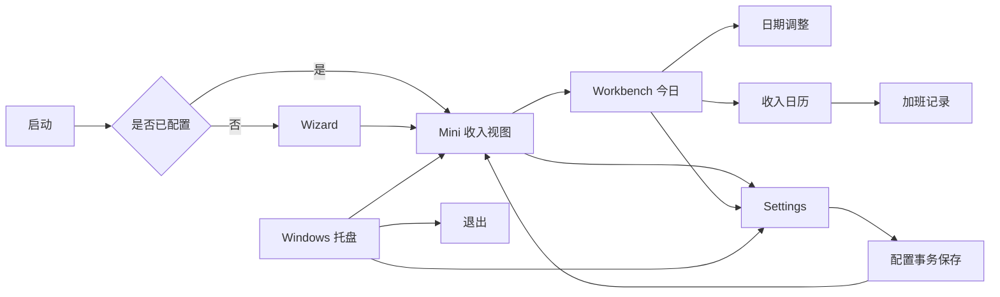
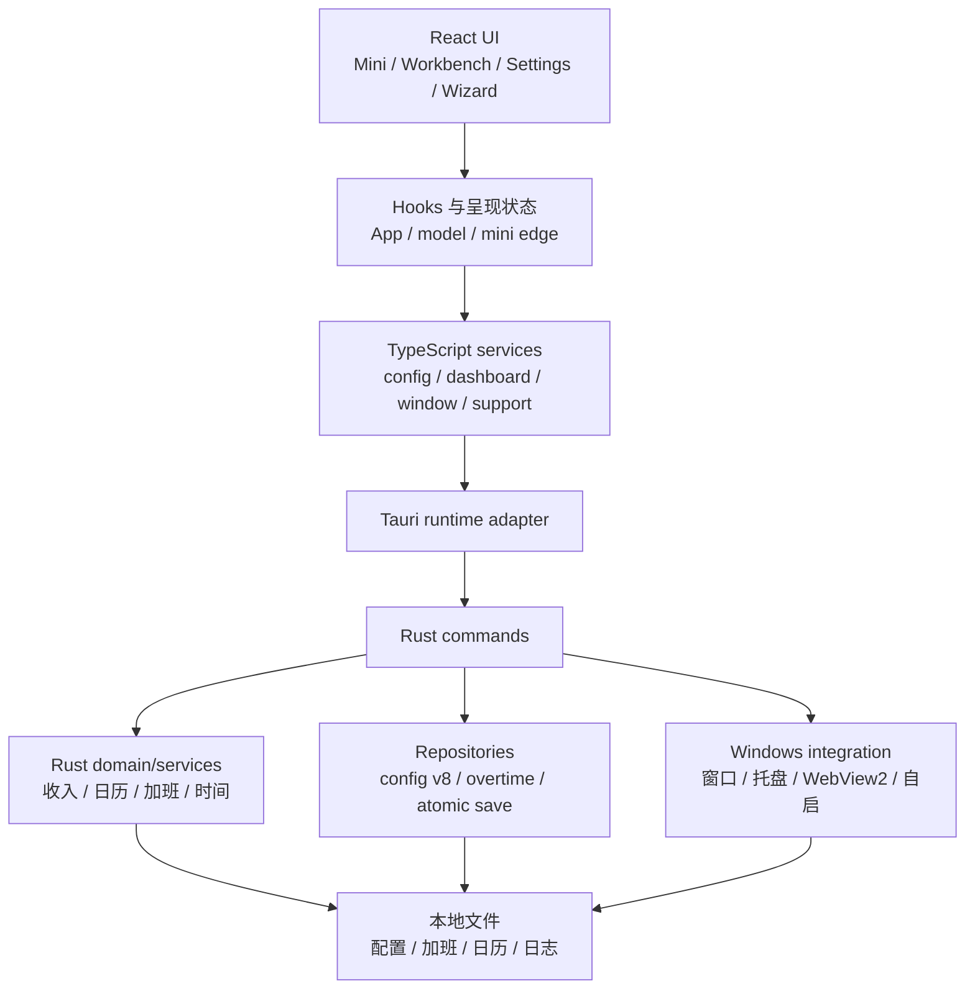
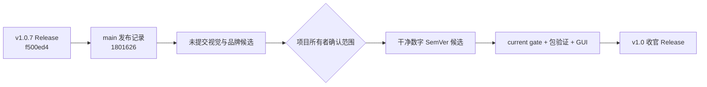

入口判断：/review

# LetsMakeMoney Windows v1.0.F 深度项目 Review

## Review 判断

- Review 类型：Project Review。
- 辅助通路：Implementation Review、Release Readiness Review、代码与目录治理 Review。
- 审查对象：公开 `v1.0.7`、发布后 `main`、当前未提交候选三层事实；不把任一层冒充另一层。
- 总体结论：**项目具备进入最后一个 v1.0.x 收官版本的条件，但暂不具备直接进入发布或大规模重构的条件。** 收入、日历、配置事务、窗口隐私与发布工程已有较强自动化基础；当前最紧迫事项是确定合法版本身份、冻结已选 Logo 与窗口视觉候选、从干净提交建立唯一候选，并补齐真实 GUI 回归。
- 架构结论：现有分层不是“完全没有做”，配置、收入、日历、运行时适配和前端服务均已有边界；主要债务集中在 Rust `lib.rs` 的窗口编排、React `App.tsx` 的页面编排、`model.ts` 的 Dashboard/日历生命周期和浏览器 fallback。**这些债务不应在 v1.0 收官版中整体重写。**
- 版本结论：`v1.0.F` 只能作为内部代号。Cargo、Tauri、npm 与当前更新检查均要求数字 SemVer；公开版本建议使用 `v1.0.8`，文档可写“v1.0.F 收官计划（公开版本 v1.0.8）”。
- 发布结论：当前工作区包含已选 Logo、图标生成、窗口表面、时间控件、Combobox 与隐私竖条等未提交候选，自动 current gate 已通过，但没有干净提交、锁定包身份与本轮 GUI 证据，不能判定可发布。

## 审查范围与证据

### 已读取与检查

- 产品与发布事实：`README.md`、`README.en.md`、`doc/current.md`、`doc/releases/v1.0.7/`。
- 前端：`apps/windows-v1/src/`，重点为 `App.tsx`、`model.ts`、`styles.css`、服务、运行时适配、Mini、窗口表面和配置模型。
- Rust：`apps/windows-v1/src-tauri/src/`，重点为 `lib.rs`、`domain.rs`、`config.rs`、`platform.rs`、`support.rs`、repository/service/command 边界。
- 工程：`scripts/`、`scripts/current-manifest.json`、`.github/workflows/windows-v1-verify.yml`、lockfile 与工具链合同。
- 目录：`doc/`、`spikes/`、本机派生目录、Logo 探索产物和历史版本入口。
- Git：本地/远端分支、HEAD、tag、工作区差异和发布源提交。

### 本轮实际验证

- 在显式指定 Node、Python 与 Cargo 工具路径后，`scripts/verify_windows_current.ps1` 完整通过。
- 通过范围包括 current manifest、M1-M7、架构门禁、文档门禁、TypeScript/Vite、Rust 68/68、fmt、clippy 与 `git diff --check`。
- 该结果属于**当前未提交候选的自动验证证据**，不是 v1.0.F 的发布候选验收。
- 本轮未执行真实 Windows GUI 全量回归、Windows 10、多显示器、重新打包、tag 或 Release。

## 当前真实基线

| 对象 | 身份 | 状态 |
| --- | --- | --- |
| 当前分支 | `main` | 已确认 |
| 当前 HEAD | `1801626a153a9644f448729dabc51ee9f88a0d9e` | 与 `origin/main` 一致 |
| 当前公开 tag | `v1.0.7` | 已确认 |
| v1.0.7 发布源 | `f500ed4e7de28ec68b2a848da6fa2340420b91b2` | tag 指向该提交 |
| v1.0.7 正式 Zip | SHA256 `D656B96973F64632896715ADCBB9CAFEAED4D06D44BA1C098824335AC673E3F2` | GitHub Release 已复核 |
| `main` 与 tag 差异 | 一个发布记录提交 | 不改变 v1.0.7 附件身份 |
| 当前工作区 | 17 个已修改文件及多项未跟踪文件 | dirty，禁止冒充发布源 |
| 当前应用版本 | `1.0.7` | package/Cargo/Tauri 一致 |
| 已验证平台 | Windows 11 x86_64、单显示器、100%/125%/150% DPI | 已确认 |
| 未验证平台 | Windows 10、多显示器 | 不进入通过声明 |

## 产品与工程地图

### 用户主链路

### 工程模块与数据流

### 版本与候选关系

## 意图、实现与验证对照

| 意图 | 执行点 | 已有验证 | 状态 |
| --- | --- | --- | --- |
| 收入、工作日、跨夜与加班结果可信 | Rust domain、calendar、overtime service/repository | Rust 单元测试、M1-M4、真实 GUI | 已实现并已验证；本轮不改公式 |
| 用户配置可迁移且失败不污染旧值 | config v8、migration、atomic repository | schema/defaults/migration、负向与 GUI 保存验证 | 已实现并已验证 |
| Mini 隐私、Workbench 显示与窗口找回可靠 | `lib.rs`、`platform.rs`、window service、Mini 状态机 | 10,000 条序列、托盘与 DPI GUI | v1.0.7 已通过；当前候选又修改窗口表现，需重验 |
| 统一组件和窗口质感 | Combobox、WindowFrame、TimeField、surface contract | 静态/行为测试、此前 DPI 证据 | 当前候选继续变更，尚未冻结 |
| 品牌标识正式替换 | L2 燕麦石墨 SVG、确定性生成器、AppMark、ICO/PNG | 图标生成与构建验证 | 项目所有者已选，尚未提交和发布 |
| v1.0 系列正式收官 | README 将 v1.0.7 称为收官功能版本 | v1.0.7 Release 已发布 | 新的“最后一版”会造成事实口径冲突，需重新定义 |
| current gate 唯一且可复现 | current manifest、CI、工具解析 | 显式工具路径下完整通过 | 可用；全新 shell 的工具发现仍有操作摩擦 |
| 安全策略具备最小 CSP | Tauri `security.csp` | v1.0.7 隔离 Spike | 未通过并撤销；当前为有记录的风险接受 |
| 冷启动达到性能目标 | 性能门禁 | 10 次冷/暖启动 | 冷启动 P95 超阈值，暖启动与 Bundle 通过 |

## 关键发现

| ID | 发现 | 严重度 | 证据状态与来源 | 用户/项目影响 | 最小验证或调整 | 推荐去向 |
| --- | --- | --- | --- | --- | --- | --- |
| V10F-REV-001 | `v1.0.F` 不是当前工具链可接受的公开版本号 | Blocker | 已确认；Cargo/Tauri/npm 版本字段及 `support.rs:95-107` 仅解析数字段 | 打包、更新检查、tag 和版本比较会失效或不可用 | 冻结公开数字 SemVer；建议 `v1.0.8`，`v1.0.F` 仅作代号 | `/idea` 后进入 PRD |
| V10F-REV-002 | 公开 Release、`main` 和 dirty 候选是三套不同身份 | Blocker | 已确认；Git/tag/status/diff | 若混用会导致测试、哈希和发布声明失真 | 先列有意变更，再从干净提交重建唯一候选 | 发布工程 |
| V10F-REV-003 | 已选 L2 Logo 与窗口视觉修正尚未形成受控交付 | Major | 已确认；brand、AppMark、TimeField、ICO/PNG 与 20 个 Logo 探索文件未跟踪 | 最终品牌、包图标和窗口视觉不能稳定复现 | 仅保留最终源 SVG、生成器、目标资产、决定记录和必要对照；重新验证 | `/idea` |
| V10F-REV-004 | Rust `lib.rs` 仍承担过多窗口运行时编排 | Major | 已确认；约 2,605 行，含窗口、托盘、隐私贴边、WebView 生命周期、置顶和事务 watchdog | 窗口修复的认知范围与真实桌面回归成本高 | 只评估一个行为等价边界；无充分回归证据则留给 v2 | 技术债/Spike |
| V10F-REV-005 | `App.tsx` 与 `model.ts` 仍是前端高耦合热点 | Minor | 已确认；约 1,234/966 行，多个窗口页面和 Dashboard/日历生命周期集中 | 修改页面或计时逻辑容易扩大回归面 | 冻结现有公共接口；最后一版不做整体拆分 | v2 架构债 |
| V10F-REV-006 | 浏览器 fallback 重复实现简化日历和收入逻辑 | Minor | 已确认；`model.ts` fallback 与 Rust domain 并存 | 原型/浏览器预览可能与桌面权威结果漂移 | 明确 fallback 非权威，仅用于预览；增加边界测试 | 文档/测试治理 |
| V10F-REV-007 | 暴露的 `implementation_phase()` 仍固定返回 `M6` | Minor | 已确认；`lib.rs:2220-2221`，未发现前端消费者 | 形成陈旧 IPC 与错误诊断信号 | 确认无外部消费者后删除或改为真实构建元数据 | Bugfix/清理 |
| V10F-REV-008 | v1.0.7 已被正式称为“收官功能版本” | Major | 已确认；中英文 README、release README、current | 再发布一个“最后一版”会造成公开事实冲突 | 明确 v1.0.F 是品牌/质量收尾还是新功能版，并同步解释 | `/idea` |
| V10F-REV-009 | `manual-verification.md` 的正文停留在 dirty 候选阶段 | Minor | 已确认；文件标题与剩余门禁仍写“干净发布身份尚未建立”，最终发布事实在其他文档 | 读者只打开手动验收会误判当前状态 | 不改写历史；增加显著的最终发布补充说明或索引 | 文档治理 |
| V10F-REV-010 | 冷启动 P95 明显超过既定目标 | Major | 已确认；Mini 6,154ms、Workbench 6,527ms | 首次体验慢，但单点托盘实验未证明根因 | 若列入收官范围，先重新测量并设停止门槛；禁止盲目优化 | 技术 Spike |
| V10F-REV-011 | 正式 CSP 仍为 `null` | Major | 已确认；Tauri 配置与失败 Spike | WebView 安全加固未完成，但当前是明确风险接受 | 不在收官版直接开启；只有隔离候选全链路通过才改变 | 暂不处理/安全债 |
| V10F-REV-012 | current gate 依赖显式或已配置的本机工具路径 | Minor | 已确认；默认 shell 找不到 Node，设置 LMM_NODE/LMM_PYTHON/LMM_CARGO 后全套通过 | 新环境首轮验证有摩擦，但错误信息可操作 | 在开发说明中给出一键环境探测/示例，不引入新依赖 | 文档/开发体验 |
| V10F-REV-013 | Windows 10 与多显示器仍无通过证据 | Minor | 已确认；support matrix 与 release 文档 | 扩大公开支持会超出证据 | 保持现有收窄；收官版不得自动扩大支持声明 | 支持边界 |
| V10F-REV-014 | 部分测试以源码文本/结构断言为主 | Minor | 已确认；多个 Python 静态门禁与行为测试并存 | 重构时可能出现“行为正确但文本门禁失败”或反向漏检 | 仅把高风险窗口、配置和版本路径逐步换成行为/fixture 证据 | 测试治理 |
| V10F-REV-015 | 本机派生目录约占 7.9GB | Suggestion | 已确认；`target` 约 7.62GB，另有 node_modules、artifacts、dist 与验收缓存 | 占磁盘，不构成 Git 仓库膨胀 | 无活动构建后按缓存合同清理，可随时重建 | 本地清理 |
| V10F-REV-016 | 历史 Spike、宠物、Figma 和 iOS 资料仍有回溯或脚本依赖 | Suggestion | 已确认/部分待确认；`spikes/v1.0-ui` 被历史脚本引用，其他资产承担历史/许可证据 | 直接删除会破坏历史复验或所有权追踪 | 先建立 ownership/link 清单，再决定归档；本轮不删 | 后续治理 |

## 已确认的工程优势

1. 配置已使用 v8 schema、迁移和原子保存，失败保护与旧配置兼容证据较完整。
2. 收入、日历、跨夜、日期调整和加班主要由 Rust domain/service 负责，UI 不再是唯一计算权威。
3. Tauri runtime adapter 和 TypeScript services 已隔离大部分 IPC，桌面失败不会简单伪装成浏览器导航成功。
4. current gate、脚本 lifecycle、包身份与 GitHub 回下载校验已形成可靠发布链。
5. 测试数量和风险覆盖显著高于早期版本；当前候选在显式工具环境下完成 TypeScript、Vite、Rust 68/68、fmt、clippy 和文档门禁。

## v1.0.F 收官候选主线

### P0：必须关闭

1. **合法版本身份**：决定公开数字版本；建议 `v1.0.8`，内部代号保留 v1.0.F。
2. **候选冻结**：区分 v1.0.7 正式附件、`main` 和当前 dirty 候选；建立有意变更清单。
3. **品牌交付**：将已选 L2 Logo 收敛为唯一品牌源、确定性生成器和完整尺寸资产，不把探索页全部带入发布包。
4. **发布事实**：调整“v1.0.7 已是收官功能版本”与新收官版本的关系，避免公开口径互相否定。
5. **最终验证**：从干净提交重新构建，重新执行 current gate、包体验证、Logo/图标检查和真实 Windows GUI 回归。

### P1：建议进入

1. 当前候选中的 TimeField、Combobox、窗口单一表面、隐私竖条可读性和圆角修正，但必须逐项锁定并复验 DPI。
2. 清理陈旧 `implementation_phase=M6` IPC，前提是确认没有外部消费者。
3. 为最终手动验收建立发布补充索引，不改写 v1.0.7 的首次失败与 dirty 候选历史。
4. Windows 11 单显示器 100%/125%/150% DPI、托盘、Mini/Workbench、配置、日历、加班和更新检查执行一次最终回归。

### P2：条件进入

1. 冷启动仅在新测量仍超阈值且能定位单一高收益原因时做定向优化。
2. Rust 窗口编排最多提取一个边界；若 GUI 回归成本超过收益，明确转交 v2。
3. 清理本机派生缓存与 Logo 探索中间产物；不将磁盘清理混入产品代码提交。

## 不建议进入收官版本

- 全面拆分 `App.tsx`、`model.ts` 或 `lib.rs`。
- 新全局状态库、技术栈迁移或 IPC 全量 codegen。
- 重新启用 CSP 而没有全窗口、IPC、资源和更新验证。
- 恢复宠物、接入 PetManager、账号、云同步、安装器、自动更新或跨平台。
- Windows 10 或多显示器支持承诺扩大。
- 把全部 Logo 探索 PNG/HTML 当作产品运行资源或发布附件。

## 需要项目所有者确认

1. 是否接受公开版本使用 `v1.0.8`，`v1.0.F` 只作为内部收官代号。
2. 当前 dirty 候选中，除已选 L2 Logo 外，TimeField、Combobox、窗口表面和隐私竖条修正是否全部进入收官范围。
3. 冷启动性能债是否必须在 v1.0 收官前继续解决，还是记录后转交 v2。
4. Windows 10 与多显示器是否继续保持“不进入已验证支持声明”。
5. Logo 探索页面是否只保留最终决策记录与少量对照，其余在发布前移出当前交付面。

## Review 分流

| 去向 | 事项 |
| --- | --- |
| `/idea` | V10F-REV-001、002、003、008、010 及收官范围组合 |
| Bugfix/实现候选 | 当前窗口表面、TimeField、Combobox、隐私竖条与 stale phase 清理 |
| 文档治理 | V10F-REV-009、012、支持声明和最终发布口径 |
| 技术 Spike | 冷启动、单一 Rust 窗口边界 |
| v2 架构债 | App/model/lib 全面拆分、fallback 权威化、CSP 再设计 |
| 本地治理 | 派生缓存和 Logo 探索中间产物 |

## 是否具备进入下一阶段

- 具备进入 `/idea` 的条件：**是**。
- 具备直接进入 PRD 的条件：**否**。必须先确定公开版本号、候选范围和冷启动去向。
- 具备直接开发或发布的条件：**否**。当前工作区 dirty，且没有收官版本的冻结身份与 GUI 证据。

## 下一阶段建议

执行 `/idea`，只收敛五项决策：公开版本身份、已选品牌资产、当前视觉候选范围、性能债去向、最终支持声明。方案确认后再生成正式 PRD；不要重新讨论已稳定的收入、日历和配置业务口径。

## 下一任务接手摘要

1. 公开基线是 `v1.0.7@f500ed4`，`main@1801626` 仅多发布记录提交。
2. 当前工作区是自动门禁通过但未提交、未做最终 GUI 验收的品牌与视觉候选。
3. `v1.0.F` 不是合法公开 SemVer，推荐公开使用 `v1.0.8`。
4. 收官版应优先冻结 Logo、窗口视觉和发布身份，不做 App/model/lib 全面重构。
5. CSP、冷启动、Windows 10、多显示器和大规模架构治理必须显式决定是否转交 v2。
