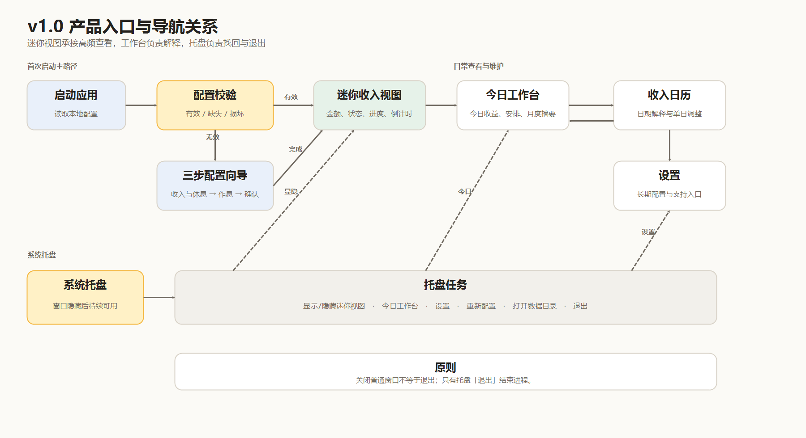
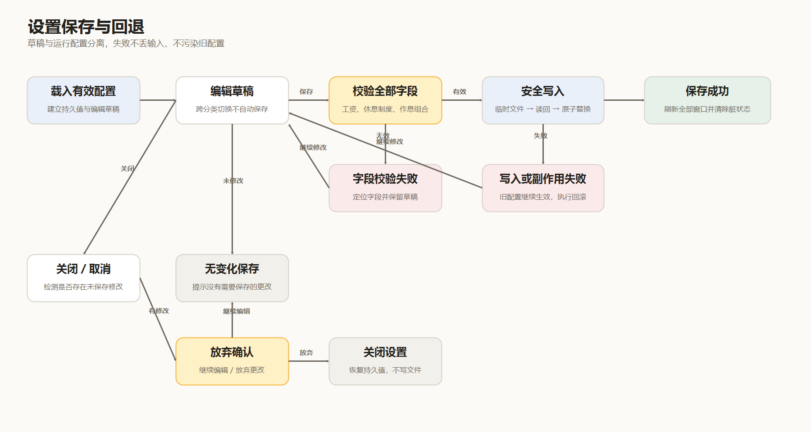
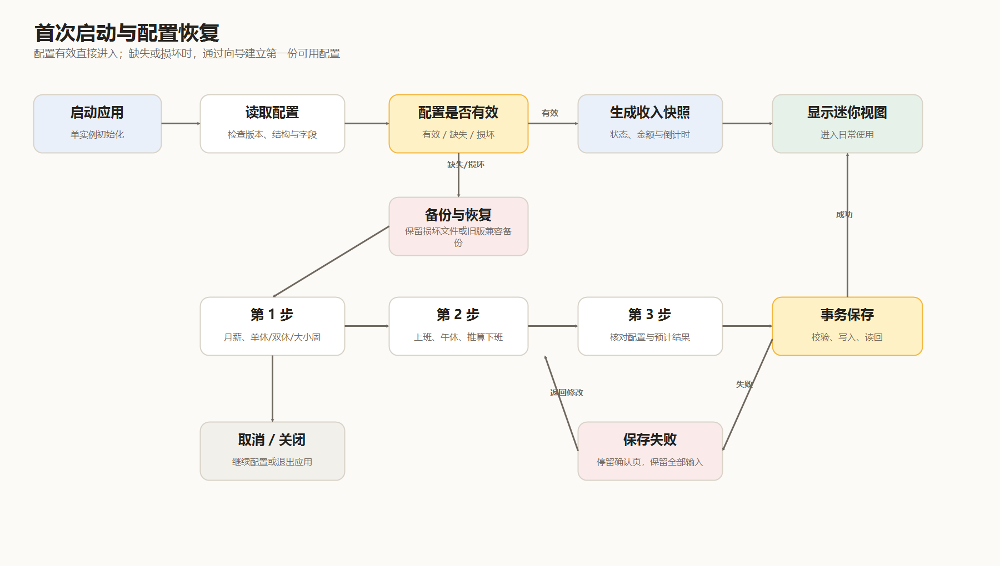
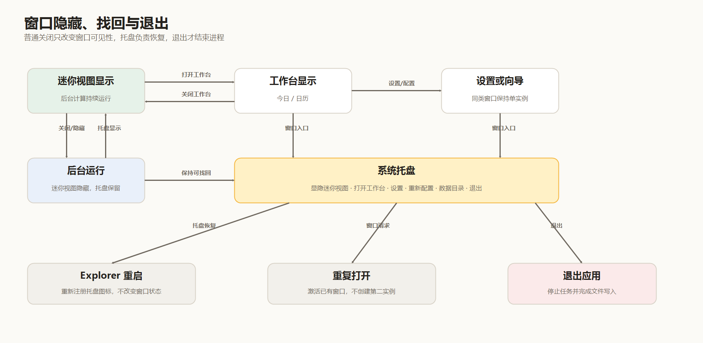

# LetsMakeMoney Windows v1.0 产品需求文档


## 文档信息

| 项目 | 内容 |
| --- | --- |
| 产品 | LetsMakeMoney Windows |
| 目标版本 | v1.0 Stable |
| 文档状态 | 已定稿，作为开发与验收基线 |
| 需求类型 | 产品重构 / UI 交互 / Windows 桌面应用 / 本地数据 |
| 技术路线 | Rust + Tauri + TypeScript/React |
| 交互原型 | [LetsMakeMoney Windows v1.0 Figma 原型](https://www.figma.com/proto/YYUnNNHBsWTavbZi3zkGTV/LetsMakeMoney-Windows-v1.0?node-id=49-94&t=xvJttNIpsynERGEK-1) |
| 上游需求池 | [idea-pool.md](idea-pool.md) |
| 技术选型 | [technical-spike-results.md](technical-spike-results.md) |
| 需求追踪 | [traceability.md](traceability.md) |
| 完成日期 | 2026-07-24 |

## 1. 项目背景

v0.9 同时承载桌宠、收入面板、日历、设置和托盘能力。随着功能增加，产品出现了三个明显问题：

1. 收入信息分散在多个入口，用户很难快速理解“今天赚了多少、现在处于什么状态、距离下班还有多久”。
2. 首次配置与日常设置混在一起，复杂作息缺少引导，保存失败时也缺少足够可信的反馈。
3. 桌宠相关窗口、点击穿透和原生逻辑持续扩大维护成本，却不再服务收入进度这一核心价值。

v1.0 因此不再继续修补旧界面，而是重新定义产品：保留“一眼看到收入进度”的辨识度，将日常查看、日期解释、配置维护和托盘找回串联为一条完整路径，并把宠物能力从当前版本彻底移除。

## 2. 产品目标

### 2.1 目标

- 用户启动应用后，能在 2 秒内读懂当前收入状态。
- 新用户能在 3 分钟内完成月薪、休息制度和作息配置。
- 今日、日历、设置和托盘之间有清晰、可逆的导航关系。
- 所有金额、工作日和倒计时来自同一套计算规则。
- 保存失败不丢输入、不污染旧配置；窗口隐藏后始终可以找回。
- 用户数据默认只保存在本机，不依赖账号或云服务。

### 2.2 成功标准

| 目标 | 判断标准 |
| --- | --- |
| 快速理解 | 迷你收入视图在不展开详情的情况下即可表达金额、状态和下一时间节点 |
| 首次配置 | 三步完成，所有必填项均有就地校验，返回上一步不丢草稿 |
| 结果一致 | 迷你视图、今日页和日历对同一日期给出一致的金额与工作日解释 |
| 数据安全 | 迁移或保存失败后，原有效配置仍可继续使用 |
| 可找回 | 关闭或隐藏窗口不等于退出，托盘始终提供恢复入口 |
| 可交付 | Windows 便携包可在 100%、125%、150% 缩放下完成核心路径 |

### 2.3 本版不做

- 账号、云同步和跨设备同步。
- 通用考勤、待办、项目计时或财务记账。
- macOS、Linux 或移动端。
- 宠物展示、宠物选择、纯桌宠和点击穿透。
- 静默安装和完整自动更新系统。

## 3. 目标用户与使用场景

### 3.1 目标用户

- 希望工作时间获得即时正反馈的上班族。
- 不需要复杂计时，只关心今日收入、下班倒计时和本月累计的用户。
- 重视本地数据和低打扰常驻体验的 Windows 用户。

### 3.2 核心场景

1. 上班后瞄一眼迷你窗口，确认今日已赚和距离下一个时间节点还有多久。
2. 打开今日页，查看日薪、时薪、工作进度和完整作息时间线。
3. 在日历中解释某天为什么是工作日或休息日，并按实际情况进行日期调整。
4. 首次启动时快速完成配置，之后在设置中精确维护工资、作息和窗口偏好。
5. 临时隐藏窗口后，通过托盘恢复，不中断后台计算。
6. 配置损坏、更新检查失败或窗口位置异常时，获得明确反馈和恢复入口。

## 4. 产品方案

v1.0 采用“迷你收入视图 + 今日/日历工作台”的双层结构：

- **迷你收入视图**负责高频、低打扰的信息反馈。
- **今日/日历工作台**负责解释收入、日期与作息。
- **首次配置向导**只解决首次使用和明确的重新配置。
- **设置**负责长期维护，不重复向导式教育。
- **系统托盘**负责显隐、找回、任务入口与退出。



图中只表达 v1.0 的正式入口。迷你视图、工作台和设置承担不同频率的任务；托盘不是附加菜单，而是窗口隐藏后的找回与退出通道。

### 4.1 窗口定义

| 窗口 | 默认尺寸 | 任务栏 | 关闭行为 |
| --- | ---: | --- | --- |
| 迷你收入视图 | 344 × 120 | 默认不显示 | 隐藏到托盘，进程继续运行 |
| 今日/日历工作台 | 920 × 640 | 显示 | 关闭工作台，迷你视图继续运行 |
| 设置 | 760 × 560 | 跟随工作台 | 有未保存修改时先确认是否放弃 |
| 首次配置向导 | 780 × 580 | 跟随工作台 | 首次配置时确认继续配置或退出应用 |
| 托盘菜单 | 220–260 宽 | 不适用 | 菜单关闭不改变窗口状态 |

尺寸均为逻辑像素，系统缩放只应用一次。窗口不得通过整张位图缩放来适配 DPI。

## 5. 业务规则

### 5.1 工作日判定

工作日按以下优先级解析：

```text
用户手动调整 > 调休工作日 > 法定节假日 > 用户休息制度
```

- 休息制度支持单休、双休和大小周。
- 大小周必须由用户明确指定锚点日期及该周类型，系统不能默认猜测。
- 官方节假日数据未覆盖目标年份时，仍按休息制度计算，并明确提示数据边界。
- 用户可以恢复自动判断，取消某一天的手动调整。

### 5.2 收入计算

1. 日薪 = 月薪 ÷ 当月实际工作日数。
2. 每日有效工作时长 = 下班时间 − 上班时间 − 午休时长。
3. 时薪 = 日薪 ÷ 每日有效工作小时数。
4. 今日收入只在有效工作时段内线性增长；午休、上班前、下班后和休息日不增长。
5. 今日进度 = 已完成有效工作时长 ÷ 每日有效工作时长。
6. 本月累计只计算已结束工作日和当前时刻，不提前计入未来日期。
7. 金额内部使用定点数，界面统一保留两位小数。
8. 跨夜班次归属上班开始日，午休必须落在班次范围内。

### 5.3 运行状态

| 状态 | 判断条件 | 用户看到的结果 |
| --- | --- | --- |
| 待配置 | 月薪或关键作息无效 | 引导完成配置，不展示误导性金额 |
| 上班前 | 工作日但未到上班时间 | 今日预计收入、距离上班时间 |
| 工作中 | 位于有效工作时段 | 金额递增、进度变化、下一节点倒计时 |
| 午休中 | 位于午休时段 | 金额冻结、距离复工时间 |
| 已下班 | 工作日且已结束 | 今日完成金额和完成状态 |
| 休息日 | 周末或节假日 | 今日不计实时收入、提示下个工作日 |
| 日历数据未知 | 官方数据未覆盖 | 按休息制度计算，并显示数据提醒 |
| 配置异常 | 时间或工资组合无效 | 保留最后一次有效结果，并提供修复入口 |

## 6. 功能需求

### FR-001 产品范围重构

**用户价值**

让用户面对的是一个目标单一的收入进度工具，而不是由历史功能拼接出的多入口应用。

**需求说明**

- 应用启动页、窗口、菜单、设置、向导、关于页和发布说明统一使用收入进度产品定位。
- 当前版本不出现宠物窗口、宠物设置或宠物相关引导。
- 旧配置中的宠物字段只参与一次兼容备份，不写入新配置。
- v0.9 的安装包、Tag 和恢复说明继续保留，作为明确回退路径。
- 移除宠物能力时，不得误删通用托盘、窗口、日志和配置能力。

**用户可见范围**

| 产品表面 | v1.0 保留内容 | 明确移除内容 |
| --- | --- | --- |
| 启动 | 配置校验、首次配置向导、迷你收入视图 | 宠物选择、宠物素材加载、纯桌宠启动 |
| 主界面 | 今日、收入日历、设置 | 宠物页、素材页、ComfyUI 入口 |
| 设置 | 收入与作息、日历、窗口与启动、数据与支持 | 宠物、点击穿透、宠物动画与缩放 |
| 托盘 | 显隐迷你视图、今日、设置、重新配置、数据目录、退出 | 宠物切换、纯桌宠、宠物重置 |
| 发布包 | v1.0 运行文件、许可、说明与回退文档 | 宠物运行模块、专属原生路径和未使用素材 |

**升级与回退边界**

1. 发现 v0.9 配置时，先创建兼容备份，再迁移收入、作息和通用窗口偏好。
2. 宠物字段不参与 v1.0 业务计算，也不能因未知字段导致升级失败。
3. 升级失败时继续保留旧文件，并进入可解释的恢复流程，不生成半份 v1.0 配置。
4. 用户选择回退时，必须先退出 v1.0，再按回退说明恢复 v0.9 兼容备份。
5. 已从产品表面移除的功能不得继续通过隐藏快捷键、旧菜单或参数进入。

**验收重点**

- 发布包和新配置中不存在宠物功能入口或有效字段。
- 从旧版本升级后，工资和作息仍可正常读取。
- 用户需要回退时，能够找到 v0.9 的发布物和恢复说明。
- 代码瘦身后，托盘找回、窗口置顶、配置备份和日志能力仍可单独运行。
- README、关于页、窗口标题和发布说明对产品定位的描述一致。

### FR-002 统一收入计算

**用户价值**

同一时刻在不同页面看到的金额、状态和倒计时必须一致，并且可以解释。

**输入**

- 月薪、休息制度和大小周锚点。
- 上班、下班、午休开始与结束时间。
- 当前时间、系统时区、官方节假日数据和用户日期调整。

**输出**

- 当前业务状态。
- 今日已赚、日薪、时薪和工作进度。
- 本月累计与当月工作日数。
- 当前日期的工作日解释。
- 下一个状态节点及倒计时。

**统一快照**

前端各页面只消费一份收入快照，不自行推导金额或工作日。快照至少包含：

| 字段 | 用途 | 更新时机 |
| --- | --- | --- |
| 归属日期、时区 | 确定跨夜班次和当前业务日 | 日期或系统时区变化 |
| 业务状态 | 驱动工作中、午休、休息日等界面 | 每秒及跨状态节点时 |
| 今日已赚、日薪、时薪 | 迷你视图与今日页展示 | 每秒；配置或日历变化时重算 |
| 已完成/剩余有效工时 | 进度条和倒计时 | 每秒 |
| 本月累计、工作日数 | 今日页与日历摘要 | 日期、配置、覆盖或数据集变化 |
| 下一状态、目标时间 | “距离上班/午休/复工/下班”文案 | 每秒及跨状态节点时 |
| 日期类型、来源 | 解释某天为何工作或休息 | 月份、覆盖或数据集变化 |

**交互要求**

- 迷你视图与今日页每秒请求或接收同一份实时快照。
- 配置、日期调整或节假日数据发生变化后，所有已打开窗口同步刷新。
- 页面只负责展示和格式化，不单独复制收入公式。
- 计算失败时保留最后一次有效快照，并给出“重试”或“打开设置”。

**刷新与展示规则**

- 工作状态、今日金额、进度和倒计时按秒刷新；日薪、时薪和本月工作日数不做无意义的每秒重算。
- 从上班前进入工作中、从工作中进入午休、从午休进入复工、从工作中进入下班时，必须在下一次刷新内切换状态和文案。
- 金额内部按分保存，最终显示统一保留两位小数；各页面不得分别四舍五入后再参与后续计算。
- 倒计时小于 0 时立即切换到下一状态，不显示负数；跨日目标明确显示日期。
- 前端收到较旧快照时不得覆盖新结果；窗口从休眠或隐藏恢复后先请求一次完整快照。
- 日历数据降级时，在不阻断收入查看的前提下显示来源提醒。

**异常处理**

| 异常 | 用户反馈 | 处理方式 |
| --- | --- | --- |
| 月薪无效 | 月薪需大于 0 | 停止金额计算，引导进入设置 |
| 当月工作日为 0 | 无法计算日薪 | 保留配置，提示检查休息制度和日期调整 |
| 作息越界 | 工作与休息时间冲突 | 标记具体字段，不保存 |
| 日历数据损坏 | 官方数据暂不可用 | 按休息制度降级计算，并保留提醒 |

**一致性验收**

- 同一测试时刻下，迷你视图、今日页和日历详情的今日金额误差不超过 0.01 元。
- 切换休息制度、修改单日规则或跨过午休边界后，已打开窗口在 1 秒内给出一致状态。
- 连续刷新、窗口隐藏后恢复和系统睡眠后唤醒均不能让今日金额倒退。

### FR-003 配置迁移与保存

**用户价值**

升级和修改设置都不应以丢失原有配置为代价。

**首次升级流程**

1. 读取旧配置并判断是否需要迁移。
2. 在原目录创建带时间戳的兼容备份。
3. 校验月薪和作息字段，转换为 v1.0 配置。
4. 写入临时文件并读回校验。
5. 校验成功后原子替换正式配置，同时保留上一版本副本。
6. 任一步失败都继续使用原有效配置，并向用户说明结果。

**设置保存流程**

1. 用户在设置或向导中修改的是草稿，不直接改变运行配置。
2. 点击“保存”或“完成”后先做完整校验。
3. 写入成功后刷新所有窗口，并反馈“设置已保存”。
4. 内容未变化时反馈“没有需要保存的更改”。
5. 写入失败时保留用户输入和旧配置，不显示成功。
6. 开机启动等系统副作用失败时，回滚本次所有可回滚修改。



**操作结果**

| 场景 | 界面反馈 | 配置与草稿结果 |
| --- | --- | --- |
| 字段校验失败 | 定位第一个错误字段，同时保留其他错误提示 | 草稿保留，不发起写入 |
| 有修改且保存成功 | 显示“设置已保存”，清除未保存状态 | 新配置成为运行配置并刷新所有窗口 |
| 没有修改仍点击保存 | 显示“没有需要保存的更改” | 不重写文件，不触发系统副作用 |
| 文件写入失败 | 显示失败原因，允许再次保存 | 草稿保留，旧配置继续生效 |
| 开机启动等副作用失败 | 显示失败项和回滚结果 | 文件与系统设置尽量恢复到保存前状态 |
| 有修改时关闭或取消 | 打开放弃确认 | “继续编辑”保留草稿；“放弃更改”恢复持久值 |
| 无修改时关闭 | 直接关闭 | 不写文件 |

**文件安全与并发**

- 配置写入统一由 Rust 配置服务串行处理；设置与首次配置向导同时提交时，后到请求必须基于最新配置重新校验。
- 临时文件和正式文件位于同一目录，确保原子替换不跨卷。
- 临时文件写完后必须刷新到磁盘并读回校验；校验失败不能替换正式配置。
- 应用异常终止后再次启动时，优先使用最后一份完整正式配置；遗留临时文件只作为恢复证据，不自动覆盖。
- 保存成功后再广播配置版本和新快照；前端只在版本号更新后清除脏状态。

**日志与验收**

- 记录迁移开始、完成、失败，保存成功、无变化、失败，以及回滚完成或部分失败；日志不记录原始月薪。
- 人为制造不可写目录、无效作息和开机启动写入失败时，均应证明“输入仍在、旧配置仍可用、界面没有误报成功”。

### FR-004 迷你收入视图

**用户价值**

不打断当前工作，也能快速获得收入进度反馈。

**入口与退出**

- 配置有效且“启动时显示”开启时，应用启动后直接显示迷你视图。
- 配置有效但“启动时显示”关闭时，应用进入托盘后台，不强制弹窗。
- 首次配置完成后显示迷你视图；重新配置完成后保持用户进入向导前的可见状态。
- 单击迷你视图打开工作台“今日”；关闭、隐藏或按 `Esc` 不结束应用。
- 托盘左键和“显示/隐藏迷你视图”菜单项必须使用同一套显隐逻辑。

**界面内容**

| 区域 | 展示内容 | 规则 |
| --- | --- | --- |
| 状态 | 工作中、午休中、休息日或异常 | 文案与颜色同时表达，不能只依赖颜色 |
| 主金额 | 今日已赚 | 工作中每秒更新；长金额不得溢出 |
| 辅助信息 | 距离上班、午休、复工或下班 | 始终选择距离当前最近且有意义的节点 |
| 进度 | 今日有效工作进度 | 休息日和异常状态不显示误导性进度 |
| 主入口 | 金额区或工作台按钮 | 打开工作台并定位到“今日” |
| 更多操作 | 工作台、设置、隐藏 | 菜单关闭不影响窗口状态 |

**状态表现**

- **工作中**：显示今日已赚和下一个工作节点，金额持续增长。
- **午休中**：显示“休息中”，金额冻结，倒计时指向复工。
- **休息日**：用“今天好好休息”替代 `¥0.00` 的强刺激表达，并提示下个工作日。
- **待配置**：显示“完成配置”主按钮，点击打开向导。
- **计算异常**：显示“暂时无法计算”，保留最后一次有效结果，并提供“重试”和“打开设置”。

| 状态 | 主信息 | 辅助信息 | 进度表现 |
| --- | --- | --- | --- |
| 上班前 | 今日预计收入 | 距离上班 | 0%，不增长 |
| 工作中 | 今日已赚 | 距离午休、复工或下班 | 按有效工时增长 |
| 午休中 | 休息中、今日已赚 | 距离复工 | 冻结在午休开始值 |
| 已下班 | 今日已赚 | 今日工作已完成 | 固定 100% |
| 休息日 | 今天好好休息 | 下一个工作日 | 不显示收入进度 |
| 数据未知 | 当前可计算结果 | 节假日数据提示 | 按休息制度降级 |
| 配置异常 | 暂时无法计算 | 错误摘要与修复入口 | 保留上次有效值 |

**操作说明**

| 操作 | 结果 |
| --- | --- |
| 单击金额区 | 打开今日工作台 |
| 按住空白区拖动 | 移动窗口，并保存屏幕内位置 |
| 打开更多菜单 | 显示工作台、设置和隐藏入口 |
| 点击关闭或隐藏 | 隐藏到托盘，应用继续运行 |
| 托盘左键 | 恢复或再次隐藏迷你视图 |

**边界与恢复**

- 窗口位置保存前需限制在当前屏幕可见区域。
- 显示器断开或分辨率变化后，窗口自动回到安全位置。
- 过长金额优先采用紧凑数字格式，其次在限定范围内调整字号。
- 刷新失败不能把有效金额清零。

**刷新、反馈与可用性**

- 窗口显示时每秒更新动态字段；隐藏时可降低前端刷新频率，但后台状态跨节点时仍需准确更新。
- 从隐藏恢复时先显示最后一次有效结果，再异步刷新，避免空白闪烁。
- 单击与拖动需要做位移阈值仲裁：发生有效拖动后不再触发“打开工作台”。
- 窗口拖动结束后再保存位置，拖动过程不持续写配置文件。
- 主点击区域提供可读的辅助名称，键盘聚焦后按 `Enter` 或 `Space` 可打开工作台。
- 错误操作反馈不得遮挡金额和拖动区域；同一错误连续发生时合并提示，不堆叠多个轻提示。

**验收场景**

- 分别构造上班前、工作中、午休、下班后、休息日、待配置和计算失败状态，检查文案、金额和进度组合。
- 在 100%、125%、150% 缩放及长金额下，窗口尺寸稳定且不存在文字裁切。
- 拖动、单击、隐藏、托盘恢复和显示器断开恢复均能回到可操作位置。

### FR-005 今日与日历工作台

#### 6.5.1 工作台公共框架

- 标题区显示应用名、当前日期和工作日解释。
- 主导航包含“今日”“日历”“设置”。
- “今日”和“日历”在同一窗口内切换，不重复创建窗口。
- 点击关闭只关闭工作台；迷你收入视图和后台计算继续运行。
- 从迷你视图进入时默认打开“今日”；从日期相关入口进入时保留目标日期。

| 入口 | 默认落点 | 重复打开行为 |
| --- | --- | --- |
| 单击迷你视图 | 今日 | 激活现有工作台并切换到今日 |
| 托盘“打开今日工作台” | 今日 | 激活现有工作台并切换到今日 |
| 今日页“调整今天” | 日历，并选中今天 | 激活现有工作台，不创建第二窗口 |
| 日历页签 | 当前浏览月份 | 保留本次会话中的选中日期 |
| 主导航“设置” | 设置上次停留分类 | 激活现有设置窗口 |

页面切换不重新创建收入快照，也不因切换页签丢失当前月份、选中日期或局部错误信息。窗口重新打开时默认回到今日，避免把上次浏览的历史月份误认为当前状态。

#### 6.5.2 今日页

**页面信息**

| 模块 | 内容 | 用户可执行操作 |
| --- | --- | --- |
| 日期与状态 | 日期、星期、工作日类型、当前状态 | 无 |
| 今日收入进度 | 今日已赚、日薪、时薪、工作进度 | 点击“调整今天” |
| 今日安排 | 上班、午休开始、复工、下班时间线 | 查看每个阶段及当前所在阶段 |
| 本月累计 | 已发生收入与本月工作日数 | 无 |
| 倒计时 | 距离下一个工作节点 | 无 |

**“调整今天”**

1. 点击后切换到“日历”，自动定位当前月份、选中今天并展开日期编辑区。
2. 编辑区显示日期、当前判定、规则来源，以及“跟随规则 / 工作日 / 休息日”三项选择。
3. 选择“工作日”或“休息日”后，仅覆盖当天；选择“跟随规则”则删除当天覆盖。
4. 选择发生变化时立即发起单日保存；保存期间三项选择保持可见但禁止重复提交。
5. 保存成功后更新日期格标识，并同步刷新今日、迷你视图、本月工作日、日薪与累计收入。
6. 点击编辑区关闭按钮或按 `Esc` 只收起编辑区，不撤销已经保存成功的选择。
7. 保存失败时恢复到提交前规则，保留编辑区并显示原因，不让页面出现“看似已改、重启丢失”的假成功。

**状态差异**

- 上班前：时间线高亮“开始工作”，倒计时指向上班。
- 工作中：高亮当前工作阶段，金额和进度增长。
- 午休中：高亮休息阶段，金额冻结。
- 已下班：展示今日完成结果，进度固定为 100%。
- 休息日：隐藏工作进度，解释休息来源并允许调整当天。
- 日历数据未知：显示数据提醒，但不遮挡主要收入信息。

#### 6.5.3 收入日历

**页面结构**

- 顶部显示当前年月，并提供“上个月”“下个月”按钮。
- 周标题固定为周日到周六，日期网格按完整自然周排列。
- 日期格需要区分今天、当前选中、工作日、休息日、法定节假日、调休工作日和手动调整。
- 选中日期后显示日期类型、规则来源、预计或实际收入及调整入口。
- 默认选中今天；切换月份后，优先选中目标月今天，否则选中该月第一天。

**日期格信息层级**

- 第一层是日期数字，保证在所有状态下可读。
- 第二层用底色区分基础工作日与休息日；今天使用描边，不能只换颜色。
- 法定节假日、调休工作日和手动覆盖使用文字或角标说明来源。
- 同一天同时命中“今天、选中、手动覆盖”时，今天描边、选中焦点和覆盖角标必须可以同时识别。
- 非当前月份的补位日期不进入 v1.0 交互范围；网格可留空，不允许误触。

**操作说明**

| 操作 | 结果 |
| --- | --- |
| 点击上月/下月 | 切换月份并加载对应年份数据 |
| 点击日期 | 选中日期并展开行内编辑区 |
| 点击“跟随规则” | 删除该日覆盖，恢复节假日与休息制度判定 |
| 点击“工作日” | 将该日写为手动工作日 |
| 点击“休息日” | 将该日写为手动休息日 |
| 点击编辑区关闭按钮 | 收起编辑区，不改变已保存结果 |
| 点击“调整日期” | 定位当前选中日期；未选中时默认选择今天 |
| 点击“今日”页签 | 返回今日收入页 |
| 点击“设置” | 打开设置并复用已有设置窗口 |

**异常与空状态**

- 官方数据未覆盖目标年份时，页面显示“官方节假日数据未覆盖”，并按休息制度继续渲染。
- 日历加载失败时保留当前月份和最后一次有效结果，提供“重试”。
- 切换月份期间使用局部加载状态，不清空整个工作台。
- 日期调整失败后，日历格和日期详情保持原值。

**跨页面一致性**

- 日期调整成功后，工作台当前页不刷新整个窗口，只更新受影响的日期格、统计卡片和快照。
- 调整当月任意日期都会重算当月工作日数和日薪；调整今天还会同步改变今日状态与进度。
- 调整非当前月份日期不得改变当前今日收入，只影响目标月份的统计。
- 同一日期的规则来源在日历详情和计算服务中必须一致，不能一个显示“手动调整”、另一个仍解释为“周末”。

**验收场景**

- 覆盖普通工作日、周末、法定节假日、调休工作日、手动工作日、手动休息日和数据未知年份。
- 验证跨月、跨年、恢复自动规则、保存失败、连续切换日期和键盘操作。
- 关闭并重新打开应用后，已成功保存的单日调整仍存在。

### FR-006 首次配置向导

**入口**

- 首次启动且配置缺失或无效。
- 托盘菜单“重新配置”。
- 设置中的“重新配置”。

**公共结构**

- 标题显示“开始配置”和“第 N 步，共 3 步”。
- 左侧或顶部步骤栏固定展示“收入与休息”“工作与休息”“确认配置”。
- 每一步只处理一个决策主题，不一次展示全部配置项。
- 底部持续提示“配置只保存在本机”。
- 向导打开时始终从第 1 步开始；重新配置可以载入当前值，但不得恢复上次未完成的步骤位置。
- 左侧步骤仅表达进度，不允许跳过校验直接点击进入后续步骤。
- 窗口加载配置期间显示局部加载状态，不能先闪现默认值再覆盖为用户值。

#### 第 1 步：收入与休息

| 控件 | 行为 |
| --- | --- |
| 月薪 | 必填，大于 0，最多两位小数；支持带千分位展示 |
| 双休 | 选择后按周六、周日休息 |
| 单休 | 选择后按每周一个休息日计算 |
| 大小周 | 选择后显示“本周类型” |
| 本周类型 | 必须明确选择大周或小周，不提供隐式默认值 |
| 取消 | 首次配置进入退出确认；重新配置直接询问是否放弃草稿 |
| 下一步 | 当前输入全部有效后才启用 |

补充规则：

- 月薪输入允许用户键入小数，但失焦时再统一格式化；正在输入 `.` 或末尾 `0` 时不得擅自改写。
- 切换休息模式不会清空其他已填内容；从大小周切回单休或双休时，锚点字段保留在草稿但不参与计算。
- 预计工作日加载中时可以继续编辑，但不能带着尚未产生的关键预览进入确认页。
- 预览失败时展示“暂时无法计算工作日”，并提供检查当前输入的明确提示。

#### 第 2 步：工作与休息

| 控件 | 行为 |
| --- | --- |
| 上班时间 | 选择每天开始工作的时间 |
| 午休开始 | 必须晚于上班时间 |
| 午休时长 | 用于推算复工和下班时间 |
| 时间选择器“确定” | 提交当前选择；关闭或取消保留原值 |
| 推算结果 | 实时展示“几点复工、几点下班” |
| 上一步 | 返回第 1 步并保留所有草稿 |
| 下一步 | 时间组合有效后进入确认页 |

默认按 8 小时有效工时推算下班时间。若推算结果跨日，需要明确显示“次日”，不能仅显示时分。

时间选择器打开后应聚焦当前值；点击“确定”提交本次选择，点击取消、关闭或按 `Esc` 保留原值。修改上班时间、午休开始或午休时长后，午休结束与下班时间即时联动。午休为 0 时不展示虚假的午休阶段；午休开始早于上班、午休超出班次或有效工时不大于 0 时，错误就地显示并禁止下一步。

#### 第 3 步：确认配置

- 汇总月薪、休息模式、工作时间和午休时间。
- 展示预计当月工作日、日薪和时薪，帮助用户发现明显配置错误。
- “上一步”返回编辑，草稿保持不变。
- “完成”触发配置校验和保存；保存中按钮禁用，避免重复提交。
- 保存成功后关闭向导并显示迷你收入视图。
- 保存失败时停留在确认页，保留全部输入并显示可读原因。

确认页只展示用户能理解的业务结果，不展示配置字段名、内部状态或文件路径。月薪使用货币格式，工作与午休显示完整时间区间，大小周需要明确写出当前锚点周是大周还是小周。若用户在上一步修改了任何内容，返回确认页时摘要和预览必须重新计算。

**关闭与取消**

- 首次配置尚未完成时，关闭窗口弹出“退出首次配置？”确认。
- “继续编辑”返回原步骤；“退出应用”才终止进程。
- 重新配置时取消不影响当前有效配置。
- 任何中间步骤都不写入半成品配置。

**键盘与异常路径**

- `Tab` 顺序遵循页面从上到下、从左到右；`Shift+Tab` 可反向移动。
- `Enter` 仅在当前步骤校验通过且焦点不位于选择器内时触发下一步或完成。
- 保存过程中关闭窗口时先阻止退出，待结果返回后再允许用户处理。
- 读取现有配置失败时，不把默认值伪装成用户配置；显示恢复说明后按首次配置流程处理。

**验收场景**

- 分别完成单休、双休、大小周大周、大小周小周四条路径。
- 验证上一步保留草稿、重新打开回到第 1 步、首次配置退出确认、重新配置放弃和保存失败。
- 验证鼠标、键盘、100%/125%/150% 缩放及最长错误文案。

### FR-007 设置

**设计原则**

设置用于精确维护，不重复首次向导。所有页面共享同一份草稿和底部操作区，切换分类不会自动保存。

**入口与导航**

- 可从工作台“设置”、迷你视图更多菜单和托盘“偏好设置”打开。
- 同一时刻只保留一个设置窗口；重复打开时激活现有窗口，并保留当前分类和未保存草稿。
- 左侧导航固定为“收入与作息、日历、窗口与启动、数据与支持”四项。
- 打开设置默认进入上次停留分类；首次打开进入“收入与作息”。
- 底部操作区固定显示草稿状态、“恢复默认”和“保存”，滚动页面时仍可操作。

#### 6.7.1 收入与工作日

| 设置项 | 类型 | 说明 |
| --- | --- | --- |
| 月薪 | 数字输入 | 大于 0，最多两位小数 |
| 休息制度 | 下拉选择 | 单休、双休、大小周 |
| 本周类型 | 条件选择 | 仅大小周显示，必须明确选择 |
| 大小周锚点 | 日期 | 用于后续周次推算 |
| 预计工作日 | 只读结果 | 随草稿实时重算 |
| 预计日薪 | 只读结果 | 使用统一计算规则 |

#### 6.7.2 作息与午休

| 设置项 | 类型 | 说明 |
| --- | --- | --- |
| 上班时间 | 时间输入 | 班次起点 |
| 每日有效工时 | 数字输入 | 默认 8 小时 |
| 午休开始 | 时间输入 | 必须位于班次内 |
| 午休时长 | 时长输入 | 用于推算午休结束和下班时间 |
| 午休结束 | 推算结果 | 与草稿联动 |
| 下班时间 | 推算结果或确认值 | 跨日时明确标识次日 |

收入与作息属于同一分类。月薪、休息制度和四个时间字段均参与一次完整校验：

- 月薪必须大于 0，最多两位小数；粘贴含千分位的文本时先规范化再校验。
- 单休、双休、大小周切换后立即刷新预计工作日和日薪，但不影响正式运行结果，直至保存成功。
- 大小周模式显示“本周类型”和锚点日期；离开大小周时隐藏，不删除草稿值。
- 时间输入允许直接键入和选择器操作；任一字段变化后重算午休时长、有效工时和预览。
- 只读预览计算失败时展示具体原因，不使用 `0` 冒充有效结果。

#### 6.7.3 日历

| 设置项 | 类型 | 说明 |
| --- | --- | --- |
| 节假日数据 | 只读选择 | 显示当前内置数据集及覆盖年份 |
| 数据版本 | 只读信息 | 用于定位日期解释来源 |
| 允许手动调整 | 开关 | 控制日历页是否展示单日调整入口 |

- v1.0 仅使用中国大陆内置数据，不提供在线切换国家或远程下载数据集。
- 关闭“允许手动调整”只隐藏后续编辑入口，不删除已经保存的日期覆盖；再次开启后仍可查看和恢复。
- 数据年份不覆盖当前浏览月份时，在设置和日历页使用相同提示口径。

#### 6.7.4 迷你视图与显示

| 设置项 | 类型 | 说明 |
| --- | --- | --- |
| 启动时显示 | 开关 | 下次启动是否显示迷你收入视图 |
| 始终置顶 | 开关 | 保持在普通窗口上方 |
| 重置窗口位置 | 按钮 | 把迷你视图移动到当前主屏安全位置 |
| 开机启动 | 开关 | 登录 Windows 后启动应用，默认关闭 |

- “启动时显示”控制下次应用启动后的迷你窗口可见性，不等于是否启动应用。
- “始终置顶”保存成功后立即应用；应用失败时本次配置整体按 FR-003 回滚。
- “重置窗口位置”属于即时维护操作，执行前不要求保存其他草稿；成功后移动到当前主屏安全位置并单独反馈。
- 开机启动只在用户保存时修改系统项；取消或放弃设置不改变注册表。

#### 6.7.5 系统、数据与支持

| 设置项 | 类型 | 说明 |
| --- | --- | --- |
| 关闭到托盘 | 开关 | 关闭工作台或迷你视图时保持进程运行 |
| 启动时检查更新 | 开关 | 仅检查稳定通道，不静默安装 |
| 日志等级 | 下拉选择 | `error`、`info`、`debug` |
| 打开数据目录 | 按钮 | 打开配置、日志和备份所在目录 |
| 复制诊断摘要 | 按钮 | 复制脱敏后的版本、配置和最近错误信息 |
| 检查更新 | 按钮 | 由用户主动触发更新检查 |
| 重新配置 | 按钮 | 打开向导，不立即修改当前配置 |
| 恢复默认 | 按钮 | 先展示影响摘要，再更新草稿 |
| 关于 | 信息入口 | 展示版本、许可和项目链接 |

维护按钮不属于配置草稿，点击后立即执行，各自显示独立反馈：

| 操作 | 执行中 | 成功 | 失败 |
| --- | --- | --- | --- |
| 打开数据目录 | 按钮短暂禁用 | 打开目录，不关闭设置 | 显示无法打开的原因 |
| 复制诊断摘要 | 防止连续重复写入 | 显示“诊断摘要已复制” | 保留设置页并显示剪贴板错误 |
| 检查更新 | 显示“正在检查…” | 显示已是最新或新版本入口 | 显示离线/失败，当前功能继续可用 |
| 重新配置 | 激活或打开向导 | 从第 1 步开始，载入当前值 | 无法打开时保留设置窗口 |
| 恢复默认 | 先打开影响确认 | 确认后仅替换草稿 | 取消不改变草稿 |

#### 6.7.6 底部操作与状态

| 操作或状态 | 预期行为 |
| --- | --- |
| 保存 | 校验全部分类并执行一次事务保存 |
| 无变化保存 | 显示“没有需要保存的更改” |
| 保存成功 | 显示成功反馈，并同步所有已打开窗口 |
| 保存失败 | 输入保留、旧配置不变，错误保持到下一次操作 |
| 恢复默认 | 只修改草稿；再次点击保存后才生效 |
| 关闭/取消 | 无修改直接关闭；有修改时确认放弃或返回编辑 |
| 切换分类 | 保留当前草稿和错误状态，不自动保存 |

**关闭与反馈规则**

- 保存成功反馈与当前配置版本绑定；用户再次编辑后，旧成功提示立即退出，状态改为“有尚未保存的更改”。
- 保存失败信息至少保持到用户修改相关字段、再次保存或主动关闭，不能在用户看清前自动消失。
- 放弃更改后恢复打开设置时的持久值，不恢复上一次失败写入产生的临时状态。
- 恢复默认确认需要列出工资、作息、窗口和启动偏好会被重置；诊断日志和日期覆盖是否保留必须明确说明。

**验收场景**

- 四个分类逐项检查控件、条件显示、草稿保留和键盘焦点。
- 覆盖成功、无变化、字段无效、文件不可写、系统副作用失败、恢复默认和关闭未保存设置。
- 设置保存后，迷你视图、今日页、日历和托盘策略无需重启即可使用新配置。

### FR-008 托盘与窗口生命周期

**托盘左键**

- 迷你视图显示时，左键托盘图标将其隐藏。
- 迷你视图隐藏时，左键托盘图标恢复并激活窗口。
- 恢复时重新应用置顶和安全位置策略。
- 若工作台或设置处于前台，托盘左键仍只切换迷你视图，不擅自关闭其他任务窗口。
- 连续双击按两次左键命令处理，但最终状态必须可预测，不产生两个迷你窗口。

**托盘菜单**

| 菜单项 | 行为 |
| --- | --- |
| 显示/隐藏迷你视图 | 切换迷你窗口显隐 |
| 今日工作台 | 打开工作台并定位到今日 |
| 设置 | 打开或激活设置窗口 |
| 重新配置 | 打开向导并载入当前配置为草稿 |
| 打开数据目录 | 打开本地数据目录 |
| 退出 | 结束应用进程 |

菜单打开时，根据迷你视图当前状态动态显示“显示迷你收入”或“隐藏迷你收入”。点击菜单项后立即关闭菜单；命令失败时通过仍可见的窗口或系统通知反馈，不能静默失败。

**窗口管理**

- 同一种任务窗口只允许存在一个实例；重复打开时激活已有窗口。
- 打开工作台时可隐藏迷你视图，关闭工作台后按原状态恢复。
- 普通关闭动作不终止进程，只有托盘“退出”结束应用。
- 应用退出前停止计时器、刷新任务和文件写入，避免留下半写状态。
- Explorer 重启后重新注册托盘图标。
- 托盘能力不可用时，工作台必须保留“打开数据目录”和“退出”入口，并显示降级说明。

**窗口状态合同**

| 请求 | 目标窗口已存在 | 目标窗口不存在 | 失败处理 |
| --- | --- | --- | --- |
| 打开工作台 | 激活并按入口切换页签 | 创建并显示 | 保留迷你视图，显示可读错误 |
| 打开设置 | 激活并保留草稿 | 创建并载入配置 | 不关闭当前窗口 |
| 重新配置 | 激活向导并回到第 1 步 | 创建向导并载入当前值 | 当前有效配置不变 |
| 隐藏迷你视图 | 隐藏并记录可见状态 | 视为已隐藏 | 不结束进程 |
| 显示迷你视图 | 激活、置顶、校正位置 | 创建并显示 | 托盘菜单继续可用 |
| 退出 | 进入终止流程，拒绝新窗口请求 | 同左 | 记录未完成清理项 |

**关闭语义**

- 迷你视图关闭：等同隐藏到托盘。
- 工作台关闭：只关闭工作台；迷你视图按打开工作台前的状态恢复。
- 设置关闭：按 FR-007 判断直接关闭或确认放弃草稿。
- 首次向导关闭：询问继续配置或退出应用；重新配置向导关闭只放弃草稿。
- 托盘“退出”：停止刷新、等待进行中的配置写入完成或失败、注销托盘并结束进程。

**真实 Windows 验收**

- 托盘左键显隐、右键菜单六个入口、Explorer 重启恢复和单实例必须用真实通知区操作验证。
- 迷你视图隐藏后不得留下不可操作的任务栏入口；工作台与设置按窗口定义显示任务栏行为。
- 进程退出后不得残留托盘图标、计时器或未完成的临时配置文件。

### FR-009 视觉、DPI 与可访问性

**视觉目标**

符合 Windows 桌面工具的密度与操作习惯。界面不做后台管理系统式的卡片堆叠，也不照搬移动端布局。

**基础规范**

- 优先使用 `Segoe UI Variable`，中文回退到系统 UI 字体。
- 正文 14px、辅助文字 12px、窗口标题 16px、页面标题 24–28px、主金额 32–40px。
- 输入框、选择器和次按钮高度 36px，主按钮 36–40px。
- 控件圆角 8px，窗口内容区圆角 10–12px。
- 使用 4/8/12/16/24/32 的间距体系。
- 图标使用统一线性图标，不用 emoji 代替产品控件。

**组件状态**

按钮、输入、下拉框、开关和导航至少覆盖：默认、悬停、按下、键盘焦点、禁用、加载、成功、警告和错误。

| 组件 | 关键要求 |
| --- | --- |
| 主/次按钮 | 文案稳定，加载时不改变宽度；危险操作与普通主按钮有明确差异 |
| 数字与时间输入 | 标签、单位、错误和禁用原因同时可见；步进按钮不挤压内容 |
| 下拉框 | 选中项、悬停项和键盘焦点可区分；菜单宽度不小于触发控件 |
| 开关 | 整行标签可点击；开/关同时用位置和状态文字表达 |
| 页签/侧栏 | 当前项有结构性高亮，不只改变文字颜色 |
| 轻提示/反馈条 | 成功、无变化、警告和失败文案不同；失败不会过早消失 |
| 对话框 | 首个安全动作获得焦点；`Esc` 等同取消，不等同危险确认 |

**适配要求**

- 100%、125%、150% 缩放下使用真实布局，无文字裁切和控件重叠。
- 键盘可完成向导、设置保存和工作台导航。
- 焦点顺序与视觉顺序一致，焦点样式清晰可见。
- 状态不能只依赖颜色，必须同时使用文案或图标。
- 遵循系统“减少动画”偏好；普通过渡控制在 120–220ms。

**窗口级适配**

- 迷你视图保持固定信息结构，金额增长、错误文案或缩放变化不能推高窗口高度。
- 工作台在最小尺寸下保留主导航、页面标题和主要操作；内容不足时内部滚动，不让按钮落到窗口外。
- 设置的左侧导航和底部操作区保持稳定，长分类内容只滚动中间区域。
- 首次配置向导在三步之间切换时窗口尺寸不跳变，底部“取消 / 上一步 / 下一步或完成”位置稳定。
- 系统文字缩放导致单行放不下时允许换行，但不得用缩小到不可读的字号解决。

**可访问性验收**

- 仅使用键盘完成首次配置、修改并保存设置、切换今日/日历、调整日期和关闭确认。
- 使用系统高对比度或颜色识别受限场景检查状态信息仍可理解。
- 屏幕阅读器能够读出按钮用途、字段标签、错误原因、进度值和当前页签。

### FR-010 日志、诊断、恢复与更新

#### 日志与诊断

- 默认日志等级为 `info`，支持轮换，不逐秒记录实时金额。
- “打开数据目录”成功后直接打开本地目录；失败时显示可读原因。
- “复制诊断摘要”包含应用版本、配置版本、日志等级、窗口/托盘能力和最近错误。
- 诊断摘要不得包含用户名、完整绝对路径或原始月薪。
- 剪贴板写入成功即显示成功；读回校验只用于诊断，不制造错误反馈。

| 事件类别 | 至少记录 | 不得记录 |
| --- | --- | --- |
| 配置 | 迁移/保存/回滚结果、配置版本、错误码 | 原始月薪、完整配置正文 |
| 计算 | 成功或失败、业务日期、状态、日历数据版本 | 每秒金额明细 |
| 窗口与托盘 | 请求、实际结果、窗口类型、失败原因 | 无意义的鼠标移动 |
| 诊断 | 打开目录、复制摘要、失败原因 | 剪贴板完整内容 |
| 更新 | 检查开始、结果类型、目标版本、失败码 | 下载令牌或账号信息 |

日志事件名保持稳定，便于验收按事件检索；面向用户的文案可以调整，但事件含义和错误码不能随 UI 文案变化。

#### 配置恢复

1. 配置无法解析时，将原文件重命名为带时间戳的损坏备份。
2. 使用默认配置启动首次配置向导。
3. 明确说明发生了恢复，并提供“打开数据目录”。
4. 用户完成新配置前，不覆盖损坏备份。

#### 更新检查

- 支持启动时检查和用户主动检查，均只使用稳定通道。
- 检查状态包括：检查中、已是最新、有新版本、离线或失败。
- 有新版本时提供“打开发布页”，由用户决定是否下载。
- 检查失败时提供“重试”，不影响本地核心功能。
- v1.0 不静默下载或安装更新。

| 结果 | 用户看到的内容 | 后续动作 |
| --- | --- | --- |
| 已是最新 | 当前版本已是最新 | 关闭反馈，继续使用 |
| 有新版本 | 新版本号与发布入口 | 用户主动打开发布页 |
| 离线 | 当前无法联网，核心功能不受影响 | 稍后重试 |
| 服务失败 | 可读错误与重试入口 | 记录错误码，不改变配置 |
| 用户取消 | 停止本次检查 | 不显示失败，不自动重试 |

**恢复与验收**

- 配置损坏恢复后，用户能够从说明中知道发生了什么、旧文件在哪里、下一步需要做什么。
- 诊断摘要在普通路径、含用户名路径和错误日志场景下均需验证脱敏。
- 更新检查需覆盖最新、有更新、离线、服务错误和取消；任何结果都不能阻塞本地收入计算。

### FR-011 历史版本兼容与回退

- v1.0 迁移前保留可被 v0.9 识别的兼容备份。
- v1.0 后续保存不得覆盖该备份。
- 回退时先退出 v1.0，再恢复备份到 v0.9 预期位置。
- 回退文档需要说明哪些 v1.0 配置不会被旧版识别。
- 历史发布物保持可下载，不在 v1.0 中隐藏恢复方式。

**回退步骤**

1. 用户从发布说明或数据目录找到 v0.9 回退说明和兼容备份。
2. 检查 LetsMakeMoney v1.0 进程已完全退出，避免回退后又被 v1.0 写回。
3. 备份当前 v1.0 配置，保留日期覆盖等仅 v1.0 可识别的数据。
4. 将兼容备份恢复到 v0.9 预期文件名和目录。
5. 启动 v0.9，核对月薪、休息制度和作息；失败时保留两份配置并停止自动处理。

**兼容边界**

- v0.9 能恢复的只有迁移前已有字段，不承诺识别 v1.0 新增的日期覆盖、日历数据版本和窗口状态。
- 回退工具或文档不得删除 v1.0 配置，只做重命名或复制。
- 兼容备份损坏、缺失或版本不匹配时，不提供“一键覆盖”，改为提示人工核对。

### FR-012 验证与发布

验证分为五层：

| 层级 | 覆盖内容 |
| --- | --- |
| 业务规则 | 工资、作息、工作日、节假日和日期调整 |
| UI | 页面、组件、键盘、长内容和错误状态 |
| Windows | 窗口、托盘、单实例、开机启动和数据目录 |
| 升级兼容 | 旧配置迁移、损坏恢复和回退 |
| 发布物 | 干净构建、便携包、许可、版本号和 SHA256 |

发布物包括 Windows x86_64 便携 Zip、`SHA256SUMS.txt`、LICENSE、第三方声明、README 和已知限制。v1.0 不以签名安装器为发布前提。

**发布门禁**

| 门禁 | 最小证据 | 不能替代它的证据 |
| --- | --- | --- |
| 业务规则 | 固定时间与日期样例、边界测试、三类休息制度 | 仅浏览页面截图 |
| 配置安全 | 迁移、成功、无变化、失败、回滚和损坏恢复 | 仅正常保存一次 |
| UI | 高保真原型对照、桌面/窄窗口、键盘和错误态 | 仅组件单测 |
| Windows | 锁定产物的托盘、窗口、任务栏、数据目录真实操作 | 仅代码检查 |
| 发布物 | 解压启动、文件清单、版本、许可、SHA256 | 开发目录运行成功 |
| 回退 | v0.9 兼容备份恢复演练 | 仅存在回退文档 |

**发布结论规则**

- 候选包身份、分支、HEAD、路径和 SHA256 未锁定时，相关验收项只能写“待验证”。
- 自动化无法稳定操作 Windows 通知区时，必须输出人工验证步骤，不能用托盘代码存在代替通过。
- 出现配置污染、无法找回窗口、金额不一致或发布包无法启动时，直接阻塞发布。
- 非阻塞限制必须写入已知限制，并说明影响范围、规避方式和后续版本去向。

## 7. 关键流程

### 7.1 首次启动



首次启动的关键不是“打开向导”，而是先区分有效、缺失和损坏配置。只有事务保存成功后，向导结果才成为运行配置；失败时继续停留在确认页。

### 7.2 隐藏与找回



普通窗口关闭只改变可见性；系统托盘负责找回。退出命令单独进入终止流程，避免用户把“隐藏”误解为“应用已结束”。

## 8. 数据与配置

v1.0 使用本地 JSON 配置，不引入数据库。核心字段如下：

| 字段 | 类型 | 默认值 | 用途 |
| --- | --- | --- | --- |
| `config_version` | integer | `6` | 配置版本 |
| `monthly_salary` | number | `0` | 月薪 |
| `rest_mode` | enum | `double` | 单休、双休、大小周 |
| `alternating_anchor_date` | date/null | `null` | 大小周锚点 |
| `alternating_anchor_week_type` | enum/null | `null` | 大周或小周 |
| `work_hours_per_day` | number | `8` | 每日有效工时 |
| `work_start_time` | time | `08:00` | 上班时间 |
| `work_end_time` | time | `18:00` | 下班时间 |
| `lunch_start_time` | time | `12:00` | 午休开始 |
| `lunch_end_time` | time | `14:00` | 午休结束 |
| `calendar_dataset_version` | string | 内置版本 | 节假日数据版本 |
| `date_overrides` | array | `[]` | 日期手动调整 |
| `mini_window_position` | point/null | `null` | 迷你窗口位置 |
| `mini_window_visible` | boolean | `true` | 启动时是否显示 |
| `mini_window_always_on_top` | boolean | `true` | 是否置顶 |
| `minimize_to_tray` | boolean | `true` | 关闭到托盘 |
| `auto_start` | boolean | `false` | 开机启动 |
| `check_updates_on_start` | boolean | `true` | 启动检查更新 |
| `update_channel` | enum | `stable` | 更新通道 |
| `log_level` | enum | `info` | 日志等级 |

配置、日志和备份均保存在用户本地应用数据目录；不上传服务器。

## 9. 影响范围

| 维度 | 影响 |
| --- | --- |
| 前端 / UI | 重建迷你视图、工作台、日历、设置和向导；建立共享控件与状态表现 |
| 前端状态 | 共享收入快照、配置草稿、日期选择、保存状态和跨窗口同步 |
| Rust 服务 | 收入计算、日历解析、配置迁移、事务保存、诊断与窗口命令 |
| Windows 能力 | 托盘、单实例、任务栏、窗口置顶、开机启动、数据目录 |
| 数据库 | 不涉及 |
| 配置 | 旧配置迁移到 v1.0，保留兼容备份和上一版本副本 |
| 文件 | 本地配置、日志、节假日数据和诊断摘要 |
| 日志 | 配置、计算、窗口、托盘、诊断和更新事件；敏感信息脱敏 |
| 第三方依赖 | Tauri、WebView2、前端构建与 Windows 运行环境 |
| 既有体验 | 保留收入计算、托盘找回和本地数据；移除当前版本宠物体验 |
| 测试 | 新增业务规则、组件、Windows 原生、升级兼容和发布包验证 |

## 10. 原型交付

界面结构、控件关系和状态反馈以 Figma 高保真交互原型为准，业务范围以本 PRD 为准。产品导航、保存、首次启动和窗口生命周期采用静态 PNG 流程图，确保在不同文档阅读环境中均可正常查看。

| 原型交付门禁 | 交付标准 |
| --- | --- |
| 交付文件 | [LetsMakeMoney Windows v1.0 Figma 原型](https://www.figma.com/proto/YYUnNNHBsWTavbZi3zkGTV/LetsMakeMoney-Windows-v1.0?node-id=49-94&t=xvJttNIpsynERGEK-1)；正式交付使用高保真交互原型，不以低保真线框替代 |
| 状态与出口 | 覆盖正常、空、错、禁用、加载及保存、取消、关闭 |
| 模拟边界 | 原型中的金额、日期和配置为演示数据；托盘、文件写入和窗口生命周期需由真实 Windows 实现验证 |
| 浏览器验证 | 开发后检查各逻辑窗口尺寸、关键交互、键盘路径、控制台和页面脚本错误，并补充 100%/125%/150% DPI 验证 |
| 结论回写 | 原型调整如改变入口、业务规则或状态，必须同步更新第 6 节与 `traceability.md`；不得破坏收入一致、保存安全和托盘找回 |

## 11. 开发前验收标准

### 11.1 核心功能

- 迷你视图、今日页和日历对同一时刻的金额误差不超过 0.01 元。
- 单休、双休、大小周、节假日、调休和手动调整均有可复现测试样例。
- 向导三步均可前进、返回、取消和关闭，草稿行为符合定义。
- 设置保存成功、无变化、失败和放弃修改均有明确反馈。
- 关闭窗口后可从托盘找回；重复打开不会产生重复窗口。
- 配置迁移失败、配置损坏和日历数据异常均不会覆盖有效数据。

### 11.2 UI 与可访问性

- 100%、125%、150% 缩放下无文字裁切、控件重叠和不可操作区域。
- 最长金额、最长错误文案和系统中文字体缩放下布局稳定。
- 键盘能够完成首次配置、设置保存和工作台切换。
- 加载、禁用、成功和失败状态不能只靠颜色表达。

### 11.3 Windows 与发布物

- 托盘左键显隐、菜单入口、Explorer 重启恢复需在真实 Windows 环境验证。
- 显示器断开或分辨率变化后，迷你视图仍可找回。
- 便携 Zip 在干净目录解压后可启动，版本、许可和 SHA256 完整。
- 发布包内不得出现当前版本已移除的功能代码、素材或配置字段。

### 11.4 通过标准

- 所有 P0 功能通过。
- 不存在数据污染、配置不可恢复、窗口无法找回或应用无法启动的问题。
- 未执行的真实桌面项目必须明确标记为待验证，不能由自动化测试代替。

## 12. 风险与应对

| 风险 | 应对措施 |
| --- | --- |
| WebView2 缺失 | 启动前检测并提供官方安装说明 |
| Tauri 托盘或 DPI 表现不稳定 | 在迁移发布前完成真实 Windows 验证，不临时切换技术路线 |
| 配置迁移污染 | 兼容备份、临时写入、读回校验和原子替换 |
| 迷你窗口在多显示器环境丢失 | 保存前限制坐标，环境变化后恢复到主屏安全位置 |
| 页面计算结果不一致 | 所有界面只消费统一收入快照 |
| 功能下线误伤通用能力 | 先补托盘、窗口、配置和日志回归，再移除历史模块 |
| 视觉还原失真 | 以高保真原型、设计规范和真实桌面验收共同判断，不用单张截图代替交互验证 |
