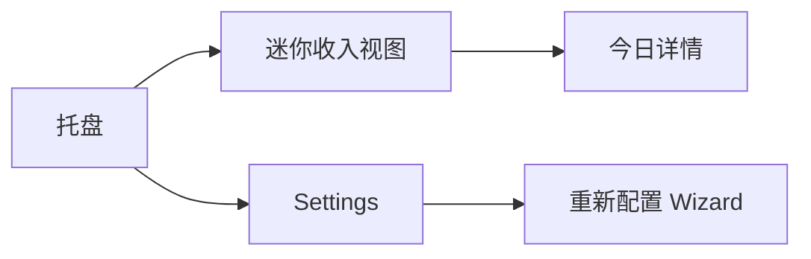
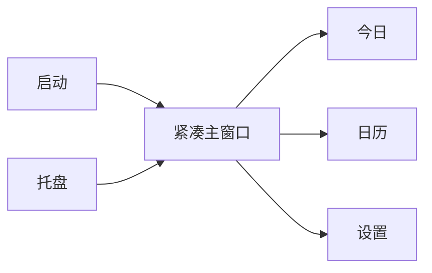
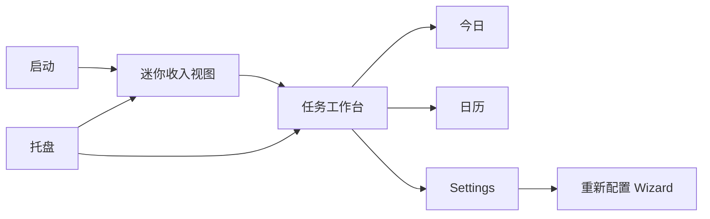
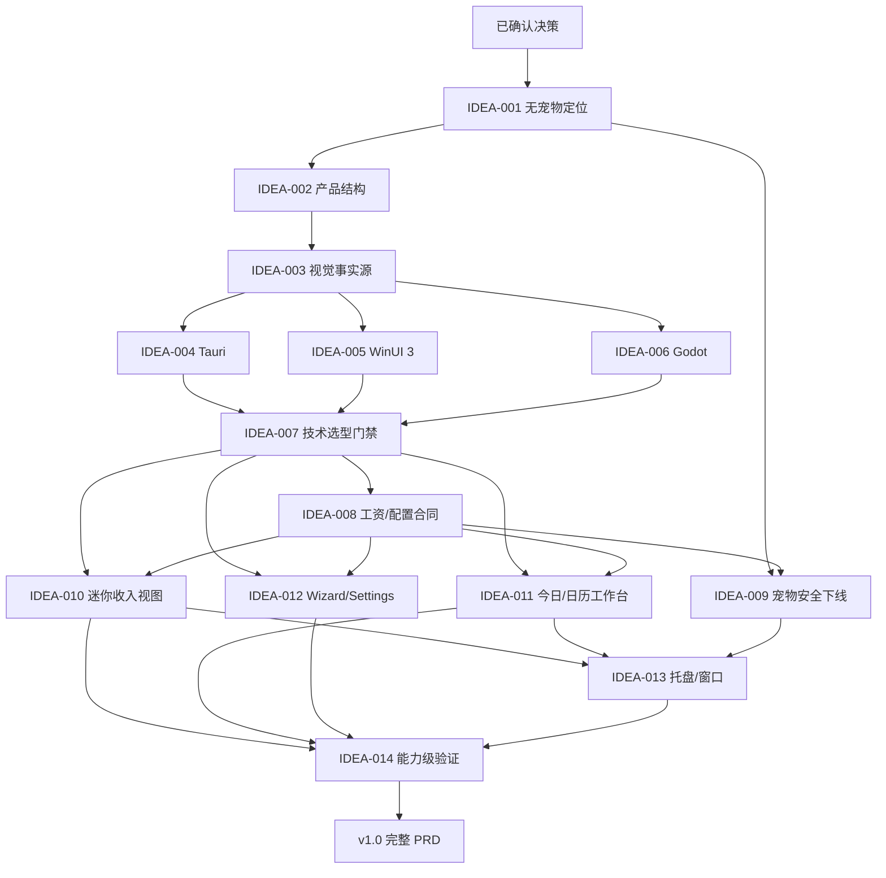

# LetsMakeMoney Windows v1.0 `/idea` 需求池

## 追踪信息

- 当前状态：推荐方案、技术路线、完整 PRD 与高保真原型均已确认，已进入开发承接
- 目标版本：Windows v1.0 Stable
- 上游来源：`doc/releases/v1.0/review.md` 中 `V10-REV-001` 至 `V10-REV-013`
- 下游承接：`doc/releases/v1.0/prd.md` 与 `doc/releases/v1.0/traceability.md`
- 当前事实源：`doc/current.md`、`doc/releases/v1.0/review.md`
- Review 基线：`aa7c0b93780d7511a6551624f2eea88595cee51f`
- 当前发布基线：`v0.9-beta` / `94f46229cd72a6648fa6d027130efd07354215e2`
- 最后更新：2026-07-23

## 1. Idea 阶段判断

### 1.1 真实判断

v1.0 值得做，但不能被定义成“去掉猫以后换一套更漂亮的皮肤”。

当前最真实的问题有三层：

1. **产品身份不再成立**：v0.9 以桌宠为主要入口；宠物完整下线后，Panel、今日详情、Settings、Wizard 和托盘必须重新形成一条自洽主路径。
2. **现有 UI 承载方式难以持续产出精致界面**：当前大屏幕主要由超大 GDScript 动态构建，颜色 token 已共享，但窗口结构、组件状态、密度和布局所有权仍分散。
3. **v1.0 是稳定版，不只是视觉版本**：配置迁移、托盘找回、DPI、发布身份、失败回滚和便携 Zip 必须同时达到稳定版门禁。

因此本轮建议将 v1.0 定义为：

> **无宠物、精致、轻量、可信的 Windows 收入与工作进度伴侣。**

### 1.2 版本主线

v1.0 的主线是：

> **重建无宠物后的产品表面，以同一条黄金路径完成技术选型，再交付首个可长期维护的稳定版。**

它包含四条必须闭环的子线：

- 产品：重新定义迷你收入视图、今日/日历工作台、Settings/Wizard 与托盘的关系。
- 设计：建立唯一高保真事实源和生产级组件/状态合同。
- 技术：用同题可运行 Spike 决定 Tauri、WinUI 3 或 Godot，而不是凭偏好直接重写。
- 稳定：安全移除宠物，并闭合配置、窗口、验证和便携发布门禁。

### 1.3 为什么不是其他方向

本版不应并行加入：

- 宠物回归、更多宠物、宠物市场或动画继续扩展；
- 主题系统；
- 云同步、账号和跨端同步；
- 多平台实现；
- 签名安装器和完整自动更新重做；
- 插件系统；
- 为“代码现代化”而全量重写 native。

这些方向会稀释 v1.0 最核心的成功判据：用户第一次看到和持续使用时，能明确感受到它已经从 Beta 工具变成精致、可信的稳定产品。

### 1.4 当前阶段

- 当前属于：**打磨期 + 稳定版方案收敛期**。
- 技术 Spike：**路线决策已完成**。项目所有者确认 Rust + Tauri + TypeScript/React，真系统 DPI 与真实通知区左键保留为条件门禁。
- 完整 PRD：**具备进入条件**。
- 开发授权：**未获得**。本文件不构成开始业务迁移或重写的授权。

## 2. 已确认决策与开放假设

### 2.1 已确认

| 决策 | 当前口径 |
|---|---|
| 版本性质 | v1.0 是首个非 Beta 稳定版 |
| 宠物范围 | 完整下线，不保留用户可见入口 |
| 分发方式 | 不要求签名安装器；允许继续发布便携 Zip |
| 视觉优先级 | 视觉表现是技术选型和产品重塑的最高优先级 |
| 技术边界 | 可以更换语言和框架 |
| 结构边界 | 不直接沿用 v0.9 的界面结构 |
| 历史恢复 | v0.9 tag、Release 和 Git 历史保留为宠物版本恢复基线 |

### 2.2 已由项目所有者确认

1. 产品结构采用 C：“迷你收入视图 + 今日/日历工作台”。
2. v1.0 用户可见产品完整下线宠物；v0.9 tag、Release 与历史作为恢复基线。
3. 技术 Spike 使用本文硬门禁与 100 分评分卡。
4. 日历只服务工作日、调休、节假日、手动调整与收入查看。

### 2.3 已确认技术路线

- 推荐：Rust + Tauri + TypeScript/React。
- 回退：Godot 4.7 只在 Tauri 条件门禁失败时重新评估。
- 不进入 v1.0：WinUI 3。样板已真实启动并完成界面对照，但产品方向与“视觉表现最高优先级”目标不符。
- 条件门禁：真实 Windows 125%/150% DPI、真实通知区左键隐藏/找回。

## 3. 无宠物后的产品定位

### 3.1 目标用户

主要用户：

- 使用 Windows 办公、按月领取固定或近似固定收入的职场用户；
- 希望随时看到“今天赚了多少、还有多久下班、这个月进度如何”，但不想维护复杂工时或财务系统；
- 重视桌面工具的轻量、清晰和质感，不接受粗糙表单或后台管理式界面。

不作为首要用户：

- 需要专业排班、打卡、项目计费或发票管理的团队；
- 需要跨组织薪资、税务和财务核算的用户；
- 需要账号、云同步或多人协作的用户。

### 3.2 核心使用场景

1. 开机或手动启动后，快速看到今日已赚、工作状态和进度。
2. 点击迷你收入视图，打开今日工作台查看安排、午休、下班时间和本月摘要。
3. 在日历中确认工作日、休息日、节假日和手动调整对收入的影响。
4. 首次使用或工资/作息变化时，通过 Wizard 或 Settings 完成配置。
5. 临时隐藏窗口后，通过托盘可靠找回。
6. 配置损坏、保存失败或原生能力不可用时，得到可读反馈和恢复路径。

### 3.3 产品承诺

- **一眼可读**：核心数字、状态和剩余时间不需要打开复杂页面。
- **计算可信**：Wizard、Settings、今日和日历使用唯一工资与工作日口径。
- **低打扰**：迷你视图可隐藏，托盘可找回，不强迫常驻大窗口。
- **视觉精致**：字体、图标、间距、状态、窗口质感和动效形成统一产品语言。
- **本地优先**：配置、日志和诊断保留在本机；不引入账号和云端依赖。

## 4. 产品结构候选

### 4.1 候选 A：托盘优先的迷你工具



特点：

- 默认只出现迷你收入视图；今日、日历和 Settings 均为独立窗口。
- 最接近 v0.9 的 Panel 使用习惯，迁移成本较低。

优点：

- 轻量，桌面占用小；
- 托盘与迷你视图关系直观；
- 能复用部分现有窗口行为合同。

风险：

- 独立窗口继续增加时，入口和窗口关系容易再次分散；
- 今日与日历难以形成稳定主产品；
- 容易退化为“更漂亮的 v0.9 Panel”。

### 4.2 候选 B：单一紧凑主窗口



特点：

- 今日、日历、设置均在单一应用壳中完成；
- 取消独立迷你视图或仅保留托盘状态。

优点：

- 信息架构最简单；
- 窗口生命周期和 DPI 验收范围较小；
- 对 WinUI 3 等原生应用模型友好。

风险：

- 弱化“随时看一眼收入”的核心差异；
- 用户必须打开完整窗口才能获得主要价值；
- 更像普通效率应用，轻量桌面工具气质不足。

### 4.3 候选 C：迷你视图 + 任务工作台



特点：

- 迷你收入视图负责“看一眼”和轻量常驻；
- 今日与日历位于同一个紧凑工作台；
- Settings 使用独立事务窗口或工作台内受控页面；
- Wizard 仅用于首次配置和明确的重新配置任务；
- 托盘负责显示/隐藏、打开工作台、设置和退出。

优点：

- 同时保留轻量桌面价值和完整产品结构；
- 避免 Today、Calendar 继续以互不相干窗口增长；
- 适合建立清晰的设计系统和响应式窗口合同；
- 三条技术路线都能用同一黄金路径公平验证。

风险：

- 需要重新定义迷你视图与工作台的数据刷新、激活和关闭语义；
- 比候选 A 有更大的结构迁移；
- 必须防止工作台变成卡片堆叠的管理后台。

### 4.4 推荐

**推荐候选 C。**

它是当前最小但完整的产品重塑：保留 LMM 的“桌面上一眼看到收入”差异，同时让今日、日历和配置进入清晰的任务结构。候选 A 不足以支撑大型体验重塑，候选 B 则会损失最有辨识度的日常入口。

## 5. 信息架构候选

### 5.1 迷你收入视图

只承载高频、瞬时信息：

- 今日已赚；
- 当前状态；
- 工作进度；
- 距离午休、复工或下班的关键剩余时间；
- 打开今日工作台的主入口。

不承载：

- 月度明细；
- 设置表单；
- 多段说明；
- 日历；
- 调试和诊断；
- 宠物模式或纯桌宠入口。

### 5.2 今日/日历工作台

工作台只保留两个一级任务：

- **今日**：收入、进度、今日安排、月度摘要；
- **日历**：工作日、休息日、节假日、调休和手动调整。

日历不扩展为通用日程、待办或考勤系统。

### 5.3 Settings

建议从 v0.9 五页签重组为四个任务组：

1. 收入与工作日；
2. 作息与午休；
3. 迷你视图与显示；
4. 系统、数据与诊断。

删除：

- 桌宠页签；
- 宠物选择；
- 宠物状态动作；
- 纯桌宠模式；
- 宠物回滚；
- 与宠物缩放、透明命中区相关的用户设置。

### 5.4 Wizard

建议收敛为三个任务步骤：

1. 收入与休息模式；
2. 上班、午休和下班推算；
3. 确认并完成。

Wizard 与 Settings 必须使用同一配置草稿、校验器、计算入口和保存事务。Wizard 只负责渐进式提问，不再维护第二套业务算法。

### 5.5 托盘

候选菜单：

- 显示/隐藏迷你收入视图；
- 打开今日工作台；
- 打开 Settings；
- 重新配置；
- 打开数据目录；
- 退出。

取消：

- 桌宠右键菜单；
- 宠物模式切换；
- 纯桌宠模式；
- 宠物相关二级菜单。

## 6. 证据映射

| 来源证据 | 对应候选需求 | 证据等级 | 说明 |
|---|---|---|---|
| `V10-REV-003` UI 屏幕级动态构建与重复组件 | IDEA-003、010、011、012 | 强 | 代码体量、重复 helper 和原型落地差距均已确认 |
| `V10-REV-004` 窗口/native 多中心状态 | IDEA-013 | 强 | Main、DragResizeSystem、WindowsPlatform 与 native 均持有策略 |
| `V10-REV-005` 稳定版真实桌面证据缺口 | IDEA-014 | 强 | 通知区、DPI、长期运行仍需稳定版重新闭合 |
| `V10-REV-008` 验证器递归和职责重叠 | IDEA-014 | 强 | 当前脚本数量、active/compat 分层和递归链已统计 |
| `V10-REV-010` 跨夜班 schema 不兼容 | IDEA-008 | 强 | Windows 与共享 schema 的约束冲突已确认 |
| 项目所有者确认宠物完整下线 | IDEA-001、009 | 强 | 直接改变产品入口、运行时、配置和发布包 |
| 项目所有者对 v0.9 UI 多轮实际反馈 | IDEA-002、003、010、011、012 | 强 | “粗糙、廉价、原型与落地差距大”在多轮真实界面验收中重复出现 |
| v0.9 仍无外部下载/规模化用户数据 | 全部候选 | 中 | 不能用市场需求证明大改，只能以项目所有者自用证据和工程证据判断 |
| v0.9 tag/Release 可恢复 | IDEA-009 | 强 | 宠物版本可以通过明确历史身份恢复 |
| 微信文章与本地设计 Skill 方法 | IDEA-003 | 中 | 能证明更可靠的设计生产方法，不能单独证明用户价值 |

## 7. 候选需求总览

评分维度依次为：痛点、场景、证据、频率、目标贡献、替代方案、成本可控、验证速度。总分 40。

| ID | 标题 | 类型 | 证据等级 | 压力测试 | 置信度 | 分档结论 | 依赖 | 建议去向 |
|---|---|---|---|---:|---|---|---|---|
| V10-IDEA-001 | 无宠物产品定位与表面边界 | 产品结构 | 强 | 38/40 | 高 | 高价值 | 无 | 进入 PRD |
| V10-IDEA-002 | 迷你视图 + 任务工作台 | 信息架构 | 强 | 35/40 | 中高 | 高价值 | 001 | 原型确认后进入 PRD |
| V10-IDEA-003 | 唯一视觉事实源与生产流程 | 设计治理 | 强 | 37/40 | 高 | 高价值 | 002 | 进入技术 Spike |
| V10-IDEA-004 | Tauri + React P0 样板 | 技术 Spike | 中 | 30/40 | 中 | 部分通过 | 002、003 | 技术 Spike |
| V10-IDEA-005 | WinUI 3 P1 原生样板 | 技术 Spike | 强 | 28/40 | 高 | 已完成并淘汰 | 002、003 | 暂不处理 |
| V10-IDEA-006 | Godot 4.7 P2 基线样板 | 技术 Spike | 强 | 31/40 | 高 | 部分通过 | 002、003 | 技术 Spike |
| V10-IDEA-007 | 技术选型与迁移门禁 | 工程决策 | 强 | 34/40 | 高 | 高价值 | 004、005、006 | Spike 后进入 PRD |
| V10-IDEA-008 | 框架无关工资/配置合同 | 工程架构 | 强 | 34/40 | 中高 | 高价值 | 007 | 进入 PRD |
| V10-IDEA-009 | 宠物功能安全下线 | 产品/工程迁移 | 强 | 37/40 | 高 | 高价值 | 001、008 | 进入 PRD |
| V10-IDEA-010 | 迷你收入视图生产实现 | 用户功能/UI | 强 | 35/40 | 中高 | 高价值 | 003、007、008 | 进入 PRD |
| V10-IDEA-011 | 今日与日历工作台重塑 | 用户功能/UI | 强 | 34/40 | 中高 | 高价值 | 002、003、007、008 | 进入 PRD |
| V10-IDEA-012 | Wizard/Settings 共模重塑 | 用户功能/UI | 强 | 36/40 | 高 | 高价值 | 003、007、008 | 进入 PRD |
| V10-IDEA-013 | 托盘与窗口生命周期收敛 | Windows 工程 | 强 | 34/40 | 高 | 高价值 | 007、009、010、011 | 进入 PRD |
| V10-IDEA-014 | 能力级验证与稳定版门禁 | 质量/发布 | 强 | 35/40 | 高 | 高价值 | 007-013 | 进入 PRD |

## 8. 压力测试矩阵

| ID | 痛点 | 场景 | 证据 | 频率 | 目标 | 替代 | 成本 | 验证 | 总分 | 闸门说明 |
|---|---:|---:|---:|---:|---:|---:|---:|---:|---:|---|
| 001 | 5 | 5 | 5 | 5 | 5 | 4 | 4 | 5 | 38 | 已确认宠物下线，必须重建产品身份 |
| 002 | 5 | 5 | 4 | 5 | 5 | 4 | 3 | 4 | 35 | 需通过高保真原型确认候选 C |
| 003 | 5 | 5 | 5 | 5 | 5 | 4 | 4 | 4 | 37 | 直接针对多轮原型/运行时失真 |
| 004 | 4 | 4 | 3 | 4 | 5 | 4 | 2 | 4 | 30 | 成本低于 3，最高只能进入 Spike |
| 005 | 4 | 4 | 3 | 4 | 4 | 3 | 2 | 4 | 28 | 成本低于 3，最高只能进入 Spike |
| 006 | 4 | 4 | 5 | 4 | 4 | 3 | 3 | 4 | 31 | 作为已知基线，不代表推荐保留 |
| 007 | 5 | 5 | 5 | 4 | 5 | 4 | 3 | 3 | 34 | 必须在可运行样板后决策 |
| 008 | 5 | 4 | 5 | 5 | 5 | 3 | 3 | 4 | 34 | 迁移前必须先定义兼容合同 |
| 009 | 5 | 5 | 5 | 4 | 5 | 4 | 4 | 5 | 37 | tag/Release 提供清晰回滚基线 |
| 010 | 5 | 5 | 5 | 5 | 5 | 3 | 3 | 4 | 35 | 高频主入口，必须真实桌面验证 |
| 011 | 4 | 5 | 5 | 4 | 5 | 3 | 4 | 4 | 34 | 不得扩为通用日历产品 |
| 012 | 5 | 5 | 5 | 4 | 5 | 4 | 4 | 4 | 36 | 配置是信任路径，且已有重复模型证据 |
| 013 | 5 | 5 | 5 | 5 | 5 | 3 | 3 | 3 | 34 | Windows 系统行为需 Computer Use/人工补证 |
| 014 | 5 | 4 | 5 | 4 | 5 | 4 | 4 | 4 | 35 | 稳定版不能沿用 Beta 的证据缺口 |

## 9. 候选需求详情

### V10-IDEA-001 无宠物产品定位与表面边界

- 问题：v0.9 的产品入口和大量窗口行为围绕桌宠建立；直接隐藏宠物会留下失去中心的 Panel、菜单和设置。
- 目标用户/场景：需要随时查看收入和工作进度、但不想使用复杂工时系统的 Windows 用户。
- 当前替代：保留 v0.9 结构并隐藏宠物入口；只能解决“看不到宠物”，不能形成完整产品。
- 证据：项目所有者明确下线宠物；Review 已确认现有产品关系以宠物为中心。
- 价值：为所有后续 UI、技术和发布决策提供唯一产品边界。
- 影响范围：产品定位、README、启动流程、主入口、窗口关系、设置分类、托盘命令、日志事件和验收矩阵；无数据库影响。
- 依赖：无。
- 风险：把“暂时下线”误解为永久否定；历史恢复入口不清楚。
- 成本：中。
- 测试缺口：尚无无宠物产品原型与真实用户任务走查。
- 结论：进入 PRD。
- 最小下一步：确认候选 C，并画出无宠物完整信息架构。

### V10-IDEA-002 迷你视图 + 任务工作台

- 问题：v0.9 的 Panel、Today、Settings 和托盘是多个并列入口；宠物移除后更容易显得零散。
- 方案：迷你收入视图负责轻量常驻，今日/日历共用任务工作台，Settings 与 Wizard 保持明确任务边界。
- 证据：多轮 UI 反馈确认 Panel 与独立窗口缺少统一层级；候选 C 同时保留轻量性和完整信息架构。
- 价值：保留 LMM 的一眼价值，同时让完整任务有稳定归属。
- 影响范围：主窗口、今日、日历、Settings、Wizard、托盘、窗口激活和导航状态；无数据库影响。
- 依赖：IDEA-001。
- 风险：双层表面可能重新制造窗口状态复杂度。
- 成本：大。
- 测试缺口：需要用高保真可交互原型验证打开、关闭、找回和长内容。
- 结论：原型确认后进入 PRD。
- 最小下一步：制作候选 C 的黄金路径原型，不先实现全部页面。

### V10-IDEA-003 唯一视觉事实源与生产流程

- 问题：v0.9 多轮出现“原型好看，Godot 落地廉价”，本质是设计事实源和组件合同不唯一。
- 方案：按 `oiloil-ui-ux-guide → draw-ui → frontend-design → impeccable → emil-design-eng → Playwright/Computer Use` 串行生产。
- 证据：Review 的代码结构审计、多轮真实截图反馈、已有 Figma/HTML 原型和本地 Skill 能力。
- 价值：把“精致”转成可执行的字体、图标、间距、状态、动效、DPI 和差异门禁。
- 影响范围：Figma/HTML 原型、设计 token、组件展示页、技术 Spike、视觉回归和验收证据；不直接影响配置与数据。
- 依赖：IDEA-002。
- 风险：多个 Skill 各自产生风格；原型与实现再次分叉。
- 成本：中。
- 测试缺口：需确定唯一受管设计文件、参考组件来源和差异阈值。
- 结论：进入技术 Spike。
- 最小下一步：先冻结黄金路径结构，再创建唯一组件状态矩阵。

### V10-IDEA-004 Tauri + React P0 样板

- 问题：现有 UI 构建方式难以稳定达到目标质感，需要验证 Web 组件生态能否在轻量 Windows 桌面工具中承担生产界面。
- 证据：前端技术更接近现有高保真生产方法；但 Tauri 的 Windows 窗口、托盘、WebView 和双栈维护尚未在本项目证明。
- 价值：若通过，可显著提高组件复用、视觉还原、动效和自动视觉测试效率。
- 影响范围：新建隔离 Spike，不修改当前业务代码；涉及 Rust、TypeScript/React、WebView2、托盘、窗口、配置适配和便携构建。
- 依赖：IDEA-002、003。
- 风险：WebView 字体/窗口质感、Rust/前端双栈、托盘插件兼容和包体。
- 成本：大，成本闸门触发。
- 测试缺口：尚无 LMM 黄金路径可运行样板。
- 结论：只进入技术 Spike，不得直接开始完整迁移。
- 最小下一步：按第 11 节合同实现同题样板。

### V10-IDEA-005 WinUI 3 P1 原生样板

- 问题：需要一条 Windows 原生路线对照 Tauri 的字体、DPI、可访问性和窗口行为。
- 证据：自包含样板已构建并真实启动；实机展示了迷你收入视图与工作台。原生组件与系统集成优势明确，但默认视觉偏传统，自定义品牌视觉的投入、开发摩擦和约 107 MB 多文件产物不符合本版目标。
- 价值：防止只因 Web 开发速度快就忽视真实 Windows 质感。
- 影响范围：隔离 Spike；涉及 C#、WinUI 3、Windows App SDK、托盘/窗口适配、本地配置和发布。
- 依赖：IDEA-002、003。
- 风险：部署链复杂，自定义窗口 chrome 和紧凑组件成本可能偏高。
- 成本：大，成本闸门触发。
- 测试缺口：未继续投入完整托盘、配置事务和发布验证；路线淘汰后不再补齐。
- 结论：技术 Spike 已完成，项目所有者决定不采用 WinUI 3。
- 最小下一步：无；保留样板与结论作为技术决策证据。

### V10-IDEA-006 Godot 4.7 P2 基线样板

- 问题：若没有同题 Godot 基线，就无法判断换技术栈的真实收益。
- 证据：现有工资、配置、窗口、托盘和发布链均在 Godot 中可运行；UI 质感和可维护性问题也已被代码与截图确认。
- 价值：提供迁移收益下限，避免新框架因“新鲜”获得不公平优势。
- 影响范围：隔离样板或当前代码的最小黄金路径分支；不得借 Spike 顺带重构全部项目。
- 依赖：IDEA-002、003。
- 风险：团队熟悉度和既有代码可能让评分偏向 Godot；历史样式债可能反向压低结果。
- 成本：中。
- 测试缺口：需用与其他路线相同的结构、素材和时间预算重做样板。
- 结论：进入技术 Spike。
- 最小下一步：从正式业务口径构建最小样板，不直接截取 v0.9 旧页面。

### V10-IDEA-007 技术选型与迁移门禁

- 问题：当前允许换栈，但尚无证据证明哪条路线能同时满足视觉和 Windows 行为。
- 方案：三路样板通过硬门禁后按统一 100 分评分卡选择唯一技术栈。
- 证据：Review 已明确 UI 与窗口技术风险；项目所有者确认视觉权重最高。
- 价值：避免凭个人偏好进行不可逆大迁移。
- 影响范围：技术决策记录、Spike 产物、迁移路线、回退条件和 PRD 前置门禁。
- 依赖：IDEA-004、005、006。
- 风险：为了让预设路线获胜而调整评分；样板范围不一致。
- 成本：中。
- 测试缺口：评分卡尚未由项目所有者签核。
- 结论：Spike 后进入 PRD。
- 最小下一步：确认第 11 节评分和淘汰规则。

### V10-IDEA-008 框架无关工资/配置合同

- 问题：工资、作息、节假日、跨夜班次和配置事务当前绑定 Godot 实现；直接迁移 UI 会复制或漂移业务口径。
- 方案：先定义框架无关的配置 schema、计算输入/输出、金额取整、错误和迁移 fixture。
- 证据：`V10-REV-001` 和 `V10-REV-010` 已证明入口和跨端 schema 漂移。
- 价值：让三条技术路线和未来实现使用同一业务真相。
- 影响范围：`salary_engine.gd`、`work_schedule_resolver.gd`、`holiday_calendar.gd`、`config.gd`、事务控制器、schema、fixture 和兼容测试；无数据库影响。
- 依赖：IDEA-007 决定落地语言，但合同可先定义。
- 风险：过度抽象成跨平台 SDK；为了迁移重写已经成熟的计算逻辑。
- 成本：大。
- 测试缺口：需要从现有验证提取一组稳定黄金 fixture，覆盖单休、双休、大小周、午休、节假日、调休、手动调整和跨夜班次。
- 结论：进入 PRD，范围只到 Windows v1.0 必需合同。
- 最小下一步：先输出数据合同和兼容 fixture，不先选 RPC 或复杂模块系统。

### V10-IDEA-009 宠物功能安全下线

- 问题：只隐藏入口仍会让宠物 autoload、资源、配置、点击穿透和构建产物继续增加风险；直接删除又可能破坏旧配置和回滚。
- 推荐方案：
  1. v1.0 活跃源码、autoload、UI、native 策略和发布包不再包含宠物；
  2. 首次迁移时把 v0.9 配置保存为明确的兼容备份；
  3. v1.0 活跃配置移除宠物字段，对未知旧字段容错；
  4. v0.9 tag、Release、Zip 和迁移备份作为恢复路径；
  5. 包体验证必须证明无宠物代码、素材和入口误入。
- 证据：项目所有者明确要求完整下线；v0.9 tag/Release 已存在。
- 价值：真正降低 v1.0 复杂度，而不是把宠物变成隐藏死代码。
- 影响范围：`project.godot` autoload、Pet 场景与资源、Panel 邻接、纯桌宠模式、点击穿透、宠物设置、菜单、配置 schema、日志、验证、打包和许可清单；无数据库影响。
- 依赖：IDEA-001、008。
- 风险：旧配置迁移失败；用户回退 v0.9 时宠物选择丢失；误删仍服务非宠物窗口的 native 能力。
- 成本：大。
- 测试缺口：需要 pet-to-no-pet 配置迁移、回退和发布包排除测试。
- 结论：进入 PRD。
- 最小下一步：确认“活跃源码彻底删除 + v0.9 历史恢复”的口径。

### V10-IDEA-010 迷你收入视图生产实现

- 问题：现有 Panel 与宠物邻接、尺寸和内容密度绑定，不能直接作为无宠物 v1.0 主入口。
- 方案：重建独立迷你收入视图，只显示金额、状态、进度和关键倒计时。
- 证据：Panel 多轮真实界面反馈；一眼查看是 LMM 的核心高频价值。
- 价值：提供独特且低打扰的每日入口。
- 影响范围：窗口、UI、工资快照刷新、托盘、显示配置、DPI、开机启动和日志；无数据库影响。
- 依赖：IDEA-003、007、008。
- 风险：内容过多再次变成拥挤 Panel；窗口过小导致长金额和 DPI 崩坏。
- 成本：大。
- 测试缺口：需要长金额、非工作日、午休、下班后、125%/150% DPI 和多显示器回落。
- 结论：进入 PRD。
- 最小下一步：在高保真原型中冻结默认、午休、非工作日和错误四种状态。

### V10-IDEA-011 今日与日历工作台重塑

- 问题：今日详情和日历承载相关信息，却没有统一任务壳和导航。
- 方案：建立紧凑工作台，一级只保留今日与日历。
- 证据：iOS 对照和 v0.9 原型均证明 Today/Calendar 的信息关系；Windows 需要独立桌面表达而非照抄移动端。
- 价值：让用户从“快速看一眼”自然进入“理解今天和本月”。
- 影响范围：Today、日历、日期选择、手动调整、窗口导航、状态刷新和空/错误状态；无数据库影响。
- 依赖：IDEA-002、003、007、008。
- 风险：扩大为通用日历；月度信息与今日信息重复。
- 成本：大。
- 测试缺口：需要长月份、跨年、节假日数据缺失、手动调整和窄窗口。
- 结论：进入 PRD。
- 最小下一步：确认日历只服务收入和工作日，不加入通用事件。

### V10-IDEA-012 Wizard/Settings 共模重塑

- 问题：v0.9 已共享部分控件和事务，但两个屏幕仍有独立布局与业务辅助逻辑。
- 方案：一个配置草稿、一个校验器、一个工资预览入口、一个保存事务；Wizard 只负责渐进提问，Settings 负责维护。
- 证据：`V10-REV-001` 已确认 Wizard 预览口径漂移，Settings/Wizard 重复 helper 已确认。
- 价值：提高首次配置可信度并降低长期维护成本。
- 影响范围：Wizard、Settings、配置草稿、事务控制器、自动推算、反馈、恢复默认、失败回滚、日志和测试；无数据库影响。
- 依赖：IDEA-003、007、008。
- 风险：UI 重塑时改变既有配置语义；失败路径只做视觉不做事务。
- 成本：大。
- 测试缺口：需覆盖保存成功、无变化、失败、回滚部分失败、取消、关闭和旧配置迁移。
- 结论：进入 PRD。
- 最小下一步：先直接修复 `V10-REV-001/006`，再把修复后的行为作为迁移基线。

### V10-IDEA-013 托盘与窗口生命周期收敛

- 问题：当前窗口策略有多个所有者；新技术栈若照搬现状，会复制恢复、任务栏和激活问题。
- 方案：定义唯一期望状态，平台层只执行命令并回报实际状态；托盘命令映射到产品动作，不直接操作多个缓存。
- 证据：`V10-REV-004` 和多轮托盘 bugfix 已确认。
- 价值：保证轻量工具隐藏后可找回，窗口不会重复、丢失或任务栏错乱。
- 影响范围：主进程、窗口管理、托盘、开机启动、native bridge、日志和真实 Windows 验收；宠物专属穿透与纯桌宠策略移除。
- 依赖：IDEA-007、009、010、011。
- 风险：重写 native；不同框架的窗口模型差异大。
- 成本：大。
- 测试缺口：真实通知区鼠标、DPI、多显示器、异常退出和 Explorer 重启。
- 结论：进入 PRD，但先做框架样板。
- 最小下一步：技术 Spike 只实现显示/隐藏、恢复和退出四个状态。

### V10-IDEA-014 能力级验证与稳定版门禁

- 问题：当前按历史版本递归验证，脚本多、重复断言多，且稳定版仍有真实桌面证据缺口。
- 方案：按 domain、UI、platform、release、legacy compatibility 分层；v1.0 只保留仍承诺的兼容合同。
- 证据：`V10-REV-005/008/012`。
- 价值：让稳定版结论可解释、可复现，也降低换栈后的测试迁移成本。
- 影响范围：验证脚本、CI、打包、文档、Acceptance、SHA256 和干净 checkout；无数据库影响。
- 依赖：IDEA-007 至 013。
- 风险：清理历史测试时误删真实回归保护；新栈只验证 UI 不验证 Windows 行为。
- 成本：大。
- 测试缺口：需先建立现有能力到新门禁的追踪矩阵。
- 结论：进入 PRD。
- 最小下一步：先定义能力清单，再决定哪些历史测试保留、迁移或删除。

## 10. 直接修复项

以下不是 v1.0 新需求，不占用产品需求编号；它们是已确认缺陷或事实不一致，应在技术 Spike 前或并行关闭：

| ID | 来源 | 事项 | 建议动作 |
|---|---|---|---|
| V10-FIX-001 | V10-REV-001 | Wizard 工作日预览仍使用旧计算器 | 改用正式 `WorkScheduleResolver` 并补节假日/调休/手动调整回归 |
| V10-FIX-002 | V10-REV-002 | release dry-run 仍打包 v0.8 | 建立唯一版本源并修正 workflow/合同测试 |
| V10-FIX-003 | V10-REV-006 | 配置回滚部分失败仍提示“已恢复” | 按两个回滚结果展示真实反馈并增加失败注入 |
| V10-DOC-001 | V10-REV-009 | 当前事实仍夹带发布前口径 | 更新 `doc/current.md`，不重写历史验收 |
| V10-OPS-001 | V10-REV-013 | GitHub 列表仍有历史 Apple SDK workflow 噪音 | 核对远端残留后单独清理，不在本轮执行 |

## 11. 技术 Spike 合同

### 11.1 目标

技术 Spike 只回答一个问题：

> 哪条技术路线能以可接受的 Windows 行为、性能和维护成本，稳定实现已经确认的 v1.0 视觉与交互标准？

它不负责完整迁移，不负责证明所有业务功能已经完成。

### 11.2 三条路线

| 优先级 | 路线 | 角色 |
|---|---|---|
| P0 | Rust + Tauri + TypeScript/React | 首选候选，验证高保真还原、组件系统和动效效率 |
| P1 | C# + WinUI 3 | Windows 原生对照，验证字体、DPI、可访问性和窗口质感 |
| P2 | Godot 4.7 | 现状基线，验证在新结构和组件合同下继续使用 Godot 的上限 |

### 11.3 固定黄金路径

三条路线必须使用相同数据、文案、组件状态和操作：

```text
启动
  → 迷你收入视图
  → 今日工作台
  → Settings 代表页
  → 保存成功 / 无变化 / 失败
  → 托盘隐藏 / 找回
```

固定状态：

- 工作中、午休、非工作日；
- 正常、hover、focus、pressed、disabled、loading、success、error；
- 长金额、长中文、英文、错误信息；
- 100%、125%、150% DPI。

### 11.4 固定输入与业务口径

- 使用同一组静态工资与作息 fixture；
- 使用同一份今日快照 JSON；
- 保存只写入隔离测试目录；
- 不读取或覆盖真实 `%APPDATA%\LetsMakeMoney`；
- 不实现宠物；
- 不连接真实更新源；
- 不把截图作为 UI 图层。

### 11.5 必交产物

每条路线必须交付：

1. 可独立运行的样板源码；
2. 可启动的 Windows 构建；
3. 构建与启动说明；
4. 100%、125%、150% DPI 截图；
5. 黄金路径录屏；
6. 托盘显示/隐藏日志；
7. 冷启动、空闲内存、包体和交互帧率测量；
8. 组件状态矩阵；
9. 已知限制、阻塞和完整迁移风险；
10. 可清理的隔离目录，不污染主实现。

### 11.6 硬门禁

任一路线出现以下情况即淘汰，不能用其他高分补偿：

- 无法稳定实现便携 Windows 构建；
- 字体或 DPI 在 125%/150% 出现明显模糊、裁切或错位；
- 托盘隐藏后无法可靠找回；
- 保存失败无法保留输入并显示可读原因；
- 原型需要大量截图、Canvas 位图或一次性 hack 才能还原；
- 无法自动测试核心组件状态；
- 依赖未声明的本机绝对路径或私有缓存。

### 11.7 评分卡

| 指标 | 权重 | 证据 |
|---|---:|---|
| 高保真还原与组件一致性 | 30 | 原型/运行截图差异、组件状态覆盖 |
| 字体、图标、间距、边界和窗口质感 | 20 | 设计审计与真实 Windows 截图 |
| 动效、反馈和可中断性 | 10 | 录屏与交互测试 |
| DPI、可访问性和长内容稳定性 | 10 | 100%/125%/150% 和边界用例 |
| Windows 窗口、托盘和生命周期 | 10 | Computer Use、日志与人工补证 |
| 冷启动、内存、包体和流畅度 | 10 | 同机测量 |
| 构建、测试和发布可维护性 | 10 | 干净环境构建与代码审查 |

严格视觉核心占 60 分；加上 DPI/长内容质量后为 70 分。技术路线必须先通过硬门禁，再比较总分。

### 11.8 选型规则

1. 三条路线使用同一产品结构、设计事实源、fixture 和时间箱。
2. P0 只是试验顺序，不是预设胜者。
3. 总分差距小于 5 分时，优先比较 Windows 行为、维护复杂度和迁移风险，不机械按 1 分差异决定。
4. Tauri 若视觉领先但托盘/窗口硬门禁失败，不进入完整迁移。
5. WinUI 3 若原生表现领先但开发/分发成本不可控，只保留为对照。
6. Godot 若在相同设计合同下达到目标且迁移收益不足，可继续保留；不能因为“旧技术”直接淘汰。
7. 选型结论必须由项目所有者确认后才能进入完整 PRD。

### 11.9 停止条件

- 不在 Spike 中迁移完整工资引擎；
- 不迁移完整历史配置；
- 不移除主仓库宠物代码；
- 不实现所有 Settings 页面；
- 不创建正式 v1.0 包；
- 不以 Spike 结果冒充 Acceptance。

## 12. 宠物安全下线方案

### 12.1 推荐口径

采用“活跃树删除 + 历史版本恢复”：

- v1.0 主分支不保留宠物产品入口、运行时、素材和专属配置；
- v0.9 tag、Pre-release、Zip 和 Git 历史保留完整宠物版本；
- v1.0 第一次读取 v0.9 配置时生成一次兼容备份；
- v1.0 配置迁移后不再写入宠物字段；
- 用户需要恢复宠物时，按文档回到 v0.9，并恢复兼容备份；
- 未来宠物重新进入产品时，必须重新进入 `/idea` 和 `/prd`，不能从隐藏开关直接复活。

### 12.2 分层移除

| 层 | 移除内容 | 必须保留的非宠物能力 |
|---|---|---|
| 产品入口 | 桌宠、宠物选择、右键宠物菜单、纯桌宠模式 | 迷你收入视图、工作台、Settings、Wizard、托盘 |
| 运行时 | Pet autoload、状态机、输入仲裁、动态命中区、宠物业务事件 | 工资引擎、配置事务、日志、窗口基础能力 |
| 配置 | 宠物 ID、动作、缩放、纯桌宠和回退字段 | 收入、作息、显示、托盘、诊断 |
| native/window | 宠物透明窗口与专属穿透策略 | 普通窗口、托盘、任务栏、激活和找回 |
| 构建 | 宠物资源、manifest、动作 profile 和包校验 | LICENSE、第三方声明、版本身份、便携 Zip |
| 文档 | 当前功能说明和截图中的宠物入口 | v0.9 历史文档、tag 和恢复说明 |

### 12.3 门禁

- v1.0 Zip 中宠物运行时、素材、manifest 和用户入口数量为 0；
- 旧配置升级后应用可启动、保存和重启；
- v1.0 不覆盖唯一 v0.9 配置备份；
- 回退文档能定位 v0.9 Release 和兼容备份；
- 删除宠物代码前，托盘、窗口、配置、日志和工资测试先与宠物测试解耦；
- 不删除 v0.9 tag、Release 或历史许可证记录。

## 13. 跨模块依赖



可并行：

- 三条技术 Spike 可以在同一设计事实源冻结后并行；
- V10-FIX-001/002/003 可与 Spike 并行；
- 宠物资产与代码引用清单可在不删除文件的前提下先审计；
- 工资/配置 fixture 可在技术选型期间准备。

必须串行：

- 产品结构确认早于视觉事实源冻结；
- 视觉事实源冻结早于三路样板评分；
- 技术选型早于完整 UI 迁移；
- 配置合同早于宠物字段迁移；
- 宠物安全下线与窗口迁移完成后才能执行稳定版 Acceptance。

## 14. 三种 v1.0 组合

### 14.1 最小方案

包含：

- 关闭 V10-FIX-001/002/003；
- 更新当前事实文档；
- 在 Godot 中隐藏宠物入口并从发布包移除素材；
- 保留现有 Panel/Today/Settings/Wizard 主结构；
- 补稳定版必要验收。

不包含：

- 三技术栈 Spike；
- 产品信息架构重建；
- 生产级组件系统；
- 完整移除宠物活跃代码。

优点：

- 最快；
- 改动和回归范围最小。

风险：

- 只满足“无宠物”和“稳定”，不满足“最好视觉表现”；
- 现有 UI 和窗口状态债继续保留；
- 不适合作为当前已确认目标下的真正 v1.0。

结论：**不推荐。** 可作为技术 Spike 失败时的保底路线。

### 14.2 推荐方案

包含：

- 直接修复项全部关闭；
- 采用候选 C：迷你收入视图 + 今日/日历工作台；
- 建立唯一视觉事实源和组件状态矩阵；
- 完成 Tauri、WinUI 3、Godot 同题 Spike；
- 根据硬门禁与 100 分评分选择唯一栈；
- 建立框架无关工资/配置合同；
- 重塑迷你视图、今日/日历、Wizard/Settings 和托盘；
- 从活跃源码、配置、构建和发布包安全移除宠物；
- 将验证重组为能力级门禁；
- 以便携 Zip 交付 Windows v1.0 Stable。

不包含：

- 宠物、主题、云同步、多平台、插件系统；
- 签名安装器硬门禁；
- 与 v1.0 主路径无关的 native 全量重写。

风险：

- 迁移和验证成本大；
- 若产品结构、设计和选型不按门禁串行，容易再次返工。

结论：**推荐。** 它与“从能用到精致、视觉表现最高优先”的目标一致，又通过 Spike 控制大迁移风险。

### 14.3 过大方案

在推荐方案上同时加入：

- 完整安装器与自动更新重做；
- 账号和云同步；
- 多平台；
- 主题系统；
- 插件系统；
- 宠物重新上线；
- Main/native 全量重写；
- 通用日历、待办或考勤能力。

风险：

- 产品身份重新发散；
- 依赖和验收矩阵成倍增长；
- 首个稳定版会被多个高风险系统共同阻塞；
- 个人项目维护成本失控。

结论：**暂不做。**

## 15. 最终分流

### 15.1 现在直接做

- V10-FIX-001：统一 Wizard 工作日预览。
- V10-FIX-002：修复 release dry-run 版本源。
- V10-FIX-003：修复回滚部分失败提示。
- V10-DOC-001：更新当前发布事实。
- 技术 Spike 所需的只读 fixture 和行为合同盘点。

这些动作仍需单独开发授权；本轮没有执行。

### 15.2 进入技术 Spike

- V10-IDEA-003 至 V10-IDEA-007。
- 只实现固定黄金路径，不启动完整迁移。
- Spike 结论需由项目所有者确认。

### 15.3 Spike 后进入 `/prd`

- V10-IDEA-001、002、008 至 014。
- PRD 必须使用选定技术栈的真实样板证据，不得同时为三套栈写完整实现方案。

### 15.4 继续验证

- 候选 C 的高保真信息架构；
- 迷你视图是否默认常驻、是否允许单独关闭；
- 真实 125%/150% DPI；
- 托盘真实鼠标与 Explorer 重启；
- v0.9 配置升级、兼容备份和回退；
- 日历是否保持收入/工作日专用边界。

### 15.5 暂不处理

- 宠物重新上线；
- 主题、市场、插件和下载系统；
- 多平台；
- 云同步和账号；
- 签名安装器；
- 完整自动更新重做；
- 通用日程、待办和考勤；
- 与选定技术栈无关的全面 native 重写。

## 16. 需要确认的关键决策

1. **产品结构**：是否确认采用候选 C“迷你收入视图 + 今日/日历工作台”？
2. **迷你视图默认行为**：是否默认随应用启动并常驻桌面，用户可从托盘单独关闭？
3. **宠物源码处置**：是否确认从 v1.0 活跃源码树彻底删除宠物代码与素材，只通过 v0.9 tag/Release 恢复？
4. **兼容备份**：是否接受首次升级时生成一次 `v0.9` 配置兼容备份，v1.0 活跃配置不再保留宠物字段？
5. **视觉事实源**：是在现有 LMM Figma 文件中新增独立 v1.0 受管区域，还是新建 v1.0 设计文件？
6. **选型规则**：是否确认三路样板先过硬门禁，再按本文 100 分评分卡决定唯一技术栈？
7. **日历边界**：是否确认只服务工作日、调休、节假日、手动调整和收入查看，不加入通用日程？

## 17. 是否具备进入下一阶段

### 17.1 技术 Spike

**有条件具备。**

开始前只需确认：

- 产品结构候选；
- 视觉事实源位置；
- 宠物源码移除口径；
- 评分卡与硬门禁。

确认后可以生成独立 Spike 承接文档和三个隔离样板，不需要先写完整 v1.0 PRD。

### 17.2 完整 `/prd`

**暂不具备。**

阻塞项：

- 产品结构尚未最终确认；
- 技术栈尚未由可运行证据选出；
- 配置兼容备份和宠物源码处置尚未确认；
- 高保真 v1.0 事实源尚未冻结。

技术 Spike 完成并确认唯一技术栈后，才进入完整 PRD。这样 PRD 能准确写出窗口、配置、托盘、构建、发布和验收影响，而不是同时维护三套互相冲突的实现假设。
