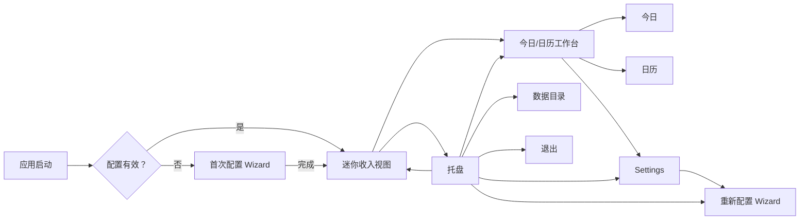
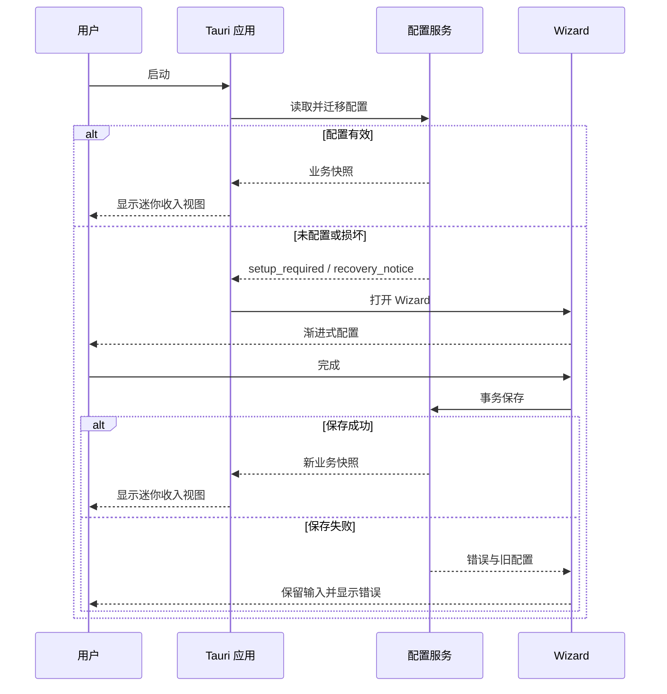
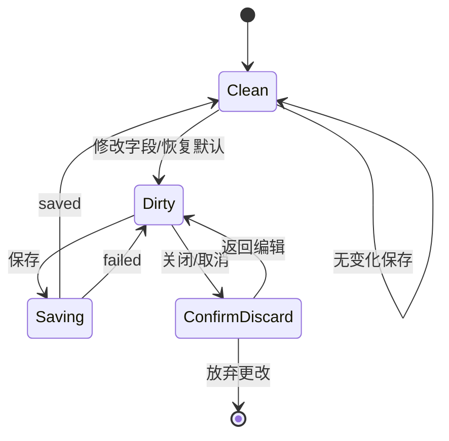

# LetsMakeMoney Windows v1.0 产品需求文档

## 追踪信息

- 当前状态：完整可开发，待项目所有者确认
- 目标版本：Windows v1.0 Stable
- PRD 类型：正式推进型
- 上游来源：`V10-IDEA-001` 至 `V10-IDEA-014`
- 上游文件：`doc/releases/v1.0/idea-pool.md`
- 技术决策：`doc/releases/v1.0/technical-spike-results.md`
- 需求表达物：`doc/prototypes/v1.0/index.html`
- 下游承接：确认后生成 `dev_plan_v1.0.md`、`progress_v1.0.md`
- 当前事实源：本文件、`doc/prototypes/v1.0/`、`doc/releases/v1.0/traceability.md`
- 最后更新：2026-07-24

## 1. 需求状态

- 需求来源：v0.9 发布后的深度 Review、用户真实视觉反馈、v1.0 Idea Pool 和三路线技术 Spike。
- 证据基础：v0.9 代码与发布事实、Tauri/WinUI/Godot 同题样板、真实 GUI 对照和项目所有者决策。
- 已确认技术路线：Rust + Tauri + TypeScript/React。
- 回退基线：v0.9 Godot tag、Release、便携 Zip 和 Git 历史。
- 当前假设：迷你收入视图随应用启动并常驻，可从托盘单独隐藏或找回。
- 待开发前补证：真实 Windows 125%/150% DPI、真实通知区左键、Explorer 重启后的托盘恢复。
- 是否达到完整 PRD 门禁：是。

## 2. 方案收敛

### 2.1 推荐方案

采用“迷你收入视图 + 今日/日历工作台”：

1. 迷你收入视图负责低打扰地展示今日收入、状态、工作进度和关键倒计时。
2. 今日与日历进入统一工作台，不再作为互不关联的独立产品表面。
3. Settings 负责长期维护，Wizard 只负责首次配置和显式重新配置。
4. 托盘负责隐藏、找回、进入主要任务和退出。
5. v1.0 活跃源码、配置、UI 和发布包完整移除宠物功能。
6. 视觉事实源由可交互高保真原型、设计 token、组件状态矩阵和真实桌面截图共同组成。

### 2.2 选择理由

- 保留“一眼看到收入进度”的产品辨识度。
- 解决 v0.9 Panel、今日详情、日历、设置和托盘入口零散的问题。
- Tauri 样板已证明高保真还原、配置事务和便携构建可行。
- 不把产品扩展为考勤、待办、云同步或通用日历。

### 2.3 优先级

| 需求 | 优先级 | 进入 v1.0 | 理由 |
|---|---|---|---|
| 框架无关工资与作息合同 | P0 | 是 | 所有金额和状态的唯一事实源 |
| v0.9 配置迁移与事务保存 | P0 | 是 | 防止升级污染和用户数据丢失 |
| 迷你收入视图 | P0 | 是 | 最高频产品入口 |
| 今日/日历工作台 | P0 | 是 | 无宠物后的完整任务结构 |
| Wizard 与 Settings 共模 | P0 | 是 | 首次使用和长期维护的信任路径 |
| 托盘与窗口生命周期 | P0 | 是 | 隐藏后必须可找回 |
| 宠物安全下线 | P0 | 是 | 已确认版本边界 |
| 视觉系统、DPI 与可访问性 | P0 | 是 | v1.0 的核心成功标准 |
| 日志、诊断与恢复 | P1 | 是 | 支撑稳定版故障定位 |
| 用户控制的更新检查 | P1 | 是，沿用最小能力 | 不重写完整更新系统 |
| 主题、账号、云同步、多平台 | P3 | 否 | 偏离本版目标 |
| 宠物重新上线 | P3 | 否 | 需未来重新进入 Idea/PRD |

### 2.4 最小、推荐与过大方案

- 最小方案：继续 Godot，仅隐藏宠物并修正现有界面。不能达到视觉目标，不采用。
- 推荐方案：使用 Tauri 重建本 PRD 定义的完整产品表面和业务合同。采用。
- 过大方案：同时加入账号、云同步、主题、多平台、安装器重做、自动更新重做或宠物系统。不采用。

## 3. 产品定义

### 3.1 产品定位

LetsMakeMoney 是一个轻量、私密、只在本机运行的 Windows 收入进度工具。它把月薪、工作日与作息换算成今天和本月可理解的收入进度，但不替代工资条、财务软件或考勤系统。

### 3.2 目标用户

- 希望工作时间更有即时反馈的上班族。
- 不需要复杂项目计时，只想了解今日已赚、距离下班和本月累计的用户。
- 重视本地数据、低打扰常驻和精致桌面体验的 Windows 用户。

### 3.3 核心场景

1. 开机后看一眼当前收入和距离下班时间。
2. 打开工作台理解今日安排、月度累计和工作日解释。
3. 通过日历查看节假日、调休和手动调整对收入的影响。
4. 首次配置或修改月薪、休息制度与午休。
5. 隐藏到托盘后可靠找回窗口。
6. 配置或平台能力异常时获得可读反馈并保住已有数据。

### 3.4 产品承诺

- 金额口径可解释。
- 保存失败不丢输入、不污染旧配置。
- 隐藏后一定有找回路径。
- 数据默认只保存在本机。
- v1.0 不包含宠物功能。

## 4. 产品结构与状态



### 4.1 窗口合同

| 窗口 | 默认逻辑尺寸 | 最小逻辑尺寸 | 任务栏入口 | 关闭语义 |
|---|---:|---:|---|---|
| 迷你收入视图 | 344×120 | 固定 | 默认不显示 | 隐藏到托盘 |
| 今日/日历工作台 | 920×640 | 820×560 | 显示 | 关闭工作台，迷你视图继续运行 |
| Settings | 760×560 | 720×520 | 跟随工作台 | 关闭并丢弃未保存草稿，必要时二次确认 |
| Wizard | 780×580 | 740×540 | 跟随工作台 | 首次配置时询问退出；重新配置时丢弃草稿 |
| 托盘菜单 | 220–260 宽 | 固定 | 不适用 | 菜单关闭不改变窗口状态 |

所有尺寸为逻辑像素。系统缩放只能应用一次，不允许对整窗截图或位图缩放。

## 5. 数据与业务合同

### 5.1 配置 Schema

v1.0 使用 `config_version: 6`。正式实现可调整字段的序列化组织，但不得改变下列业务语义。

| 字段 | 类型 | 默认值 | 说明 |
|---|---|---|---|
| `config_version` | integer | `6` | 配置版本 |
| `monthly_salary` | number | `0` | 月薪，最多两位小数 |
| `rest_mode` | enum | `double` | `single` / `double` / `alternating` |
| `alternating_anchor_date` | date/null | `null` | 大小周锚点 |
| `alternating_anchor_week_type` | enum/null | `null` | 仅在大小周模式下由用户明确选择 `big` / `small`，不得默认 |
| `work_hours_per_day` | number | `8` | 每日有效工时 |
| `work_start_time` | time | `08:00` | 上班时间 |
| `work_end_time` | time | `18:00` | 推算或用户确认的下班时间 |
| `lunch_start_time` | time | `12:00` | 午休开始 |
| `lunch_end_time` | time | `14:00` | 午休结束 |
| `calendar_dataset_version` | string | 当前内置版本 | 离线节假日数据版本 |
| `date_overrides` | array | `[]` | 用户手动工作日覆盖 |
| `mini_window_position` | point/null | `null` | 迷你视图位置 |
| `mini_window_visible` | boolean | `true` | 启动后是否显示迷你视图 |
| `mini_window_always_on_top` | boolean | `true` | 是否置顶 |
| `minimize_to_tray` | boolean | `true` | 关闭主工作台后的托盘策略 |
| `auto_start` | boolean | `false` | 开机启动 |
| `check_updates_on_start` | boolean | `true` | 启动检查更新 |
| `update_channel` | enum | `stable` | v1.0 仅公开 `stable` |
| `log_level` | enum | `info` | `error` / `info` / `debug` |

v1.0 活跃配置不再写入 `pet_id`、`pet_package_*`、`pure_pet_mode`、宠物缩放、透明点击穿透或宠物动作字段。

### 5.2 工资与作息

1. 当月工作日由休息制度、离线节假日、调休和手动覆盖共同解析。
2. 优先级：手动覆盖 > 调休工作日 > 法定节假日 > 休息制度。
3. 日薪 = 月薪 / 当月实际工作日数。
4. 每日有效工作秒数 = 班次跨度 - 午休时长，默认 8 小时。
5. 时薪 = 日薪 / 每日有效工作小时数。
6. 今日收益只在有效工作区间线性增长，午休和非工作日冻结。
7. 今日进度 = 已完成有效工作秒数 / 每日有效工作秒数。
8. 本月累计 = 已结束工作日收入 + 当日实时收入，不包含未来日期。
9. 金额内部使用最小货币单位或十进制定点数，界面显示四舍五入到两位小数。
10. 跨夜班次归属上班开始日；午休必须落在班次跨度内。

### 5.3 业务状态

| 状态 | 条件 | 迷你视图 |
|---|---|---|
| `setup_required` | 月薪或关键作息无效 | 显示“需要完成配置”与主按钮 |
| `working` | 工作日且处于有效工作区间 | 金额递增，显示距离午休或下班 |
| `lunch` | 处于午休区间 | 金额冻结，显示距离复工 |
| `before_work` | 工作日但尚未上班 | 显示今日预计收入与距离上班 |
| `after_work` | 工作日且已下班 | 显示今日完成金额 |
| `rest_day` | 休息日或节假日 | 显示 `¥0.00` 与下个工作日 |
| `calendar_unknown` | 节假日数据未覆盖 | 按休息制度计算并显示提醒 |
| `configuration_error` | 配置组合无效 | 保留旧快照，提供修复入口 |

## 6. 功能需求

### FR-001 无宠物产品表面

**目标**：v1.0 用户可见产品只包含收入进度、今日、日历、配置、托盘、诊断和更新。

**要求**：

- 启动、菜单、Settings、Wizard、关于、README 和发布说明中不出现宠物入口。
- 不显示宠物窗口、宠物选择、纯桌宠、点击穿透或宠物回滚。
- 旧配置中的宠物字段只用于一次迁移备份，不进入新配置。
- v0.9 tag、Release 和恢复文档继续存在。

**影响范围**：产品入口、Tauri 前端、Rust 主进程、配置迁移、资源、打包、许可、文档和测试；无数据库影响。

**验收**：源码活跃入口、发布 Zip、配置输出和可见 UI 中宠物能力数量为 0。

### FR-002 框架无关计算服务

**目标**：所有页面使用同一计算结果，禁止页面自行复制公式。

**输入**：配置、当前时间、时区、离线节假日数据和手动覆盖。

**输出**：业务状态、今日收益、日薪、时薪、工作进度、月度累计、工作日解释、下一状态和倒计时。

**失败**：

- 月薪小于等于 0：`salary_invalid`。
- 当月工作日为 0：`workday_count_zero`。
- 班次或午休越界：`schedule_invalid`。
- 数据集损坏：降级到休息制度并返回 `calendar_dataset_invalid`。

**日志**：`salary.calculate.success`、`salary.calculate.invalid`、`schedule.resolve`、`calendar.dataset.invalid`。不得记录原始月薪。

**影响范围**：Rust domain 模块、fixture、配置迁移、前端 view model、日志和自动测试；无数据库影响。

### FR-003 配置迁移与事务保存

**目标**：从 v0.9 安全升级，保存失败不污染有效配置。

**迁移流程**：

1. 读取 v0.9 配置。
2. 在同目录创建一次 `config.v0.9-compatible-backup.<timestamp>.json`。
3. 校验工资与作息字段并映射到 v6。
4. 忽略宠物字段，不写入 v6。
5. 将 v6 写到临时文件，刷新并读回校验。
6. 原子替换有效配置，保留 `.previous`。

**保存结果**：`saved`、`unchanged`、`failed`。

**失败补偿**：

- 用户输入保留在草稿。
- 有效配置和运行快照保持旧值。
- 开机启动注册表等副作用必须回滚。
- 回滚部分失败时明确列出失败项，不显示保存成功。

**日志**：`config.migration.started/completed/failed`、`config.save.saved/unchanged/failed`、`config.rollback.completed/partial_failed`。

**影响范围**：Rust 配置模块、本地 JSON、注册表适配、Settings/Wizard、日志、迁移和回滚测试；无数据库影响。

### FR-004 迷你收入视图

**目标**：用户在 2 秒内理解当前收入状态。

**内容**：

- 今日已赚。
- 当前状态。
- 工作进度。
- 距离上班、午休、复工或下班的关键倒计时。
- 打开工作台的主入口。
- 更多菜单：工作台、设置、隐藏到托盘。

**交互**：

- 单击金额区打开工作台“今日”。
- 拖动空白区域移动窗口；位置在屏幕内持久化。
- 关闭或选择隐藏时进入托盘，不退出进程。
- 长金额使用紧凑数字格式或动态字号，不能溢出。

**刷新**：金额和倒计时每秒更新；工作日和月度统计在日期、配置或数据集变化时更新。

**影响范围**：React 视图、Rust 窗口与快照、托盘、显示配置、日志、DPI 和多显示器回落；无数据库影响。

### FR-005 今日/日历工作台

**今日**：

- 今日收益、状态、日薪、时薪、进度、本月累计、本月工作日和倒计时。
- 上班、午休、下班时间线。
- 工作日解释和节假日数据提醒。
- “调整今天”进入日期覆盖，不扩展为通用日程。

**日历**：

- 展示工作日、休息日、法定节假日、调休工作日、手动覆盖和今天。
- 选择日期后显示日期属性、预计/实际收入和覆盖入口。
- 月份切换保留选中规则；跨年加载对应数据。
- 数据年份缺失时显示“官方节假日数据未覆盖”，但仍可按休息制度浏览。

**出口**：设置、隐藏到托盘、关闭工作台；关闭后迷你视图继续运行。

**影响范围**：React 工作台、计算服务、日历数据、日期覆盖、窗口导航、日志和测试；无数据库影响。

### FR-006 渐进式 Wizard

**入口**：首次启动配置无效、托盘“重新配置”、Settings“重新配置”。

**步骤**：

1. 收入与休息模式：月薪、单休/双休/大小周；选择大小周后必须追问“本周是大周还是小周”，初始不选中任何答案。
2. 作息推算：先选择上班时间，再选择午休时长和开始时间，按 8 小时有效工时推算午休结束与下班。
3. 确认：只显示中文业务结果和预计工作日/日薪。

**链路**：

- 下一步仅在当前输入有效时启用；大小周模式下未选择本周类型时禁止下一步，不得以大周或小周作为隐式默认值。
- 上一步保留草稿。
- 取消/关闭不写入半成品。
- 首次配置关闭时确认“退出应用”或“继续配置”。
- 完成调用 FR-003 保存事务；失败停留在确认页并保留输入。

**影响范围**：React Wizard、共享草稿、校验器、计算预览、事务保存、日志和可访问性；无数据库影响。

### FR-007 任务化 Settings

**任务组**：

1. 收入与工作日：月薪、休息制度、大小周锚点、预计工作日和日薪。
2. 作息与午休：上班、有效工时、午休开始/时长、自动推算和跨夜说明。
3. 迷你视图与显示：启动显示、置顶、位置重置、开机启动。
4. 系统、数据与支持：托盘、更新检查、日志等级、数据目录、诊断摘要、重新配置、恢复默认、关于。

**出口**：

- 保存：调用事务，显示成功或失败。
- 无变化保存：显示“没有需要保存的更改”。
- 关闭/取消：有未保存内容时询问放弃或返回。
- 恢复默认：先显示影响摘要，确认后只更新草稿，保存后生效。
- 保存失败：保留输入和旧配置，错误至少保持到用户下一次操作。

**影响范围**：React Settings、共享组件、配置草稿、Rust 命令、注册表、更新与诊断入口、日志和测试；无数据库影响。

### FR-008 托盘与窗口生命周期

**托盘菜单**：

- 显示/隐藏迷你收入视图。
- 打开今日工作台。
- 打开 Settings。
- 重新配置。
- 打开数据目录。
- 退出。

**状态合同**：

```text
running_visible
  -> hide_mini -> running_hidden
running_hidden
  -> tray_left_click / show_mini -> running_visible
any_running
  -> open_workbench / open_settings / open_wizard
any_running
  -> exit -> terminating -> stopped
```

- 左键托盘图标切换迷你视图显隐。
- 打开同一任务时激活既有窗口，不重复创建。
- Explorer 重启后重新注册托盘图标。
- 原生能力不可用时，工作台保留退出和数据目录入口，并显示可读降级提示。
- v1.0 不再处理纯桌宠任务栏策略或动态点击穿透。

**日志**：`tray.command`、`window.requested`、`window.applied`、`window.activation_failed`、`tray.re_registered`。

**影响范围**：Rust 主进程、Tauri 窗口、托盘、单实例、任务栏、日志和真实 Windows 验收；无数据库影响。

### FR-009 视觉系统、DPI 与可访问性

**视觉目标**：安静、精致、可信的 Windows 桌面工具，不是后台管理系统，也不照抄移动端。

**基础合同**：

- 字体：`Segoe UI Variable` 优先，中文回退使用系统 UI 字体。
- 正文 14px，辅助 12px，设置行标签 14px，窗口标题 16px，页面标题 24–28px，金额 32–40px。
- 组件高度：输入/选择器/次按钮 36px，主按钮 36–40px，菜单行 34px。
- 圆角：控件 8px，窗口内容 10–12px；不使用大面积胶囊和嵌套卡片。
- 间距：4/8/12/16/24/32 token。
- 颜色：中性画布、白色窗口、金币黄强调、柔和绿色成功、克制红色错误。
- 图标使用统一线性图标，不使用 emoji 代替产品控件。

**状态**：normal、hover、pressed、focus-visible、disabled、loading、success、warning、error、empty。

**动效**：

- 120–220ms，优先透明度、位移和轻微缩放。
- 保存、窗口切换和 Toast 可被新操作中断。
- 遵循 `prefers-reduced-motion`。

**DPI 与长内容**：

- 100%、125%、150% 下均使用真实布局。
- 文字不得裁切或重叠，最长金额、中文系统缩放和英文诊断文本必须稳定。
- 键盘可完成主路径，焦点顺序可预测；状态不能只靠颜色表达。

**影响范围**：设计 token、React 组件、CSS、图标、窗口阴影、视觉回归、Playwright 和 Computer Use；无数据库影响。

### FR-010 日志、诊断、恢复与更新

**诊断**：

- 打开数据目录。
- 复制脱敏诊断摘要。
- 摘要包含版本、配置版本、日志等级、窗口/托盘能力和最近错误，不包含用户名、完整绝对路径或月薪。
- 复制成功以写入 API 成功为准；读回只作为非阻塞诊断。

**配置损坏**：

- 原文件重命名保存。
- 使用默认配置启动 Wizard。
- 展示恢复说明和备份位置的相对描述。

**日志**：

- 默认 `info`，支持轮换。
- 关键事件使用稳定语义名。
- 不高频记录每秒金额刷新。

**更新**：

- 保留用户控制的稳定通道检查。
- 无更新、有更新、离线、取消、下载失败和校验失败均有明确状态。
- 不静默安装，不在本 PRD 重写安装器或自动更新架构。

**影响范围**：Rust 诊断、日志、更新适配、Settings、Toast、发布身份和验证；无数据库影响。

### FR-011 宠物安全下线与回退

**下线**：

- 从 v1.0 活跃源码、构建依赖、资源和发布包移除宠物模块。
- 移除透明宠物窗口、输入仲裁、命中区和宠物专属 native 路径。
- 保留非宠物窗口、托盘、任务栏、日志和配置能力。

**回退**：

- 文档指向 v0.9 Release。
- v0.9 配置兼容备份不被 v1.0 后续保存覆盖。
- 回退 v0.9 前退出 v1.0，并恢复备份到 v0.9 期望位置。

**影响范围**：Godot 历史代码处置、新 Tauri 工程、资源、配置、native、打包、许可和文档；无数据库影响。

### FR-012 能力级验证与发布

验证分层：

1. `domain`：工资、作息、日历、迁移。
2. `ui`：组件、页面、键盘、长内容、视觉回归。
3. `platform`：窗口、托盘、单实例、注册表和数据目录。
4. `release`：干净构建、Zip、许可、版本与 SHA256。
5. `legacy`：v0.9 配置升级与回退。

发布物：

- Windows x86_64 便携 Zip。
- `SHA256SUMS.txt`。
- LICENSE、第三方声明、README 和已知限制。
- 不要求签名安装器。

**影响范围**：测试、CI、脚本、Release 文档和 Acceptance；无数据库影响。

## 7. 完整链路

### 7.1 首次启动



### 7.2 Settings 保存



### 7.3 隐藏与找回

- 关闭迷你视图或工作台不终止进程。
- 托盘左键切换迷你视图。
- 托盘菜单打开工作台、Settings 或 Wizard 时复用已有窗口。
- 只有“退出”进入进程终止。

## 8. 总体影响范围

| 维度 | 影响 |
|---|---|
| UI | 全新 React 产品表面与共享组件 |
| Windows | Tauri 窗口、托盘、单实例、任务栏、注册表、数据目录 |
| 业务 | 工资、作息、节假日、调休、日期覆盖统一为 Rust domain |
| 配置 | v5 → v6 迁移、v0.9 兼容备份、事务保存与回滚 |
| 日志 | Rust 结构化语义事件、脱敏、轮换 |
| 更新 | 保留用户控制的最小稳定通道检查 |
| 构建 | Node/Rust 锁定、WebView2 边界、便携 Zip |
| 测试 | domain/ui/platform/release/legacy 五层 |
| 文档 | README、迁移、回退、许可、发布与 Acceptance |
| v0.9 回归 | 保护计算、配置、托盘和恢复；宠物相关行为明确不回归 |
| 数据库 | 无数据库影响 |

## 9. 优先实施顺序


M0 必须先冻结 fixture、配置 schema、日志事件和视觉 token。不得先搭大量页面再补业务合同。

## 10. 开发前验收

### 10.1 自动化

- 工资与作息黄金向量全部通过，金额误差不超过 0.01 元。
- v0.9 配置升级、损坏配置、写入失败、回滚部分失败均有测试。
- React 组件状态、键盘导航、长金额和三类业务状态通过。
- Playwright 在 100% 参考布局及 1.25/1.50 等效布局下无溢出。
- 发布 Zip 不包含宠物代码、素材或配置字段。
- License、第三方声明、版本身份和 SHA256 完整。

### 10.2 必须读取日志

- `config.migration.*`
- `config.save.*`
- `config.rollback.*`
- `salary.calculate.*`
- `schedule.resolve`
- `tray.command`
- `window.requested/applied`
- `diagnostics.summary.*`
- `update.check.*`

### 10.3 必须使用 Computer Use

- 迷你视图、工作台、Wizard、Settings 和托盘的真实桌面操作。
- 100%、125%、150% DPI 截图。
- 托盘左键隐藏/找回。
- 多窗口激活、关闭和重复打开。
- 配置保存成功、无变化和失败反馈。
- 长金额、长错误和配置恢复通知。

### 10.4 必须人工补证

- Computer Use 无法稳定操作通知区时的真实鼠标路径。
- Explorer 重启后的托盘恢复。
- 当前设备具备多显示器时的跨屏与断屏回落；环境不具备时标记待验证。

### 10.5 通过标准

- P0 需求全部通过。
- 无数据污染、窗口不可找回或迁移失败类阻塞。
- 视觉评分不低于技术 Spike 的 Tauri 87/100，且高保真还原与窗口质感两项不得下降。
- 所有未执行项明确标记，不得用自动测试冒充真实桌面通过。

### 10.6 不通过处理

- 数据、配置、托盘找回、启动或发布包问题：阻塞发布，进入 bugfix。
- 视觉差异超过冻结 token 或出现裁切/重叠：阻塞对应 UI 模块验收。
- 多显示器等环境缺失：进入手动验证，不伪造通过。
- 宠物内容误入活跃树或发布包：立即阻塞发布。

## 11. 范围保护

v1.0 不做：

- 宠物、宠物市场、宠物下载或隐藏宠物开关。
- 主题系统。
- 账号、云同步和跨终端同步。
- macOS、iOS、Android 或 Linux。
- 通用日历、待办、考勤或项目计时。
- 完整安装器重做和静默自动更新。
- WinUI 3 实现。
- 与 Tauri 主线无关的 native 全量重写。

## 12. 风险与回退

| 风险 | 处理 |
|---|---|
| WebView2 缺失 | 启动前检测并给出官方安装说明 |
| Tauri 托盘或 DPI 未通过 | 停止完整迁移发布；不自动切回 WinUI |
| 配置迁移污染 | 保留 v0.9 兼容备份和 `.previous`，阻塞发布 |
| 视觉再次失真 | 原型、token、组件状态和截图差异共同门禁 |
| 宠物移除误伤窗口能力 | 先解耦非宠物托盘/窗口测试，再删除历史依赖 |
| 用户需要宠物 | 使用 v0.9 Release，不在 v1.0 隐藏恢复 |

## 13. 原型

- 高保真可交互原型：`doc/prototypes/v1.0/index.html`
- 原型说明：`doc/prototypes/v1.0/README.md`
- 原型必须覆盖：迷你视图、今日、日历、Wizard、四类 Settings、保存状态、托盘、配置恢复、native 降级和更新状态。
- 原型用于结构、视觉和交互事实源，不代表真实 Windows 平台能力已经验收。

## 14. 完整 PRD 门禁

- 产品结构：已确认。
- 技术路线：已确认 Tauri。
- 宠物下线：已确认。
- 配置迁移与回退：已定义。
- 数据与状态：已定义。
- 原型与验收：已提供。
- 高风险支付、权限、生产数据库：不涉及。

结论：本 PRD 达到开发承接门禁。项目所有者确认后，下一阶段仅生成开发计划、进度看板与开发日志，不直接开始业务实现。
