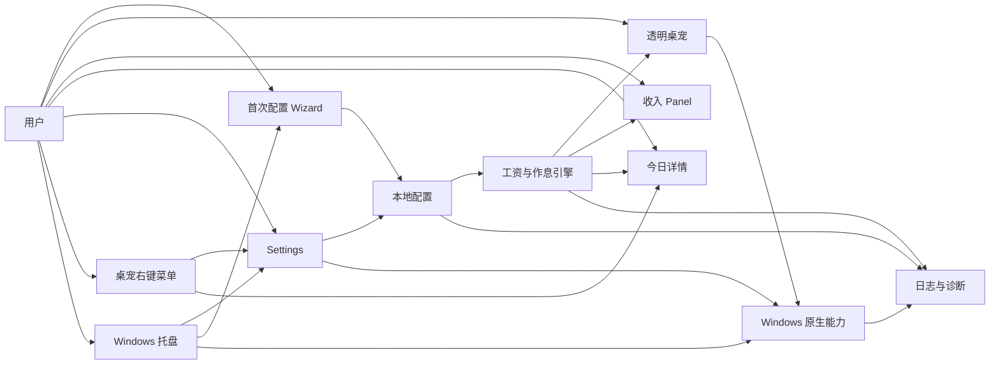
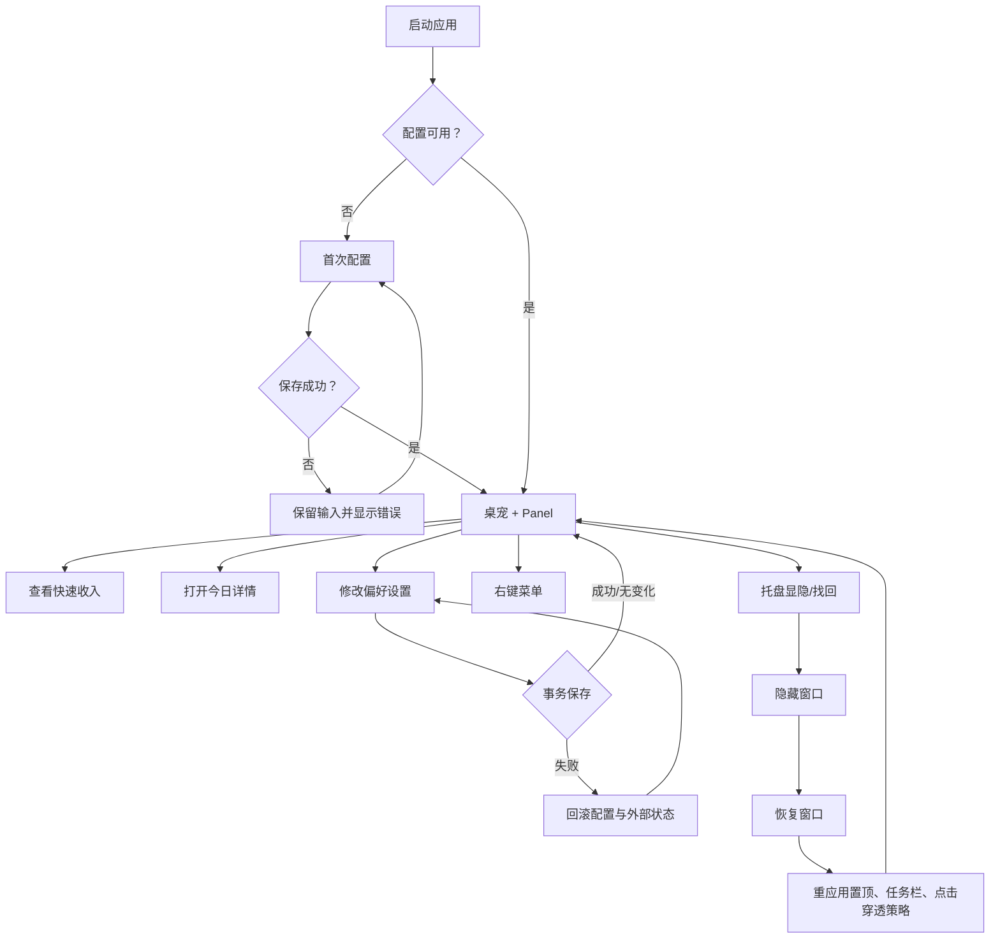
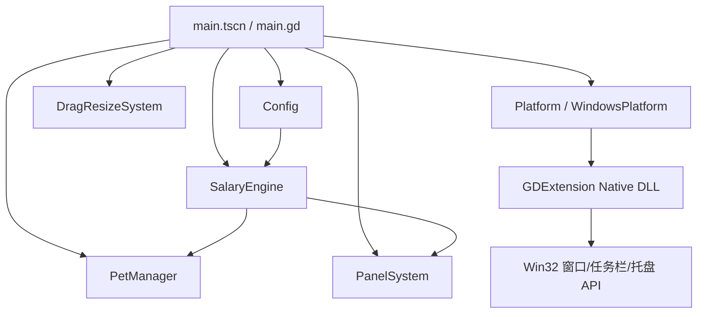
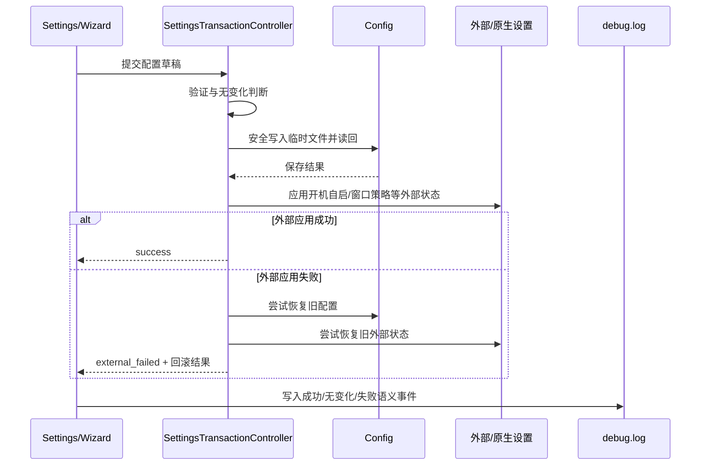
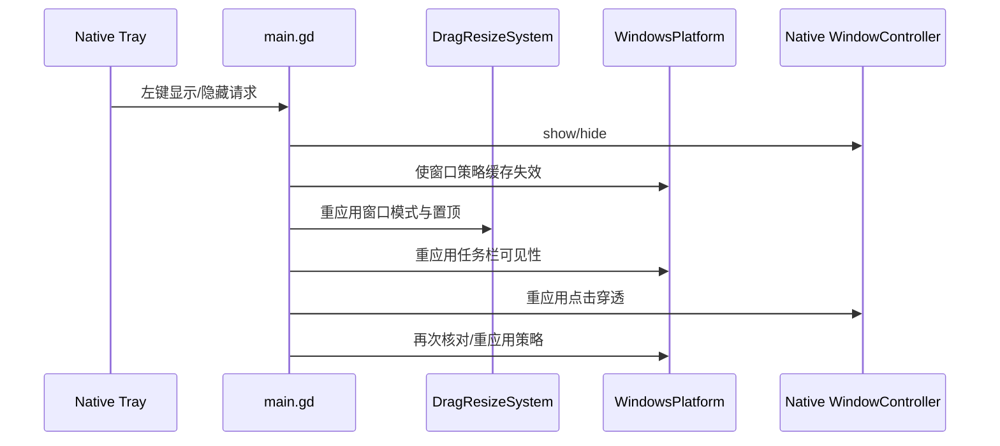
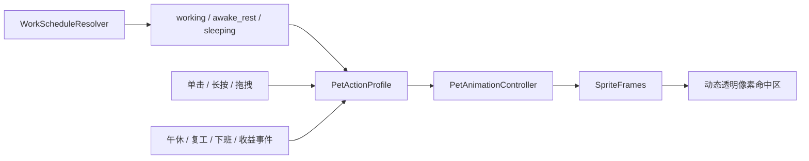

# LetsMakeMoney Windows v1.0 深度 Review

> 状态：Review 完成，等待进入 `/idea`
>
> 审查日期：2026-07-23
>
> 审查对象：Windows 主仓库当前 `origin/main`
>
> 审查基线：`aa7c0b93780d7511a6551624f2eea88595cee51f`
>
> 当前已发布版本：`v0.9-beta`

## 1. Review 判断

### 1.1 自动识别类型

本次为组合型深度 Review：

- Project Review：重新建立产品、版本和工程全景。
- Implementation Review：检查工资、配置、窗口、托盘、桌宠和动画运行时。
- UX / Information Architecture Review：检查 v0.9 原型与实际 UI 的落差来源。
- Release Readiness Review：核对 v0.9 发布事实、自动门禁和仍未闭合的真实桌面证据。
- Maintainability Review：检查脚本、兼容层、状态所有权和超大屏幕脚本。

本次不是代码 PR Review，也不是 v1.0 PRD。文中候选项不自动成为正式需求。

### 1.2 总体结论

**v0.9 已形成可运行、可回退、可验证的 Windows Beta，但尚不是适合直接改名为稳定版 1.0 的工程和体验基线。**

当前问题不是“功能太少”，而是多个重要能力已经存在，却由重复的状态所有权、并存的新旧模型、屏幕级手写 UI 和过长的历史回归链共同承载。继续横向增加功能会进一步放大维护成本和体验不一致。

项目所有者在 Review 后确认：v1.0 是首个非 Beta 稳定版，不要求签名安装器，并暂时下线全部宠物功能。因此推荐将 v1.0 定义为：

> **Windows 收入进度工具重塑 + 生产级 UI + 稳定版信任门禁**

它不应首先成为更多宠物、主题、市场、安装器或跨平台功能的合集。v0.9 的桌宠能力由历史 tag 和发布包保留，不再自动成为 v1.0 的产品范围。

### 1.3 当前是否可以直接进入 v1.0 PRD

**不建议直接进入 PRD。建议先进入 `/idea` 完成产品重定位与技术选型压力测试。**

进入 PRD 前仍需收敛：

1. “暂时下线宠物”在代码层是从活跃构建移除，还是仅隐藏产品入口。
2. 保留 Godot，还是进入 C#/WinUI 3、Tauri 等候选技术的可运行 spike。
3. v1.0 的主窗口形态：单一紧凑应用、托盘工具，还是“迷你收入条 + 完整主窗口”双层结构。

### 1.4 项目所有者确认

| 决策 | 已确认口径 |
| --- | --- |
| 版本性质 | v1.0 是首个非 Beta 稳定版 |
| 分发门禁 | 不要求签名安装器；便携 Zip 可以作为主要分发 |
| 宠物范围 | v1.0 暂时下线宠物功能，不保留 Classic/多多用户入口 |
| 核心目标 | 从“能看到”提升到“好看”，从“能用”提升到“精致” |
| 选型最高权重 | 最好的视觉表现、交互细节和原型还原能力 |
| 技术方向 | 允许评估更换开发语言和 UI 技术栈，尚未作最终选择 |

## 2. 审查范围与证据

### 2.1 实际读取范围

- Git：分支、HEAD、tag、远端、工作区和 GitHub Release。
- 产品与版本：`README.md`、`doc/current.md`、v0.1-v0.9 当前入口及 v0.9 全套发布文档。
- Godot：`project.godot`、autoload、Main、Pet、Panel、Today、Settings、Wizard、菜单和共享 UI 工具。
- Windows 原生层：平台桥、窗口控制、托盘、任务栏、点击穿透和 native protocol。
- 数据层：配置、事务保存、工资引擎、工作日历、节假日、诊断和日志。
- 宠物层：宠物包、动作 profile、状态机、输入仲裁、动态命中区和业务事件。
- 工程链：构建、验证、打包、包体验证、CI、脚本分层和公开合规。
- 设计资产：v0.9 高保真原型、本地 Figma 插件和动画 1 对多合同。

### 2.2 使用工具与检查

- `git status / branch / rev-parse / tag / ls-files`
- `gh repo view / release view / run list / workflow list`
- `rg / rg --files / Get-Content / Get-ChildItem`
- 代码体量、重复符号、脚本分层和仓库体量统计
- `scripts/run_ci_verification.ps1 -Suite docs`
- `scripts/verify_v09.ps1 -SkipExport`
- GitHub Actions 最新主分支运行结果核对

### 2.3 能力边界

- 本次没有重新执行完整 GUI Acceptance，不把代码或自动测试当作真实桌面通过。
- 本次没有修改业务代码、重写历史、提交、推送、打 tag 或创建 Release。
- 本次没有把 v0.9 文档中“待人工补证”和“暂不验证”改写为通过。

## 3. 当前项目身份

| 项目 | 当前事实 | 证据状态 |
| --- | --- | --- |
| 仓库 | `NzyZzz1998/LetsMakeMoney`，公开仓库 | 已确认 |
| 默认分支 | `main` | 已确认 |
| Review 基线 | `aa7c0b93780d7511a6551624f2eea88595cee51f` | 已确认 |
| 当前版本 | `v0.9-beta` | 已确认 |
| v0.9 tag 提交 | `94f4622` | 已确认 |
| v0.9 Release | GitHub Pre-release 已发布 | 已确认 |
| v0.9 Zip SHA256 | `B10FDE2027D4ABC71C41F0F7AC7BDCE3D93AEB8AFAF4058BA1A592B6A75CC1EC` | 已确认 |
| 平台边界 | Windows x86_64 | 已确认 |
| 开发框架 | Godot 4.7 + GDExtension Windows native | 已确认 |
| v1.0 状态 | 尚未进入 Idea / PRD | 已确认 |

主工作区在审查时落后远端 2 个提交，并包含未跟踪的原型、临时 UI Review 和 v0.9 发布目录。本次审查使用独立干净 worktree，未改动主工作区。

## 4. 产品全景

### 4.1 产品定位

LetsMakeMoney 是 Windows 桌面收入进度工具，以透明桌宠和轻量 Panel 把月薪、工作日、作息转换为实时“今日已赚”、工作进度和今日安排。

核心用户是希望在工作日持续获得收入进度反馈，同时不愿打开完整记账或考勤应用的桌面用户。

上述是 v0.9 的真实定位。v1.0 已确认暂时取消桌宠，产品身份应改为：

> **精致、轻量、可信的 Windows 收入与工作进度伴侣。**

收入计算、今日进度、日历、作息配置和托盘常驻成为主产品；“宠物陪伴”不再是 v1.0 首屏承诺。

### 4.2 核心场景

1. 首次启动，通过 Wizard 配置月薪、休息模式、上下班和午休。
2. 桌宠常驻桌面，根据工作、清醒休息和睡眠状态切换动作。
3. Panel 提供快速收入摘要，今日详情承载完整时间线。
4. Settings 维护工资、作息、宠物、显示和通用能力。
5. 托盘和右键菜单负责窗口找回、模式切换和退出。
6. 配置、日志和诊断全部保留在本机。

### 4.3 产品模块图



### 4.4 用户核心流程



### 4.5 v0.9 Windows 独有能力与 v1.0 处置

以下是 v0.9 已验证能力，但在项目所有者确认宠物下线后，不再全部构成 v1.0 的保护面：

| 能力 | v1.0 建议 |
| --- | --- |
| 透明桌宠、动态命中区、宠物输入和纯桌宠模式 | 从产品和发布包移除；由 v0.9 tag 保留 |
| Panel 与桌宠邻接 | 取消邻接关系，重新定义为独立迷你收入视图 |
| 托盘隐藏、恢复、找回和退出 | 保留，仍是轻量 Windows 工具的核心 |
| Settings / Wizard / Today | 保留并进行生产级 UI 重塑 |
| Popup / Modal 状态保护 | 若新技术栈仍需要多窗口则保留合同，否则重新评估 |

## 5. 工程架构与状态流

### 5.1 启动架构



### 5.2 配置保存事务



### 5.3 托盘恢复与窗口策略



该恢复链已经过多轮缺陷修正，但其复杂度也表明窗口策略尚无唯一所有者。

### 5.4 宠物动画与输入



## 6. 版本演进与 v1.0 真实起点

| 阶段 | 主要形成能力 | 当前意义 |
| --- | --- | --- |
| v0.1-v0.3 | 工资计算、Panel、桌宠基本交互 | 历史参考 |
| v0.4 | Settings、Wizard、托盘和纯桌宠稳定化 | 建立窗口与配置主链 |
| v0.5 | 共享暖色控件、保存反馈和日志语义 | 当前 UI 合同前身 |
| v0.6 | 诊断、验证、文档和公开准备 | 建立工程信任基础 |
| v0.7 | 开源治理、构建、许可、更新和安装器基线 | 建立公开仓库能力 |
| v0.8 | 工程治理与稳定回退基线 | 当前稳定回退版本 |
| v0.9 | 工资作息重构、生产级 UI 尝试、通用宠物包、动画状态机 | 当前 Beta 基线 |
| v1.0 | 尚未定义 | 应先完成范围收敛 |

v1.0 的起点不是空白项目，也不是单纯“换皮”。它需要在保留 v0.9 可靠能力的前提下，减少重复模型和屏幕级实现差异。

## 7. 当前进度真实性

### 7.1 文档与发布

- v0.9 tag、Pre-release、Zip 和 SHA256 一致，发布事实成立。**证据状态：已确认。**
- `doc/current.md` 已写明发布事实，但仍使用“通过 / 可进入发布收口”，落后于“已经发布”的状态。**证据状态：已确认。**
- v0.9 verification 保留多个历史候选的失败、部分通过和最终通过，事实完整但当前入口过长。**证据状态：已确认。**
- 文档中大量 `.tmp_acceptance` 证据路径不在仓库，适合作为历史索引，不适合作为外部贡献者可复核证据。**证据状态：已确认。**

### 7.2 自动门禁

- GitHub 主分支 Windows native/Godot 与 docs/compliance 工作流均通过。**证据状态：已确认。**
- 本地 docs suite 通过，当前树公开检查为 0 failure。**证据状态：已确认。**
- 干净 checkout 直接运行 `verify_v09.ps1 -SkipExport` 会在 native DLL 缺失处停止；README 已要求先 bootstrap/build native。**证据状态：已确认。**
- 当前 release dry-run workflow 仍打包 v0.8，而且现有 CI 合同测试明确期待 v0.8，无法发现版本漂移。**证据状态：已确认。**

### 7.3 真实桌面证据

v0.9 发布时以下项目没有被冒充为通过：

- Windows 通知区真实鼠标左键显隐。
- 500ms 长按进入跑动和释放收势。
- Classic 与多多完整三状态观感矩阵。
- 真实 125%/150% DPI。
- 受控损坏宠物包桌面回退观感。
- 两小时稳定运行。

这些边界对 Beta 发布是已接受限制。宠物相关证据在 v1.0 中转为安全下线和不误打包门禁；通知区、DPI 与长期稳定性仍需在稳定版 Acceptance 中重新闭合。

## 8. 关键发现

| ID | 严重度 | 模块 | 发现 | 证据状态 | 用户/工程影响 | 建议去向 |
| --- | --- | --- | --- | --- | --- | --- |
| V10-REV-001 | Major | Wizard / 工资 | Wizard 的“预计本月工作日”调用旧 `SalaryScheduleCalculator`，正式运行时使用 `WorkScheduleResolver`；法定节假日、调休和手动调整时可能预览与最终结果不同 | 已确认 | 首次配置阶段建立错误预期 | 直接修复并补回归 |
| V10-REV-002 | Major | Release CI | `windows-release-dry-run.yml` 仍打包和验证 v0.8，现有合同测试也把 v0.8 当成正确值 | 已确认 | 1.0 发布演练可能生成错误版本产物 | 直接修复 CI 与测试 |
| V10-REV-003 | Major | UI 系统 | Settings/Wizard/Today 主要由超大 GDScript 动态构建；共享层以 token 和局部 helper 为主，没有稳定的组件与布局所有权 | 已确认 | 原型和运行时长期漂移，质感修正难以复用 | 进入 `/idea`，再做 UI 技术 spike |
| V10-REV-004 | Major | 窗口/native | Main、DragResizeSystem、WindowsPlatform 和 native 同时缓存或重应用可见性、置顶、任务栏与穿透策略 | 已确认 | 恢复、模式切换和异常路径容易出现状态分裂 | 技术 spike |
| V10-REV-005 | Major | 稳定版门禁 | v0.9 仍保留通知区、DPI、长期运行及多项宠物真实桌面证据缺口 | 已确认 | 宠物证据转为安全下线门禁；其余项目仍影响稳定版可信度 | 进入 `/acceptance` 范围设计 |
| V10-REV-006 | Major | Settings 事务 | 外部设置失败后，配置回滚本身可能失败；返回结果有 `rollback_config_ok=false`，UI 仍固定提示“已恢复原设置” | 高度可能 | 极端失败下内存与磁盘可能分裂，提示误导 | 直接修复并做失败注入 |
| V10-REV-007 | Minor | 宠物状态 | 新的三状态和单击/长按链路已生效，但旧 IDLE/RESTING/DOUBLE/HOLD 枚举、映射与测试仍并存 | 已确认 | 扩展动作时理解和回归成本上升 | 补 characterization tests 后清理 |
| V10-REV-008 | Major | 验证脚本 | 125 个脚本中 85 个 active、24 个 compat；v0.9 回归递归调用多个旧版本和 M4/M5 门禁 | 已确认 | 验证时间、重复断言和修改成本持续上升 | 进入 `/idea` 做验证分层 |
| V10-REV-009 | Minor | 文档 | `current.md`、verification 和运行证据索引仍带发布前口径及大量历史过程 | 已确认 | 接手者需要穿过大量历史才能判断当前事实 | 直接修文档 |
| V10-REV-010 | Major | 跨端合同 | 共享 salary schema 要求 `workStart < workEnd`，Windows 已支持跨夜班次 | 已确认 | 未来 Windows/iOS 口令或模型复用会产生不兼容 | 进入 `/idea`，再统一 schema |
| V10-REV-011 | Suggestion | 产品决策 | GitHub Release 在审查时尚无外部下载证据 | 已确认 | 不能用社区需求为大范围新功能背书 | 先做用户价值压力测试 |
| V10-REV-012 | Minor | 可复现构建 | 总验证入口不是干净 checkout 的单命令流程，需要先构建 native DLL | 已确认 | 新贡献者第一次验证容易误判失败 | 改进 bootstrap/错误提示 |
| V10-REV-013 | Minor | GitHub 治理 | GitHub workflow 列表仍显示历史 Apple SDK experimental gate，当前树中已无对应文件 | 已确认 | 仓库设置与当前 Windows 主线产生噪音 | 直接清理远端工作流残留 |

## 9. 重点发现详述

### 9.1 两套工作日计算口径已经造成真实入口漂移

正式工资快照由：

`SalaryEngine -> WorkScheduleResolver -> HolidayCalendar`

共同计算，支持：

- 官方节假日；
- 调休工作日；
- 手动日期调整；
- 午休扣除；
- 跨夜班次；
- 金额最小单位取整。

但 Wizard 的预计工作日仍调用旧 `SalaryScheduleCalculator.workday_count`。旧实现不具备完整官方日历与日期覆盖语义。

这不是架构美观问题，而是用户在首次配置时会看到一个数字，完成后可能得到另一个数字。建议在任何 v1.0 UI 重塑前先关闭。

### 9.2 UI 质感问题不是 Godot 的必然限制

当前主要屏幕体量：

| 文件 | 约行数 | 结构 |
| --- | ---: | --- |
| `settings_dialog.gd` | 1719 | 大量动态节点、样式与布局 |
| `wizard_dialog.gd` | 1045 | 大量动态节点、样式与布局 |
| `main.gd` | 979 | 主窗口与跨系统状态 |
| `today_detail_window.gd` | 461 | 动态详情窗口 |

Settings、Wizard 和 Today 的 `.tscn` 几乎只是脚本挂载壳。Settings 与 Wizard 至少有 21 个同名构造、样式、时间控件和休息模式函数。

项目已经有 `warm_control_theme.gd`、`settings_section_builder.gd` 和 `context_menu_builder.gd`，说明共享方向正确；但它们还没有成为屏幕结构和布局合同的唯一入口。

因此 v0.9 多轮出现“原型好看、落地廉价”的根因更接近：

1. 原型按完整组件设计，Godot 端按单屏局部修补；
2. token 共享了颜色，却没有共享布局、密度、状态和窗口结构；
3. 动态代码让可视化检查与编辑成本过高；
4. 相同控件在 Settings 和 Wizard 中各自实现。

建议 v1.0 先建立生产 UI 组件和窗口壳，再迁移屏幕，避免继续逐像素追原型。

### 9.3 窗口策略仍是多中心所有权

`DragResizeSystem` 的职责已经超出名称，包括：

- 主窗口位置与显隐；
- Today、Settings、Wizard、About 的创建；
- Popup / Modal 生命周期；
- 窗口尺寸、模式与置顶；
- 配置保存、恢复默认和退出。

同时 `main.gd`、`WindowsPlatform` 与 native DLL 都保存或重应用部分窗口策略。托盘恢复路径通过“缓存失效 + 多次重应用”保证正确，这对当前版本有效，但不适合作为继续扩展窗口类型的长期模型。

建议先做技术 spike，定义：

- 谁拥有期望窗口状态；
- 谁只负责执行原生命令；
- 谁负责读取实际 native 状态；
- 恢复和失败时如何收敛；
- 哪些缓存可以删除。

不要直接重写 native。当前 versioned native protocol 和小型 bridge 应保留。

### 9.4 Settings 双重失败路径的提示不真实

事务控制器已经正确返回：

- `rollback_config_ok`
- `rollback_external_ok`

但 UI 对外部设置应用失败统一显示“已恢复原设置”。如果配置回滚也失败，这条提示不成立。

建议：

- 回滚全部成功：显示已恢复；
- 配置或外部回滚部分失败：显示“保存失败，部分设置可能需要重启或手动恢复”；
- 日志必须记录新旧配置身份和两个回滚结果；
- 增加配置回滚失败的可控失败注入。

### 9.5 宠物动画新旧模型需要收尾，而不是再扩语义

v0.9 已经完成有价值的升级：

- `working / awake_rest / sleeping`；
- 基于帧时长的动作完成；
- 优先级、冷却、中断、超时和晚到完成保护；
- 500ms 长按跑动；
- 动态透明像素命中区；
- 午休、复工、下班等业务事件。

但旧的 `IDLE / RESTING / CLICKED_DOUBLE / CLICKED_HOLD` 仍留在 autoload、解析函数和历史测试中。当前属于兼容债，不是发布阻塞。

建议先建立旧包与现有 Classic/多多的行为矩阵，再移除不再可达的入口。不要在清理完成前增加更多宠物动作语义。

### 9.6 验证数量多，不等于验证结构清晰

当前脚本数量已经超过业务源文件数量。历史版本回归对稳定性有价值，但“当前验证器递归调用旧版本完整验证器”会产生：

- 相同合同多次断言；
- 当前改动需要同步多个历史测试；
- 历史 UI 结构阻碍当前批准的 UI 演进；
- 难以判断失败属于当前合同还是历史快照。

建议重组为能力级门禁：

- domain：工资、日历、配置；
- UI contracts：窗口尺寸、控件状态和布局；
- platform：托盘、任务栏、穿透；
- pet runtime：包、状态机、输入和命中区；
- release：许可、打包、身份和 smoke；
- legacy compatibility：只保留仍承诺兼容的少量合同。

版本文档继续保留历史结果，但测试入口不再按 v0.4 -> v0.9 递归。

## 10. 模块健康度

| 模块 | 当前状态 | 值得保留 | 主要风险 | 1.0 建议 |
| --- | --- | --- | --- | --- |
| 工资/作息/日历 | 较成熟 | WorkScheduleResolver、HolidayCalendar、最小单位取整 | Wizard 预览旧口径、共享 schema 漂移 | 统一唯一计算入口 |
| Config | 成熟 | 临时写入、读回、previous、损坏恢复 | 回滚二次失败提示 | 保留并补失败注入 |
| Wizard/Settings | 功能完整、结构过重 | 配置草稿、事务控制器、渐进式逻辑 | 重复控件和屏幕级样式 | 建组件后迁移 |
| Panel/Today | 功能完整、体验仍有债 | 快速摘要与完整详情分层 | 视觉密度和尺寸适配 | 做产品表面收敛 |
| Main/窗口 | 可用但脆弱 | 当前行为基线与日志 | 状态所有权分散 | 先 spike 后分阶段治理 |
| Native | 边界较清楚 | versioned protocol、小 bridge、Win32 能力 | 上层重复缓存 | 保留协议，不先重写 |
| 托盘/纯桌宠 | 多轮修复后可用 | 强制重应用策略、自动 native 测试 | 真实鼠标补证仍未闭合 | 1.0 稳定门禁候选 |
| Pet 包 | 较成熟 | manifest、哈希、许可、回退 | 更多宠物会扩大矩阵 | 冻结输入，先稳运行时 |
| 动画/输入 | 新模型已成形 | 事件驱动控制器、动态命中区 | 新旧枚举并存、人工观感缺口 | 补证后清兼容债 |
| 日志/诊断 | 良好 | 语义事件、脱敏摘要、轮换 | 历史验证信息较散 | 保留并做证据索引 |
| CI/发布 | 主流程通过 | pinned Actions、只读权限、合规门禁 | release dry-run 仍是 v0.8 | 立即修正 |
| 文档/原型 | 内容丰富 | current 入口、版本文档、高保真/Figma | 过程文档过长、运行证据不可移植 | 缩短当前事实层 |

## 11. 值得保留

以下内容不应因 1.0“大改”被顺手替换：

1. `SettingsTransactionController` 的事务边界。
2. `Config` 的安全写入、读回验证、previous 和损坏恢复。
3. `WorkScheduleResolver + HolidayCalendar` 的正式计算口径。
4. 版本化 `native-protocol.json` 和小型原生桥。
5. 当前托盘、任务栏和点击穿透的行为测试基线。
6. `PetAnimationController` 的事件驱动完成、中断、超时保护。
7. 宠物包 manifest、哈希、许可与失败回退。
8. Classic 作为 v0.8 兼容回退，多多作为 v0.9 正式包。
9. GitHub Actions 的固定 commit、最小权限和公开合规门禁。
10. v0.8 稳定回退版本和 v0.9 Beta 发布身份。

## 12. v1.0 候选主线

### 主线 A：稳定版信任闭环

- 统一 Wizard 与运行时工作日计算。
- 修复 Settings 回滚二次失败提示。
- 修复 release dry-run 版本漂移。
- 确定并完成 1.0 必需的真实桌面验收矩阵。
- 收敛 current、verification 和可移植证据入口。

推荐去向：直接修复 + `/acceptance` 设计。

### 主线 B：产品表面收敛

- 明确桌宠、Panel、Today、Settings 的职责与入口。
- 建立生产级窗口壳、表单行、时间控件、状态反馈和菜单组件。
- 用同一组件系统承载 Wizard 与 Settings。
- 以真实 Windows 桌面挂件为目标，不照搬 iOS，也不继续单屏修补。

推荐去向：进入 `/idea`。

### 主线 C：窗口运行时所有权

- 建立单一的期望窗口状态模型。
- 将策略决策、Godot 窗口执行和 Win32 执行分层。
- 减少 Main、DragResizeSystem、WindowsPlatform 的重复缓存。
- 保持 native protocol 兼容，分阶段替换，不做一次性重写。

推荐去向：技术 spike。

### 主线 D：宠物功能安全下线

- 从 v1.0 产品入口、默认运行时和发布包中移除宠物。
- 使用 v0.9 tag、Release 和 Git 历史保留完整可恢复基线。
- 明确宠物代码是从活跃源码删除，还是隔离为不参与构建的 legacy 模块。
- 删除与宠物绑定的点击穿透、纯桌宠、动作和素材时，先建立非宠物窗口回归门禁。
- 不把“暂时下线”误写为永久取消；未来回归必须重新进入 Idea/PRD。

推荐去向：进入 `/idea`，形成迁移与回退方案。

### 主线 E：验证和文档分层

- 从版本递归回归改为能力级门禁。
- 为 release workflow 增加当前版本一致性断言。
- 为干净 checkout 提供更明确的 bootstrap/verify 入口。
- 将当前事实、发布证据、历史过程分离。

推荐去向：进入 `/idea`，部分文档可直接修。

## 13. 分流建议

### 13.1 直接修复

1. Wizard 工作日预览改用正式解析器。
2. Settings 回滚结果按实际状态反馈。
3. release dry-run 从 v0.8 切到当前版本，并让合同测试读取唯一版本源。
4. `doc/current.md` 从“可进入发布收口”更新为“v0.9 Beta 已发布”。
5. 清理 GitHub 历史 Apple SDK workflow 残留。

### 13.2 进入 `/idea`

1. v1.0 产品表面和信息架构收敛。
2. 生产级 Godot UI 组件系统。
3. 验证脚本按能力重组。
4. 跨端工资 schema 与跨夜班次兼容。
5. 1.0 稳定版定义和分发边界。

### 13.3 技术 spike

1. 窗口状态唯一所有者与 native 执行边界。
2. Settings/Wizard 从动态脚本迁移到共享组件的最小样板。
3. 旧宠物状态和交互枚举的可达性分析。

### 13.4 进入 `/acceptance`

若 1.0 为稳定版，建议将以下项目升级为发布门禁候选：

- Windows 通知区真实鼠标显隐和窗口找回。
- 真实 125%/150% DPI。
- 至少一轮长时间稳定运行。
- v0.9 配置迁移后宠物字段不影响 v1.0 启动、保存和回退。
- 宠物运行时和素材未误入 v1.0 发布包。

### 13.5 暂不处理

- 更多宠物和宠物市场。
- 主题系统。
- 插件化宠物下载。
- 宠物动画继续生产和接入。
- 多平台业务实现。
- 全量安装器/自动更新重做。
- 为追求代码行数而重写 native。

签名安装器已确认不构成 v1.0 发布门禁。

## 14. 三种 v1.0 组合

### 14.1 最小方案

包含：

- V10-REV-001/002/006 的直接修复。
- 当前事实和发布文档收敛。
- 关闭稳定版必须的真实桌面补证。
- 下线宠物入口，但保持 Godot 和现有屏幕架构。

优点：成本最低，最快形成可信稳定版。

风险：现有 UI 质感与窗口状态复杂度继续保留，不满足“从能用到精致”的核心目标。

### 14.2 推荐方案

包含：

- 最小方案全部内容。
- 完成 Godot、C#/WinUI 3、Tauri 三条技术路线的同屏可运行 spike。
- 根据量化结果选择唯一 v1.0 技术栈。
- 产品表面与信息架构重新收敛为迷你收入视图、今日、日历、Settings/Wizard 和托盘。
- 建立生产级共享 UI 组件系统。
- 安全下线宠物运行时、素材和专属窗口策略。
- 若保留 Godot，继续完成窗口状态所有权有限治理；若迁移，按行为合同重建。
- 验证门禁能力化分层。

不包含：

- 宠物、主题、市场、多平台和未经 spike 证明的全量重写。
- 未签名安装器强行升级为主要分发。

推荐原因：它先用可运行证据决定是否换技术，再围绕已经确认的新产品定位重建 UI，避免把当前 Godot 屏幕简单换皮，也避免凭主观感觉直接重写。

### 14.3 过大方案

在推荐方案基础上同时加入：

- 签名安装器和完整更新系统；
- 主题系统；
- 宠物重新上线与下载市场；
- 多平台实现；
- Main/native 全量重写。

不推荐原因：依赖、验收矩阵和发布风险会同时膨胀，任何一个系统失败都可能让 1.0 无法收口。

## 15. 推荐实施顺序


M1 与 M2 可以并行；M2 结论必须早于完整 UI 实现。不要先用某个新框架重做所有窗口，再补产品和组件规范。

## 16. 技术栈评估边界

语言或框架不能只比较静态截图。项目所有者已确认“视觉表现”为最高权重，因此技术 spike 不再平均投入：**Tauri + TypeScript 前端为首选候选，WinUI 3 为原生对照，Godot 为现状基线。**

| 优先级 | 路线 | 适合验证的价值 | 主要风险 |
| --- | --- | --- | --- |
| P0 | Rust + Tauri + TypeScript/React | CSS、动效和组件系统最接近高保真原型，可直接复用现有前端设计方法 | 系统 WebView、Rust/前端双栈、原生窗口和托盘插件边界 |
| P1 | C# + WinUI 3 | Windows 原生视觉、文字渲染、可访问性、DPI、输入和窗口集成 | 自定义品牌视觉的实现速度可能低于 Web 技术；部署链更复杂 |
| P2 | 继续 Godot 4.7 | 复用现有工资、配置、托盘和发布链；作为迁移收益基线 | 表单、可访问性和生产级桌面 UI 仍需大量自建 |

每条路线都必须实现：

- 迷你收入视图；
- 今日页；
- Settings 代表页；
- 托盘显隐与窗口找回；
- 本地配置读写；
- 100%/125%/150% DPI；
- 冷启动、内存、包体、构建和发布 smoke。

不建议把 Electron 作为首选：它能快速还原原型，但对当前轻量工具定位的内存和包体成本偏高。WPF/Avalonia/Flutter 可以作为备选资料，不进入首轮三路样板，除非 Idea 阶段出现决定性约束。

## 17. 视觉质量生产方法

### 17.1 参考案例结论

《别再只对 AI 说“Apple 风格”了，先给它一个 Figma 参考》的核心观点适用于 v1.0，但需要分阶段使用：

1. 不把“精致”“高级感”“像 Apple”当作可执行要求。
2. 先选择结构完整、组件齐全、接近业务场景的真实参考文件。
3. 参考的重点是组件尺寸、间距、状态、层级和交互，不是照抄品牌表面。
4. 设计和实现优先复用同一套 Button、Input、Select、Tabs、Slider、Switch、Popover、Dialog 和 Toast，不为每个页面重画一套。
5. 在产品结构冻结后，才采用“不改变布局、不增删功能、不改变核心流程”的视觉精修约束。
6. 每轮从视觉美感、信息层级、操作直观性、一致性与品牌感四个维度验收。

v1.0 会重新定义无宠物后的产品结构，因此不能一开始就锁死 v0.9 布局。正确顺序是：先完成信息架构和业务原型，项目所有者确认后冻结，再进入组件复用和像素级精修。

参考来源：

- 微信文章：`https://mp.weixin.qq.com/s/U7pkDJ3dAUng0aa14cqLsQ`
- 当前 LMM Figma 单页产品流与 v0.9 高保真原型。
- 技术 spike 中三条路线共用的同一组业务页面和组件状态。

### 17.2 本地设计能力分工

现有 Skill 不应各自生成一套互相竞争的界面，建议按固定流水线串行使用：

| 阶段 | 使用能力 | 产物 | 门禁 |
| --- | --- | --- | --- |
| 现状审计 | `oiloil-ui-ux-guide` review | P0/P1/P2 问题、设计阶段判断 | 明确保留、重构和删除项 |
| 设计方向 | `oiloil-ui-ux-guide` design | 业务设计系统、设计 token、真实业务稿 | 项目所有者确认业务稿 |
| 设计探索 | `draw-ui` | 少量候选构图或难以代码化的视觉资产 | 不直接作为实现规范 |
| 前端实现 | `frontend-design` + 选定技术栈 | 可运行组件和完整页面 | 禁止通用 AI 模板化视觉 |
| 产品级精修 | `impeccable` 的 critique/layout/typeset/polish/harden | 间距、字体、状态、边界和异常路径修正 | 生产级检查通过 |
| 动效精修 | `emil-design-eng` | 动效 token、进入/退出、反馈和中断规则 | 动效有明确目的且不拖慢高频操作 |
| 最终验收 | Playwright 截图 + Computer Use | 自动视觉差异和真实 Windows 证据 | 原型、实现和真实桌面三方一致 |

`oil-icon` 只用于补齐确有必要的产品图标；v1.0 暂时下线宠物，不应为了“质感”增加装饰插画。`oil-visual` 不作为产品 UI 的默认步骤。

### 17.3 v1.0 视觉事实源

视觉事实源按以下优先级建立：

1. 已确认的 v1.0 业务高保真原型。
2. 从原型提取的设计 token 和共享组件。
3. 组件展示页中的完整状态矩阵。
4. Tauri、WinUI 3、Godot 三个技术样板的真实截图。
5. 最终 Windows 运行截图和 DPI 证据。

Figma 或 HTML 原型不能只保存静态画面，至少需要沉淀：

- 窗口尺寸、最小尺寸和滚动策略；
- 字体、字号、字重、行高和数字等宽规则；
- 颜色、描边、圆角、阴影和层级 token；
- 4/8px 间距体系；
- 默认、hover、focus、pressed、disabled、loading、success、error 状态；
- Window chrome、菜单、弹窗、Toast 和系统边界；
- 100%、125%、150% DPI 下的布局规则；
- 长金额、长中文、英文和错误信息的边界状态。

### 17.4 首轮黄金路径

技术栈对照不制作整个产品，只实现同一条黄金路径：

```text
启动
  → 迷你收入视图
  → 今日详情
  → Settings 代表页
  → 保存成功 / 无变化 / 失败
  → 托盘隐藏与找回
```

共用组件至少包括：

- Window chrome；
- Primary、Secondary、Icon Button；
- Input、Number Input、Time Picker、Select；
- Tabs、Switch、Slider；
- Inline feedback、Toast、Dialog、Popover；
- Income summary、Progress、Schedule timeline；
- Menu、Tray command 映射。

只有黄金路径达到确认后的视觉标准，技术路线才允许进入完整迁移。静态截图相似但交互、文字、DPI 或窗口行为不合格，同样淘汰。

### 17.5 视觉选型评分

| 指标 | 权重 | 证据 |
| --- | ---: | --- |
| 高保真还原与组件一致性 | 30% | 原型与运行截图差异 |
| 字体、图标、间距、边界和窗口质感 | 20% | 设计审计和真实桌面截图 |
| 动效、反馈和可中断性 | 10% | 录屏和交互测试 |
| DPI、可访问性和长内容稳定性 | 10% | 100%/125%/150% 与边界用例 |
| Windows 窗口、托盘和生命周期 | 10% | Computer Use 与日志 |
| 启动、内存、包体和流畅度 | 10% | 测量数据 |
| 构建、测试和发布可维护性 | 10% | 干净环境验证 |

视觉相关指标合计 60%。任一路线若在视觉、字体或 DPI 三项中出现阻塞，不得依靠包体或复用成本补偿。

### 17.6 防止再次失真

- 不接受“原型方向大致一致”，必须建立逐窗口差异表。
- 不在实现阶段临时发明新控件。
- 不让每个页面单独决定圆角、间距、阴影或反馈文案。
- 不用截图嵌入代替真实组件。
- 不以默认组件主题冒充生产设计。
- 不先完成整站再统一精修；每完成一个业务面就经过 critique、polish 和视觉回归。
- 不把装饰、渐变、玻璃或大阴影当作质感来源。质感来自字体、比例、对齐、状态、响应和一致性。

## 18. 下一阶段建议

下一步进入 `/idea`，先完成产品重定位、宠物安全下线和技术栈 spike 方案，不直接写 PRD 或启动重写。

可直接发送：

```text
[$mypm] /idea

基于 `doc/releases/v1.0/review.md`，建立 LetsMakeMoney Windows v1.0 候选需求池。

要求：
1. 已确认：v1.0 是首个非 Beta 稳定版；不要求签名安装器；宠物功能暂时下线。
2. 重新定义无宠物后的产品定位、主窗口、迷你收入视图、今日、日历、Settings/Wizard 和托盘关系。
3. 明确宠物从产品、构建、发布包和活跃源码中的安全下线方式，保留 v0.9 tag/Release 可恢复基线。
4. 视觉表现是最高选型权重。以 Rust+Tauri+TypeScript/React 为首选候选、C#/WinUI 3 为原生对照、Godot 4.7 为现状基线，设计同屏可运行技术 spike。
5. 技术 spike 必须量化视觉还原、动效、文字渲染、DPI、托盘、配置、冷启动、内存、包体、构建与发布指标。
6. V10-REV-001、002、006 作为缺陷单独分流，不包装成新功能。
7. 每项包含证据状态、用户价值、影响范围、依赖、风险、测试缺口、成本和推荐去向。
8. 给出最小、推荐、过大三种组合，并判断换技术栈是否值得进入 v1.0。
9. 不写 PRD、不修改业务代码、不开始重写、不提交、不推送。
10. 全部使用简体中文、UTF-8、无乱码。
```
