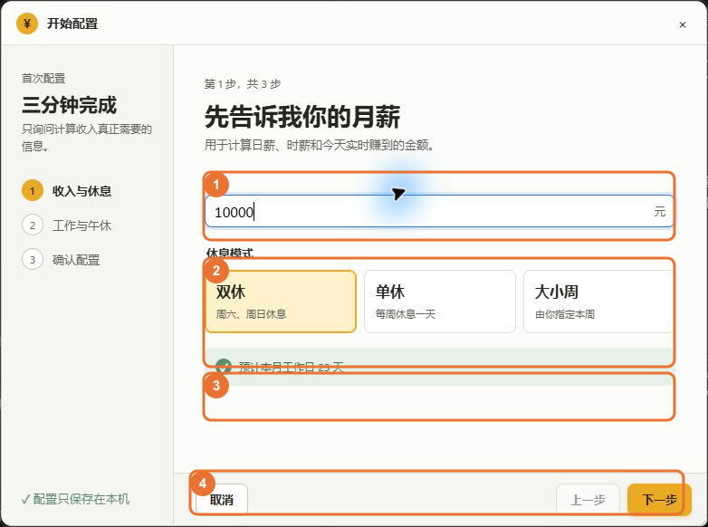
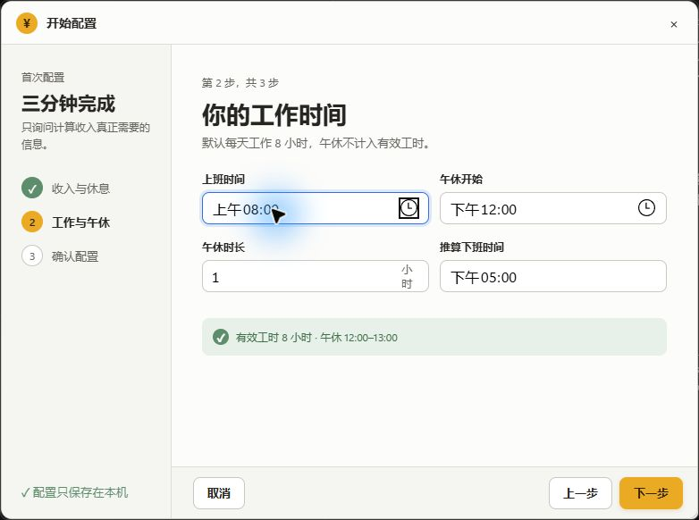
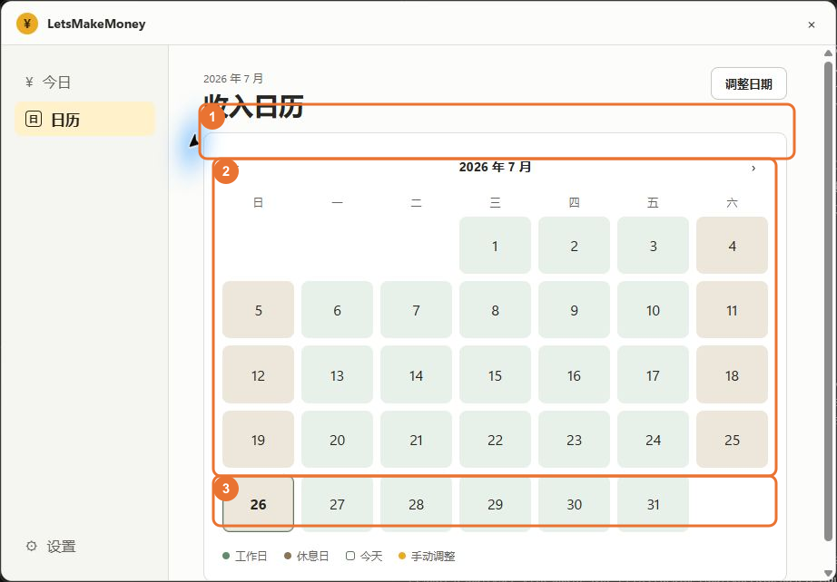
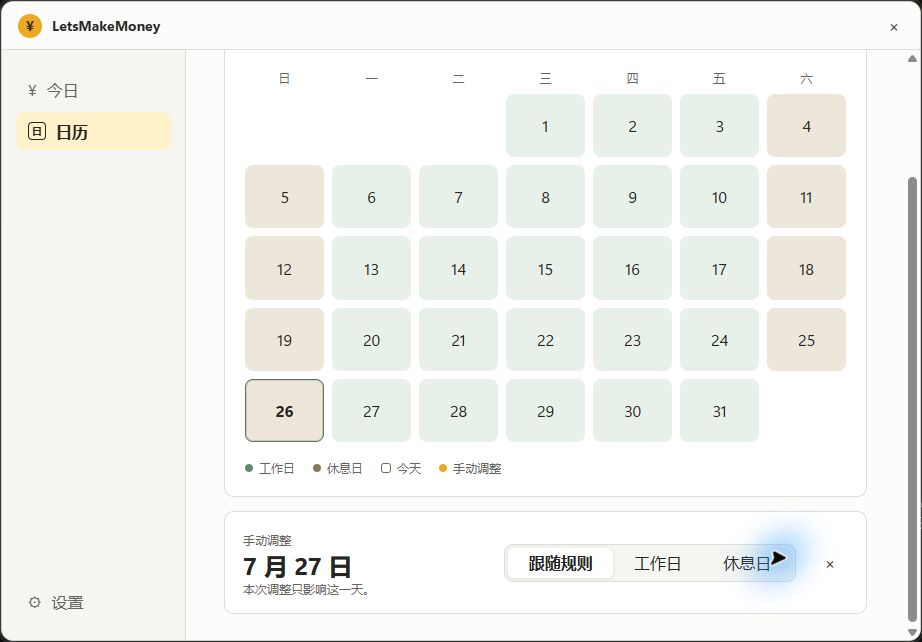
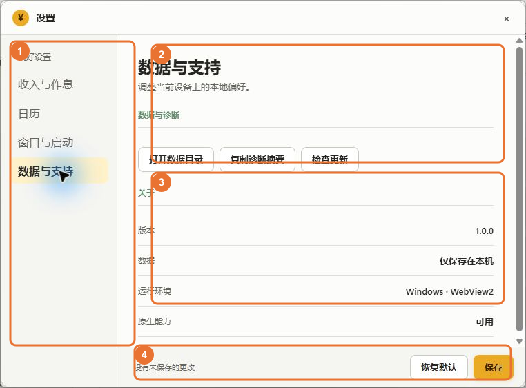
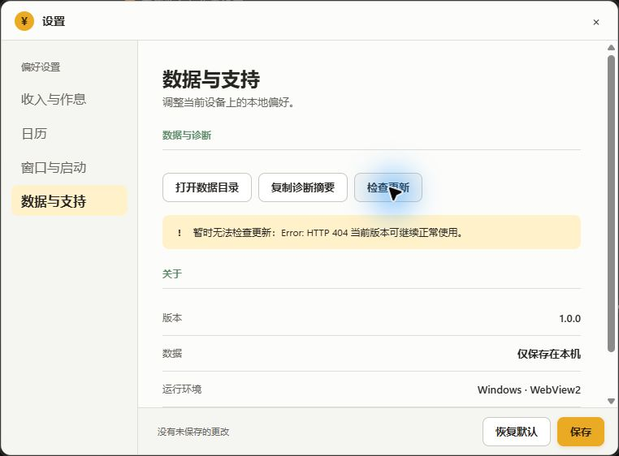

# LetsMakeMoney Windows v1.0 使用说明书

> 本说明书仅适用于 Windows v1.0。v0.7-v0.9 的桌宠、透明宠物窗口、点击穿透和纯桌宠模式不属于 v1.0。

## 说明书对象

| 项目 | 内容 |
| --- | --- |
| 应用版本 | 1.0.0 Stable Candidate |
| 分支 | `agent/v1.0-review` |
| HEAD | `da4326e18536d8846fdd6ef49ae894de4a8975c5` |
| 候选包 | `releases/v1.0/LetsMakeMoney-v1.0-windows-x86_64.zip` |
| Zip SHA-256 | `99DB494245F207B420B9B3CCDBA96D8DC65EC4F444926DF4DE03AD021A8911A8` |
| EXE SHA-256 | `78E5ECDABC2F710569942F1918E80601136A8638A92DCBCD76A90B0E5D03F820` |
| 截图说明 | 全部来自独立解压后的真实候选 EXE |

本轮统一演示数据：

- 月薪：`10000`
- 休息模式：双休
- 上班时间：`08:00`
- 下班时间：`17:00`
- 午休时间：`12:00-13:00`
- 每日有效工时：8 小时

截图中的工资数据均为演示数据，不代表真实用户配置。

## 1. 首次启动与三步配置

第一次启动且没有有效配置时，应用会打开“开始配置”窗口。配置只保存在本机。


图中编号：

1. 当前步骤的标题、用途和错误提示。
2. 三步进度：收入与休息、工作与午休、确认配置。
3. 取消、上一步和下一步。

### 第 1 步：收入与休息



1. 在“月薪”中输入税前或税后月薪。应用只按输入金额计算，不判断薪资口径。
2. 选择休息模式：
   - 双休：周一至周五工作。
   - 单休：周一至周六工作。
   - 大小周：必须再明确选择本周是大周还是小周。
3. “预计本月工作日”会按当前月份、休息模式、节假日和调休规则立即重算。
4. 输入有效后点击“下一步”。

大小周不会替用户决定本周类型：

- [大小周入口](screenshots/raw/LMM-V10-WIZARD-004-ALTERNATING.png)
- [选择大周](screenshots/raw/LMM-V10-WIZARD-005-BIG-WEEK.png)
- [选择小周](screenshots/raw/LMM-V10-WIZARD-006-SMALL-WEEK.png)

月薪为空或小于等于 0 时，会显示“请输入大于 0 的月薪”，并禁用下一步。

### 第 2 步：工作与午休



- 上班时间：使用 Windows 时间选择器。
- 午休开始：使用 Windows 时间选择器。
- 午休时长：输入小时数。
- 推算下班时间：由“上班时间 + 8 小时有效工时 + 午休时长”自动得出。
- 状态条会显示有效工时及午休区间。

时间输入会使用专用选择器，不能保存英文或无效时间。

展开时间选择器的真实画面见 [时间选择器](screenshots/raw/LMM-V10-WIZARD-010-TIME-PICKER.png)。

### 第 3 步：确认配置


请核对月薪、休息模式、工作时间和午休时间：

- “上一步”：返回修改，不保存当前步骤。
- “完成”：保存配置并进入主界面。
- “取消”或右上角关闭：弹出确认，不会静默丢弃草稿。

取消确认画面见 [取消首次配置](screenshots/raw/LMM-V10-WIZARD-013-CANCEL-CONFIRM.png)。

## 2. 迷你收入视图

迷你收入视图是 v1.0 的桌面常驻入口。可以拖动窗口，也可以单击窗口打开今日工作台。

### 休息日


休息日不会显示今日已赚和工作进度。界面只显示：

- 当前为休息日；
- 本月累计；
- 本月工作日；
- 下一工作日。

### 工作日


工作日会显示：

- 当前状态：上班前、工作中、午休中或已下班；
- 今日已赚；
- 工作进度；
- 剩余有效工时。

本图使用“把 7 月 26 日手动设为工作日”的演示覆盖，因此本月工作日由 23 天变为 24 天，日薪为 `10000 ÷ 24 = 416.66` 元。

## 3. 今日工作台

单击迷你收入视图，或从托盘选择“打开今日工作台”，即可进入。

左侧入口：

- 今日：查看当前状态、收入、安排和月度摘要。
- 日历：查看和调整每日工作属性。
- 设置：打开设置窗口。

### 休息日状态


1. 日期、星期和“休息日”状态。
2. 休息日说明及下一工作日。
3. 本月累计和本月工作日。

休息日的今日收入与工作进度固定为 0，界面不会把“预计下班收入”误当成实际收入。

### 工作日完成状态


1. 今日已赚、日薪、时薪和工作进度。
2. 今日安排：上班、午休、下班。
3. 本月累计、本月工作日和剩余有效工时。

“调整今天”会进入日历调整流程。当天被设为工作日或休息日后，月工作日、日薪和今日状态都会重算。

## 4. 收入日历



1. 上月、当前年月和下月。
2. 日期网格。当前日期使用描边强调，不表示额外收入或特殊状态。
3. 图例：工作日、休息日、手动调整。

点击左右箭头可查看其他月份：

- [2026 年 7 月](screenshots/raw/LMM-V10-CALENDAR-001-MONTH.png)
- [2026 年 8 月](screenshots/raw/LMM-V10-CALENDAR-002-NEXT-MONTH.png)

点击某一天后，页面下方会出现日期编辑器：



可选项：

- 跟随规则：恢复为休息模式、节假日和调休规则的计算结果。
- 工作日：强制把当天作为工作日。
- 休息日：强制把当天作为休息日。

[手动改为休息日](screenshots/raw/LMM-V10-CALENDAR-006-MANUAL-REST.png)

当前候选存在一个已记录限制：日历页的手动调整只保存在当前界面会话中，关闭或重启后不会持久化。不要把它当作长期配置使用。

## 5. 设置：收入与作息


1. 设置分组导航。
2. 月薪、休息模式、大小周类型、上下班及午休时间。
3. 恢复默认与保存。

控件说明：

- 月薪：必须大于 0。
- 休息模式：双休、单休、大小周。
- 本周类型：仅大小周时出现，必须选择大周或小周。
- 上班时间、下班时间、午休开始、午休结束：使用时间选择器。

休息模式下拉框展开状态见 [休息模式选项](screenshots/raw/LMM-V10-SETTINGS-002-REST-MODE-OPTIONS.png)。

保存后，月工作日、日薪、时薪、工作状态和今日安排会重新计算，不需要重启。

## 6. 设置：日历


- 节假日数据：当前仅提供“中国大陆 2026”。
- 允许手动调整：当前候选显示为开启，但该开关尚未接入持久化配置；日期调整仍应从日历日期单元格进入。

本页无金额计算，只决定日期解析口径。

日期优先级：

1. 手动指定工作日或休息日；
2. 调休工作日；
3. 法定节假日；
4. 单休、双休或大小周基础规则。

## 7. 设置：窗口与启动


- 启动时显示：下次启动时显示迷你收入视图。
- 始终置顶：让迷你收入视图保持在普通窗口上方。
- 开机启动：登录 Windows 后启动应用。

窗口开关作为设置草稿，点击“保存”后生效。取消或关闭不会保存未提交的修改。

## 8. 设置：数据与支持



1. 设置分组导航。
2. 打开数据目录、复制诊断摘要、检查更新。
3. 版本、本地数据和原生能力信息。
4. 恢复默认与保存。

### 打开数据目录

打开配置和日志所在目录：

```text
%APPDATA%\io.letsmakemoney.windows\
```

### 复制诊断摘要

点击后会复制脱敏摘要并显示成功提示：


摘要包含版本、平台、配置版本、配置状态、原生能力和日志级别，不包含用户名或完整本机路径。

### 检查更新

检查 GitHub Release。网络或服务不可用时，当前版本继续可用：



当前候选真实返回 HTTP 404，因此显示“暂时无法检查更新”，这不是应用崩溃。

## 9. 保存、无变化、失败、取消和恢复默认

### 保存成功


保存成功后，新配置立即成为当前配置。

### 无变化保存


配置未改变时，不会重复写入文件。

### 保存失败


保存失败时：

- 显示可读错误；
- 保留用户输入；
- 已生效的旧配置不被污染；
- 日志记录失败原因。

本图通过受控占用临时配置路径制造写入失败，最终有效配置仍保持原值。

### 关闭未保存设置


- 继续编辑：返回设置。
- 放弃更改：关闭并丢弃草稿。

### 恢复默认


恢复默认只先修改当前草稿，仍需点击保存才会生效。

## 10. 托盘、隐藏、找回和退出

v1.0 的原生托盘菜单包含：

- 显示 / 隐藏迷你收入；
- 打开今日工作台；
- 偏好设置；
- 重新配置；
- 打开数据目录；
- 退出 LetsMakeMoney。

左键单击托盘图标会切换迷你收入视图的显示状态。

“重新配置”会从第 1 步打开三步配置，不会直接跳到确认页。

本轮 Computer Use 无法稳定操作 Windows 通知区，因此托盘真实截图和左键动作列为待人工补证。代码和自动验证只能证明入口存在，不能代替真实鼠标点击。

## 11. 配置、日志与隐私

本地目录：

```text
%APPDATA%\io.letsmakemoney.windows\
```

主要文件：

- `config.json`：当前有效配置。
- `config.json.previous`：保存前的回滚点。
- `debug.log`：语义日志。

保存过程：

1. 校验草稿；
2. 备份旧配置；
3. 写入临时文件；
4. 读回并再次校验；
5. 原子替换正式配置；
6. 任一步失败则保留旧配置和草稿。

应用不需要账号，不上传工资或作息配置。

## 12. 完整业务闭环

推荐操作顺序：

1. 首次启动，输入月薪和休息模式。
2. 设置上班时间、午休和 8 小时有效工时。
3. 完成配置，查看迷你收入视图。
4. 单击迷你视图，打开今日工作台。
5. 在设置中修改月薪或作息。
6. 点击保存。
7. 返回今日页，确认工作日、日薪、时薪、进度和安排已重算。
8. 在日历中检查节假日和调休。
9. 从托盘隐藏、找回或退出应用。

计算公式与复算示例见 [计算口径参考](calculation-reference.md)，每个控件的覆盖情况见 [控件覆盖表](control-coverage.md)。

